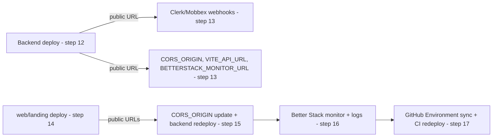

# RUNBOOK — Provisioning and deployment

This is the living runbook for duck-stack's external-provider footprint: what
each provider is used for, what must be created in it, the complete
environment-variable inventory, the ordered from-scratch provisioning
sequence, and the recurring operations (deploy, deploy a specific commit,
roll back, rotate a credential).

It complements — and does not replace — the existing component READMEs
(`.do/README.md`, `.do/monitoring/README.md`, `.cloudflare/README.md`,
`.github/README.md`), which it references for command-level and
console-navigation detail instead of duplicating it. It also does not cover
the application architecture, already documented in `ARCHITECTURE.md`,
`BACKEND.md`, `FRONTEND.md` and `INFRASTRUCTURE.md`.

## Maintenance rule

**Any change that adds, renames or removes an environment variable, a
provider, or a deploy step must update this runbook in the same change.**
A pull request that touches `.do/app.yaml`, `.cloudflare/.env.deploy.*`,
`.github/workflows/*`, or introduces a new external dependency, is not
complete until this document reflects it.

This document contains no credentials and no real environment-specific values.
Every table below holds only a variable's name, its consuming component, and
the origin its value is loaded from — never an actual value.
Anywhere a value looks like a real secret is a bug in this document, not a
feature of it.

## Provider catalogue

| Provider | Used for | Resources to create | Credentials issued (env var name) |
|---|---|---|---|
| GitHub | Repository hosting, CI/CD (Actions) | Repository access, two GitHub Environments (`dev`, `prod`) | — (uses repository/Environment access, not a project credential) |
| DigitalOcean App Platform | Backend (`services`) hosting | Team, GitHub App installation, one App per environment (created by `.do/deploy.sh`, not by hand) | `DIGITALOCEAN_ACCESS_TOKEN` |
| Cloudflare Pages | `web` and `landing` static hosting | Account, one Pages project per app (created by `.cloudflare/deploy.sh`, shared across environments) | `CLOUDFLARE_API_TOKEN`, `CLOUDFLARE_ACCOUNT_ID` |
| Supabase | PostgreSQL database | One project per environment | `DATABASE_URL` |
| Clerk | Authentication | One application per environment; a webhook endpoint registered once the backend URL is known | `CLERK_SECRET_KEY`, `CLERK_JWT_KEY`, `CLERK_WEBHOOK_SIGNING_SECRET`; `VITE_CLERK_PUBLISHABLE_KEY` |
| Mobbex | Payments | One account per environment (test/live); a webhook endpoint registered once the backend URL is known | `MOBBEX_API_KEY`, `MOBBEX_ACCESS_TOKEN`, `MOBBEX_WEBHOOK_SECRET` |
| Resend | Transactional email | Verified sending domain (DNS records) | `RESEND_API_KEY` |
| Better Stack — Logs & Uptime | Backend log aggregation and `/health` availability monitoring | One team (per environment or shared, see `.do/monitoring/README.md`), a Logs source, an Uptime monitor, an invited alert recipient | `BETTERSTACK_LOGS_TOKEN`, `BETTERSTACK_API_TOKEN`, `BETTERSTACK_ALERT_EMAIL` |
| Better Stack — error tracking (Sentry-compatible) | Frontend (`web`, `landing`) exception reporting and source-map resolution | One error-tracking project | `ERROR_TRACKING_DSN` / `VITE_ERROR_TRACKING_DSN`, `SENTRY_AUTH_TOKEN`, `SENTRY_ORG`, `SENTRY_PROJECT`, `SENTRY_URL` |
| PostHog | `web`/`landing` product analytics, feature flags, session replay | One project (shared by `web` and `landing`) | `VITE_POSTHOG_KEY`, `VITE_POSTHOG_HOST` |

**Known production-only limits:** Better Stack's free Logs plan imposes a
daily ingestion quota that only becomes visible once the backend is running
in production. See `.do/monitoring/README.md` for its no-code-change
mitigation (raise `LOG_LEVEL` to reduce volume, then redeploy). No other
provider row has a known production-only limit yet; add one here the moment
it is discovered, per the maintenance rule above.

## Environment variable inventory

Grouped by consuming component. **Origin** states where the value is loaded
from at deploy time: a GitHub Environment `vars.*`/`secrets.*` entry (per
`.github/README.md`'s contract), a provider console, or "computed at run
time" for the two values that are never stored.

### `services` (backend)

Read via `apps/services/src/shared/configs/*.ts`, declared in `.do/app.yaml`.

| Variable | Consumed by | Origin |
|---|---|---|
| `NODE_ENV` | `serverConfig.ts` | GitHub Environment `vars.NODE_ENV` |
| `LOG_LEVEL` | `serverConfig.ts` | GitHub Environment `vars.LOG_LEVEL` |
| `HOST` | `serverConfig.ts` | GitHub Environment `vars.HOST` |
| `PORT` | `serverConfig.ts` | GitHub Environment `vars.PORT` |
| `CORS_ORIGIN` | `serverConfig.ts` | GitHub Environment `vars.CORS_ORIGIN` (temporary placeholder until step 13/15 of the provisioning sequence) |
| `DATABASE_URL` | `dbConfig.ts` | GitHub Environment `secrets.DATABASE_URL`, sourced from the Supabase project console |
| `CLERK_SECRET_KEY` | `authConfig.ts` | GitHub Environment `secrets.CLERK_SECRET_KEY`, sourced from the Clerk application console |
| `CLERK_JWT_KEY` | `authConfig.ts` | GitHub Environment `secrets.CLERK_JWT_KEY`, sourced from the Clerk application console |
| `CLERK_WEBHOOK_SIGNING_SECRET` | `authConfig.ts` | GitHub Environment `secrets.CLERK_WEBHOOK_SIGNING_SECRET`, sourced from the Clerk webhook endpoint (created after the backend URL is known) |
| `EMAIL_SENDER_ADDRESS` | `emailConfig.ts` | GitHub Environment `vars.EMAIL_SENDER_ADDRESS`, matching the verified Resend sending domain |
| `RESEND_API_KEY` | `emailConfig.ts` | GitHub Environment `secrets.RESEND_API_KEY`, sourced from the Resend console |
| `BILLING_PROVIDER` | `mobbexConfig.ts` | GitHub Environment `vars.BILLING_PROVIDER` |
| `MOBBEX_API_KEY` | `mobbexConfig.ts` | GitHub Environment `secrets.MOBBEX_API_KEY`, sourced from the Mobbex account console |
| `MOBBEX_ACCESS_TOKEN` | `mobbexConfig.ts` | GitHub Environment `secrets.MOBBEX_ACCESS_TOKEN`, sourced from the Mobbex account console |
| `MOBBEX_TEST_MODE` | `mobbexConfig.ts` | GitHub Environment `vars.MOBBEX_TEST_MODE` |
| `MOBBEX_TIMEOUT_MS` | `mobbexConfig.ts` | GitHub Environment `vars.MOBBEX_TIMEOUT_MS` |
| `MOBBEX_WEBHOOK_SECRET` | `mobbexConfig.ts` | GitHub Environment `secrets.MOBBEX_WEBHOOK_SECRET`, sourced from the Mobbex webhook endpoint (created after the backend URL is known) |
| `ERROR_TRACKING_DSN` | `errorTrackingConfig.ts` | GitHub Environment `secrets.ERROR_TRACKING_DSN`, sourced from the Better Stack error-tracking project console |
| `ERROR_TRACKING_SAMPLE_RATE` | `errorTrackingConfig.ts` | GitHub Environment `vars.ERROR_TRACKING_SAMPLE_RATE` |
| `SERVICE_VERSION` | `errorTrackingConfig.ts` | computed at run time — the deployed commit SHA |
| `SIGNUP_MODE` | `subscriptionsConfig.ts` | GitHub Environment `vars.SIGNUP_MODE` |
| `FREE_TRIAL_DAYS` | `subscriptionsConfig.ts` | GitHub Environment `vars.FREE_TRIAL_DAYS` |
| `STRICT_ENTITLEMENTS_ON_PAST_DUE` | `subscriptionsConfig.ts` | GitHub Environment `vars.STRICT_ENTITLEMENTS_ON_PAST_DUE` |
| `BETTERSTACK_LOGS_TOKEN` | `.do/app.yaml`'s `log_destinations` | GitHub Environment `secrets.BETTERSTACK_LOGS_TOKEN`, sourced from the Better Stack Logs source console |

### `web`

Build-time `VITE_*` values, inlined by Vite at build time.

| Variable | Consumed by | Origin |
|---|---|---|
| `VITE_API_URL` | `api/client.ts` | GitHub Environment `vars.VITE_API_URL`, set to the backend's public URL once known |
| `VITE_CLERK_PUBLISHABLE_KEY` | `main.tsx` | GitHub Environment `vars.VITE_CLERK_PUBLISHABLE_KEY`, sourced from the Clerk application console |
| `VITE_LANDING_URL` | `pages/billing/BillingPage.tsx`, `SubscribePage.tsx` | GitHub Environment `vars.VITE_LANDING_URL`, set to the `landing` Pages project's public URL |
| `VITE_PROVIDER_PORTAL_URL` | `components/domain/billing/SubscriptionStatusCard.tsx` | GitHub Environment `vars.VITE_PROVIDER_PORTAL_URL`, sourced from the Mobbex account console |
| `VITE_POSTHOG_KEY` | `lib/analytics.ts` | GitHub Environment `vars.VITE_POSTHOG_KEY`, sourced from the PostHog project console |
| `VITE_POSTHOG_HOST` | `lib/analytics.ts` | GitHub Environment `vars.VITE_POSTHOG_HOST`, sourced from the PostHog project console |
| `VITE_ERROR_TRACKING_DSN` | `lib/errorTracking.ts` | GitHub Environment `vars.VITE_ERROR_TRACKING_DSN`, sourced from the Better Stack error-tracking project console |
| `VITE_ENVIRONMENT` | `lib/errorTracking.ts` | GitHub Environment `vars.VITE_ENVIRONMENT` |
| `VITE_RELEASE` | `lib/errorTracking.ts` | computed at run time — the deployed commit SHA |

### `landing`

Build-time `VITE_*` values.

| Variable | Consumed by | Origin |
|---|---|---|
| `VITE_API_URL` | `api/plans.ts` | GitHub Environment `vars.VITE_API_URL`, set to the backend's public URL once known |
| `VITE_WEB_URL` | `lib/handoff.ts` | GitHub Environment `vars.VITE_WEB_URL`, set to the `web` Pages project's public URL |
| `VITE_POSTHOG_KEY` | `lib/analytics.ts` | GitHub Environment `vars.VITE_POSTHOG_KEY`, sourced from the PostHog project console |
| `VITE_POSTHOG_HOST` | `lib/analytics.ts` | GitHub Environment `vars.VITE_POSTHOG_HOST`, sourced from the PostHog project console |
| `VITE_ERROR_TRACKING_DSN` | `lib/errorTracking.ts` | GitHub Environment `vars.VITE_ERROR_TRACKING_DSN`, sourced from the Better Stack error-tracking project console |
| `VITE_ENVIRONMENT` | `lib/errorTracking.ts` | GitHub Environment `vars.VITE_ENVIRONMENT` |
| `VITE_RELEASE` | `lib/errorTracking.ts` | computed at run time — the deployed commit SHA |

### Deploy tooling only

Never read by application runtime — consumed only by the deploy scripts and
CI/CD pipeline.

| Variable | Consumed by | Origin |
|---|---|---|
| `DO_APP_NAME` | `.do/app.yaml` identity placeholder | GitHub Environment `vars.DO_APP_NAME` |
| `GITHUB_REPO` | `.do/app.yaml` source placeholder | computed at run time — `${{ github.repository }}`, never a stored value |
| `GIT_BRANCH` | Cloudflare's production/preview classification (`.cloudflare/deploy.sh`); `.do/app.yaml`'s own value is overridden per deploy to the pinned `_deploy/<environment>` ref | GitHub Environment `vars.GIT_BRANCH` provides the classification label (`develop`/`main`); `.github/scripts/pin-do-deploy-ref.sh` computes the pinned ref used by `.do/app.yaml` |
| `DIGITALOCEAN_ACCESS_TOKEN` | `doctl` auth (`.do/deploy.sh`) | GitHub Environment `secrets.DIGITALOCEAN_ACCESS_TOKEN`, sourced from the DigitalOcean console |
| `CLOUDFLARE_ACCOUNT_ID` | `wrangler` auth (`.cloudflare/deploy.sh`) | GitHub Environment `secrets.CLOUDFLARE_ACCOUNT_ID`, sourced from the Cloudflare console |
| `CLOUDFLARE_API_TOKEN` | `wrangler` auth (`.cloudflare/deploy.sh`) | GitHub Environment `secrets.CLOUDFLARE_API_TOKEN`, sourced from the Cloudflare console |
| `CLOUDFLARE_PROJECT_NAME` | `.cloudflare/deploy.sh` default override | Local `.cloudflare/.env.deploy.<app>.<environment>` file only — intentionally not a GitHub Environment value |
| `BETTERSTACK_API_TOKEN` | `.do/monitoring/deploy.sh` | Local `.do/.env.deploy.<environment>` file only, sourced from the Better Stack console — the monitoring setup (INFRA-011) runs manually and is not part of the GitHub Environment `vars.*`/`secrets.*` contract |
| `BETTERSTACK_ALERT_EMAIL` | `.do/monitoring/deploy.sh` | Local `.do/.env.deploy.<environment>` file only |
| `BETTERSTACK_MONITOR_URL` | `.do/monitoring/deploy.sh` | Local `.do/.env.deploy.<environment>` file only, set to the backend's public `/health` URL once known |
| `BETTERSTACK_CHECK_FREQUENCY_SECONDS` | `.do/monitoring/deploy.sh` | Local `.do/.env.deploy.<environment>` file only |
| `BETTERSTACK_CHECK_TIMEOUT_SECONDS` | `.do/monitoring/deploy.sh` | Local `.do/.env.deploy.<environment>` file only |
| `SENTRY_AUTH_TOKEN` | source-map upload during `vite build` | GitHub Environment `secrets.SENTRY_AUTH_TOKEN`, sourced from the Better Stack error-tracking project console |
| `SENTRY_ORG` | source-map upload during `vite build` | GitHub Environment `vars.SENTRY_ORG` |
| `SENTRY_PROJECT` | source-map upload during `vite build` | GitHub Environment `vars.SENTRY_PROJECT` |
| `SENTRY_URL` | source-map upload during `vite build` | GitHub Environment `vars.SENTRY_URL` |

### Verifiability

The inventory's "Consumed by" and "Origin" columns are each traceable to one
canonical source the reader can diff the runbook against: `.do/app.yaml`'s
`envs` list and `.cloudflare/.env.deploy.web.example` /
`.cloudflare/.env.deploy.landing.example` for "what exists and who declares
it", and `.github/README.md`'s `vars.*`/`secrets.*` contract for "where the
value is loaded from in CI". A variable added, renamed or removed in any of
those three without a matching edit to this runbook is detectable by
comparing the three lists against the tables above. The five Better Stack
monitoring variables (`BETTERSTACK_API_TOKEN`, `BETTERSTACK_ALERT_EMAIL`,
`BETTERSTACK_MONITOR_URL`, `BETTERSTACK_CHECK_FREQUENCY_SECONDS`,
`BETTERSTACK_CHECK_TIMEOUT_SECONDS`) are the one exception: they never pass
through CI, so their canonical source is `.do/monitoring/README.md`'s
placeholder contract table instead.

## From-scratch provisioning sequence

One ordered sequence, from an empty set of accounts to a functioning
environment. **Scope** is `per-account` (executed once, regardless of how
many environments follow) or `per-environment` (repeated for every
environment). Each step that consumes a value produced by an earlier step
states that dependency inline. Each step with an external wait is marked
`blocking` with the expected wait stated before its instructions.

| # | Scope | Blocking | Action → produces |
|---|---|---|---|
| 1 | per-account | no | Ensure GitHub Actions is enabled on the repository; install the DigitalOcean GitHub App with access to it (`.do/README.md` prerequisites) → repo/App access |
| 2 | per-account | no | Create a DigitalOcean team, enable App Platform, generate a personal access token → `DIGITALOCEAN_ACCESS_TOKEN` |
| 3 | per-account | no | Create a Cloudflare account, enable Pages, create an API token with Pages-edit scope → `CLOUDFLARE_API_TOKEN`, `CLOUDFLARE_ACCOUNT_ID` |
| 4 | per-account | no | Create a PostHog project → `VITE_POSTHOG_KEY`, `VITE_POSTHOG_HOST` (reused by both `web` and `landing`, every environment) |
| 5 | per-account | no | Create a Better Stack error-tracking (Sentry-compatible) project → `ERROR_TRACKING_DSN`/`VITE_ERROR_TRACKING_DSN`, `SENTRY_AUTH_TOKEN`, `SENTRY_ORG`, `SENTRY_PROJECT`, `SENTRY_URL` |
| 6 | per-environment | no | Create a Supabase project for this environment → `DATABASE_URL` |
| 7 | per-environment | no | Create a Clerk application for this environment; create its API keys. **Defer** the webhook endpoint — depends on step 12's backend URL → `CLERK_SECRET_KEY`, `CLERK_JWT_KEY`, `VITE_CLERK_PUBLISHABLE_KEY` |
| 8 | per-environment | no | Create a Mobbex account (test or live) for this environment; create its API credentials. **Defer** the webhook endpoint — depends on step 12's backend URL → `MOBBEX_API_KEY`, `MOBBEX_ACCESS_TOKEN`, `BILLING_PROVIDER`, `MOBBEX_TEST_MODE`, `MOBBEX_TIMEOUT_MS` |
| 9 | per-environment | **blocking — DNS propagation, minutes to hours** | Add Resend's sending-domain DNS records and wait for verification → `RESEND_API_KEY`, `EMAIL_SENDER_ADDRESS` |
| 10 | per-environment | no | Create a Better Stack team for this environment (or reuse one shared team, scoped per `.do/monitoring/README.md` prerequisites), enable a Logs source and an Uptime monitor product → `BETTERSTACK_LOGS_TOKEN`, `BETTERSTACK_API_TOKEN` |
| 11 | per-environment | no | Create the two GitHub Environments (`dev`, `prod`) if not already created; populate every `vars.*`/`secrets.*` entry gathered so far, per `.github/README.md`'s contract. `CORS_ORIGIN` is set to a temporary placeholder (`*`) — the real value is not known until step 13 |
| 12 | per-environment | no | First backend deploy: run `.do/deploy.sh .do/.env.deploy.<environment>` (or trigger the pipeline) per `.do/README.md` → produces the backend's public URL |
| 13 | per-environment | no | **Depends on step 12's URL.** Register the Clerk and Mobbex webhook endpoints against the backend URL from step 12; update `CORS_ORIGIN`, `VITE_API_URL`, `BETTERSTACK_MONITOR_URL` now that the URL is known → `CLERK_WEBHOOK_SIGNING_SECRET`, `MOBBEX_WEBHOOK_SECRET` |
| 14 | per-environment | no | Deploy `web` and `landing`: `.cloudflare/deploy.sh web …` / `.cloudflare/deploy.sh landing …` per `.cloudflare/README.md` → produces each SPA's public URL; sets `VITE_WEB_URL`, `VITE_LANDING_URL` |
| 15 | per-environment | no | **Depends on step 14's URLs.** Update `CORS_ORIGIN` with both SPA URLs and redeploy the backend (`.do/deploy.sh`) so CORS reflects the real origins |
| 16 | per-environment | **blocking — alert-subscription confirmation email** | Run `.do/monitoring/deploy.sh .do/.env.deploy.<environment>` per `.do/monitoring/README.md`; wait for `BETTERSTACK_ALERT_EMAIL` to confirm its team invitation, then perform the mandatory forced downtime/recovery delivery test |
| 17 | per-environment | no | Update the GitHub Environment's `vars.*` with the values produced in steps 12–16 (`CORS_ORIGIN`, `BETTERSTACK_MONITOR_URL`, `VITE_API_URL`, `VITE_WEB_URL`/`VITE_LANDING_URL`), then trigger one CI-driven redeploy (push, or `deploy-manual.yml`) to confirm the pipeline reproduces the manually-provisioned state end to end |

## Recurring operations

### Deploy to an environment

Deploys happen automatically on merge to `develop` (→ `dev`) and `main`
(→ `prod`). The manual equivalent is running `.do/deploy.sh` for the backend
and `.cloudflare/deploy.sh web|landing` for the SPAs locally, or triggering
the `deploy-manual.yml` GitHub Actions workflow with the branch's current
HEAD commit. See `.do/README.md`, `.cloudflare/README.md` and
`.github/README.md` for the exact commands and required local environment
files.

### Deploy a specific commit

Use `workflow_dispatch` on the `deploy-manual.yml` workflow, supplying the
`environment` and `commit_sha` inputs. See `.github/README.md` for the
inputs' exact contract and permissions required to trigger it.

### Rollback

Use `workflow_dispatch` on the `rollback.yml` workflow, supplying the
`environment` and the previously-delivered `commit_sha` to roll back to.
Rollback redeploys application code only — data changes already applied by
the newer commit (schema migrations, writes) are not reverted. The operator
is responsible for verifying the rolled-back version's compatibility with
the current database state before confirming the rollback as complete,
consistent with the caveat `rollback.yml` itself prints at run time.

### Credential rotation

WHEN a credential is compromised, first classify it, then follow that
category's redeploy scope:

| Category | Variables | Redeploy scope |
|---|---|---|
| Backend secret in `.do/app.yaml` | `DATABASE_URL`, `CLERK_SECRET_KEY`, `CLERK_JWT_KEY`, `CLERK_WEBHOOK_SIGNING_SECRET`, `RESEND_API_KEY`, `MOBBEX_API_KEY`, `MOBBEX_ACCESS_TOKEN`, `MOBBEX_WEBHOOK_SECRET`, `ERROR_TRACKING_DSN`, `BETTERSTACK_LOGS_TOKEN` | Update the GitHub Environment secret, redeploy `services` only |
| Public `VITE_*` build-time value | `VITE_CLERK_PUBLISHABLE_KEY`, `VITE_POSTHOG_KEY`, `VITE_ERROR_TRACKING_DSN` | Update the GitHub Environment var, redeploy every SPA that consumes it — Vite inlines the value at build time, so a running SPA keeps the old value until rebuilt |
| Deploy-tooling-only secret (GitHub Environment) | `DIGITALOCEAN_ACCESS_TOKEN`, `CLOUDFLARE_ACCOUNT_ID`, `CLOUDFLARE_API_TOKEN`, `SENTRY_AUTH_TOKEN` | Update the GitHub Environment secret only — no redeploy needed, since the CI/CD pipeline itself is the only consumer |
| Deploy-tooling-only secret (local monitoring file) | `BETTERSTACK_API_TOKEN` | Update `.do/.env.deploy.<environment>` only — no redeploy needed; re-run `.do/monitoring/deploy.sh` only if the Uptime monitor or alert recipient configuration itself must also change |

Regardless of category, every rotation follows the same three universal
sub-steps:

1. **Revoke and reissue** the credential at the originating provider.
2. **Update every place the value is stored** — the GitHub Environment
   entry, and any local `.do/.env.deploy.<environment>` or
   `.cloudflare/.env.deploy.<app>.<environment>` file still in use.
3. **Redeploy** the component(s) indicated by the category table above.

### Manual steps enumeration

The following steps of the from-scratch provisioning sequence have no
automation and must be performed by hand, cross-referenced by step number:

| Step | Manual action | Why it cannot be automated |
|---|---|---|
| Step 1 | Enable GitHub Actions, install the DigitalOcean GitHub App | One-time console authorization, tied to the human account granting access |
| Step 2 | Create a DigitalOcean team and personal access token | Provider console account/token creation |
| Step 3 | Create a Cloudflare account and API token | Provider console account/token creation |
| Step 4 | Create a PostHog project | Provider console project creation |
| Step 5 | Create a Better Stack error-tracking project | Provider console project creation |
| Step 6 | Create a Supabase project | Provider console project creation |
| Step 7 | Create a Clerk application and API keys | Provider console project creation |
| Step 8 | Create a Mobbex account and API credentials | Provider console account creation |
| Step 9 | Add Resend DNS records and wait for domain verification | DNS is edited at the domain registrar/DNS host, outside this repository, and verification is an external, provider-side wait |
| Step 10 | Create a Better Stack team, Logs source and Uptime monitor | Provider console project creation |
| Step 13 | Register Clerk and Mobbex webhook endpoints | Provider console configuration, only possible once the backend URL exists |
| Step 16 | Confirm the Better Stack alert-subscription email; perform the forced downtime/recovery delivery test | Requires a human to click the confirmation link in their inbox and manually verify the alert fires |

Every `blocking` step in the provisioning sequence (step 9, step 16) appears
above; add a new row here whenever a future provisioning step introduces
another manual, non-automatable action, per the maintenance rule.
