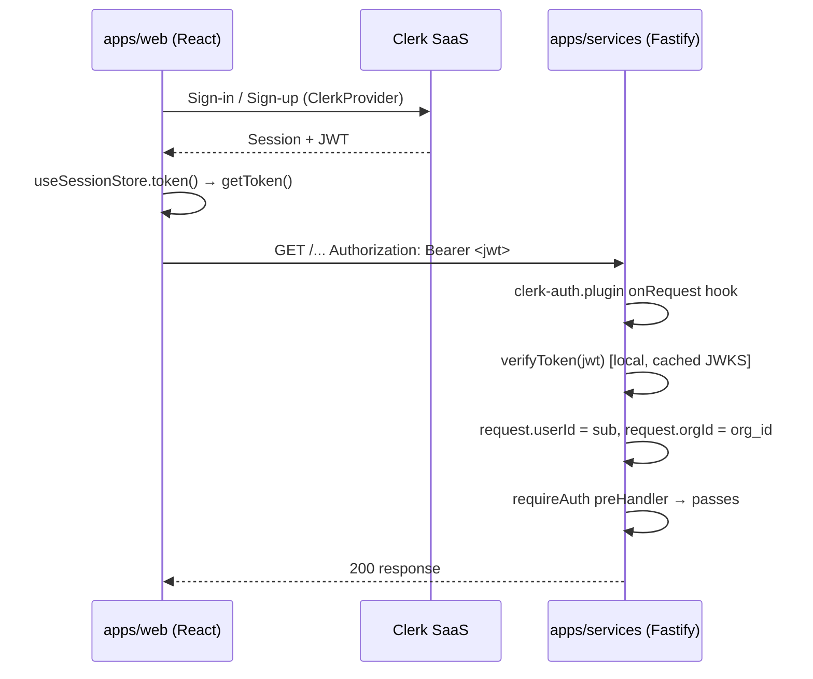

# AUTH-001 — Clerk Authentication Integration

## Problem statement

`apps/web` and `apps/services` are fully scaffolded but have no authentication layer. The frontend exposes a placeholder `useSessionStore` and an API client that already accepts an optional `Authorization: Bearer` header, while the backend serves only a public `/health` endpoint. This feature introduces Clerk as the end-to-end identity provider: React components and hooks manage user sessions on the frontend, and a Fastify plugin verifies Clerk JWTs locally on the backend, decorating requests with `userId` and `orgId` for downstream route handlers.

## Alternatives

| Alternative | Description | Decision |
|---|---|---|
| Option A — `@clerk/fastify` server plugin | Use the official `@clerk/fastify` package which ships both a Fastify plugin and a `clerkPlugin` that auto-handles session verification and route protection via `getAuth` helpers. | Not chosen — `@clerk/fastify` performs remote Clerk API calls per request by default and wraps routes in its own middleware model, conflicting with NF001 (local-only verification) and the project's `requireAuth`/`requireOrg` preHandler pattern. |
| Option B — Custom JWKS fetch + manual `jose` verification | Fetch Clerk's JWKS endpoint at startup, cache the key set, and use `jose` to verify tokens — building the full verification pipeline from scratch without any Clerk SDK on the backend. | Not chosen — reinvents functionality already handled by `@clerk/backend`'s `verifyToken` helper, which verifies locally using Clerk's public key fetched once at startup. More code to own, more surface for bugs, no benefit over Option C. |
| Option C — `@clerk/clerk-react` on frontend + `@clerk/backend` on backend (local verification) | Use `@clerk/clerk-react` for `ClerkProvider`, built-in components, and hooks in `apps/web`. Use `@clerk/backend`'s `verifyToken` in a custom Fastify plugin (`clerk-auth.plugin.ts`) that decodes the JWT locally using the public key obtained from Clerk's JWKS URL at plugin registration time — no per-request network call. | **Chosen** — satisfies all technical constraints directly, achieves NF001 (local per-request verification), fits the existing preHandler pattern in `apps/services`, and maps cleanly onto `@clerk/clerk-react`'s hooks for R006 and R007. |

## Chosen solution

**`@clerk/clerk-react` + `@clerk/backend` with local JWT verification**

This solution uses the official Clerk SDK split across the two apps:

- `apps/web` uses `@clerk/clerk-react` exclusively. `ClerkProvider` wraps the React tree in `main.tsx` (R001). Built-in `<SignIn />`, `<SignUp />`, `<CreateOrganization />`, and `<OrganizationProfile />` components satisfy R002, R003, R008, and R009. `useUser` and `useOrganization` are wrapped in thin hooks (R006, R007). `<UserButton />` is embedded in the authenticated layout (R010). An `AuthGuard` component uses `useAuth().isSignedIn` to gate protected routes (R004, R005).

- `apps/services` uses `@clerk/backend`'s `verifyToken` function. At plugin registration (`clerk-auth.plugin.ts`) the plugin fetches Clerk's JWKS keys once and caches them. Each `onRequest` handler call verifies the JWT locally from the cached public key — no per-request network call (NF001). The plugin decorates every request with `userId` and `orgId` (R011, R012, EC008). `requireAuth` and `requireOrg` are preHandler functions that read from those decorations and reply 401/403 respectively (R013, R014, R015, NF002).

This is the only option that satisfies both technical constraints (`@clerk/clerk-react` and `@clerk/backend` are the mandated SDKs) while keeping the verification path fully local per NF001.

## Technical design

### Frontend — `apps/web`

#### Provider bootstrap (`main.tsx`)

`ClerkProvider` from `@clerk/clerk-react` wraps the entire React tree just inside `StrictMode`. The publishable key is read from `import.meta.env.VITE_CLERK_PUBLISHABLE_KEY`. A missing key must throw before rendering (EC006). `ClerkProvider` is placed outside `QueryClientProvider` so Clerk state is available to all hooks.

#### Routing

`App.tsx` is replaced with a React Router DOM router. The route table is:

| Path | Component | Guard |
|---|---|---|
| `/sign-in` | `SignInPage` | public |
| `/sign-up` | `SignUpPage` | public |
| `/org/create` | `CreateOrgPage` | `AuthGuard` |
| `/org/profile` | `OrgProfilePage` | `AuthGuard` |
| `/*` (layout) | `AppLayout` + nested routes | `AuthGuard` |

#### `AuthGuard` component

A React component that calls `useAuth()` from `@clerk/clerk-react`. If `isLoaded` is false, renders a loading state. If `isSignedIn` is false, calls `<Navigate to="/sign-in" replace />`. Otherwise renders `<Outlet />` (R004, R005, EC004).

#### Hooks

| Export | File | Underlying Clerk hook | Return type |
|---|---|---|---|
| `useCurrentUser` | `hooks/use-current-user.ts` | `useUser()` | `UserResource \| null` |
| `useCurrentOrg` | `hooks/use-current-org.ts` | `useOrganization()` | `OrganizationResource \| null` |

Both return `null` when the respective resource is not loaded or not present (EC005).

#### `useSessionStore` integration

`useSessionStore` is updated to hold `{ userId: string \| null; token: () => Promise<string \| null> }`. The `token` field wraps Clerk's `useAuth().getToken()` so `api/client.ts` can retrieve a fresh JWT without knowing about Clerk.

#### Layout

`AppLayout.tsx` contains the shared chrome for authenticated routes and renders `<UserButton />` from `@clerk/clerk-react` in the header area (R010).

### Backend — `apps/services`

#### Fastify type augmentation

A declaration file `src/shared/plugins/clerk-auth.plugin.ts` augments `FastifyRequest` to add `userId: string | undefined` and `orgId: string | null | undefined`. These are `undefined` on routes that do not run the plugin's `onRequest` hook with a valid JWT, and `null` for `orgId` when no org is present in the token (EC008, NF002).

#### `clerk-auth.plugin.ts`

Registered with `fastify-plugin` so decorations are available globally. The plugin:

1. Reads `CLERK_SECRET_KEY` from `process.env`; throws at registration time if absent (EC007).
2. Calls `createClerkClient({ secretKey })` from `@clerk/backend` to obtain a Clerk client. Uses the client's built-in JWKS caching — Clerk's backend SDK fetches JWKS once and caches the key set in memory, so per-request verification is purely local (NF001).
3. Registers an `onRequest` hook on the Fastify instance. The hook:
   - Extracts the `Authorization` header; skips decoration if absent (EC008).
   - If the header is present but malformed (missing `Bearer` prefix), sets `request.userId = undefined` (EC002 — actual 401 is enforced by `requireAuth`).
   - Calls `verifyToken(token, { secretKey })` from `@clerk/backend`; on success sets `request.userId` from `sub` and `request.orgId` from `org_id ?? null` (R011, R012).
   - On failure (expired, invalid signature), sets `request.userId = undefined` (EC003 — 401 enforced by `requireAuth`).

#### `requireAuth` preHandler

Exported function `requireAuth(request, reply)`. If `request.userId` is `undefined`, throws `UnauthorizedError` which the existing error-handler plugin converts to HTTP 401 (R013, EC002, EC003).

#### `requireOrg` preHandler

Exported function `requireOrg(request, reply)`. First calls `requireAuth` to ensure userId is set. If `request.orgId` is `null`, replies with a `ForbiddenError` (HTTP 403) (R014). If `orgId` is a non-null string, passes through (R015).

#### `ForbiddenError`

A new typed error extending `DomainError` with `statusCode: 403` and code `FORBIDDEN`. Added to `shared/errors.ts`.

#### `app.ts`

Imports and registers `clerkAuthPlugin` after the existing security plugins so the `onRequest` hook fires on all subsequently registered routes.

### Data flow diagram

## Files

| Path | Action | Description |
|---|---|---|
| `apps/web/package.json` | MODIFY | Add `@clerk/clerk-react` and `react-router-dom` dependencies |
| `apps/web/src/main.tsx` | MODIFY | Wrap tree with `ClerkProvider`; fail-fast on missing `VITE_CLERK_PUBLISHABLE_KEY`; add `BrowserRouter` |
| `apps/web/src/App.tsx` | MODIFY | Replace `HealthPage` render with route table (`RouterProvider` / route definitions) |
| `apps/web/src/router.tsx` | CREATE | Define all application routes using `createBrowserRouter`; export `router` |
| `apps/web/src/components/auth/AuthGuard.tsx` | CREATE | `AuthGuard` component: checks `useAuth().isSignedIn`, redirects to `/sign-in` or renders `<Outlet />` |
| `apps/web/src/pages/auth/SignInPage.tsx` | CREATE | Route-level page rendering Clerk `<SignIn />` component |
| `apps/web/src/pages/auth/SignUpPage.tsx` | CREATE | Route-level page rendering Clerk `<SignUp />` component |
| `apps/web/src/pages/org/CreateOrgPage.tsx` | CREATE | Route-level page rendering Clerk `<CreateOrganization />` component |
| `apps/web/src/pages/org/OrgProfilePage.tsx` | CREATE | Route-level page rendering Clerk `<OrganizationProfile />` component |
| `apps/web/src/components/layout/AppLayout.tsx` | CREATE | Authenticated layout shell; renders `<UserButton />` in header and `<Outlet />` for nested routes |
| `apps/web/src/hooks/use-current-user.ts` | CREATE | `useCurrentUser` hook wrapping Clerk's `useUser`; returns `UserResource \| null` |
| `apps/web/src/hooks/use-current-org.ts` | CREATE | `useCurrentOrg` hook wrapping Clerk's `useOrganization`; returns `OrganizationResource \| null` |
| `apps/web/src/store/session.store.ts` | MODIFY | Extend `SessionState` with `userId: string \| null` and `token: () => Promise<string \| null>` |
| `apps/web/.env.example` | CREATE | Document `VITE_CLERK_PUBLISHABLE_KEY` and `VITE_API_URL` environment variables |
| `apps/services/package.json` | MODIFY | Add `@clerk/backend` dependency |
| `apps/services/src/shared/errors.ts` | MODIFY | Add `ForbiddenError` class extending `DomainError` with statusCode 403 and code `FORBIDDEN` |
| `apps/services/src/shared/plugins/clerk-auth.plugin.ts` | CREATE | Fastify plugin: reads `CLERK_SECRET_KEY`, registers `onRequest` hook for local JWT verification, decorates `request.userId` and `request.orgId` |
| `apps/services/src/shared/plugins/require-auth.ts` | CREATE | `requireAuth` preHandler function: replies 401 via `UnauthorizedError` if `request.userId` is undefined |
| `apps/services/src/shared/plugins/require-org.ts` | CREATE | `requireOrg` preHandler function: calls `requireAuth` then replies 403 via `ForbiddenError` if `request.orgId` is null |
| `apps/services/src/app.ts` | MODIFY | Import and register `clerkAuthPlugin` after existing security plugins |
| `apps/services/src/types/fastify.d.ts` | CREATE | Module augmentation declaring `userId: string \| undefined` and `orgId: string \| null \| undefined` on `FastifyRequest` |
| `apps/services/.env.example` | CREATE | Document `CLERK_SECRET_KEY`, `PORT`, `HOST`, `LOG_LEVEL`, `CORS_ORIGIN`, `SUPABASE_URL`, `SUPABASE_ANON_KEY` |

## Requirement coverage

| ID | Design decision |
|---|---|
| R001 | `main.tsx` wraps the tree in `ClerkProvider` using `VITE_CLERK_PUBLISHABLE_KEY`; fail-fast guard throws if the key is absent |
| R002 | `SignInPage.tsx` renders Clerk's `<SignIn />` component at the `/sign-in` route; `router.tsx` maps the path |
| R003 | `SignUpPage.tsx` renders Clerk's `<SignUp />` component at the `/sign-up` route; Clerk's built-in OTP flow handles email verification |
| R004 | `AuthGuard.tsx` reads `useAuth().isSignedIn`; redirects to `/sign-in` when false |
| R005 | `AuthGuard.tsx` renders `<Outlet />` when `isSignedIn` is true |
| R006 | `hooks/use-current-user.ts` wraps `useUser()` and returns `user ?? null` |
| R007 | `hooks/use-current-org.ts` wraps `useOrganization()` and returns `organization ?? null` |
| R008 | `CreateOrgPage.tsx` renders Clerk's `<CreateOrganization />` at `/org/create`, wrapped by `AuthGuard` |
| R009 | `OrgProfilePage.tsx` renders Clerk's `<OrganizationProfile />` at `/org/profile`, wrapped by `AuthGuard` |
| R010 | `AppLayout.tsx` renders `<UserButton />` from `@clerk/clerk-react` in the layout header |
| R011 | `clerk-auth.plugin.ts` registers a global `onRequest` hook that reads the `Authorization: Bearer` header and calls `verifyToken` |
| R012 | On a valid JWT, the `onRequest` hook sets `request.userId = payload.sub` and `request.orgId = payload.org_id ?? null` |
| R013 | `requireAuth` preHandler throws `UnauthorizedError` (→ HTTP 401) when `request.userId` is undefined |
| R014 | `requireOrg` preHandler replies with `ForbiddenError` (→ HTTP 403) when `request.orgId === null` |
| R015 | `requireOrg` preHandler allows the request through when `request.orgId` is a non-null string |
| NF001 | `@clerk/backend`'s `verifyToken` uses a cached JWKS key set fetched once at plugin registration; no Clerk API call occurs per request |
| NF002 | `request.orgId` is typed as `string \| null \| undefined`; the starter makes no route globally `requireOrg`-protected; per-route opt-in only |
| EC001 | Handled entirely by Clerk's `<SignUp />` component OTP flow; no custom code required |
| EC002 | Malformed `Authorization` header (no `Bearer` prefix) causes the token extraction step to skip setting `userId`; `requireAuth` then replies 401 |
| EC003 | `verifyToken` throws on expired JWTs; the `onRequest` hook catches the error and leaves `userId` undefined; `requireAuth` replies 401 |
| EC004 | Clerk's `<UserButton />` handles sign-out internally; `AuthGuard` re-evaluates `isSignedIn` on next render and redirects to `/sign-in` |
| EC005 | `useCurrentOrg` returns `null` when no org is active; matching backend requests have `orgId === null`; `requireOrg` routes reject them with 403 |
| EC006 | `main.tsx` checks for `VITE_CLERK_PUBLISHABLE_KEY` before rendering; throws `Error` with a descriptive message if absent |
| EC007 | `clerk-auth.plugin.ts` checks for `CLERK_SECRET_KEY` at registration time; throws `Error` with a descriptive message if absent |
| EC008 | The `onRequest` hook skips decoration when no `Authorization` header is present, leaving `userId` and `orgId` as `undefined`; no automatic 401 is issued |
