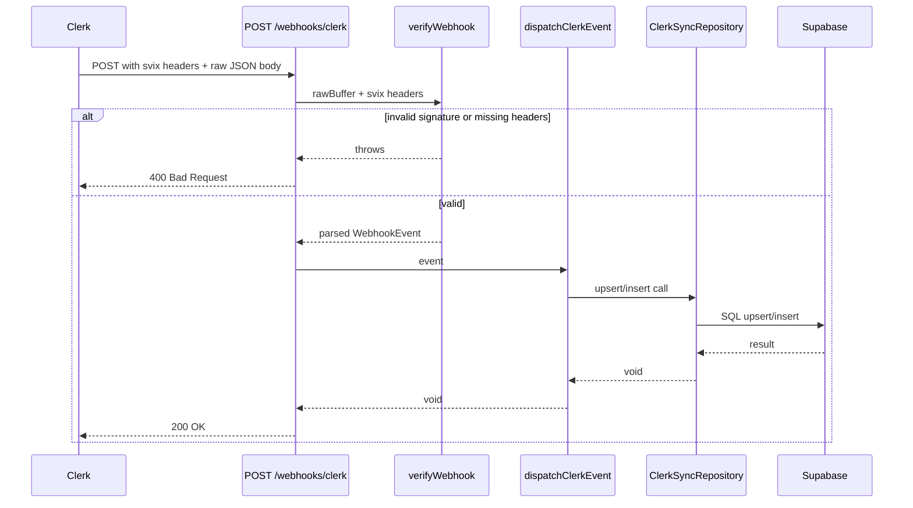

# AUTH-002 — Supabase Schema & Clerk Sync

## Problem statement

Clerk manages authentication (AUTH-001), but the platform has no persistence layer for user and organization data. Without local records in Supabase, the platform cannot associate business entities (subscriptions, projects, billing) with users or organizations, nor query or join against them. This feature establishes the foundational Supabase schema and a Clerk webhook endpoint that keeps those tables synchronized with Clerk's source of truth in near real time.

## Alternatives

| Alternative | Description | Decision |
|---|---|---|
| Monolithic handler | A single `routes.ts` file inside a `webhooks` module handles all event types inline with no repository abstraction. | Not chosen — violates the vertical-slice / hexagonal pattern; inline DB calls make upsert logic untestable and the file grows unmanageably as event types increase. |
| Webhook module with handler map + repository | A `src/modules/webhooks/clerk/` module with a route plugin, a dispatcher that maps event type strings to handler functions, and a repository that wraps all Supabase upsert calls. | **Chosen** — aligns with the established BACKEND.md architecture (vertical slicing, constructor injection, repository pattern); each handler is an isolated unit; the repository centralises all DB access. |
| Webhook as shared plugin | The webhook endpoint is registered inside `src/shared/plugins/` alongside cors/helmet. | Not chosen — misplaces feature-level business logic in shared infrastructure; `src/shared/` is reserved for cross-cutting concerns, not domain-specific routes. |

## Chosen solution

**Webhook module with handler map + repository**

This solution satisfies all functional requirements (R001–R013) and both non-functional requirements. It respects the technical constraint that the route must be registered before Fastify's JSON-parsing plugin by using `addContentTypeParser` to capture the raw body at the route level. The `CLERK_WEBHOOK_SIGNING_SECRET` check at registration time satisfies EC006 (fail-fast). The repository's upsert-on-conflict semantics satisfy EC003, EC004, and EC007. EC005 (missing FK parent rows) is handled by catching FK constraint errors in the membership handler and logging them without propagating.

## Technical design

### Supabase migration

One migration file creates all three tables. `uuid_generate_v4()` is used for primary keys; `updated_at` is managed by a trigger function.

```sql
-- users
CREATE TABLE users (
  id          UUID PRIMARY KEY DEFAULT uuid_generate_v4(),
  clerk_user_id TEXT UNIQUE NOT NULL,
  email       TEXT NOT NULL,
  name        TEXT NOT NULL,
  avatar_url  TEXT,
  created_at  TIMESTAMPTZ NOT NULL DEFAULT now(),
  updated_at  TIMESTAMPTZ NOT NULL DEFAULT now()
);

-- organizations
CREATE TABLE organizations (
  id           UUID PRIMARY KEY DEFAULT uuid_generate_v4(),
  clerk_org_id TEXT UNIQUE NOT NULL,
  name         TEXT NOT NULL,
  slug         TEXT UNIQUE NOT NULL,
  created_at   TIMESTAMPTZ NOT NULL DEFAULT now(),
  updated_at   TIMESTAMPTZ NOT NULL DEFAULT now()
);

-- organization_members
CREATE TABLE organization_members (
  user_id    UUID NOT NULL REFERENCES users(id) ON DELETE CASCADE,
  org_id     UUID NOT NULL REFERENCES organizations(id) ON DELETE CASCADE,
  role       TEXT NOT NULL,
  created_at TIMESTAMPTZ NOT NULL DEFAULT now(),
  PRIMARY KEY (user_id, org_id)
);
```

### Seed data

A seed SQL file for local development inserts two example users, one organization, and two membership rows, all using `ON CONFLICT DO NOTHING` to keep seeds idempotent.

### Webhook module structure

```
src/modules/webhooks/clerk/
  routes.ts       — Fastify plugin: registers POST /webhooks/clerk with raw body parsing
  handlers.ts     — dispatcher + per-event handler functions
  repository.ts   — all Supabase upsert/insert calls
```

### Raw body capture (NF001)

Inside `routes.ts` the route uses `config: { rawBody: true }` is NOT available in Fastify v4 without a plugin. Instead, the route is registered with `addContentTypeParser('application/json', ...)` scoped to the webhook plugin so that the raw buffer is available in the handler before calling `verifyWebhook`. The content-type parser stores the raw bytes on the request and also provides the parsed JSON body so downstream code can use both.

Implementation pattern:

```typescript
fastify.addContentTypeParser(
  'application/json',
  { parseAs: 'buffer' },
  (_req, body, done) => { done(null, body); }
);
```

The handler then receives `request.body` as a `Buffer`. It passes this buffer directly to `verifyWebhook` along with the Svix headers extracted from `request.headers`.

### Signature verification (R006, R007, EC001, EC006)

`verifyWebhook` from `@clerk/backend/webhooks` is called with:
- The raw `Buffer` body
- An object containing `svix-id`, `svix-timestamp`, `svix-signature` headers

If any required header is missing or the signature is invalid, `verifyWebhook` throws. The handler catches this and replies with HTTP 400.

### Event dispatcher (R009–R012, EC002)

A `dispatchClerkEvent` function maps event `type` strings to handler functions:

| Event type | Handler |
|---|---|
| `user.created` | `handleUserUpsert` |
| `user.updated` | `handleUserUpsert` |
| `organization.created` | `handleOrganizationUpsert` |
| `organizationMembership.created` | `handleMembershipCreate` |
| (any other) | no-op, returns HTTP 200 (EC002) |

### Repository (R009–R012, EC003, EC004, EC005, EC007)

`ClerkSyncRepository` class with four methods:

| Method | SQL semantics |
|---|---|
| `upsertUser(data)` | `INSERT ... ON CONFLICT (clerk_user_id) DO UPDATE SET email, name, avatar_url, updated_at` |
| `upsertOrganization(data)` | `INSERT ... ON CONFLICT (clerk_org_id) DO UPDATE SET name, slug, updated_at` |
| `createMembership(data)` | `INSERT ... ON CONFLICT (user_id, org_id) DO NOTHING`; if referenced user or org is not found, logs warning and returns without error (EC005) |

`createMembership` first resolves the local `user_id` and `org_id` by querying `users.clerk_user_id` and `organizations.clerk_org_id`. If either lookup returns no row, it logs and returns — no FK error is raised.

### Environment variable (EC006)

`routes.ts` reads `CLERK_WEBHOOK_SIGNING_SECRET` at plugin registration time and throws `Error` immediately if absent, preventing the route from ever being served unverified.

### app.ts registration order

The webhook plugin must be registered BEFORE `clerkAuthPlugin` to avoid the global `onRequest` hook attempting to verify a Bearer token on a route that intentionally has no Authorization header. The plugin skips the global auth hook by design — it uses its own Svix verification.

Actually, re-reading the constraint: the route must be registered before the JSON parsing plugin. Fastify v4 does not register a global JSON body parser by default; each route receives body parsing through its declared `Content-Type`. The `addContentTypeParser` override is scoped inside the webhook plugin so it only affects routes within that plugin context. The webhook plugin should be registered before `clerkAuthPlugin` so the global auth hook does not interfere. The webhook route should use `config: { skipAuth: true }` or the plugin should be wrapped in a scope that bypasses the global `onRequest` hook from `clerkAuthPlugin`.

Since `clerkAuthPlugin` is registered globally via `fastify-plugin` and sets `userId`/`orgId` on the request (but does not block requests without auth), the webhook route does not need to bypass it — unauthenticated requests simply have `userId = undefined`, which is harmless. The webhook plugin can be registered in any order relative to security plugins.

### Sequence diagram



## Files

| Path | Action | Description |
|---|---|---|
| `apps/services/supabase/migrations/20240101000000_identity_schema.sql` | CREATE | Initial migration: `users`, `organizations`, `organization_members` tables with trigger for `updated_at` |
| `apps/services/supabase/seed.sql` | CREATE | Seed data for local development (example users, org, memberships) |
| `apps/services/src/modules/webhooks/clerk/routes.ts` | CREATE | Fastify plugin — registers `POST /webhooks/clerk` with raw buffer content-type parser and Svix verification |
| `apps/services/src/modules/webhooks/clerk/handlers.ts` | CREATE | `dispatchClerkEvent` dispatcher and per-event handler functions (`handleUserUpsert`, `handleOrganizationUpsert`, `handleMembershipCreate`) |
| `apps/services/src/modules/webhooks/clerk/repository.ts` | CREATE | `ClerkSyncRepository` class with `upsertUser`, `upsertOrganization`, `createMembership` methods |
| `apps/services/src/app.ts` | MODIFY | Register `clerkWebhookRoutes` plugin before `clerkAuthPlugin` |
| `apps/services/package.json` | MODIFY | Add `svix` (or rely on `@clerk/backend`'s re-export) — add `@clerk/backend` webhook import; confirm `svix` is a peer dep or add it explicitly |

## Requirement coverage

| ID | Design decision |
|---|---|
| R001 | `apps/services/supabase/migrations/` directory created with the initial migration file; Supabase CLI config lives there |
| R002 | `20240101000000_identity_schema.sql` defines the `users` table with all specified columns |
| R003 | `20240101000000_identity_schema.sql` defines the `organizations` table with all specified columns |
| R004 | `20240101000000_identity_schema.sql` defines the `organization_members` table with FK references and composite PK |
| R005 | `routes.ts` registers `POST /webhooks/clerk` on the Fastify instance |
| R006 | `routes.ts` handler calls `verifyWebhook(rawBuffer, svixHeaders)` before any business logic |
| R007 | Catch block in the handler replies with `reply.status(400).send()` when `verifyWebhook` throws |
| R008 | Handler replies `reply.status(200).send()` after `dispatchClerkEvent` resolves without error |
| R009 | `handleUserUpsert` in `handlers.ts` calls `repository.upsertUser` on `user.created` events |
| R010 | `handleUserUpsert` in `handlers.ts` calls `repository.upsertUser` on `user.updated` events (same upsert path) |
| R011 | `handleOrganizationUpsert` in `handlers.ts` calls `repository.upsertOrganization` on `organization.created` events |
| R012 | `handleMembershipCreate` in `handlers.ts` calls `repository.createMembership` on `organizationMembership.created` events |
| R013 | `supabase/seed.sql` provides idempotent seed rows for users, organizations, and memberships |
| NF001 | `addContentTypeParser('application/json', { parseAs: 'buffer' }, ...)` in `routes.ts` ensures `request.body` is a raw `Buffer` passed to `verifyWebhook` |
| NF002 | HTTP 400 on `verifyWebhook` throw; HTTP 200 after successful dispatch — explicit `reply.status(...)` calls in `routes.ts` |
| EC001 | `verifyWebhook` throws when Svix headers are absent; catch block sends 400 |
| EC002 | `dispatchClerkEvent` returns without calling any repository method for unrecognised event types; handler sends 200 |
| EC003 | `upsertUser` uses `ON CONFLICT (clerk_user_id) DO UPDATE` — existing rows are updated, not duplicated |
| EC004 | `user.updated` is routed to the same `handleUserUpsert` which calls `upsertUser` — idempotent upsert heals missing rows |
| EC005 | `createMembership` resolves user/org by Clerk IDs first; if lookup returns nothing, logs warning and returns without inserting — no FK error |
| EC006 | `routes.ts` reads `CLERK_WEBHOOK_SIGNING_SECRET` at plugin registration time and throws `Error` immediately if absent |
| EC007 | `upsertOrganization` uses `ON CONFLICT (clerk_org_id) DO UPDATE` — duplicate slug via same Clerk org ID is handled as an update |
