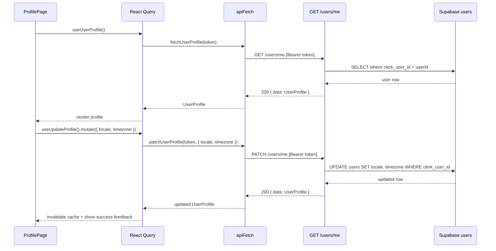

# AUTH-003 — User Profile

## Problem statement

User identity data is already synchronized into the Supabase `users` table via the Clerk webhook (AUTH-002), but the product has no way for users to view or edit their own profile. There are no backend endpoints exposing the authenticated user's profile and no UI surface in `apps/web` for rendering or mutating it. This feature closes that gap by adding `GET /users/me` and `PATCH /users/me` endpoints in `apps/services` and a `/profile` page in `apps/web`, while extending the `users` table with `locale` and `timezone` columns.

## Chosen solution

**Hexagonal slice `users` module with React Query profile page**

A new `src/modules/users/` vertical slice is added to `apps/services` following the existing hexagonal pattern (routes → handler → use-case → repository interface + implementation). The two endpoints reuse the existing `requireAuth` preHandler and the shared `supabase` client. On the frontend, a dedicated `api/users.ts` module and a `useUserProfile` / `useUpdateProfile` hook pair wrap the API calls with React Query, consumed by a new `/profile` page added under `AuthGuard`. The shared `UserProfile` interface is published from `@repo/types`.

This solution satisfies R001–R012, NF001, NF002, and all edge cases (EC001–EC007) while respecting every technical constraint from analysis.md. It introduces no new auth or sync primitives and stays strictly within the defined scope.

## Technical design

### Data model extension (R001)

A new Supabase migration adds `locale` (TEXT, nullable) and `timezone` (TEXT, nullable) columns to the `users` table. No default values — `null` is the legitimate initial state.

### Shared type (R012)

```ts
// packages/types/src/index.ts — new export
export interface UserProfile {
  name: string;
  email: string;
  avatar_url: string | null;
  locale: string | null;
  timezone: string | null;
}
```

### Backend — `src/modules/users/`

**Repository interface** (`repositories/interfaces/IUserRepository.ts`):

```ts
export interface IUserRepository {
  findByClerkUserId(clerkUserId: string): Promise<UserProfile | null>;
  updatePreferences(
    clerkUserId: string,
    patch: { locale?: string | null; timezone?: string | null },
  ): Promise<UserProfile>;
}
```

**Repository implementation** (`repositories/UserDBRepository.ts`): queries the `users` table via the shared `supabase` client.

**Zod schema for PATCH body** (in `dtos/updateProfile.dto.ts`):

```ts
const UpdateProfileBody = z.object({
  locale: z.string().nullable().optional(),
  timezone: z.string().nullable().optional(),
}).strict(); // .strict() rejects unknown fields → satisfies R006, NF002, EC005
```

**Use cases**:
- `GetUserProfileUseCase` — calls `repo.findByClerkUserId`; throws `NotFoundError` when `null` (EC002).
- `UpdateUserProfileUseCase` — calls `repo.updatePreferences`; handles empty patch as no-op returning current profile (EC003); propagates DB errors as 500 (EC006).

**Routes** (`routes.ts`): registered as a Fastify plugin in `app.ts`.

```
GET  /users/me   → requireAuth → GetUserProfileHandler
PATCH /users/me  → requireAuth → UpdateUserProfileHandler
```

Response shape for both endpoints (success):
```json
{ "data": { "name": "...", "email": "...", "avatar_url": "...", "locale": "...", "timezone": "..." } }
```

### Frontend — `apps/web/src/`

**API module** (`api/users.ts`):

```ts
export async function fetchUserProfile(token: string): Promise<UserProfile>
export async function patchUserProfile(
  token: string,
  body: { locale?: string | null; timezone?: string | null },
): Promise<UserProfile>
```

Both functions use the existing `apiFetch` helper with `Authorization: Bearer <token>` (token obtained from `useAuth().getToken()`).

**Hooks** (`hooks/use-user-profile.ts`):
- `useUserProfile()` — React Query `useQuery` with key `['users', 'me']`.
- `useUpdateProfile()` — React Query `useMutation`; on success, invalidates `['users', 'me']` and sets a success flag; on error, surfaces error state (R010, R011).

**Profile page** (`pages/profile/ProfilePage.tsx`):
- Placed behind `AuthGuard` at `/profile`.
- Renders `name`, `email`, avatar (with fallback placeholder when `avatar_url` is null — EC007), `locale`, `timezone` (R008).
- Controlled form for `locale` and `timezone`; submit dispatches mutation (R009).
- Displays success or error feedback after submission (R010, R011).

### Sequence diagram



## Files

| Path | Action | Description |
|---|---|---|
| `apps/services/supabase/migrations/20260622000000_users_locale_timezone.sql` | CREATE | Migration adding `locale` and `timezone` nullable text columns to `users` |
| `packages/types/src/index.ts` | MODIFY | Export `UserProfile` interface |
| `apps/services/src/modules/users/repositories/interfaces/IUserRepository.ts` | CREATE | Repository contract with `findByClerkUserId` and `updatePreferences` |
| `apps/services/src/modules/users/repositories/UserDBRepository.ts` | CREATE | Supabase implementation of `IUserRepository` |
| `apps/services/src/modules/users/dtos/updateProfile.dto.ts` | CREATE | Zod schema for PATCH body (strict, locale + timezone only) |
| `apps/services/src/modules/users/entities/user.entity.ts` | CREATE | Internal domain entity type for the users module |
| `apps/services/src/modules/users/useCases/GetUserProfileUseCase.ts` | CREATE | Business logic for fetching a user's profile |
| `apps/services/src/modules/users/useCases/UpdateUserProfileUseCase.ts` | CREATE | Business logic for patching locale/timezone; no-op on empty body |
| `apps/services/src/modules/users/handlers/getUserProfileHandler.ts` | CREATE | Fastify handler composing repo + GetUserProfileUseCase |
| `apps/services/src/modules/users/handlers/updateUserProfileHandler.ts` | CREATE | Fastify handler composing repo + UpdateUserProfileUseCase |
| `apps/services/src/modules/users/routes.ts` | CREATE | Fastify plugin registering GET and PATCH /users/me with requireAuth |
| `apps/services/src/app.ts` | MODIFY | Register the users routes plugin |
| `apps/web/src/api/users.ts` | CREATE | `fetchUserProfile` and `patchUserProfile` functions using `apiFetch` |
| `apps/web/src/hooks/use-user-profile.ts` | CREATE | `useUserProfile` query hook and `useUpdateProfile` mutation hook |
| `apps/web/src/pages/profile/ProfilePage.tsx` | CREATE | `/profile` page: renders profile data and edit form with save feedback |
| `apps/web/src/router.tsx` | MODIFY | Add `/profile` route under the existing `AuthGuard` subtree |

## Requirement coverage

| ID | Design decision |
|---|---|
| R001 | Migration `20260622000000_users_locale_timezone.sql` adds nullable `locale` and `timezone` text columns to `users` |
| R002 | `routes.ts` registers `GET /users/me` with `requireAuth` as preHandler |
| R003 | `GetUserProfileUseCase` queries Supabase by `clerk_user_id` and returns all five profile fields; `getUserProfileHandler` serialises to JSON |
| R004 | `routes.ts` registers `PATCH /users/me` with `requireAuth` as preHandler |
| R005 | `UpdateUserProfileUseCase` calls `repo.updatePreferences` with only the supplied fields and returns the updated profile |
| R006 | `UpdateProfileBody` Zod schema uses `.strict()` — unknown fields cause validation to fail with HTTP 400 |
| R007 | `ProfilePage` is placed inside the existing `AuthGuard` subtree in `router.tsx` |
| R008 | `useUserProfile` hook fetches via `GET /users/me` on mount; `ProfilePage` renders all five fields |
| R009 | `ProfilePage` form calls `useUpdateProfile().mutate(...)` with locale/timezone values on submit |
| R010 | `useUpdateProfile` mutation `onSuccess` sets a success state rendered as visible feedback in `ProfilePage` |
| R011 | `useUpdateProfile` mutation `onError` sets an error state rendered as visible feedback in `ProfilePage`; cached profile is not mutated |
| R012 | `UserProfile` interface exported from `packages/types/src/index.ts`, consumed by both `apps/services` and `apps/web` |
| NF001 | `UserDBRepository.findByClerkUserId` does a single indexed lookup on `clerk_user_id` (unique column); no joins or N+1 queries |
| NF002 | `UpdateProfileBody` Zod schema validates the PATCH body, accepting only `locale` and `timezone` |
| EC001 | Delegated entirely to the existing `requireAuth` preHandler — no Supabase query occurs when JWT is absent/invalid |
| EC002 | `GetUserProfileUseCase` throws `NotFoundError` when the repository returns `null`; error-handler plugin maps this to HTTP 404 |
| EC003 | `UpdateUserProfileUseCase` detects an empty patch object and calls `repo.findByClerkUserId` to return the current profile with HTTP 200 |
| EC004 | `UpdateProfileBody` allows `z.string().nullable()` so explicit `null` values are accepted and persisted |
| EC005 | `z.string().nullable()` in the Zod schema rejects non-string, non-null values with HTTP 400 |
| EC006 | Supabase errors in `UserDBRepository.updatePreferences` propagate as thrown errors → error-handler returns HTTP 500; frontend `onError` surfaces save-error feedback |
| EC007 | `ProfilePage` renders a fallback avatar placeholder element when `avatar_url` is `null` |
