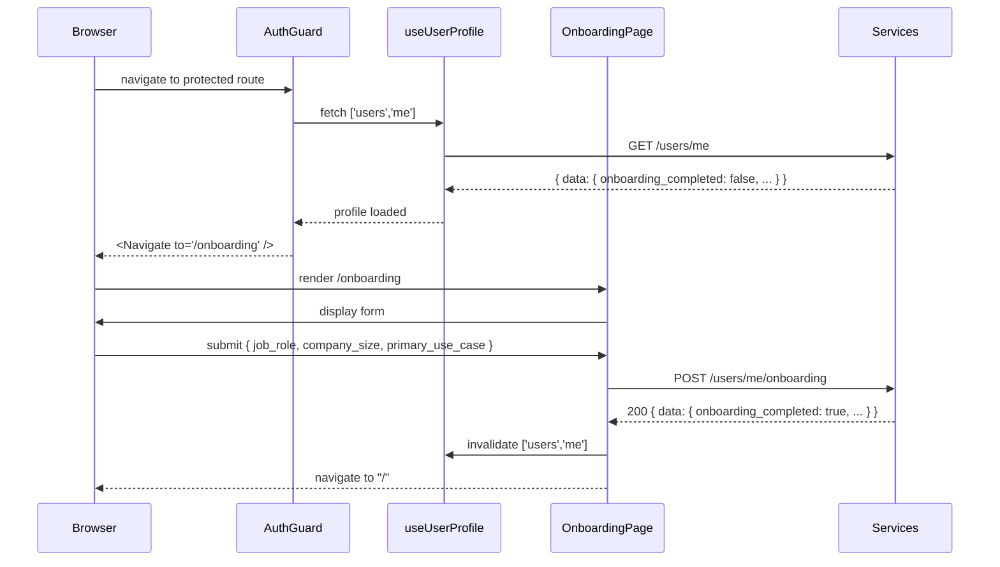

# AUTH-004 — Onboarding

## Problem statement

Newly registered users land directly on the authenticated dashboard without any segmentation step. The `users` table holds no information about job role, company size, or primary use case, blocking downstream personalisation, lifecycle messaging, and analytics. A mandatory onboarding gate must intercept the first authenticated access, collect those three fields, and persist them before the user can reach any protected page.

## Alternatives

| Alternative | Description | Decision |
|---|---|---|
| Option A — Separate onboarding service module | Introduce a new `src/modules/onboarding/` vertical slice with its own repository interface, DB repository, use case, handler, and route, completely independent of the `users` module. | Not chosen — the onboarding data lives on the `users` table and the operation is semantically an update to the user record; creating a separate module would duplicate the repository layer and violate the single-responsibility boundary already established in AUTH-003. |
| Option B — Extend `PATCH /users/me` with onboarding fields | Reuse the existing `UpdateUserProfileUseCase` and route by adding `job_role`, `company_size`, `primary_use_case`, and `onboarding_completed` as optional patch fields on `PATCH /users/me`. | Not chosen — the onboarding submission has distinct semantics (all three fields required simultaneously, `onboarding_completed` toggled atomically), different Zod schema (non-nullable required strings), and a different caller intent; conflating it with the general preferences patch would bloat the existing DTO, weaken validation, and obscure the business event in logs. |
| Option C — New endpoint within the existing `users` module | Add `POST /users/me/onboarding` as a new route, handler, use case, and repository method inside `src/modules/users/`, reusing the existing `UserDBRepository` class, `IUserRepository` interface, and hexagonal slice wiring. | **Chosen** — keeps onboarding logic inside the correct domain boundary (users), avoids code duplication, follows the established hexagonal slice convention, and satisfies all R-IDs cleanly. |

## Chosen solution

**New endpoint within the existing `users` module (Option C)**

This solution extends the `users` vertical slice with one new use case (`CompleteOnboardingUseCase`), one handler (`completeOnboardingHandler`), and one new DTO (`completeOnboarding.dto.ts`). The `IUserRepository` interface gains a single `completeOnboarding` method; `UserDBRepository` implements it with a single atomic `UPDATE … RETURNING` statement. `GET /users/me` is updated to select and return `onboarding_completed` without any structural change to the route. On the frontend, `AuthGuard` is extended to consume `useUserProfile` and perform the onboarding redirect before rendering any protected child, and a new `/onboarding` page renders the three-field form and fires a new `useCompleteOnboarding` mutation. This approach satisfies R001–R011 and NF001–NF002 while respecting all technical constraints from analysis.md.

## Technical design

### Database migration

A new migration adds four columns to `users`:

```sql
ALTER TABLE users
  ADD COLUMN job_role              TEXT,
  ADD COLUMN company_size          TEXT,
  ADD COLUMN primary_use_case      TEXT,
  ADD COLUMN onboarding_completed  BOOLEAN NOT NULL DEFAULT FALSE;
```

All three segmentation columns are nullable text (no enum enforcement per out-of-scope). `onboarding_completed` is non-null with `DEFAULT FALSE` (R001).

### Shared types — `@repo/types`

`UserProfile` gains four new fields:

```typescript
export interface UserProfile {
  name: string;
  email: string;
  avatar_url: string | null;
  locale: string | null;
  timezone: string | null;
  // onboarding
  job_role: string | null;
  company_size: string | null;
  primary_use_case: string | null;
  onboarding_completed: boolean;
}
```

### Backend — `apps/services`

#### Entity

`UserEntity` gains the four new columns as optional fields to match the DB row.

#### DTO — `completeOnboarding.dto.ts`

```typescript
export const CompleteOnboardingBody = z.object({
  job_role: z.string().min(1),
  company_size: z.string().min(1),
  primary_use_case: z.string().min(1),
}).strict();
export type CompleteOnboardingBodyType = z.infer<typeof CompleteOnboardingBody>;
```

All three fields required, non-empty (NF001, EC002, EC003).

#### Repository interface addition

```typescript
completeOnboarding(
  clerkUserId: string,
  data: { job_role: string; company_size: string; primary_use_case: string },
): Promise<UserProfile>;
```

Returns the updated `UserProfile` or throws if the row is not found (EC004). A single `UPDATE … RETURNING` ensures atomicity (R003).

#### `UserDBRepository` — `findByClerkUserId` and `completeOnboarding`

`findByClerkUserId` is updated to also `SELECT` the four new columns so `GET /users/me` returns them (R005).

`completeOnboarding` performs:
```sql
UPDATE users
SET job_role = $1, company_size = $2, primary_use_case = $3, onboarding_completed = TRUE
WHERE clerk_user_id = $4
RETURNING name, email, avatar_url, locale, timezone,
          job_role, company_size, primary_use_case, onboarding_completed
```
Returns `UserProfile`. If no row is updated (`rows.length === 0`) throws `NotFoundError` (EC004). DB errors propagate to the Fastify error handler as HTTP 500 (EC005).

#### Use case — `CompleteOnboardingUseCase`

```typescript
async execute(
  clerkUserId: string,
  data: { job_role: string; company_size: string; primary_use_case: string },
): Promise<UserProfile>
```

Delegates directly to `repo.completeOnboarding(clerkUserId, data)`. The repository throws `NotFoundError` when the user row is absent (EC004). EC006 (idempotent re-submission) is handled naturally: the `UPDATE` simply overwrites existing values and leaves `onboarding_completed = TRUE`.

#### Handler — `completeOnboardingHandler`

- Parses body with `CompleteOnboardingBody.parse`; catches `ZodError` → 400 (NF001, EC002, EC003).
- Instantiates `UserDBRepository` and `CompleteOnboardingUseCase`.
- Calls `useCase.execute(request.userId!, body)` → 200 `{ data: profile }` (R004).
- `NotFoundError` is caught by the shared Fastify error handler → 404 `NOT_FOUND` (EC004).
- Uncaught DB errors → 500 (EC005).

#### Route registration — `routes.ts`

```typescript
fastify.post('/users/me/onboarding', { preHandler: requireAuth }, completeOnboardingHandler);
```

`requireAuth` enforces Clerk JWT (R002, EC001).

### API contract

**Request**

```
POST /users/me/onboarding
Authorization: Bearer <clerk_jwt>
Content-Type: application/json

{
  "job_role": "Engineer",
  "company_size": "11-50",
  "primary_use_case": "Build internal tools"
}
```

**Response 200**

```json
{
  "data": {
    "name": "Alice",
    "email": "alice@example.com",
    "avatar_url": null,
    "locale": null,
    "timezone": null,
    "job_role": "Engineer",
    "company_size": "11-50",
    "primary_use_case": "Build internal tools",
    "onboarding_completed": true
  }
}
```

**Response 400** — missing or empty field

```json
{ "code": "VALIDATION_ERROR", "message": "Required" }
```

**Response 401** — missing/invalid JWT

```json
{ "code": "UNAUTHORIZED", "message": "..." }
```

**Response 404** — user row not found

```json
{ "code": "NOT_FOUND", "message": "User not found" }
```

### Frontend — `apps/web`

#### `AuthGuard` extension

`AuthGuard` currently only checks `isLoaded` and `isSignedIn` from `useAuth`. It is extended to also call `useUserProfile` and inspect `onboarding_completed`:

```
isLoaded && isSignedIn?
  No  → redirect /sign-in
  Yes → isProfileLoading || isProfileError?
          Yes → render loading/neutral state (EC007, EC008)
          No  → onboarding_completed === false && not already on /onboarding?
                  Yes → <Navigate to="/onboarding" />
                No  → onboarding_completed === true && on /onboarding?
                        Yes → <Navigate to="/" />
                        No  → <Outlet />
```

The profile check is done before `<Outlet />` is rendered, guaranteeing no protected page is shown first (NF002). EC009 is already handled by the existing `isSignedIn` check.

#### Router

A new `/onboarding` route is added inside the `AuthGuard` wrapper so the existing auth check applies (R006, EC009). It must be listed as a sibling to `/profile`, `/org/create`, etc.

#### API function — `users.ts`

```typescript
export async function postOnboarding(
  token: string,
  body: { job_role: string; company_size: string; primary_use_case: string },
): Promise<UserProfile>
```

Calls `POST /users/me/onboarding`.

#### Hook — `use-user-profile.ts`

A new `useCompleteOnboarding` hook is added alongside `useUpdateProfile`:

```typescript
export function useCompleteOnboarding(): UseMutationResult<...>
```

On success it invalidates `['users', 'me']` (R010). The caller (`OnboardingPage`) navigates to `/` on `onSuccess` (R011).

#### `OnboardingPage`

- Renders a welcome heading and a form with three `<input>` fields for `job_role`, `company_size`, and `primary_use_case`, plus a submit button (R009).
- On submit calls `useCompleteOnboarding`; on mutation success navigates to `/` (R011).

### Sequence diagram



## Files

| Path | Action | Description |
|---|---|---|
| `apps/services/supabase/migrations/20260622224341_users_onboarding_fields.sql` | CREATE | Migration adding `job_role`, `company_size`, `primary_use_case`, and `onboarding_completed` columns to `users`. |
| `packages/types/src/index.ts` | MODIFY | Add `job_role`, `company_size`, `primary_use_case`, and `onboarding_completed` to `UserProfile`. |
| `apps/services/src/modules/users/entities/user.entity.ts` | MODIFY | Add the four new columns to `UserEntity`. |
| `apps/services/src/modules/users/dtos/completeOnboarding.dto.ts` | CREATE | Zod schema `CompleteOnboardingBody` requiring three non-empty string fields. |
| `apps/services/src/modules/users/repositories/interfaces/IUserRepository.ts` | MODIFY | Add `completeOnboarding` method signature. |
| `apps/services/src/modules/users/repositories/UserDBRepository.ts` | MODIFY | Extend `findByClerkUserId` to select new columns; implement `completeOnboarding` with single atomic UPDATE. |
| `apps/services/src/modules/users/useCases/CompleteOnboardingUseCase.ts` | CREATE | Use case delegating to `repo.completeOnboarding`; throws `NotFoundError` propagated from repo. |
| `apps/services/src/modules/users/handlers/completeOnboardingHandler.ts` | CREATE | Fastify handler: parse body with Zod, invoke use case, return 200 or 400. |
| `apps/services/src/modules/users/routes.ts` | MODIFY | Register `POST /users/me/onboarding` with `requireAuth` preHandler. |
| `apps/web/src/api/users.ts` | MODIFY | Add `postOnboarding` API function. |
| `apps/web/src/hooks/use-user-profile.ts` | MODIFY | Add `useCompleteOnboarding` mutation hook. |
| `apps/web/src/components/auth/AuthGuard.tsx` | MODIFY | Add onboarding gate: consume `useUserProfile`, redirect to/from `/onboarding` based on `onboarding_completed`. |
| `apps/web/src/pages/onboarding/OnboardingPage.tsx` | CREATE | Form page with `job_role`, `company_size`, `primary_use_case` fields; navigates to `/` on success. |
| `apps/web/src/router.tsx` | MODIFY | Add `/onboarding` route inside the `AuthGuard` wrapper. |
| `apps/services/tests/unit/users/completeOnboarding.test.ts` | CREATE | Unit tests for `CompleteOnboardingUseCase` covering R003, R004, EC004, EC005, EC006. |
| `apps/services/tests/unit/users/completeOnboardingHandler.test.ts` | CREATE | Unit tests for `completeOnboardingHandler` covering NF001, EC001, EC002, EC003. |
| `apps/services/tests/unit/users/getUserProfile.test.ts` | CREATE | Unit tests asserting `findByClerkUserId` returns `onboarding_completed` (R005). |
| `apps/web/tests/AuthGuard.test.tsx` | CREATE | Vitest/RTL tests for onboarding redirect logic covering R007, R008, EC007, EC008, EC009. |
| `apps/web/tests/OnboardingPage.test.tsx` | CREATE | Vitest/RTL tests for onboarding form covering R009, R010, R011, EC002, EC003. |

## Requirement coverage

| ID | Design decision |
|---|---|
| R001 | Migration `20260622224341_users_onboarding_fields.sql` adds nullable `job_role`, `company_size`, `primary_use_case` (text) and non-null `onboarding_completed boolean DEFAULT FALSE` to `users`. |
| R002 | Route `POST /users/me/onboarding` registered in `routes.ts` with `requireAuth` preHandler. |
| R003 | `UserDBRepository.completeOnboarding` performs a single `UPDATE … SET … onboarding_completed = TRUE … RETURNING` — all four fields written atomically. |
| R004 | `completeOnboardingHandler` returns HTTP 200 with `{ data: UserProfile }` after successful use-case execution. |
| R005 | `UserDBRepository.findByClerkUserId` extended to SELECT all four new columns; `GET /users/me` response includes `onboarding_completed` via the same handler/use-case path. |
| R006 | `/onboarding` added to the router inside the `AuthGuard` layout, making it authenticated-only. |
| R007 | `AuthGuard` redirect: if `onboarding_completed === false` and current path is not `/onboarding`, renders `<Navigate to="/onboarding" replace />` before `<Outlet />`. |
| R008 | `AuthGuard` redirect: if `onboarding_completed === true` and current path is `/onboarding`, renders `<Navigate to="/" replace />`. |
| R009 | `OnboardingPage` renders a welcome heading and a `<form>` with inputs for `job_role`, `company_size`, `primary_use_case` plus a submit button. |
| R010 | `useCompleteOnboarding` hook uses `useMutation` calling `postOnboarding`; `onSuccess` invalidates `['users', 'me']`. |
| R011 | `OnboardingPage` calls `useNavigate` inside `useCompleteOnboarding`'s `onSuccess` to push to `/`. |
| NF001 | `CompleteOnboardingBody` Zod schema uses `.string().min(1)` on all three fields; handler returns 400 on `ZodError`. |
| NF002 | `AuthGuard` evaluates `onboarding_completed` and calls `<Navigate />` synchronously before returning `<Outlet />`, so no protected page component is mounted. |
| EC001 | `requireAuth` preHandler rejects missing/invalid JWT with HTTP 401 before the handler or DB are reached. |
| EC002 | Zod schema with all three fields required rejects missing fields → 400. |
| EC003 | `.string().min(1)` rejects empty strings; non-string values fail `.string()` type check → 400. |
| EC004 | `UserDBRepository.completeOnboarding` checks `rows.length === 0` and throws `NotFoundError`; Fastify error handler maps it to HTTP 404 `NOT_FOUND`. |
| EC005 | DB errors in `completeOnboarding` propagate uncaught to Fastify's error handler → HTTP 500; the UPDATE never committed, so `onboarding_completed` remains `false`. |
| EC006 | `UPDATE … SET … onboarding_completed = TRUE` overwrites previous values unconditionally; the endpoint returns 200 with the new profile whether or not onboarding was already completed. |
| EC007 | `AuthGuard` returns a loading state while `isProfileLoading` is true and does not evaluate `onboarding_completed`. |
| EC008 | `AuthGuard` returns a neutral error/loading state when `isProfileError` is true and does not redirect to `/onboarding`. |
| EC009 | The existing `isSignedIn` check in `AuthGuard` redirects unauthenticated users to `/sign-in` before the onboarding flag is evaluated. |
