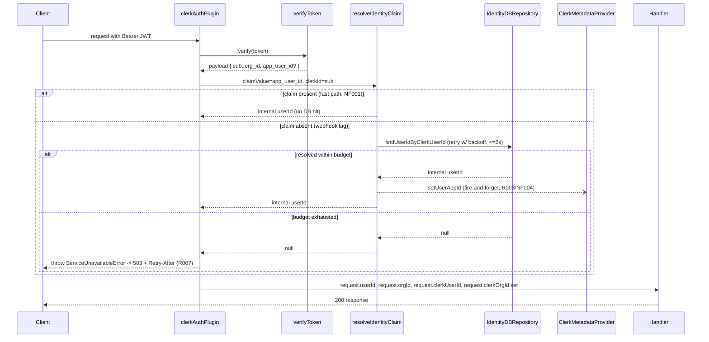

# AUTH-005 — Internal Identity Resolution via JWT Claim

## Problem statement

`clerkAuthPlugin` decorates `request.userId` with the raw Clerk user ID (`payload.sub`), but every FK column written and queried by `subscriptions`, `billing`, and `usage_counters` (`user_id`, `org_id`) stores the internal `users.id` / `organizations.id` UUID. This mismatch silently breaks lookups and writes across those modules. The fix must make `request.userId` / `request.orgId` carry the internal UUIDs while still letting the `users` module resolve by Clerk ID, without adding a DB hit on the happy path or leaving newly created identities in a permanently broken state during webhook lag.

## Alternatives

| Alternative | Description | Decision |
|---|---|---|
| DB lookup on every request | Drop the JWT-claim idea entirely; on every authenticated request, `clerkAuthPlugin` queries `users`/`organizations` by Clerk ID to resolve the internal UUID. | Not chosen — adds a DB round trip to every single authenticated request, violating NF001 ("no perceptible latency... no DB hit for identity resolution"), and ignores the technical constraint that mandates custom JWT claims. |
| JWT claims + blocking synchronous backfill | Use `app_user_id`/`app_org_id` claims as the fast path, but when a claim is missing, resolve via DB lookup **and** write the Clerk metadata back **before** replying, so the very next JWT for that user is guaranteed to carry the claim. | Not chosen — violates NF004, which requires the lazy backfill to be fire-and-forget and add no latency; a slow or failing Clerk API call would stall or fail requests that would otherwise succeed once the DB row is found, and duplicates the retry logic already required for R006/R007. |
| JWT claims + fire-and-forget lazy backfill + blocking webhook-side write (dual reliability) | Fast path reads `app_user_id`/`app_org_id` straight from the JWT (no DB hit). When absent, retry a DB lookup with exponential backoff for up to 2s; on success, respond immediately and fire-and-forget a Clerk metadata write (failures logged at `warn`); on timeout, respond 503 with `Retry-After`. Independently, `user.created`/`organization.created` webhook handlers write the metadata claim synchronously right after the DB upsert, returning 5xx (triggering Clerk's webhook retry) if that write fails. | **Chosen** — satisfies every R-ID and NF-ID exactly as specified in the technical constraints; the webhook-side blocking write is the primary reliability path, the plugin's lazy backfill is the self-healing fallback for identities created before this feature or while a webhook retry is still pending. |

## Chosen solution

**JWT claims + fire-and-forget lazy backfill + blocking webhook-side write (dual reliability)**

This solution satisfies R001–R004 (claim-based decoration of `userId`/`orgId`/`clerkUserId`/`clerkOrgId`), R006–R007 (bounded retry + 503 fallback), R008 (lazy backfill on cache-miss) and R009 (blocking webhook write with 5xx propagation) directly, using the exact mechanisms named in the technical constraints (`private_metadata.appUserId`/`appOrgId`, `clerkClient.users.updateUserMetadata`/`organizations.updateOrganizationMetadata`). R005 is satisfied by switching the three `users` module handlers to read `request.clerkUserId` instead of `request.userId`, since after this change `request.userId` is no longer the Clerk ID. NF001 is satisfied because the fast path never touches the database. NF002/NF003 are satisfied by a single exponential-backoff retry helper shared by both user and organization resolution. NF004/NF005's differing blocking semantics (fire-and-forget in the plugin vs. blocking in the webhook) are implemented as two distinct call sites against the same `IClerkMetadataProvider` interface, so the reliability contract is explicit at each call site rather than hidden inside a shared helper.

No new database migration is required: `users.id`/`organizations.id` and their `clerk_user_id`/`clerk_org_id` unique columns already exist (AUTH-002), and the FK columns in `subscriptions`, `transactions`, `usage_counters` already declare `ON DELETE SET NULL` (EC001 is already satisfied by the existing schema — verified in `apps/services/supabase/migrations/20260623000000_transactions.sql`, `20260624000000_subscriptions.sql`, `20260626000000_usage_counters.sql`). `subscriptions`/`billing`/`usage_counters` handlers already treat `request.userId`/`request.orgId` as opaque strings with no Clerk-specific parsing, so none of those modules need code changes — decorating them with the correct UUID is sufficient to fix the FK mismatch described in the problem statement.

A new repository (`IdentityDBRepository`) is introduced under `src/shared/repositories/` rather than inside `modules/users` or `modules/webhooks`, because its only consumer is the cross-cutting `clerkAuthPlugin` (shared infrastructure, not owned by a single feature module) — this mirrors the documented rule that shared repositories live under `src/shared/repositories/` when the dependency is not scoped to one feature module. This coexists with `UserDBRepository` and `ClerkSyncRepository`, which already query the same `users`/`organizations` tables for their own module-scoped concerns (profile CRUD, webhook sync); per BACKEND.md this is not a violation of "one repository per entity per data source" since that rule targets mixing unrelated entities inside one repository, not multiple call sites reading the same table for different purposes. Similarly, `ClerkMetadataProvider` is placed under a new `src/shared/providers/` directory (mirroring the existing `modules/billing/providers/` naming pattern, promoted to `shared/` because both `clerkAuthPlugin` and the `webhooks/clerk` module depend on it) rather than reusing `ProviderError`'s existing sole consumer (billing) — it is still a `ProviderError`-throwing infrastructure adapter for an external provider API (Clerk), consistent with the documented scope of `ProviderError`.

## Technical design

### New shared building blocks

| File | Role |
|---|---|
| `src/shared/errors.ts` (MODIFY) | Add `ServiceUnavailableError` — `DomainError` subclass, `statusCode 503`, code `SERVICE_UNAVAILABLE`, carries `retryAfterSeconds` (default `2`). |
| `src/shared/plugins/errorHandler.ts` (MODIFY) | Detect `ServiceUnavailableError` and reply with a `Retry-After` header, mirroring the existing `QuotaExceededError`/`TrialExpiredError` special-cased branches. |
| `src/shared/infrastructure/clerkClient.ts` (CREATE) | `postgres.js`-style singleton: reads `CLERK_SECRET_KEY` at module load, throws synchronously if absent, exports `clerkClient: ClerkClient` from `createClerkClient({ secretKey })`. Used only for metadata writes — JWT verification continues to use the existing standalone `verifyToken` import, unchanged. |
| `src/shared/repositories/interfaces/iIdentityRepository.ts` (CREATE) | `IIdentityRepository`: `findUserIdByClerkUserId(clerkUserId): Promise<string \| null>`, `findOrgIdByClerkOrgId(clerkOrgId): Promise<string \| null>`. |
| `src/shared/repositories/identityDBRepository.ts` (CREATE) | `IdentityDBRepository implements IIdentityRepository`, constructor-injected `Sql`, `SELECT id FROM users WHERE clerk_user_id = $1` / `SELECT id FROM organizations WHERE clerk_org_id = $1`, `ProviderError` on unexpected failures per the repository error-handling convention. |
| `src/shared/providers/interfaces/iClerkMetadataProvider.ts` (CREATE) | `IClerkMetadataProvider`: `setUserAppId(clerkUserId, appUserId): Promise<void>`, `setOrgAppId(clerkOrgId, appOrgId): Promise<void>`. |
| `src/shared/providers/clerkMetadataProvider.ts` (CREATE) | `ClerkMetadataProvider implements IClerkMetadataProvider`, constructor-injected `ClerkClient`. Calls `clerkClient.users.updateUserMetadata(clerkUserId, { privateMetadata: { appUserId } })` / `clerkClient.organizations.updateOrganizationMetadata(clerkOrgId, { privateMetadata: { appOrgId } })`. Logs at `error` and re-throws `ProviderError(502)` on failure (required catch for every external call, per BACKEND.md). |
| `src/shared/plugins/resolveIdentityClaim.ts` (CREATE) | `resolveIdentityClaim` + internal `withRetryBackoff` helper — the core R001/R006/R007/R008/NF001–NF004 algorithm, generic over "user" and "org" so `clerkAuthPlugin` calls it twice with different lookup/backfill functions. |

### `resolveIdentityClaim` algorithm (R001, R002, R006, R007, R008, NF001–NF004, EC002, EC003, EC006)

```ts
interface ResolveIdentityClaimParams {
  claimValue: string | undefined;                       // app_user_id / app_org_id from the JWT payload
  clerkId: string;                                       // Clerk sub / org_id
  lookupById: (clerkId: string) => Promise<string | null>;
  backfill: (clerkId: string, internalId: string) => Promise<void>;
  budgetMs?: number;                                     // default 2000 (NF002)
}

async function resolveIdentityClaim(params: ResolveIdentityClaimParams): Promise<string | null> {
  if (params.claimValue) {
    return params.claimValue;                            // NF001 — no DB hit
  }

  const internalId = await withRetryBackoff(
    () => params.lookupById(params.clerkId),
    params.budgetMs ?? 2000,                              // R006, NF002
  );

  if (internalId === null) {
    return null;                                          // caller throws ServiceUnavailableError (R007)
  }

  // R008, EC002, NF004: fire-and-forget backfill; a failed write here is non-critical because
  // the webhook-side blocking write (R009) is the primary path and the next unresolved request
  // will retry this same backfill — silent-fail justified by NF004.
  void params.backfill(params.clerkId, internalId).catch((err) => {
    logger.warn({ err, clerkId: params.clerkId }, 'resolveIdentityClaim: lazy backfill to Clerk metadata failed');
  });

  return internalId;
}
```

`withRetryBackoff` loops: call `lookup()`, return non-null results immediately; otherwise sleep `min(delay, remainingBudget)` and double `delay` (starting at 100ms) until the budget is exhausted (NF003), then return `null`. Each call to `resolveIdentityClaim` holds no state beyond its own closure — concurrent requests for the same unsynced identity each run an independent loop (EC006), and every invocation reads `clerkId`/`claimValue` fresh from that request's JWT payload, so an organization switch is reflected on the very next request with no caching (EC005). Because `claimValue` is used as-is with no extra check when present, a manually-edited `private_metadata` value is trusted without validation (EC003), matching the documented risk-acceptance in the analysis.

### `clerkAuthPlugin` (MODIFY) — R001–R008, NF001–NF005

The existing `onRequest` hook only wraps `verifyToken` in `try/catch` (invalid/expired JWTs must not block the request — unchanged). Everything after a **successful** verification runs outside that `catch`, so a thrown `ServiceUnavailableError` propagates to Fastify's `errorHandler` instead of being swallowed:

```ts
const identityRepo = new IdentityDBRepository(db);
const metadataProvider = new ClerkMetadataProvider(clerkClient);      // module-scope singletons, instantiated once at registration

fastify.addHook('onRequest', async (request) => {
  const authHeader = request.headers['authorization'];
  if (!authHeader?.startsWith('Bearer ')) return;
  const token = authHeader.slice('Bearer '.length);

  let payload;
  try {
    payload = await verifyToken(token, jwtKey ? { jwtKey } : { secretKey });
  } catch (err) {
    logger.warn({ err }, 'clerkAuthPlugin: JWT verification failed; request proceeds without userId');
    return;
  }

  request.clerkUserId = payload.sub;                                          // R004
  request.clerkOrgId = (payload as Record<string, unknown>)['org_id'] as string | null ?? null; // R004

  const appUserId = (payload as Record<string, unknown>)['app_user_id'] as string | undefined;
  const userId = await resolveIdentityClaim({
    claimValue: appUserId,
    clerkId: request.clerkUserId,
    lookupById: (id) => identityRepo.findUserIdByClerkUserId(id),
    backfill: (id, internalId) => metadataProvider.setUserAppId(id, internalId),
  });
  if (userId === null) throw new ServiceUnavailableError();                   // R007
  request.userId = userId;                                                    // R001

  if (request.clerkOrgId === null) {
    request.orgId = null;                                                     // R003
    return;
  }

  const appOrgId = (payload as Record<string, unknown>)['app_org_id'] as string | undefined;
  const orgId = await resolveIdentityClaim({
    claimValue: appOrgId,
    clerkId: request.clerkOrgId,
    lookupById: (id) => identityRepo.findOrgIdByClerkOrgId(id),
    backfill: (id, internalId) => metadataProvider.setOrgAppId(id, internalId),
  });
  if (orgId === null) throw new ServiceUnavailableError();                    // R007
  request.orgId = orgId;                                                      // R002
});
```

`src/types/fastify.d.ts` (MODIFY) is augmented with `clerkUserId: string | undefined` and `clerkOrgId: string | null | undefined` alongside the existing `userId`/`orgId` declarations.

### Webhook-side blocking write (R009, NF005, EC004)

`ClerkSyncRepository.upsertOrganization` currently returns `void`; it is changed to `RETURNING id` and return `{ id: string }`, mirroring `upsertUser`, so the internal UUID is available immediately after the upsert without an extra lookup.

`dispatchClerkEvent` (in `clerkEventHandlers.ts`) gains a third parameter, `metadataProvider: IClerkMetadataProvider`. Only the `user.created` and `organization.created` branches (R009 is scoped to those two event types — `user.updated` is intentionally left untouched, since re-writing an unchanged claim on every profile edit is not required by any R-ID) are extended to await the metadata write immediately after the DB upsert, before any other side effect:

```ts
case 'user.created': {
  const { id } = await handleUserUpsert(event, repo);
  await metadataProvider.setUserAppId(event.data.id, id);   // R009, NF005 — blocking; ProviderError propagates to errorHandler as 502
  if (subscriptionsConfig.signupMode === 'free_trial' && subscriptionRepo) {
    await new CreateTrialSubscriptionUseCase(subscriptionRepo).execute(id);
  }
  break;
}
...
case 'organization.created': {
  const { id } = await handleOrganizationUpsert(event, repo);
  await metadataProvider.setOrgAppId(event.data.id, id);    // R009, NF005
  break;
}
```

Because the DB upsert always runs before the metadata write, a persistently failing metadata write (EC004) still leaves a resolvable `users`/`organizations` row in place — any authenticated request that arrives before Clerk's webhook retry eventually succeeds is served correctly via the plugin's lazy backfill (`resolveIdentityClaim`'s degraded path), independent of the webhook's retry timing. `routes.ts` (MODIFY) instantiates `metadataProvider` once at plugin registration (same pattern as the existing `repository`/`subscriptionRepository` singletons) and passes it into `dispatchClerkEvent`.

### `users` module — no functional regression (R005)

`getUserProfileHandler.ts`, `updateUserProfileHandler.ts`, and `completeOnboardingHandler.ts` each currently call their use case with `request.userId!`. Since `request.userId` becomes the internal UUID after this feature, all three are changed to pass `request.clerkUserId!` instead — the use cases and `UserDBRepository.findByClerkUserId`/`updatePreferences`/`completeOnboarding` are untouched, since they already key exclusively on `clerk_user_id`.

### Sequence diagram



## Files

| Path | Action | Description |
|---|---|---|
| `apps/services/src/shared/errors.ts` | MODIFY | Add `ServiceUnavailableError` (503, `SERVICE_UNAVAILABLE`, `retryAfterSeconds`). |
| `apps/services/src/shared/plugins/errorHandler.ts` | MODIFY | Special-case `ServiceUnavailableError` to set the `Retry-After` header. |
| `apps/services/src/shared/infrastructure/clerkClient.ts` | CREATE | `clerkClient` singleton via `createClerkClient({ secretKey })`; fail-fast if `CLERK_SECRET_KEY` is absent. |
| `apps/services/src/shared/repositories/interfaces/iIdentityRepository.ts` | CREATE | `IIdentityRepository` contract. |
| `apps/services/src/shared/repositories/identityDBRepository.ts` | CREATE | `IdentityDBRepository` — SELECT-only lookups of internal UUIDs by Clerk ID. |
| `apps/services/src/shared/providers/interfaces/iClerkMetadataProvider.ts` | CREATE | `IClerkMetadataProvider` contract. |
| `apps/services/src/shared/providers/clerkMetadataProvider.ts` | CREATE | `ClerkMetadataProvider` — writes `appUserId`/`appOrgId` into Clerk `private_metadata`. |
| `apps/services/src/shared/plugins/resolveIdentityClaim.ts` | CREATE | `resolveIdentityClaim` + `withRetryBackoff` — claim-first, retry-with-backoff, fire-and-forget backfill algorithm. |
| `apps/services/src/shared/plugins/clerkAuthPlugin.ts` | MODIFY | Decorate `request.clerkUserId`/`request.clerkOrgId`; resolve `request.userId`/`request.orgId` via `resolveIdentityClaim`; throw `ServiceUnavailableError` on timeout. |
| `apps/services/src/types/fastify.d.ts` | MODIFY | Add `clerkUserId`/`clerkOrgId` to the `FastifyRequest` augmentation. |
| `apps/services/src/modules/webhooks/repositories/clerkSyncRepository.ts` | MODIFY | `upsertOrganization` returns `{ id: string }` (`RETURNING id`). |
| `apps/services/src/modules/webhooks/clerk/clerkEventHandlers.ts` | MODIFY | `dispatchClerkEvent` accepts `metadataProvider`; `user.created`/`organization.created` branches await the blocking metadata write. |
| `apps/services/src/modules/webhooks/clerk/routes.ts` | MODIFY | Instantiate `ClerkMetadataProvider(clerkClient)` and pass it to `dispatchClerkEvent`. |
| `apps/services/src/modules/users/handlers/getUserProfileHandler.ts` | MODIFY | Use `request.clerkUserId!` instead of `request.userId!`. |
| `apps/services/src/modules/users/handlers/updateUserProfileHandler.ts` | MODIFY | Use `request.clerkUserId!` instead of `request.userId!`. |
| `apps/services/src/modules/users/handlers/completeOnboardingHandler.ts` | MODIFY | Use `request.clerkUserId!` instead of `request.userId!`. |

## Requirement coverage

| ID | Design decision |
|---|---|
| R001 | `resolveIdentityClaim` resolves `request.userId` from `app_user_id` (fast path) or DB lookup (degraded path) in `clerkAuthPlugin`. |
| R002 | `resolveIdentityClaim` resolves `request.orgId` from `app_org_id` when `request.clerkOrgId` is non-null. |
| R003 | `clerkAuthPlugin` sets `request.orgId = null` immediately when the JWT carries no `org_id` claim. |
| R004 | `clerkAuthPlugin` decorates `request.clerkUserId`/`request.clerkOrgId` from `payload.sub`/`payload.org_id`; `fastify.d.ts` augmentation. |
| R005 | `getUserProfileHandler.ts`, `updateUserProfileHandler.ts`, `completeOnboardingHandler.ts` switched to `request.clerkUserId!`. |
| R006 | `withRetryBackoff` inside `resolveIdentityClaim.ts` retries `lookupById` for up to `budgetMs` (default 2000ms). |
| R007 | `clerkAuthPlugin` throws `ServiceUnavailableError` when `resolveIdentityClaim` returns `null`; `errorHandler.ts` replies 503 with `Retry-After`. |
| R008 | `resolveIdentityClaim` fire-and-forget calls `backfill` (`ClerkMetadataProvider.setUserAppId`/`setOrgAppId`) after a successful DB lookup. |
| R009 | `dispatchClerkEvent`'s `user.created`/`organization.created` branches `await metadataProvider.set*AppId`; a thrown `ProviderError` propagates to `errorHandler` as a 502 (5xx), letting Clerk retry the event. |
| NF001 | Fast path in `resolveIdentityClaim` returns `claimValue` immediately with no DB call. |
| NF002 | `withRetryBackoff` bounds the retry loop to `budgetMs` (default 2000ms) before returning `null`. |
| NF003 | `withRetryBackoff` doubles its delay (starting at 100ms, capped to the remaining budget) between attempts. |
| NF004 | `resolveIdentityClaim`'s backfill call is `void`-fired with a `.catch` that logs at `warn` and is documented as a justified silent fail. |
| NF005 | `dispatchClerkEvent` `await`s `metadataProvider.set*AppId` synchronously before the webhook route replies 200; failures propagate as thrown errors (non-2xx). |
| EC002 | Same mechanism as R008 — first request for a pre-existing, claim-less identity resolves via DB lookup and triggers backfill. |
| EC003 | `resolveIdentityClaim` uses `claimValue` as-is with no extra validation when present. |
| EC004 | DB upsert precedes the metadata write in both `handleUserUpsert`/`handleOrganizationUpsert` call sites, so the plugin's lazy backfill can resolve the identity regardless of webhook retry timing. |
| EC005 | `clerkAuthPlugin` reads `org_id`/`app_org_id` fresh from each request's JWT payload; no caching. |
| EC006 | `resolveIdentityClaim` and `withRetryBackoff` hold no shared or module-level state across invocations. |
