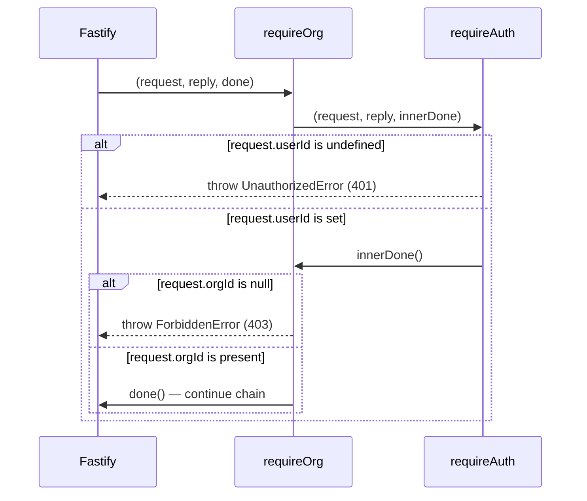

# AUTH-006 — Corregir la composición de `requireOrg` sobre `requireAuth`

## Problem statement

`requireOrg` (`apps/services/src/shared/plugins/requireOrg.ts`) calls `requireAuth(request)` with a single argument, but `requireAuth`'s signature is `(request, reply, done)` — a Fastify preHandler. This mismatch produces a `TS2554` compile error that breaks the backend build. The fix must restore compilation while preserving `requireOrg`'s intended three-way guard behavior (unauthenticated → 401, authenticated without org → 403, authenticated with org → continue) without changing `requireAuth`'s signature or wiring `requireOrg` into any route.

## Chosen solution

**Give `requireOrg` a Fastify preHandler signature and delegate to `requireAuth` via its `done` callback**

Change `requireOrg`'s signature to `(request: FastifyRequest, reply: FastifyReply, done: () => void): void`, matching `requireAuth`'s own shape, and call `requireAuth(request, reply, innerDone)` where `innerDone` performs the organization check and only then invokes `requireOrg`'s own `done`. This satisfies R001 directly: `requireAuth` is now invoked with the exact three arguments its signature declares, eliminating `TS2554`.

It also satisfies R002/EC002: `requireAuth` itself throws `UnauthorizedError` when `request.userId` is `undefined`, and it does so before ever invoking the callback passed to it — so the organization check inside `innerDone` never runs, matching the "auth check short-circuits first" requirement. It satisfies R003/EC001: when `request.userId` is set, `requireAuth` calls `innerDone`, which throws `ForbiddenError` if `request.orgId === null` — critically, that throw happens *before* `requireOrg`'s own `done` (the one Fastify uses to continue the preHandler chain) is ever called, so Fastify is never signaled to proceed and no duplicate response can occur. It satisfies R004: when `request.orgId` is non-`null`, `innerDone` calls `requireOrg`'s `done()`, continuing the chain exactly as a normal preHandler would.

This respects every technical constraint in analysis.md: `requireAuth`'s signature and behavior are untouched (only called correctly); `requireOrg` is not registered on any route (this is a pure compile/logic fix to an unused-but-exported function); and the whole composition remains synchronous and in-memory, so NF001 (no added latency) holds by construction — no new I/O or async work is introduced.

This is the only alternative considered (effort: medium, per `ds-design` rules a single best solution is evaluated directly). It was chosen over leaving `requireOrg` with a single-argument signature and manually re-implementing `requireAuth`'s check inline, because that would duplicate `requireAuth`'s logic (violating DRY / SOLID conventions in `duck-spec/docs/BACKEND.md` → "Coding conventions") and risk drifting out of sync again — the exact failure mode that created this bug. Delegating to `requireAuth` via its own callback contract keeps `requireOrg` as a thin composition over `requireAuth`, which is also how `duck-spec/docs/BACKEND.md` → "Route-level auth preHandlers" already documents the intended relationship ("`requireOrg` — Calls `requireAuth`, then throws `ForbiddenError` (403) when `request.orgId` is `null`").

`duck-spec/modules/auth/SPEC.md` was consulted ("Organization (multi-tenancy)" section): it confirms `requireOrg` is meant for routes that opt in to organization scoping and is not enforced globally — consistent with analysis.md's note that no route wiring exists today and none should be added by this fix.

## Technical design

No data models, API endpoints, or request/response contracts change. This is a pure control-flow fix inside one function.

Before (broken):
```ts
export function requireOrg(request: FastifyRequest): void {
  requireAuth(request); // TS2554: expected 3 arguments, got 1
  if (request.orgId === null) {
    throw new ForbiddenError();
  }
}
```

After:
```ts
export function requireOrg(request: FastifyRequest, reply: FastifyReply, done: () => void): void {
  requireAuth(request, reply, () => {
    if (request.orgId === null) {
      throw new ForbiddenError();
    }
    done();
  });
}
```

Call sequence:



`requireAuth.ts` itself is unchanged — its signature, its `UnauthorizedError` check, and its call to `done()` on the success path remain exactly as they are today.

## Files

| Path | Action | Description |
|---|---|---|
| `apps/services/src/shared/plugins/requireOrg.ts` | MODIFY | Change `requireOrg`'s signature to `(request: FastifyRequest, reply: FastifyReply, done: () => void): void` and delegate to `requireAuth(request, reply, innerDone)`, where `innerDone` performs the `orgId === null` check (throwing `ForbiddenError`) before calling the real `done()`. |
| `apps/services/tests/unit/shared/plugins/requireOrg.test.ts` | CREATE | Unit test suite covering the three-way guard behavior: unauthenticated → `UnauthorizedError`/401 with `done` never called; authenticated without org → `ForbiddenError`/403 with `done` never called; authenticated with org → `done` called once, no error thrown. |

## Requirement coverage

| ID | Design decision |
|---|---|
| R001 | `requireAuth` is now called with all three arguments its signature declares (`request`, `reply`, `done` callback), eliminating the `TS2554` compile error. |
| R002 | `requireAuth`'s own `request.userId === undefined` check throws `UnauthorizedError` before the callback passed to it (the org check) is ever invoked. |
| R003 | The callback passed to `requireAuth` checks `request.orgId === null` and throws `ForbiddenError` before calling `requireOrg`'s own `done`. |
| R004 | When `request.orgId` is non-`null`, the callback calls `requireOrg`'s `done()`, allowing Fastify to continue to the next preHandler or route handler. |
| NF001 | The composition is entirely synchronous, in-memory logic over already-decorated request fields (`userId`, `orgId`) — no new I/O, async work, or database access is introduced. |
| EC001 | `ForbiddenError` is thrown inside the callback passed to `requireAuth`, strictly before `requireOrg`'s own `done()` is called — so Fastify is never signaled to proceed and no duplicate response can be produced. |
| EC002 | `requireAuth`'s unauthenticated check runs and throws first, inside its own function body, before it ever invokes the callback that contains the organization check — so the org check is never evaluated for an unauthenticated, org-less request, and the response is `UnauthorizedError` (401) only. |
