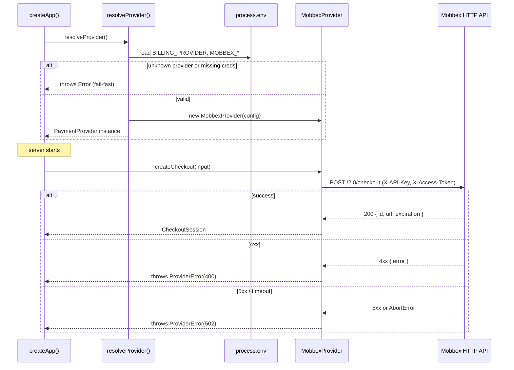

# BILLING-001 — Payment Provider Abstraction & Mobbex Adapter

## Problem statement

The platform has no payment processing capability, which blocks every billing feature. Business logic must not be coupled to a specific payment vendor because the active provider (Mobbex, Stripe, MercadoPago) may change over the product's lifetime. The first concrete provider to implement is Mobbex, targeting the Argentina/LATAM market.

## Alternatives

| Alternative | Description | Decision |
|---|---|---|
| Flat inline factory | A single `billingProvider.ts` in the billing module conditionally imports and instantiates Mobbex; no separate port file. | Not chosen — couples the factory directly to the concrete adapter, blurs the port/adapter boundary, and makes it harder to add future providers without touching shared code. |
| Port + Adapter with in-module factory | Define `PaymentProvider` port in `@repo/types`, implement `MobbexProvider` under `providers/`, expose a `resolveProvider()` factory that reads `BILLING_PROVIDER` at boot and fails fast. | **Chosen** — clean hexagonal separation, matches existing module conventions (`IUserRepository` pattern), minimal footprint, no framework coupling in domain layer. |
| Fastify plugin-per-provider | Each provider registers as a named Fastify plugin that decorates the `FastifyInstance` with the `PaymentProvider` interface. | Not chosen — conflates framework lifecycle with domain logic for a layer that has no routes; adds unnecessary Fastify dependency to what is purely a domain/infrastructure concern. |

## Chosen solution

**Port + Adapter with in-module factory**

This solution cleanly implements the hexagonal architecture already established in `apps/services`. The `PaymentProvider` interface (port) lives in `@repo/types` so any future module can depend on the contract without importing from `apps/services`. The `MobbexProvider` (adapter) lives in `apps/services/src/modules/billing/providers/` and is selected at boot time by `resolveProvider()`, which satisfies R001 (port declaration), R002 (boot-time resolution), R003 (Mobbex adapter), R004 (auth headers), R005 (test mode), R006 (unknown provider fail-fast), and R007 (missing credentials fail-fast). The `ProviderError` domain error satisfies NF002. The configurable HTTP timeout satisfies NF003. Credentials are read only from server-side env vars, satisfying NF001.

## Technical design

### Shared types (`@repo/types`)

Six new pure TypeScript interfaces/types are added to `packages/types/src/index.ts`:

```typescript
// Monetary value; amount is in the smallest currency unit (cents/centavos)
interface Money {
  amount: number;       // integer, smallest unit
  currency: string;     // ISO 4217, e.g. "ARS", "USD"
}

// Input for creating a one-off checkout session
interface CheckoutInput {
  reference: string;    // caller-assigned idempotency key / order ID
  total: Money;
  description: string;
  callbackUrl: string;  // where Mobbex redirects after payment
  webhookUrl: string;   // where Mobbex posts payment events
}

// Result of a created checkout session
interface CheckoutSession {
  sessionId: string;    // provider-assigned session ID
  checkoutUrl: string;  // URL to redirect the user to
  expiresAt: Date;
}

// Canonical transaction status returned by queryTransaction
interface TransactionStatus {
  transactionId: string;
  reference: string;
  status: 'pending' | 'approved' | 'rejected' | 'cancelled' | 'refunded';
  total: Money;
  providerData?: Record<string, unknown>;  // raw provider payload for debugging
}

// Canonicalized webhook event returned by verifyWebhook
interface WebhookEvent {
  type: string;         // e.g. 'payment.approved', 'subscription.cancelled'
  data: Record<string, unknown>;
}

// The port — every payment operation goes through this interface
interface PaymentProvider {
  createCheckout(input: CheckoutInput): Promise<CheckoutSession>;
  queryTransaction(transactionId: string): Promise<TransactionStatus>;
  createSubscription(planId: string, subscriberRef: string): Promise<{ subscriptionId: string }>;
  cancelSubscription(subscriptionId: string): Promise<void>;
  verifyWebhook(rawBody: Buffer, headers: Record<string, string | string[] | undefined>): Promise<WebhookEvent>;
}
```

### Domain error (`apps/services`)

A new `ProviderError` extends `DomainError` and lives in `apps/services/src/shared/errors.ts`:

```typescript
export class ProviderError extends DomainError {
  constructor(message: string, statusCode: 400 | 502 = 502) {
    super('PROVIDER_ERROR', message, statusCode);
  }
}
```

`statusCode 502` is used for transient/upstream failures (5xx from provider, network errors, 401 invalid credentials). `statusCode 400` is used when the provider itself reports a validation error.

### MobbexProvider adapter

File: `apps/services/src/modules/billing/providers/MobbexProvider.ts`

Implements `PaymentProvider` via Node.js `fetch` (available in Node 18+). Constructor accepts a config object validated at construction time:

```typescript
interface MobbexConfig {
  apiKey: string;
  accessToken: string;
  testMode: boolean;
  timeoutMs: number;   // default 10_000
  webhookSecret: string;
}
```

All HTTP requests set `X-API-Key` and `X-Access-Token` headers from config. A `fetchWithTimeout` private helper wraps `fetch` with `AbortController` to enforce `timeoutMs`.

Error mapping:
- Network error / `AbortError` (timeout) → `ProviderError(message, 502)`
- HTTP 4xx from Mobbex (validation) → `ProviderError(upstreamBody.error, 400)`
- HTTP 5xx / HTTP 401 (invalid credentials) → `ProviderError(upstreamBody.error ?? message, 502)`

`verifyWebhook` receives `rawBody` and `headers`. It extracts the `secret` query parameter from the `x-mobbex-signature` header (which Mobbex actually sends) or falls back to a `?secret=` query string embedded in the `webhookUrl`. It compares the value against `MOBBEX_WEBHOOK_SECRET` from config. If they do not match it throws `ProviderError('Invalid webhook secret', 400)`.

### Provider factory (`resolveProvider`)

File: `apps/services/src/modules/billing/providers/resolveProvider.ts`

```typescript
export function resolveProvider(): PaymentProvider
```

Reads `BILLING_PROVIDER` (default `'mobbex'`) synchronously at call time. Selection is captured in a module-level singleton — subsequent calls return the same instance (EC004 immutability on re-read is a property of constructing once at boot).

Fail-fast rules (throw `Error` before returning):
- Unknown provider name → `Error('Unknown BILLING_PROVIDER: "<value>". Supported: mobbex')`
- `mobbex` selected but `MOBBEX_API_KEY` or `MOBBEX_ACCESS_TOKEN` is empty → `Error('Missing required env var: MOBBEX_API_KEY / MOBBEX_ACCESS_TOKEN')`

### Boot integration

`apps/services/src/app.ts` calls `resolveProvider()` early in `createApp()`, before registering any plugins, so a misconfigured environment causes an immediate boot failure rather than a runtime error on the first payment call.

### Call flow



## Files

| Path | Action | Description |
|---|---|---|
| `packages/types/src/index.ts` | MODIFY | Add `Money`, `CheckoutInput`, `CheckoutSession`, `TransactionStatus`, `WebhookEvent`, `PaymentProvider` interfaces |
| `apps/services/src/shared/errors.ts` | MODIFY | Add `ProviderError` class extending `DomainError` |
| `apps/services/src/modules/billing/providers/MobbexProvider.ts` | CREATE | `MobbexProvider` class implementing `PaymentProvider`; private `fetchWithTimeout`; error mapping logic |
| `apps/services/src/modules/billing/providers/resolveProvider.ts` | CREATE | `resolveProvider()` factory function; singleton caching; fail-fast env validation |
| `apps/services/src/app.ts` | MODIFY | Call `resolveProvider()` early in `createApp()` to trigger fail-fast at boot |
| `tests/unit/billing/resolveProvider.test.ts` | CREATE | Unit tests for boot-time provider resolution (R002, R006, R007, EC004) |
| `tests/unit/billing/MobbexProvider.test.ts` | CREATE | Unit tests for `MobbexProvider` adapter (R003, R004, R005, R008, NF002, NF003, EC001, EC002, EC003) |
| `tests/unit/billing/ProviderError.test.ts` | CREATE | Unit tests for `ProviderError` construction and status codes (NF002) |

## Requirement coverage

| ID | Design decision |
|---|---|
| R001 | `PaymentProvider` interface in `@repo/types` declares all five operations: `createCheckout`, `queryTransaction`, `createSubscription`, `cancelSubscription`, `verifyWebhook` |
| R002 | `resolveProvider()` in `resolveProvider.ts` reads `BILLING_PROVIDER` (default `mobbex`) and returns the matching `PaymentProvider` implementation; called from `createApp()` at boot |
| R003 | `MobbexProvider` class in `providers/MobbexProvider.ts` implements all five `PaymentProvider` operations against the Mobbex HTTP API |
| R004 | `MobbexProvider` private helper sets `X-API-Key` and `X-Access-Token` headers on every outbound request from `MobbexConfig.apiKey` and `MobbexConfig.accessToken` |
| R005 | `MobbexConfig.testMode` boolean (from `MOBBEX_TEST_MODE`) controls sandbox mode; passed through to Mobbex API requests that support it |
| R006 | `resolveProvider()` throws `Error` with descriptive message before returning when `BILLING_PROVIDER` is not a known value |
| R007 | `resolveProvider()` throws `Error` with descriptive message before returning when required credentials for the selected provider are absent or empty |
| R008 | `MobbexProvider.verifyWebhook` accepts `rawBody: Buffer` and `headers` and returns a `WebhookEvent` with `type` and `data` after verifying the shared secret |
| NF001 | Provider credentials are read exclusively from `process.env` inside `resolveProvider()` and `MobbexProvider` constructor; they are never exported or passed to frontend packages |
| NF002 | `ProviderError` extends `DomainError` with `statusCode 502` for transient/upstream errors and `statusCode 400` for provider-reported validation errors; error-handler plugin serialises it as `{ code, message }` |
| NF003 | `MobbexProvider` wraps every `fetch` call with `AbortController` via `fetchWithTimeout`; `timeoutMs` defaults to `10_000` and is configurable via constructor config |
| EC001 | Network errors and `AbortError` (timeout) are caught and re-thrown as `ProviderError(message, 502)`; no internal retry logic |
| EC002 | HTTP 401 response from Mobbex is mapped to `ProviderError(upstreamErrorCode, 502)` including the upstream error code in the message |
| EC003 | `verifyWebhook` compares secret from Mobbex request against `MobbexConfig.webhookSecret`; mismatch throws `ProviderError('Invalid webhook secret', 400)`; Mobbex's lack of cryptographic signature is documented in the module |
| EC004 | `resolveProvider()` creates the provider instance once and caches it in a module-level variable; subsequent calls return the cached instance, ignoring any runtime env changes |
