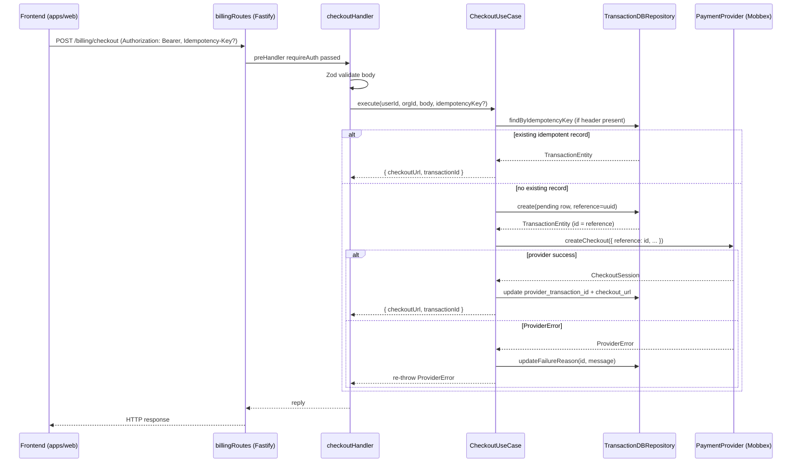

# BILLING-002 — Checkout & Transaction Records

## Problem statement

The system can generate provider checkout sessions via the `PaymentProvider` port (BILLING-001), but it has no local persistence layer for those operations. There is no `transactions` table, no idempotency strategy, and no way for a user or org to retrieve past payment records. This feature adds a complete checkout-to-record flow: it persists the transaction before calling the provider (for auditability), threads the local `id` as the provider `reference` (idempotency), and exposes three authenticated REST endpoints plus a frontend API client.

## Alternatives

| Alternative | Description | Decision |
|---|---|---|
| Option A — Single-layer service + inline SQL | Implement all checkout logic directly in `routes.ts` using inline `sql` calls, no separate service/repository/useCase files | Not chosen — violates the hexagonal architecture required by technical constraints and established project patterns; business logic becomes untestable in isolation |
| Option B — Shared repository, one use case per endpoint | Follow the full vertical-slice pattern (handler → useCase → IRepository → DBRepository) with one use case per endpoint, mirroring the users module structure exactly | **Chosen** — matches existing conventions, keeps business logic testable, keeps SQL in one place, and the interface boundary allows future test-time substitution without a real DB |
| Option C — Event-sourced append-only log | Model each checkout attempt as an event appended to an event log; derive current transaction state by replaying events | Not chosen — massively over-engineered for the scope; analysis.md lists a simple status-column row model; adds complexity (projection, replay) that exceeds the stated effort and requirements |

## Chosen solution

**Option B — Full vertical-slice pattern (handler → useCase → IRepository → DBRepository)**

This solution satisfies all R-IDs: R001 is addressed by the SQL migration, R002–R005 and R011–R013 by `CheckoutUseCase`, R006–R008 by `GetTransactionUseCase`, R009 and NF002–NF003 by `ListTransactionsUseCase`, R010 by the `requireAuth` preHandler on every route, R012 by an idempotency key look-up in the repository before insertion, R014 by the frontend client, and R015 by the shared types. It respects all technical constraints: module lives under `apps/services/src/modules/billing/`, database calls use the existing `postgres.js` singleton, provider integration goes through the `PaymentProvider` port, and domain errors extend `DomainError`.

## Technical design

### Shared types (`packages/types/src/index.ts`)

Three new exports are added:

```ts
export type TransactionStatusValue = 'pending' | 'approved' | 'failed' | 'refunded';

export interface Transaction {
  id: string;
  user_id: string | null;
  org_id: string | null;
  provider: string;
  provider_transaction_id: string | null;
  amount: number;
  currency: string;
  status: TransactionStatusValue;
  description: string;
  reference: string;
  metadata: Record<string, unknown> | null;
  failure_reason: string | null;
  created_at: string;
  updated_at: string;
}

export interface CreateCheckoutInput {
  amount: number;           // positive integer, smallest currency unit
  currency: string;         // 'ARS' | 'USD'
  description: string;
  items?: unknown[];
  metadata?: Record<string, unknown>;
}

export interface TransactionListResponse {
  data: Transaction[];
  nextCursor: string | null;
}
```

### Database migration

A new migration file creates the `transactions` table with all columns listed in R001, a `CHECK` constraint on `status`, a `UNIQUE` index on `reference`, an `updated_at` trigger using the existing `set_updated_at()` function, and a `UNIQUE` index on `(user_id, reference)` to support idempotency-key uniqueness scoped to a requester (EC001). The `user_id` column references `users(id)` and `org_id` references `organizations(id)`, both nullable.

An additional index on `(org_id, created_at DESC)` and `(user_id, created_at DESC)` supports the paginated listing queries.

### Entity (`entities/transaction.entity.ts`)

A plain TypeScript interface `TransactionEntity` mirrors the DB row exactly (same fields as `Transaction` in `@repo/types` plus `id` already included).

### Repository interface (`repositories/interfaces/iTransactionRepository.ts`)

```ts
export interface ITransactionRepository {
  create(input: CreateTransactionData): Promise<TransactionEntity>;
  findById(id: string): Promise<TransactionEntity | null>;
  findByIdempotencyKey(key: string, userId: string, orgId: string | null): Promise<TransactionEntity | null>;
  updateFailureReason(id: string, reason: string): Promise<void>;
  list(query: ListTransactionsQuery): Promise<{ rows: TransactionEntity[]; nextCursor: string | null }>;
}
```

`CreateTransactionData` carries the fields needed to insert a row (amount, currency, description, metadata, user_id, org_id, provider, reference). `ListTransactionsQuery` carries `userId`, `orgId`, `limit`, and optional `cursor`.

### DTOs (`dtos/checkout.dto.ts`)

A Zod schema `CheckoutBodySchema` enforces:
- `amount`: `z.number().int().positive()`
- `currency`: `z.enum(['ARS', 'USD'])`
- `description`: `z.string().min(1)`
- `items`: `z.array(z.unknown()).optional()`
- `metadata`: `z.record(z.unknown()).optional()`

A Zod schema `ListTransactionsQuerySchema` enforces:
- `limit`: `z.coerce.number().int().min(1).max(100).default(20)`
- `cursor`: `z.string().optional()`

### Use cases

**`CheckoutUseCase`** (satisfies R002–R005, R011–R013, EC001, EC003, EC004, EC006, NF004):

1. Look up idempotency key (R012): if an `Idempotency-Key` header is present and a matching transaction already exists for the requester, return `{ checkoutUrl: existingCheckoutUrl, transactionId: existing.id }` without a DB write or provider call. Note: `checkoutUrl` is not stored — this requires re-querying the provider or storing the URL. To keep it simple and avoid a second provider call, the `transactions` table stores a `checkout_url` column added to the migration and entity.
2. Insert a `pending` row into `transactions`; the `reference` is set to the generated UUID `id` (R011, NF004, EC003).
3. Resolve the `PaymentProvider` via `resolveProvider()` and call `createCheckout` with `reference = transaction.id` (R003).
4. On success, return `{ checkoutUrl: session.checkoutUrl, transactionId: transaction.id }` (R004). Update the transaction row with `provider_transaction_id = session.sessionId` and `checkout_url = session.checkoutUrl`.
5. On `ProviderError`, call `updateFailureReason` to persist the error message and re-throw the error so the error handler returns the correct status and code (R005, EC004).

**`GetTransactionUseCase`** (satisfies R006, R007, R008, EC005):

1. Call `findById`; if `null`, throw `NotFoundError` (R007).
2. Check ownership: if `request.orgId` is non-null, check `transaction.org_id === orgId`; else check `transaction.user_id === userId` AND `transaction.org_id IS NULL`. Throw `ForbiddenError` if mismatch (R008).
3. Return the transaction record (R006).

**`ListTransactionsUseCase`** (satisfies R009, NF002, NF003, EC005, EC007):

1. Parse and validate `limit` and `cursor` via Zod; on failure throw `ValidationError` (EC007, NF002).
2. Decode `cursor` from base64 to a `created_at` timestamp + `id` pair for stable cursor-based pagination (NF003).
3. Call `repo.list()`; return `{ data: rows, nextCursor }`.

### Repository implementation (`repositories/transactionDBRepository.ts`)

All SQL uses tagged-template `postgres.js` calls. Cursor pagination is implemented as:

```sql
WHERE (created_at, id) < (cursor_created_at, cursor_id)
ORDER BY created_at DESC, id DESC
LIMIT limit + 1
```

If `limit + 1` rows are returned, the extra row's `(created_at, id)` is encoded as base64 and returned as `nextCursor`; otherwise `nextCursor = null`.

Idempotency key uniqueness for concurrent requests (EC001) is enforced at the DB level via a `UNIQUE` constraint on `(user_id, reference)` when `org_id IS NULL`, and `(org_id, reference)` when `org_id IS NOT NULL`. Application-level idempotency key lookup happens in `findByIdempotencyKey` before insertion; the DB constraint is the second line of defense.

### Handlers

**`checkoutHandler.ts`**: parses and validates the body with `CheckoutBodySchema`, extracts the `Idempotency-Key` header, instantiates `TransactionDBRepository` and `CheckoutUseCase`, calls `execute`, replies with `{ checkoutUrl, transactionId }`.

**`getTransactionHandler.ts`**: extracts the `:id` param, instantiates use case, replies with `{ data: transaction }`.

**`listTransactionsHandler.ts`**: passes raw query params to `ListTransactionsUseCase`, replies with `{ data, nextCursor }`.

### Routes (`routes.ts`)

Registered as a `fastify-plugin` in `app.ts`. All three routes use `preHandler: requireAuth`.

```
POST   /billing/checkout
GET    /billing/transactions/:id
GET    /billing/transactions
```

### Frontend API client (`apps/web/src/api/billing.ts`)

Three functions following the same pattern as `api/users.ts`:

- `createCheckout(token, body: CreateCheckoutInput): Promise<{ checkoutUrl: string; transactionId: string }>`
- `getTransaction(token, id: string): Promise<Transaction>`
- `listTransactions(token, params?: { limit?: number; cursor?: string }): Promise<TransactionListResponse>`

All call `apiFetch` with the bearer token.

### Data flow



## Files

| Path | Action | Description |
|---|---|---|
| `apps/services/supabase/migrations/20260623000000_transactions.sql` | CREATE | SQL migration that creates the `transactions` table with all R001 columns, status CHECK constraint, `checkout_url` column, unique index on `reference`, indexes on `(user_id, created_at DESC)` and `(org_id, created_at DESC)`, and `updated_at` trigger |
| `packages/types/src/index.ts` | MODIFY | Add `Transaction`, `TransactionStatusValue`, `CreateCheckoutInput`, and `TransactionListResponse` exports |
| `apps/services/src/modules/billing/entities/transaction.entity.ts` | CREATE | `TransactionEntity` interface mirroring the `transactions` DB row |
| `apps/services/src/modules/billing/repositories/interfaces/iTransactionRepository.ts` | CREATE | `ITransactionRepository` interface with `create`, `findById`, `findByIdempotencyKey`, `updateFailureReason`, `updateProviderData`, and `list` methods |
| `apps/services/src/modules/billing/repositories/transactionDBRepository.ts` | CREATE | `TransactionDBRepository` implementing `ITransactionRepository` using `postgres.js` tagged-template SQL |
| `apps/services/src/modules/billing/dtos/checkout.dto.ts` | CREATE | `CheckoutBodySchema` Zod schema (amount, currency, description, items, metadata) and `ListTransactionsQuerySchema` (limit, cursor) |
| `apps/services/src/modules/billing/useCases/checkoutUseCase.ts` | CREATE | `CheckoutUseCase` class: idempotency lookup, insert pending row, call provider, update on success, persist failure_reason on error |
| `apps/services/src/modules/billing/useCases/getTransactionUseCase.ts` | CREATE | `GetTransactionUseCase` class: find by id, enforce ownership, return record |
| `apps/services/src/modules/billing/useCases/listTransactionsUseCase.ts` | CREATE | `ListTransactionsUseCase` class: decode cursor, call repo.list, encode next cursor |
| `apps/services/src/modules/billing/handlers/checkoutHandler.ts` | CREATE | `checkoutHandler` Fastify handler: validate body, extract idempotency header, delegate to `CheckoutUseCase` |
| `apps/services/src/modules/billing/handlers/getTransactionHandler.ts` | CREATE | `getTransactionHandler` Fastify handler: extract `:id` param, delegate to `GetTransactionUseCase` |
| `apps/services/src/modules/billing/handlers/listTransactionsHandler.ts` | CREATE | `listTransactionsHandler` Fastify handler: pass query params to `ListTransactionsUseCase` |
| `apps/services/src/modules/billing/routes.ts` | CREATE | Fastify plugin registering `POST /billing/checkout`, `GET /billing/transactions/:id`, `GET /billing/transactions` with `requireAuth` preHandler |
| `apps/services/src/app.ts` | MODIFY | Register `billingRoutes` plugin after `usersRoutes` |
| `apps/web/src/api/billing.ts` | CREATE | Frontend API client with `createCheckout`, `getTransaction`, `listTransactions` functions using `apiFetch` |
| `apps/services/tests/unit/billing/checkoutUseCase.test.ts` | CREATE | Unit tests for `CheckoutUseCase`: pending row insertion, idempotency key lookup, provider call, success response, failure_reason persistence |
| `apps/services/tests/unit/billing/getTransactionUseCase.test.ts` | CREATE | Unit tests for `GetTransactionUseCase`: found+owned, not found (404), wrong owner (403), org-scoped ownership |
| `apps/services/tests/unit/billing/listTransactionsUseCase.test.ts` | CREATE | Unit tests for `ListTransactionsUseCase`: basic listing, cursor pagination, limit enforcement, malformed cursor (400) |
| `apps/services/tests/unit/billing/checkoutHandler.test.ts` | CREATE | Unit tests for `checkoutHandler`: Zod validation rejection (400), idempotency-key passthrough, success reply shape |
| `apps/services/tests/unit/billing/transactionDBRepository.test.ts` | CREATE | Unit tests for `TransactionDBRepository`: SQL call shapes for `create`, `findById`, `findByIdempotencyKey`, `list` with cursor |

## Requirement coverage

| ID | Design decision |
|---|---|
| R001 | `apps/services/supabase/migrations/20260623000000_transactions.sql` creates the `transactions` table with all specified columns and constraints |
| R002 | `CheckoutUseCase.execute` inserts a `pending` row associated with `user_id` and optional `org_id` before calling the provider (NF004 ordering enforced) |
| R003 | `CheckoutUseCase.execute` calls `resolveProvider().createCheckout` with `reference = transaction.id` after the DB insert |
| R004 | `checkoutHandler` replies `{ checkoutUrl, transactionId }` on successful provider response |
| R005 | `CheckoutUseCase.execute` catches `ProviderError`, calls `repo.updateFailureReason`, and re-throws; the transaction row stays in `status = 'pending'` with `failure_reason` set |
| R006 | `GetTransactionUseCase.execute` returns the full `TransactionEntity` when the record is found and owned by the requester |
| R007 | `GetTransactionUseCase.execute` throws `NotFoundError` when `repo.findById` returns `null` |
| R008 | `GetTransactionUseCase.execute` throws `ForbiddenError` when the transaction's `user_id`/`org_id` does not match the requester's identity |
| R009 | `ListTransactionsUseCase.execute` queries `repo.list` with the requester's `userId`/`orgId` and returns results ordered by `created_at DESC` |
| R010 | All three routes in `routes.ts` declare `preHandler: requireAuth`; requests without a valid JWT receive 401 |
| R011 | `CheckoutUseCase.execute` generates the transaction `id` (UUID) first and passes it as `reference` to `createCheckout` |
| R012 | `CheckoutUseCase.execute` calls `repo.findByIdempotencyKey` before inserting; if found, returns existing `{ checkoutUrl, transactionId }` immediately |
| R013 | `CheckoutUseCase.execute` sets `org_id` from the caller-supplied `orgId` when non-null, otherwise leaves it `null` |
| R014 | `apps/web/src/api/billing.ts` exports `createCheckout`, `getTransaction`, `listTransactions` using `apiFetch` |
| R015 | `packages/types/src/index.ts` exports `Transaction`, `CreateCheckoutInput`, and `TransactionListResponse` |
| NF001 | `CheckoutBodySchema` in `checkout.dto.ts` enforces `amount > 0`, `currency` in `['ARS','USD']`, `description` non-empty; `checkoutHandler` returns HTTP 400 with `VALIDATION_ERROR` on failure |
| NF002 | `ListTransactionsQuerySchema` enforces `limit` ≤ 100, defaults to 20; `listTransactionsHandler` returns 400 if above max |
| NF003 | `ListTransactionsUseCase` implements cursor-based pagination using encoded `(created_at, id)` pairs |
| NF004 | `CheckoutUseCase.execute` inserts the DB row before calling the provider; provider failure leaves an auditable local record |
