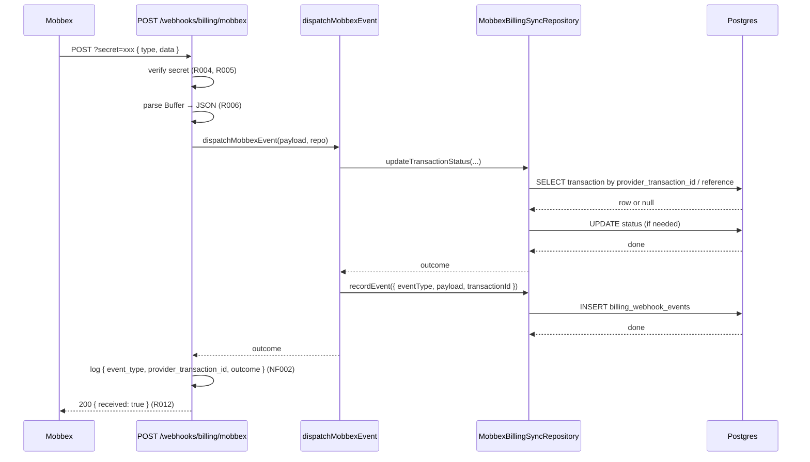

# BILLING-003 — Payment Webhooks

## Problem statement

Checkout transactions created by BILLING-002 remain stuck in `pending` status because no endpoint exists to receive the asynchronous payment outcome from Mobbex. The system must expose a secure `POST /webhooks/billing/mobbex` endpoint that verifies the shared secret, updates transaction status idempotently, and stores every raw event in a `billing_webhook_events` audit table — including events whose matching transaction is not yet present.

## Alternatives

| Alternative | Description | Decision |
|---|---|---|
| Option A: Delegate verification to MobbexProvider.verifyWebhook | Reuse the existing `verifyWebhook` method on `MobbexProvider` which reads the secret from the `x-mobbex-signature` header; adapt the route to fabricate that header from the `?secret=` query param before calling the method. | Not chosen — the method extracts the secret from the `x-mobbex-signature` request header, not the query string; forwarding would require mutating headers or creating a fake header map, adding indirection without benefit. The secret comparison itself is a single string equality check that is cleaner done inline in the route, consistent with how the Clerk plugin handles its own fail-fast check. |
| Option B: Inline all logic in the route handler | Place secret comparison, JSON parsing, transaction lookup, status update, and event recording directly inside the route function in `routes.ts`, with no separate dispatcher or repository class. | Not chosen — violates the hexagonal architecture pattern (R013) and the SQL-only-in-repositories rule enforced by backend conventions. It would also make unit testing infeasible without mocking the entire Fastify instance. |
| Option C: Dedicated webhook plugin with dispatcher + repository (chosen) | Follow the established Clerk webhook pattern exactly: a scoped Fastify plugin under `src/modules/webhooks/mobbex/` with a raw-buffer content-type parser, inline fail-fast secret check, a `dispatchMobbexEvent` dispatcher in `mobbexEventHandlers.ts`, and all DB access through a new `MobbexBillingSyncRepository` class. | **Chosen** — mirrors the Clerk webhook module structure already proven in the codebase (satisfies R002, R003, R013, R014); keeps SQL in the repository (R007, R008, R009, R010, R011); makes the dispatcher independently unit-testable (NF002, NF003); respects the technical constraints verbatim. |

## Chosen solution

**Dedicated webhook plugin with dispatcher + repository**

This solution follows the established Clerk webhook pattern. A Fastify plugin registered before `clerkAuthPlugin` adds a scoped raw-buffer parser (R003) and performs an inline fail-fast secret check at plugin registration time (R014). Incoming `POST /webhooks/billing/mobbex` requests are verified against `MOBBEX_WEBHOOK_SECRET` read via a `mobbexConfig` shared config (R004, R005). Verified payloads are dispatched by `dispatchMobbexEvent` (R008, R009, R010, R011, EC001–EC005). All SQL is centralized in `MobbexBillingSyncRepository` exposing `recordEvent` and `updateTransactionStatus` (R013, R007). A new migration creates `billing_webhook_events` (R001). Structured logging of `event_type`, `provider_transaction_id`, and `outcome` satisfies NF002 without leaking secrets or PII (NF003).

## Technical design

### Config

`src/shared/configs/mobbexConfig.ts` exports `mobbexConfig.webhookSecret` read from `process.env.MOBBEX_WEBHOOK_SECRET`. The plugin reads this value at registration time and throws a descriptive `Error` if it is absent.

Note: `resolveProvider.ts` already reads `MOBBEX_WEBHOOK_SECRET` from `process.env` directly for `MobbexProvider`. The new config module is the canonical way to read the secret in business code (per backend conventions). `resolveProvider.ts` is out of scope for this feature.

### Database migration

New table `billing_webhook_events`:

```sql
CREATE TABLE billing_webhook_events (
  id              UUID         PRIMARY KEY DEFAULT public.uuid_generate_v4()(),
  provider        TEXT         NOT NULL,
  event_type      TEXT         NOT NULL,
  payload         JSONB        NOT NULL,
  received_at     TIMESTAMPTZ  NOT NULL DEFAULT now(),
  transaction_id  UUID         REFERENCES transactions(id) ON DELETE SET NULL,
  subscription_id UUID         -- reserved; unconstrained until subscriptions table exists
);
```

### Repository interface

`IMobbexBillingSyncRepository` declared in `src/modules/webhooks/repositories/interfaces/iMobbexBillingSyncRepository.ts`:

```typescript
export type EventOutcome = 'approved' | 'failed' | 'noop' | 'unresolved';

export interface RecordEventInput {
  eventType: string;
  payload: Record<string, unknown>;
  transactionId: string | null;
}

export interface UpdateTransactionStatusInput {
  providerTransactionId: string | null;
  reference: string | null;
  status: 'approved' | 'failed';
  failureReason?: string;
}

export interface IMobbexBillingSyncRepository {
  recordEvent(input: RecordEventInput): Promise<void>;
  updateTransactionStatus(input: UpdateTransactionStatusInput): Promise<EventOutcome>;
}
```

`updateTransactionStatus` returns the outcome so the handler can log it (NF002):
- `'approved'` or `'failed'` — status was updated
- `'noop'` — target transaction already had the desired status (R011, EC002)
- `'unresolved'` — no matching transaction found (R010, EC001)

### Repository implementation

`MobbexBillingSyncRepository` in `src/modules/webhooks/repositories/mobbexBillingSyncRepository.ts`:

- `recordEvent`: inserts one row into `billing_webhook_events` with `provider = 'mobbex'`, `event_type`, `payload` as JSONB, `received_at = now()`, and `transaction_id` (nullable).
- `updateTransactionStatus`: first resolves the local transaction by `provider_transaction_id`, falling back to `reference`. Returns `'unresolved'` if not found. Returns `'noop'` if current status equals target. Otherwise updates `status` (and `failure_reason` when applicable) and returns the outcome. All SQL is in this class; the two-step lookup + conditional update is wrapped in a single `sql.begin` block to avoid race conditions.

### Dispatcher

`dispatchMobbexEvent` in `src/modules/webhooks/mobbex/mobbexEventHandlers.ts`:

```typescript
export async function dispatchMobbexEvent(
  payload: Record<string, unknown>,
  repo: IMobbexBillingSyncRepository,
): Promise<EventOutcome>
```

Logic:
1. Extract `event_type` (or `type`) and `data` from the payload.
2. Determine the Mobbex event classification: success events (`payment.success`, `checkout.success`) map to status `approved`; failure events (`payment.failure`, `checkout.failure`, `payment.rejected`) map to status `failed`.
3. Extract `data.id` as `providerTransactionId` and `data.reference` as `reference`.
4. Call `repo.updateTransactionStatus(...)` and capture the outcome.
5. Call `repo.recordEvent(...)` with the resolved `transactionId` (if outcome is not `unresolved`, the repository sets `transaction_id`; if `unresolved` or unknown event type, `transaction_id` is `null`).
6. Return the outcome (unhandled event types return `'unresolved'` for logging purposes but the route still responds HTTP 200 per EC005).

### Route plugin

`src/modules/webhooks/mobbex/routes.ts` — Fastify plugin:

1. Reads `mobbexConfig.webhookSecret` at registration time; throws `Error` if absent (R014).
2. Registers scoped `addContentTypeParser('application/json', { parseAs: 'buffer' }, ...)` (R003).
3. Instantiates `new MobbexBillingSyncRepository(db)` once (R013).
4. Handles `POST /webhooks/billing/mobbex`:
   - Extracts `request.query.secret`; throws `UnauthorizedError` if missing or mismatched (R004, R005).
   - Parses `request.body as Buffer` with `JSON.parse`; throws `ValidationError` on failure (R006).
   - Calls `dispatchMobbexEvent(payload, repository)`.
   - Logs structured entry with `event_type`, `provider_transaction_id`, `outcome` (NF002, NF003).
   - Replies `{ received: true }` with HTTP 200 (R012).

### app.ts change

Register the new plugin before `clerkWebhookRoutes` (or at minimum before `clerkAuthPlugin`) following the existing pattern:

```typescript
import mobbexWebhookRoutes from './modules/webhooks/mobbex/routes.js';
// ...
await fastify.register(mobbexWebhookRoutes);
await fastify.register(clerkWebhookRoutes);
await fastify.register(clerkAuthPlugin);
```

### Fastify query-string type declaration

The route handler accesses `request.query.secret`. Fastify types require a generic for query string shape; the route declares `{ Querystring: { secret?: string } }` on the handler.

### Sequence diagram



## Files

| Path | Action | Description |
|---|---|---|
| `apps/services/supabase/migrations/20260623100000_billing_webhook_events.sql` | CREATE | Migration creating `billing_webhook_events` table with FK to `transactions.id` (R001) |
| `apps/services/src/shared/configs/mobbexConfig.ts` | CREATE | Config module exporting `mobbexConfig.webhookSecret` read from `MOBBEX_WEBHOOK_SECRET` |
| `apps/services/src/modules/webhooks/repositories/interfaces/iMobbexBillingSyncRepository.ts` | CREATE | Repository interface declaring `recordEvent` and `updateTransactionStatus` (R013) |
| `apps/services/src/modules/webhooks/repositories/mobbexBillingSyncRepository.ts` | CREATE | Repository implementation with all SQL for event recording and transaction status updates (R007, R008, R009, R010, R011, R013) |
| `apps/services/src/modules/webhooks/mobbex/mobbexEventHandlers.ts` | CREATE | `dispatchMobbexEvent` function mapping Mobbex event types to repository calls (R008, R009, R010, EC001–EC005) |
| `apps/services/src/modules/webhooks/mobbex/routes.ts` | CREATE | Fastify plugin: scoped buffer parser, secret verification, route handler, structured logging (R002, R003, R004, R005, R006, R012, R014, NF002, NF003) |
| `apps/services/src/app.ts` | MODIFY | Import and register `mobbexWebhookRoutes` before `clerkAuthPlugin` (R002, R014) |
| `apps/services/tests/unit/modules/webhooks/mobbex/mobbexEventHandlers.test.ts` | CREATE | Unit tests for `dispatchMobbexEvent` covering all event types and outcomes |
| `apps/services/tests/unit/modules/webhooks/repositories/mobbexBillingSyncRepository.test.ts` | CREATE | Unit tests for repository methods |
| `apps/services/tests/unit/modules/webhooks/mobbex/routes.test.ts` | CREATE | Integration-style unit tests for the route plugin (secret check, parse failure, success path) |

## Requirement coverage

| ID | Design decision |
|---|---|
| R001 | Migration `20260623100000_billing_webhook_events.sql` creates the table with all specified columns, FK to `transactions.id ON DELETE SET NULL`, and unconstrained `subscription_id` |
| R002 | `src/modules/webhooks/mobbex/routes.ts` Fastify plugin registered in `app.ts` at `POST /webhooks/billing/mobbex` before `clerkAuthPlugin` |
| R003 | Scoped `addContentTypeParser('application/json', { parseAs: 'buffer' }, ...)` inside the plugin function in `routes.ts` |
| R004 | Route handler extracts `request.query.secret` and compares to `mobbexConfig.webhookSecret` |
| R005 | Throws `UnauthorizedError` (code `UNAUTHORIZED`, HTTP 401) when secret is absent or mismatched; returns before parsing or persisting |
| R006 | `JSON.parse` on the raw Buffer inside a try/catch; throws `ValidationError` (code `VALIDATION_ERROR`, HTTP 400) on failure |
| R007 | `MobbexBillingSyncRepository.recordEvent` inserts into `billing_webhook_events` with all required fields including resolved `transaction_id` |
| R008 | `dispatchMobbexEvent` maps success event types to `repo.updateTransactionStatus({ status: 'approved', ... })` with lookup by `provider_transaction_id` first, `reference` second |
| R009 | `dispatchMobbexEvent` maps failure event types to `repo.updateTransactionStatus({ status: 'failed', failureReason: ... })` populating `failure_reason` |
| R010 | `MobbexBillingSyncRepository.updateTransactionStatus` returns `'unresolved'` when no matching transaction row is found; handler logs warning and `recordEvent` stores `transaction_id = NULL` |
| R011 | `MobbexBillingSyncRepository.updateTransactionStatus` checks current status before updating; returns `'noop'` and skips the UPDATE when statuses match |
| R012 | Route handler replies `{ received: true }` HTTP 200 in all successful paths (verified event, noop, unresolved) |
| R013 | `MobbexBillingSyncRepository` class with `recordEvent` and `updateTransactionStatus` methods; instantiated via constructor injection in `routes.ts` |
| R014 | Plugin reads `mobbexConfig.webhookSecret` at registration time and throws `Error` if absent, preventing server start |
| NF001 | Two DB calls (lookup + insert) per request; no external HTTP calls in the webhook path; well within 5-second SLA |
| NF002 | `request.log.info({ event_type, provider_transaction_id, outcome }, ...)` logged after dispatch returns |
| NF003 | Only `event_type`, `provider_transaction_id`, and `outcome` are logged; no secret, headers, or PII emitted to logs |
| EC001 | `updateTransactionStatus` returns `'unresolved'`; dispatcher passes `transaction_id = null` to `recordEvent`; route responds HTTP 200 |
| EC002 | `updateTransactionStatus` detects matching current status, returns `'noop'`, skips UPDATE; `recordEvent` still inserts a row; route responds HTTP 200 |
| EC003 | Secret verification runs on every request regardless of transport; documented as a platform-level TLS concern |
| EC004 | When both `data.id` and `reference` are absent, lookup finds nothing; `updateTransactionStatus` returns `'unresolved'`; event recorded with `transaction_id = null`; HTTP 200 returned |
| EC005 | Unhandled event types in `dispatchMobbexEvent` fall through to `recordEvent` with `transaction_id = null` without calling `updateTransactionStatus`; HTTP 200 returned |
