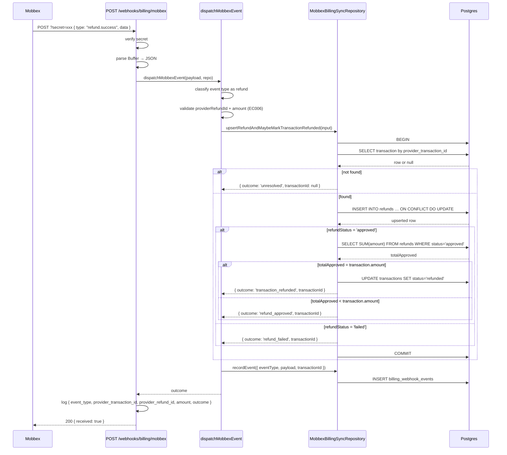

# BILLING-004 — Refunds Reflection (Provider-Initiated)

## Problem statement

Approved transactions can be refunded (fully or partially) via the Mobbex portal, but today the local `transactions` table has no knowledge of those events — a fully refunded transaction still shows `approved` locally. The system needs a `refunds` table, idempotent webhook handling for refund events extending the existing Mobbex dispatcher, atomic status transition of the parent transaction to `refunded` when the cumulative approved-refund amount matches the original transaction amount, and a read-only authenticated endpoint for listing refunds on a given transaction.

## Chosen solution

**Extend the existing Mobbex webhook dispatcher and billing module repository**

The analysis constraints prescribe exactly one implementation path: extend `dispatchMobbexEvent` to recognize refund event types (calling a new atomic repository method on `MobbexBillingSyncRepository`), add `getRefundsByTransactionId` to the billing module's repository, add a `GET /billing/transactions/:id/refunds` endpoint using the established handler → useCase → IRepository → DBRepository pattern, add a new `Refund` shared type, and create the `refunds` Supabase table via migration. This satisfies R001–R013 while respecting all technical constraints: SQL stays in repositories, the webhook audit path continues unchanged, and domain errors use the existing `DomainError` hierarchy.

## Technical design

### Shared types (`packages/types/src/index.ts`)

Add a new export:

```typescript
export type RefundStatusValue = 'pending' | 'approved' | 'failed';

export interface Refund {
  id: string;
  transaction_id: string;
  amount: number;
  reason: string | null;
  status: RefundStatusValue;
  provider_refund_id: string;
  created_at: string;
  updated_at: string;
}
```

### Database migration

New migration `20260623200000_refunds.sql`:

```sql
CREATE TABLE refunds (
  id                  UUID         PRIMARY KEY DEFAULT uuid_generate_v4(),
  transaction_id      UUID         NOT NULL REFERENCES transactions(id) ON DELETE CASCADE,
  amount              NUMERIC      NOT NULL,
  reason              TEXT,
  status              TEXT         NOT NULL CHECK (status IN ('pending', 'approved', 'failed')),
  provider_refund_id  TEXT         NOT NULL UNIQUE,
  created_at          TIMESTAMPTZ  NOT NULL DEFAULT now(),
  updated_at          TIMESTAMPTZ  NOT NULL DEFAULT now()
);

CREATE INDEX idx_refunds_transaction_id ON refunds (transaction_id);

CREATE TRIGGER set_refunds_updated_at
  BEFORE UPDATE ON refunds
  FOR EACH ROW EXECUTE FUNCTION set_updated_at();
```

### Billing module entity

New file `apps/services/src/modules/billing/entities/refund.entity.ts`:

```typescript
import type { RefundStatusValue } from '@repo/types';

export interface RefundEntity {
  id: string;
  transaction_id: string;
  amount: number;
  reason: string | null;
  status: RefundStatusValue;
  provider_refund_id: string;
  created_at: string;
  updated_at: string;
}
```

### Billing repository interface extension

`ITransactionRepository` gains one new method:

```typescript
getRefundsByTransactionId(transactionId: string): Promise<RefundEntity[]>;
```

### Billing repository implementation extension

`TransactionDBRepository.getRefundsByTransactionId` queries:

```sql
SELECT id, transaction_id, amount, reason, status, provider_refund_id, created_at, updated_at
FROM refunds
WHERE transaction_id = $transactionId
ORDER BY created_at ASC
```

### Webhook repository interface extension

`IMobbexBillingSyncRepository` gains one new method:

```typescript
upsertRefundAndMaybeMarkTransactionRefunded(input: UpsertRefundInput): Promise<RefundOutcome>;
```

Where:

```typescript
export type RefundOutcome =
  | 'refund_approved'
  | 'refund_failed'
  | 'transaction_refunded'
  | 'unresolved'
  | 'noop';

export interface UpsertRefundInput {
  providerTransactionId: string;
  providerRefundId: string;
  amount: number;
  reason: string | null;
  refundStatus: 'approved' | 'failed';
}
```

### Webhook repository implementation

`MobbexBillingSyncRepository.upsertRefundAndMaybeMarkTransactionRefunded` operates inside a single `sql.begin` block (R006, NF001):

1. Resolve the parent transaction by `provider_transaction_id`. If not found, return `'unresolved'` immediately without inserting a refund row (R007, EC001).
2. If found but `transaction.status === 'pending'`, log a warning with `transaction_id`, `provider_refund_id`, and current `status` (EC005). Continue to persist the refund row without touching `transactions.status`.
3. Upsert into `refunds` by `provider_refund_id` (ON CONFLICT DO UPDATE) (R008, EC002):
   ```sql
   INSERT INTO refunds (id, transaction_id, amount, reason, status, provider_refund_id, created_at, updated_at)
   VALUES (uuid_generate_v4(), $transactionId, $amount, $reason, $refundStatus, $providerRefundId, now(), now())
   ON CONFLICT (provider_refund_id) DO UPDATE
     SET amount = EXCLUDED.amount,
         reason = EXCLUDED.reason,
         status = EXCLUDED.status,
         updated_at = now()
   ```
4. If `refundStatus === 'approved'`: sum approved refund amounts for the parent transaction (R004, R005, EC003, EC004):
   ```sql
   SELECT COALESCE(SUM(amount), 0) AS total_approved
   FROM refunds
   WHERE transaction_id = $transactionId AND status = 'approved'
   ```
5. If the sum equals the parent `amount` AND `transactions.status` is not already `'refunded'`: update `transactions.status = 'refunded'` and return `'transaction_refunded'`. Else return `'refund_approved'`.
6. If `refundStatus === 'failed'`: return `'refund_failed'`. Do not modify `transactions.status` (EC004).

### Dispatcher extension

`dispatchMobbexEvent` in `mobbexEventHandlers.ts` is extended with two new event type sets:

```typescript
const REFUND_SUCCESS_EVENT_TYPES = new Set(['refund.success']);
const REFUND_FAILURE_EVENT_TYPES = new Set(['refund.failure']);
```

New branch in the dispatcher:

```typescript
if (REFUND_SUCCESS_EVENT_TYPES.has(eventType) || REFUND_FAILURE_EVENT_TYPES.has(eventType)) {
  const providerRefundId = (data['refund_id'] as string | undefined) ?? null;
  const amount = (data['amount'] as number | undefined) ?? null;

  // EC006 — missing or non-positive amount
  if (!providerRefundId || amount === null || typeof amount !== 'number' || amount <= 0) {
    await repo.recordEvent({ eventType, payload, transactionId: null });
    return 'unresolved'; // log warning handled in route
  }

  const refundStatus = REFUND_SUCCESS_EVENT_TYPES.has(eventType) ? 'approved' : 'failed';
  const result = await repo.upsertRefundAndMaybeMarkTransactionRefunded({
    providerTransactionId: providerTransactionId ?? '',
    providerRefundId,
    amount,
    reason: (data['reason'] as string | undefined) ?? null,
    refundStatus,
  });
  outcome = result === 'unresolved' ? 'unresolved' : result;
  resolvedTransactionId = result !== 'unresolved' ? (providerTransactionId ? ... : null) : null;
  // recordEvent is called at the end of the dispatcher as before
}
```

Note: the actual `resolvedTransactionId` is obtained by adding it to the `UpsertRefundResult` return type as `transactionId: string | null`. This mirrors the existing `UpdateTransactionStatusResult` pattern.

Updated `UpsertRefundInput` and `RefundOutcome`:

```typescript
export interface UpsertRefundResult {
  outcome: RefundOutcome;
  transactionId: string | null;
}
```

`upsertRefundAndMaybeMarkTransactionRefunded` returns `UpsertRefundResult`.

### Billing use case and handler (read endpoint)

**`GetRefundsUseCase`** (R009, R010, R011, EC007):

```typescript
class GetRefundsUseCase {
  constructor(private readonly repo: ITransactionRepository) {}

  async execute(
    transactionId: string,
    userId: string,
    orgId: string | null,
  ): Promise<RefundEntity[]> {
    const transaction = await this.repo.findById(transactionId);
    if (!transaction) throw new NotFoundError('Transaction not found');
    // Ownership check mirrors GetTransactionUseCase
    const owned = orgId
      ? transaction.org_id === orgId
      : transaction.user_id === userId && transaction.org_id === null;
    if (!owned) throw new ForbiddenError('Access denied');
    return this.repo.getRefundsByTransactionId(transactionId);
  }
}
```

**`getRefundsHandler`**: extracts `:id` param, instantiates `TransactionDBRepository` and `GetRefundsUseCase`, replies with `{ data: refunds }`.

**Route**: `GET /billing/transactions/:id/refunds` with `preHandler: requireAuth` added to `billingRoutes`.

### Structured logging (NF002, NF003)

The route handler in `mobbexWebhookRoutes` logs after `dispatchMobbexEvent` returns, now including the extended outcome set. Only `event_type`, `provider_transaction_id`, `provider_refund_id`, `amount`, and `outcome` are logged — no secrets, headers, or full payload PII.

### Sequence diagram



## Files

| Path | Action | Description |
|---|---|---|
| `apps/services/supabase/migrations/20260623200000_refunds.sql` | CREATE | Migration creating `refunds` table with FK to `transactions.id ON DELETE CASCADE`, UNIQUE on `provider_refund_id`, CHECK on `status`, index on `transaction_id`, and `updated_at` trigger (R001) |
| `packages/types/src/index.ts` | MODIFY | Add `RefundStatusValue` and `Refund` exports (R001, R013) |
| `apps/services/src/modules/billing/entities/refund.entity.ts` | CREATE | `RefundEntity` interface mirroring the `refunds` DB row (R013) |
| `apps/services/src/modules/billing/repositories/interfaces/iTransactionRepository.ts` | MODIFY | Add `getRefundsByTransactionId(transactionId: string): Promise<RefundEntity[]>` method (R013) |
| `apps/services/src/modules/billing/repositories/transactionDBRepository.ts` | MODIFY | Implement `getRefundsByTransactionId` querying `refunds` ordered by `created_at ASC` (R009, R013) |
| `apps/services/src/modules/webhooks/repositories/interfaces/iMobbexBillingSyncRepository.ts` | MODIFY | Add `UpsertRefundInput`, `RefundOutcome`, `UpsertRefundResult` types and `upsertRefundAndMaybeMarkTransactionRefunded` method (R002, R003, R006, R013) |
| `apps/services/src/modules/webhooks/repositories/mobbexBillingSyncRepository.ts` | MODIFY | Implement `upsertRefundAndMaybeMarkTransactionRefunded` with atomic `sql.begin` block: resolve transaction, upsert refund, conditionally update `transactions.status` (R002, R003, R004, R005, R006, R007, R008, NF001) |
| `apps/services/src/modules/webhooks/mobbex/mobbexEventHandlers.ts` | MODIFY | Extend `dispatchMobbexEvent` to classify `refund.success` / `refund.failure` event types and call `upsertRefundAndMaybeMarkTransactionRefunded`; validate `providerRefundId` and `amount` (R002, R003, R006, R007, R008, EC001, EC002, EC003, EC004, EC005, EC006, NF002, NF003) |
| `apps/services/src/modules/billing/useCases/getRefundsUseCase.ts` | CREATE | `GetRefundsUseCase` class: find transaction, enforce ownership, call `getRefundsByTransactionId` (R009, R010, R011, EC007) |
| `apps/services/src/modules/billing/handlers/getRefundsHandler.ts` | CREATE | `getRefundsHandler` Fastify handler: extract `:id` param, instantiate use case and repo, reply `{ data: refunds }` (R009, R012) |
| `apps/services/src/modules/billing/routes.ts` | MODIFY | Register `GET /billing/transactions/:id/refunds` with `requireAuth` preHandler (R009, R012) |
| `apps/services/tests/unit/modules/webhooks/repositories/mobbexBillingSyncRepository.test.ts` | MODIFY | Add test cases for `upsertRefundAndMaybeMarkTransactionRefunded`: approved refund, failed refund, cumulative full refund, not found, idempotent re-delivery (R002, R003, R004, R005, R006, R007, R008, EC001–EC005) |
| `apps/services/tests/unit/modules/webhooks/mobbex/mobbexEventHandlers.test.ts` | MODIFY | Add test cases for refund event dispatch: `refund.success`, `refund.failure`, missing `provider_refund_id`, missing/invalid `amount` (R002, R003, EC006, NF002, NF003) |
| `apps/services/tests/unit/billing/getRefundsUseCase.test.ts` | CREATE | Unit tests for `GetRefundsUseCase`: found+owned returns list, not found → 404, wrong owner → 403, no refunds → empty array (R009, R010, R011, EC007) |
| `apps/services/tests/unit/billing/getRefundsHandler.test.ts` | CREATE | Unit tests for `getRefundsHandler`: success reply shape, missing auth delegate to use case (R009, R012) |

## Requirement coverage

| ID | Design decision |
|---|---|
| R001 | Migration `20260623200000_refunds.sql` creates the `refunds` table with all specified columns, constraints (`CHECK status`, `UNIQUE provider_refund_id`, `FK transaction_id ON DELETE CASCADE`), and index on `transaction_id`; `Refund` + `RefundStatusValue` added to `@repo/types` |
| R002 | New `refund.success` branch in `dispatchMobbexEvent` calls `upsertRefundAndMaybeMarkTransactionRefunded` with `refundStatus = 'approved'`; the repository upserts the row inside a `BEGIN`/`COMMIT` block |
| R003 | New `refund.failure` branch in `dispatchMobbexEvent` calls `upsertRefundAndMaybeMarkTransactionRefunded` with `refundStatus = 'failed'`; the repository upserts with `status = 'failed'` inside the same atomic block |
| R004 | After upserting an approved refund, the repository sums `amount` across `status = 'approved'` rows for the parent transaction; when the sum equals `transactions.amount`, `transactions.status` is updated to `'refunded'` within the same `sql.begin` block |
| R005 | When the cumulative approved sum is strictly less than `transactions.amount`, the repository returns `'refund_approved'` and leaves `transactions.status` unchanged |
| R006 | `upsertRefundAndMaybeMarkTransactionRefunded` wraps all writes (refund upsert + optional transaction status update) in a single `sql.begin` block, ensuring atomicity |
| R007 | When no `transactions` row matches `provider_transaction_id`, the method returns `{ outcome: 'unresolved', transactionId: null }` without inserting a refund; the dispatcher passes `transactionId: null` to `recordEvent`; the route logs a warning and responds HTTP 200 |
| R008 | The refund upsert uses `ON CONFLICT (provider_refund_id) DO UPDATE`, ensuring idempotent re-delivery produces no duplicate row |
| R009 | `GET /billing/transactions/:id/refunds` registered in `billingRoutes` with `preHandler: requireAuth`; `GetRefundsUseCase` calls `getRefundsByTransactionId` returning refunds ordered by `created_at ASC` |
| R010 | `GetRefundsUseCase.execute` calls `repo.findById`; when `null` is returned, throws `NotFoundError` (HTTP 404, code `NOT_FOUND`) |
| R011 | `GetRefundsUseCase.execute` applies the same ownership check as `GetTransactionUseCase`; throws `ForbiddenError` (HTTP 403, code `FORBIDDEN`) on mismatch |
| R012 | No HTTP endpoint in this feature triggers a refund against Mobbex; refund creation is exclusively via the existing `POST /webhooks/billing/mobbex` path already established in BILLING-003 |
| R013 | All SQL for refund reads lives in `TransactionDBRepository.getRefundsByTransactionId`; all SQL for refund writes and atomic transaction status transition lives in `MobbexBillingSyncRepository.upsertRefundAndMaybeMarkTransactionRefunded`; no SQL in handlers, use cases, dispatchers, or routes |
| NF001 | The refund upsert and conditional `transactions.status` update execute inside a single `sql.begin` block in `MobbexBillingSyncRepository` |
| NF002 | The route handler in `mobbexWebhookRoutes` logs `{ event_type, provider_transaction_id, provider_refund_id, amount, outcome }` after `dispatchMobbexEvent` returns, for every refund event |
| NF003 | Only the fields listed in NF002 are logged; secrets, full headers, and raw payload PII are never written to log output |
