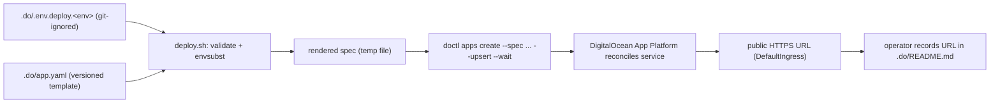

# INFRA-008 — Backend deployment on DigitalOcean App Platform — Design

## Problem statement

The `services` backend was designed for AWS App Runner but never deployed — App Runner is closed to new customers and the Terraform that would have provisioned it was never applied. Compute has moved to DigitalOcean App Platform and Terraform has been dropped from the project, but the existing Dockerfile build assumes a build context (`apps/services`) that does not contain the monorepo-root files it copies. The project needs a versioned, declarative DigitalOcean application specification and a repeatable manual procedure to deploy it.

## Alternatives

| Alternative | Description | Decision |
|---|---|---|
| Templated single spec + local values file + `doctl apps create --upsert` | One versioned `.do/app.yaml` with `${VAR}` placeholders for every environment-dependent value (including secrets); a local, git-ignored values file supplies the real values per environment; a thin script renders the spec with `envsubst` and reconciles the app with `doctl apps create --spec <rendered> --upsert`, which creates the app on first run and updates it in place on every subsequent run, keyed by the `name` field. | **Chosen** — satisfies R001/R006/R007/R008/R010/NF001/NF003 with one spec file and no per-environment fork. |
| Per-environment committed spec files (`.do/app.dev.yaml`, `.do/app.prod.yaml`) | Duplicate the full spec once per environment, inlining plain values directly and hand-editing DO's encrypted secret placeholders before each deploy of that environment's file. | Not chosen — duplicates/forks the specification structure per environment, directly violating R007, and the two files can silently drift out of sync, undermining NF001 (single source of truth). |
| Spec-only apply, environment variables managed by hand in the DO console/`doctl` afterward | `.do/app.yaml` declares only the service, build and health check; every runtime environment variable is set imperatively per environment after the first apply, outside the spec. | Not chosen — env vars would not be part of the declarative specification, violating R001/R006; re-applying the spec could never restore configuration values, violating NF001, and console edits would be indistinguishable from intended state, defeating the drift guarantee required by EC005. |

## Chosen solution

**Templated single spec + local, git-ignored values file + `doctl apps create --upsert`**

`.do/app.yaml` is the single versioned specification (R001) declaring exactly one `service` component for `apps/services` (R002) built from `apps/services/Dockerfile` with `source_dir: /` as the monorepo-root build context (R004, R005, EC001) and no source-code change to `apps/services` (technical constraint). Every value that legitimately differs per environment or must never be committed — the DO app name, the GitHub branch, and all nineteen runtime environment variables from R006 — is expressed as an `${VAR}` placeholder rather than a literal, so the same file structure serves every environment (R007) without forking. A local, git-ignored values file per environment supplies the real values, including secrets, only at deploy time (R008, NF003); `envsubst` renders the template and `doctl apps create --spec <rendered> --upsert --wait` both creates the app on the first run and reconciles it to the spec on every later run keyed by the `name` field — the same command produces the same result every time for the same spec and secret values (R010, NF001). The HTTP port used for `http_port`, `health_check.port`, and the `PORT` environment variable is the same single placeholder, making a port/health-check mismatch (EC006) structurally impossible rather than a documentation reminder. A README next to the spec documents the end-to-end procedure, the secret-handling rule, the drift guarantee (EC005), the missing-configuration failure signature (EC002), the SES placeholder rationale (EC004), and the scale-down/destroy command (EC003), so the whole procedure is executable from repository documentation alone (NF002).

This design was evaluated against `duck-spec/docs/BACKEND.md` (Configuration, Feature module structure) and `duck-spec/docs/INFRASTRUCTURE.md`; neither imposes constraints on deploy tooling that this design would violate, since no `apps/services` source file is created or modified and no `process.env` read is added to application code. `duck-spec/modules/infra/SPEC.md` was consulted (INFRA-001 through INFRA-004) — it currently describes the AWS/Terraform topology, which per the analysis and the project's move off AWS is superseded by this feature; updating SPEC.md itself is deferred to the `ds-docs` step per the duck-spec workflow and is out of scope for this design.

## Technical design

### `.do/app.yaml` — versioned specification template

One `services` component:

- `source_dir: /` (repo root) + `dockerfile_path: apps/services/Dockerfile` → satisfies R004/R005/EC001: the platform clones the whole repository and builds with the root as Docker context, so `COPY package.json pnpm-workspace.yaml pnpm-lock.yaml ./` and the `packages/*/package.json` copies in the Dockerfile resolve.
- `github.repo`, `github.branch` → templated (`${GITHUB_REPO}`, `${GIT_BRANCH}`); `github.deploy_on_push: false` (hardcoded, not templated) — automatic deploy on push is explicitly out of scope (INFRA-012); every deploy is triggered by the documented manual procedure only.
- `http_port: ${PORT}` and `health_check.http_path: /health`, `health_check.port: ${PORT}` → R009, EC006. `envsubst` substitutes the same value everywhere `${PORT}` appears, so the platform port and the container's bound port can never diverge.
- `instance_count: 1`, no `autoscaling` block → the service does not scale to zero (EC003); documented explicitly in the README rather than modeled in the spec, since scale-to-zero is not offered by App Platform for `service` components.
- `envs`: one entry per variable in R006, `scope: RUN_TIME` (none of them are read at build time), `type: secret` for anything R008 classifies as sensitive (`DATABASE_URL`, `CLERK_SECRET_KEY`, `CLERK_JWT_KEY`, `CLERK_WEBHOOK_SIGNING_SECRET`, `MOBBEX_API_KEY`, `MOBBEX_ACCESS_TOKEN`, `MOBBEX_WEBHOOK_SECRET`), `type: general` for the rest. Every value is `${VAR}` — the committed file never contains a literal secret or environment-specific value (NF003).
- `SES_REGION` carries an inline comment marking it a decommissioned-AWS placeholder (EC004): the container needs *a* value to start (`resolveNotifier`'s startup validation, EC002), but the value is inert until the email adapter is migrated off SES.

### `.do/deploy.sh` — reconciliation script

```
Usage: .do/deploy.sh <values-file>
```

1. Sources the given values file into the shell environment (`set -a; source "$1"; set +a`).
2. Validates every placeholder consumed by `app.yaml` is non-empty (`${VAR:?missing $VAR — see .do/README.md}`) — fails fast, before any network call, on the exact class of misconfiguration described in EC002, rather than surfacing as a generic platform deploy failure.
3. Renders `.do/app.yaml` with `envsubst` into a temporary file (cleaned up on exit via `trap`).
4. Runs `doctl apps create --spec <rendered> --upsert --wait --format ID,DefaultIngress --no-header`, which creates the app on the first invocation and reconciles the existing app (matched by `name`) to the rendered spec on every later invocation (R010).
5. Prints the app ID and the `DefaultIngress` URL, and instructs the operator to record it in `.do/README.md` (R011, R003).

### `.do/.env.deploy.example` — values file template

Documents every placeholder consumed by `app.yaml` (`DO_APP_NAME`, `GITHUB_REPO`, `GIT_BRANCH`, and the 19 R006 variables) with a comment describing its purpose and, where safe, a non-secret example value (e.g. `NODE_ENV=production`, `SES_REGION=us-east-1  # placeholder, see EC004`). Secret fields are left blank with a comment naming what belongs there. Operators copy it to `.do/.env.deploy.<environment>` (git-ignored) and fill in real values — this file is what makes R007 concrete: the same `app.yaml` structure, a different values file per environment.

### `.do/README.md` — manual deploy procedure

Documents, as the single source of truth an operator needs (NF002):

1. Prerequisites: authenticated `doctl` CLI, `envsubst` (part of `gettext`), a DigitalOcean team with App Platform enabled and the repository's GitHub App installed, and the externally provisioned runtime credentials already listed as a dependency in `analysis.md`.
2. How to prepare `.do/.env.deploy.<environment>` from the example file.
3. How to run `.do/deploy.sh .do/.env.deploy.<environment>`.
4. The drift rule (EC005): console edits are not durable and are overwritten by the next run of the procedure.
5. The EC002 failure signature (`Missing required env var: EMAIL_SENDER_ADDRESS`) as a missing-configuration failure, not a platform failure.
6. The EC003 cost note and the `doctl apps delete <app-id>` command to stop billing.
7. A "Current deployments" table (`Environment | Public URL | Last updated`) that the operator fills in with the value `deploy.sh` prints after each successful run (R011).



## Files

| Path | Action | Description |
|---|---|---|
| `.do/app.yaml` | CREATE | Versioned App Platform specification template: one `service` component for `apps/services`, root build context, health check, and `${VAR}`-templated `envs` for every R006 variable. |
| `.do/deploy.sh` | CREATE | Renders `.do/app.yaml` against a values file and reconciles the app via `doctl apps create --spec ... --upsert --wait`; validates required placeholders before deploying; prints the resulting public URL. |
| `.do/.env.deploy.example` | CREATE | Documents every placeholder consumed by `app.yaml`, with safe example values for non-secret fields and blank, labeled fields for secrets. |
| `.do/README.md` | CREATE | Manual deploy procedure, prerequisites, drift rule, EC002/EC003/EC004 troubleshooting notes, and the "Current deployments" URL table. |
| `.gitignore` | MODIFY | Add `.do/.env.deploy.*` and `!.do/.env.deploy.example` so per-environment values files are never committed while the example stays tracked. |
| `.do/tests/app-spec.test.sh` | CREATE | Acceptance tests asserting `.do/app.yaml` structure: single service component, build context/dockerfile path, `envs` keys and types, health check/port alignment, SES placeholder comment. |
| `.do/tests/deploy-script.test.sh` | CREATE | Acceptance tests asserting `deploy.sh` fails fast on a missing required variable, invokes `doctl apps create --spec ... --upsert --wait`, and prints the resulting public URL. |
| `.do/tests/env-example.test.sh` | CREATE | Acceptance test asserting `.env.deploy.example` declares every placeholder referenced by `app.yaml` and leaves secret-classified keys blank. |
| `.do/tests/gitignore.test.sh` | CREATE | Acceptance test asserting `git check-ignore` excludes `.do/.env.deploy.<environment>` files while `.do/.env.deploy.example` stays tracked. |
| `.do/tests/readme.test.sh` | CREATE | Acceptance test asserting `.do/README.md` documents every required section (prerequisites, procedure, drift rule, EC002/EC003 notes, current-deployments table). |

## Requirement coverage

| ID | Design decision |
|---|---|
| R001 | `.do/app.yaml` is the single versioned specification file at the required path. |
| R002 | Exactly one `services` component declared for `apps/services` with `http_port` ingress. |
| R003 | `deploy.sh` runs `doctl apps create --spec ... --upsert --wait`, which leaves the app publicly reachable over HTTPS with no console step. |
| R004 | `source_dir: /` + `dockerfile_path: apps/services/Dockerfile` in `.do/app.yaml`. |
| R005 | Root build context makes the Dockerfile's root-relative `COPY` instructions resolvable during the platform build. |
| R006 | One `envs` entry per variable listed in R006, all `scope: RUN_TIME`. |
| R007 | Placeholders in `.do/app.yaml` + one values file per environment (`.do/.env.deploy.<environment>`) reuse the identical spec structure. |
| R008 | `type: secret` on every credential/API-key/signing-secret/connection-string entry; real values only ever exist in the git-ignored values file, injected at render time. |
| R009 | `health_check` block probing `GET /health` on `${PORT}`. |
| R010 | `doctl apps create --spec ... --upsert` reconciles deterministically on every run; `deploy.sh` is the single documented command for the procedure. |
| R011 | `deploy.sh` prints `DefaultIngress`; `.do/README.md`'s "Current deployments" table is where the operator records it. |
| NF001 | `--upsert` always reconciles the full app to `.do/app.yaml`'s declared state; no configuration lives outside the spec. |
| NF002 | `.do/README.md` documents every step, including tool prerequisites; `deploy.sh` is a single reproducible entry point. |
| NF003 | All secret values are `${VAR}` placeholders in the committed template; real values live only in the git-ignored `.do/.env.deploy.<environment>` file, excluded by the `.gitignore` change. |
| EC001 | `source_dir: /` instead of `apps/services`, resolving the exact build failure described. |
| EC002 | `deploy.sh` validates `EMAIL_SENDER_ADDRESS` (and every other placeholder) is non-empty before deploying; `.do/README.md` documents the exact runtime error message as a missing-configuration failure. |
| EC003 | `.do/README.md` documents the non-scaling cost implication and the `doctl apps delete <app-id>` command. |
| EC004 | `SES_REGION` declared with an inline placeholder-rationale comment in `.do/app.yaml` and `.do/.env.deploy.example`. |
| EC005 | `.do/README.md` states console edits are overwritten by the next `deploy.sh` run. |
| EC006 | `http_port`, `health_check.port`, and the `PORT` env all resolve from the single `${PORT}` placeholder, so they cannot diverge. |
