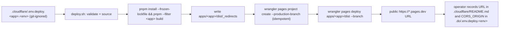

# INFRA-009 — `web` and `landing` hosting on Cloudflare Pages — Design

## Problem statement

`web` and `landing` are Vite SPAs whose Terraform-based AWS hosting (S3 + CloudFront, INFRA-003) was never applied, and the project has moved off AWS. Both apps depend on `workspace:*` packages that only resolve when built from the monorepo root, so they need a hosting target on Cloudflare Pages whose build step is monorepo-aware, that serves each app's `dist/` output over HTTPS with SPA-fallback routing, and that injects the right public `VITE_*` values per environment without leaking anything secret-classified.

## Alternatives

| Alternative | Description | Decision |
|---|---|---|
| Cloudflare-native Git integration (dashboard-connected build) | Connect each Pages project directly to the GitHub repo through the Cloudflare dashboard; Cloudflare's own build container clones the repo and runs a configured build command (root directory = repo root, `pnpm install --frozen-lockfile && pnpm --filter <app> build`, output = `apps/<app>/dist`) on every push to a tracked branch; env vars and build settings live in the dashboard/API. | Not chosen — a Git-connected Pages project builds and deploys automatically on every push to a tracked branch, which *is* "automatic deployment on merge", explicitly out of scope (INFRA-012); build/env configuration would also live only in Cloudflare's project state rather than in the repository, unlike the versioned-spec precedent set by INFRA-008. |
| Committed `wrangler.toml` per app driving Cloudflare-run builds | A `wrangler.toml` at each app declares `pages_build_output_dir` and a `[build] command`, still relying on Cloudflare's Git integration to trigger and run the build server-side. | Not chosen — this still requires connecting the project to Git for the build trigger, so it carries the same automatic-deploy-on-push problem as the alternative above; `wrangler pages deploy` itself explicitly does not support a custom Wrangler configuration location, so the only real lever this file adds (the build command) duplicates what an explicit deploy script expresses directly, without resolving the trigger question. |
| Local/CI build + explicit `wrangler pages deploy` upload | The build (`pnpm install --frozen-lockfile && pnpm --filter <app> build`) runs wherever the operator invokes the deploy script (local machine today, CI later under INFRA-012), fully outside Cloudflare's build environment; only the already-built `apps/<app>/dist` directory is uploaded via `wrangler pages deploy <dir> --project-name <name> --branch <branch>`. | **Chosen** — deployment is an explicit, versioned command (mirrors INFRA-008's `doctl apps create --upsert` pattern), never triggered by a git push, so INFRA-012 stays a clean future addition; the build runs with the exact pnpm-workspace command EC001 prescribes, with no dependency on Cloudflare's build container understanding the monorepo. |

## Chosen solution

**Local/CI build + explicit `wrangler pages deploy` upload, one Pages project per app**

A single script, `.cloudflare/deploy.sh <app> <values-file>` (`<app>` is `web` or `landing`), is the one build-and-publish entry point for both applications — it is never invoked by a git hook or Cloudflare-side trigger, so no automatic-deploy-on-merge behavior is introduced (respecting the INFRA-012 boundary). It sources a per-environment, git-ignored values file, builds the target app from the repo root with `pnpm install --frozen-lockfile && pnpm --filter <app> build` so the `workspace:*` packages resolve (R003, EC001), writes a `_redirects` file (`/* /index.html 200`) into the freshly built `apps/<app>/dist` (R005, EC003), and uploads exactly that directory — nothing else in the monorepo — via `wrangler pages deploy apps/<app>/dist --project-name <name> --branch <branch>` (R004). Because Cloudflare Pages projects natively distinguish a "production" deployment (matching the project's configured production branch) from a "preview" deployment (any other branch) with two different public URLs from the *same* project, **one Cloudflare Pages project per app already covers every environment** (R001, EC005) — no per-environment project fork is needed, satisfying R007 together with the fact that `deploy.sh`'s logic never branches on environment, only the sourced values file's contents differ. Build-time configuration (`VITE_API_URL`, `VITE_CLERK_PUBLISHABLE_KEY`, `VITE_LANDING_URL`, `VITE_PROVIDER_PORTAL_URL` for `web`; `VITE_API_URL`, `VITE_WEB_URL` for `landing`) is exported into the shell (`set -a; source "$values_file"; set +a`) before the build runs, so Vite's own env-loading (shell-provided `VITE_*` vars take precedence over any `.env` file and are inlined into `import.meta.env` at bundle time) produces a bundle with resolved values (R006) — with no change to either app's source. The two example values files list only public-classified variables — never a secret credential — enforcing NF002/EC002 structurally, and `.cloudflare/README.md` documents that restriction explicitly plus a "Current deployments" table recording both apps' URLs per environment (R008, EC005). Serving is exclusively through Cloudflare's own `*.pages.dev` distribution — no separate origin is stood up (NF003).

Because both SPAs read `VITE_API_URL` and therefore both call the backend, and `@fastify/cors`'s `origin` option — confirmed from the `@fastify/cors` source (`getAccessControlAllowOriginHeader`) — treats a plain string as a single literal value which cannot match two different request origins (only an array of strings, a RegExp, or a function can), EC004's "Assumption" that a comma-joined `CORS_ORIGIN` string would match neither origin is correct with today's `apps/services/src/shared/configs/serverConfig.ts` (`corsOrigin: env.CORS_ORIGIN ?? '*'`, forwarded verbatim). Resolving this purely through documentation would leave R008/EC004's "so requests from either SPA receive a matching `Access-Control-Allow-Origin`" unmet in practice, so the design makes the minimal, config-layer-only change: `serverConfig.corsOrigin` splits `CORS_ORIGIN` into a trimmed `string[]` only when it contains a comma, leaving any single value (including the `'*'` default) unchanged as a plain string. This keeps every existing single-origin deployment (and the current unit test) working unmodified, satisfies `@fastify/cors`'s documented array-matching behavior for the two-origin case, requires no change to `cors.ts` (it already forwards `serverConfig.corsOrigin` verbatim, and `@fastify/cors`'s `origin` type accepts `string | string[]`), and does not violate `duck-spec/docs/BACKEND.md`'s "no `process.env` outside config files" rule — the read stays inside `serverConfig.ts`. `.do/.env.deploy.example`'s `CORS_ORIGIN` comment is updated to document the exact accepted format (comma-separated list of full origins, no trailing slash), closing EC004 with working code rather than a documentation-only promise, while still deferring the actual per-environment value (which needs both apps' real URLs) to the operator, consistent with the analysis's "the two configurations close in a second pass" dependency note.

This design was evaluated against `duck-spec/docs/BACKEND.md` (Configuration, Coding conventions) for the `serverConfig.ts` change, and `duck-spec/docs/FRONTEND.md` was consulted for the exact `import.meta.env.VITE_*` reads in both apps (`api/client.ts`, `main.tsx`, `SubscriptionStatusCard.tsx`, `BillingPage.tsx`, `SubscribePage.tsx`, `Pricing.tsx`, `plans.ts`) — no FRONTEND.md section imposes a hosting-layer constraint this design would violate, and no `apps/web`/`apps/landing` source file is created or modified, respecting the technical constraint. `duck-spec/modules/infra/SPEC.md` was consulted (INFRA-002/003/004/008): it confirms `web`/`landing` are still described as pending migration from S3+CloudFront to Cloudflare Pages under this exact feature ID, and that INFRA-008's deploy script/README pattern (versioned template + git-ignored per-environment values file + idempotent CLI reconciliation) is the established precedent this design deliberately mirrors for consistency across the two deploy scripts.

## Technical design

### `.cloudflare/deploy.sh <web|landing> <values-file>`

1. Validates `$1` is exactly `web` or `landing`; validates `$2` (values-file path) exists.
2. `set -a; source "$2"; set +a` — exports every variable in the values file, including the `VITE_*` build-time variables, into the shell environment.
3. Validates required variables are non-empty with `${VAR:?missing $VAR — see .cloudflare/README.md}`: always `CLOUDFLARE_ACCOUNT_ID`, `CLOUDFLARE_API_TOKEN`, `GIT_BRANCH`; for `web` additionally `VITE_API_URL`, `VITE_CLERK_PUBLISHABLE_KEY`, `VITE_LANDING_URL`, `VITE_PROVIDER_PORTAL_URL`; for `landing` additionally `VITE_API_URL`, `VITE_WEB_URL`. `CLOUDFLARE_PROJECT_NAME` defaults to `duck-stack-<app>` and `PRODUCTION_BRANCH` defaults to `main` when unset in the values file — both are the same across every environment of a given app (one project per app), so they never need to be repeated per environment.
4. Builds from the repo root: `pnpm install --frozen-lockfile && pnpm --filter "<app>" build` (EC001, R003, NF001 — the whole procedure is this one script invocation, no prior manual step, no dependency outside `pnpm-lock.yaml`).
5. Writes `apps/<app>/dist/_redirects` with the single line `/* /index.html 200` (R005, EC003) — generated by the script, never committed to the app's source tree.
6. Ensures the Pages project exists (idempotent): `wrangler pages project create "$CLOUDFLARE_PROJECT_NAME" --production-branch "$PRODUCTION_BRANCH"`, tolerating an "already exists" failure.
7. Deploys: `wrangler pages deploy "apps/<app>/dist" --project-name "$CLOUDFLARE_PROJECT_NAME" --branch "$GIT_BRANCH"` — publishes exactly that directory (R004); Cloudflare classifies the deployment as production or preview by comparing `$GIT_BRANCH` to the project's `production_branch` (R001, EC005 — one project, two URL classes).
8. Parses the resulting `https://*.pages.dev` URL from the command's stdout and prints `Public URL: <url>` plus a reminder to record it in `.cloudflare/README.md`'s "Current deployments" table (R008, R002).

### `.cloudflare/.env.deploy.web.example` / `.cloudflare/.env.deploy.landing.example`

One example file per app (never per environment — R001/R007: the same file structure is copied to `.cloudflare/.env.deploy.<app>.<environment>`, git-ignored, and only the values differ). Each documents, with comments: `CLOUDFLARE_ACCOUNT_ID`, `CLOUDFLARE_API_TOKEN` (blank, labeled "deploy credential, not part of the published bundle"), `CLOUDFLARE_PROJECT_NAME` (commented-out default), `PRODUCTION_BRANCH` (commented-out default), `GIT_BRANCH`, and that app's own `VITE_*` keys from R006 with safe example values. No secret-classified name (`CLERK_SECRET_KEY`, `MOBBEX_*`, `DATABASE_URL`, webhook signing secrets) is ever declared here (EC002, NF002) — only the publishable Clerk key and public URLs.

### `serverConfig.ts` — multi-origin CORS support

```ts
const rawCorsOrigin = env.CORS_ORIGIN ?? '*';
export const serverConfig = {
  // ...
  corsOrigin: rawCorsOrigin.includes(',')
    ? rawCorsOrigin.split(',').map((origin) => origin.trim()).filter(Boolean)
    : rawCorsOrigin,
};
```

A single value (including the `'*'` default) stays a plain string, matching today's behavior and test exactly; a comma-separated `CORS_ORIGIN` becomes a trimmed `string[]`, which `@fastify/cors` matches against the request's `Origin` header element-by-element (EC004). `cors.ts` is unchanged — it already forwards `serverConfig.corsOrigin` verbatim, and `@fastify/cors`'s `origin` option type accepts `string | string[]`.

### `.cloudflare/README.md`

Documents: prerequisites (`wrangler` — via `pnpm exec wrangler`, a Cloudflare account/API token with Pages permissions); the procedure to copy an app's example file to `.cloudflare/.env.deploy.<app>.<environment>`, fill it in, and run `.cloudflare/deploy.sh <app> .cloudflare/.env.deploy.<app>.<environment>`; the EC002 restriction ("only public-classified values belong in these files — never a secret key, webhook secret, or connection string"); the resolved `CORS_ORIGIN` format for the backend (EC004: comma-separated list of full origins, no trailing slash, e.g. `https://duck-stack-web.pages.dev,https://duck-stack-landing.pages.dev`); the EC005 rule that each environment's `CORS_ORIGIN` in `.do/.env.deploy.<environment>` must list *that* environment's own pair of SPA URLs, never another environment's; and an empty "Current deployments" table (`App | Environment | Public URL | Last updated`) for operators to fill in after each successful run.



## Files

| Path | Action | Description |
|---|---|---|
| `.cloudflare/deploy.sh` | CREATE | Builds the given app from the repo root via pnpm workspace, writes the SPA-fallback `_redirects`, idempotently ensures the Pages project exists, deploys exactly `apps/<app>/dist` via `wrangler pages deploy`, and prints the resulting public URL. |
| `.cloudflare/.env.deploy.web.example` | CREATE | Documents every placeholder `deploy.sh` needs for `web`, including its 4 R006 `VITE_*` keys, with no secret-classified variable present. |
| `.cloudflare/.env.deploy.landing.example` | CREATE | Documents every placeholder `deploy.sh` needs for `landing`, including its 2 R006 `VITE_*` keys, with no secret-classified variable present. |
| `.cloudflare/README.md` | CREATE | Deploy procedure, prerequisites, EC002 secret-restriction statement, EC004 `CORS_ORIGIN` multi-value format, EC005 per-environment note, and the "Current deployments" URL table. |
| `.cloudflare/tests/deploy-script.test.sh` | CREATE | Acceptance tests: arg/app validation, real monorepo-root build producing `apps/<app>/dist/index.html` (EC001), `_redirects` content, exactly `apps/<app>/dist` uploaded, idempotent project creation, resulting URL printed — via a stub `wrangler` on `PATH` recording its argv. |
| `.cloudflare/tests/env-example.test.sh` | CREATE | Acceptance test asserting both example files declare exactly their app's required keys and no secret-classified name appears in either. |
| `.cloudflare/tests/gitignore.test.sh` | CREATE | Acceptance test asserting `git check-ignore` excludes `.cloudflare/.env.deploy.<app>.<environment>` files while both `*.example` files stay tracked. |
| `.cloudflare/tests/readme.test.sh` | CREATE | Acceptance test asserting `.cloudflare/README.md` contains every required section (prerequisites, procedure, EC002/EC004/EC005 notes, current-deployments table). |
| `.gitignore` | MODIFY | Add `.cloudflare/.env.deploy.*` and `!.cloudflare/.env.deploy.*.example` so per-environment values files are never committed while both examples stay tracked. |
| `package.json` (root) | MODIFY | Add `wrangler` as a pinned root `devDependency` so `deploy.sh` invokes it via `pnpm exec wrangler`, resolved from the workspace lockfile rather than an ad hoc `npx` fetch. |
| `apps/services/src/shared/configs/serverConfig.ts` | MODIFY | `corsOrigin` splits a comma-separated `CORS_ORIGIN` into a trimmed `string[]`; a single value (including `'*'`) is unchanged, preserving current behavior. |
| `apps/services/tests/unit/shared/configs/serverConfig.test.ts` | MODIFY | Add a test asserting a comma-separated `CORS_ORIGIN` value produces a trimmed `string[]`, alongside the existing single-value test which must keep passing unmodified. |
| `.do/.env.deploy.example` | MODIFY | Update the `CORS_ORIGIN` entry's comment to document the exact multi-origin format (comma-separated full origins) resolved by this feature. |

## Requirement coverage

| ID | Design decision |
|---|---|
| R001 | One `deploy.sh <app>` invocation per Pages project, project name defaulted per app (`duck-stack-<app>`); Cloudflare's production/preview split covers every environment from that single project, so no app shares configuration, build, or URL with the other. |
| R002 | `wrangler pages deploy` completes with an immediately reachable public HTTPS URL; idempotent `wrangler pages project create` requires no further manual step. |
| R003 | `deploy.sh` runs `pnpm install --frozen-lockfile && pnpm --filter <app> build` from the repo root, resolving `workspace:*` dependencies. |
| R004 | `wrangler pages deploy apps/<app>/dist ...` uploads exactly that directory, produced by the app's own Vite build. |
| R005 | `deploy.sh` writes `apps/<app>/dist/_redirects` with `/* /index.html 200` after the build, before deploy. |
| R006 | `set -a; source <values-file>; set +a` before the build exports each app's `VITE_*` variables; Vite inlines shell-provided `VITE_*` values into `import.meta.env` ahead of any `.env` file. |
| R007 | A single `deploy.sh` and a single example file per app serve every environment; only the sourced values file's contents change, never the script or project structure. |
| R008 | `deploy.sh` prints the resulting URL; `.cloudflare/README.md`'s "Current deployments" table is where the operator records it per app and environment. |
| NF001 | The entire procedure — install, build, fallback file, deploy — is the single `deploy.sh` invocation; no prior manual step, no dependency outside `pnpm-lock.yaml`. |
| NF002 | Both example files list only public-classified variables; `.cloudflare/README.md` states the restriction explicitly. |
| NF003 | Publishing goes exclusively through `wrangler pages deploy` to Cloudflare's own `*.pages.dev` distribution; no separate origin host is introduced. |
| EC001 | Build root is the repo root, not `apps/<app>`; `pnpm --filter <app> build` builds through the workspace. |
| EC002 | Example files never declare a secret-classified variable; `.cloudflare/README.md` states this restriction explicitly. |
| EC003 | `_redirects` with `/* /index.html 200` returns 200 with `index.html` for any non-asset path on reload. |
| EC004 | `serverConfig.corsOrigin` supports a comma-separated multi-origin value (confirmed against `@fastify/cors`'s string-vs-array matching behavior); `.do/.env.deploy.example` and `.cloudflare/README.md` document the exact accepted format. |
| EC005 | One Pages project per app naturally yields a distinct production URL and preview URL; `.cloudflare/README.md`'s per-app/per-environment table and the EC005 note in the README prevent an environment's `CORS_ORIGIN` from referencing another environment's URLs. |
