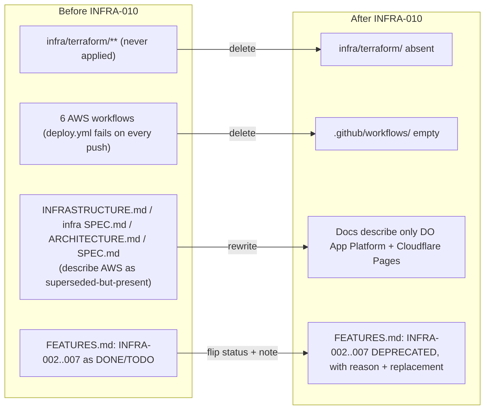

# INFRA-010 — AWS infrastructure retirement — Design

## Problem statement

The repository still versions a full Terraform project (root module, `bootstrap/`, and the `vpc`, `ecr`, `app_runner`, `static_site` child modules) and six GitHub Actions workflows that authenticate against AWS via OIDC, even though the backend now runs on DigitalOcean App Platform (INFRA-008) and both SPAs on Cloudflare Pages (INFRA-009). `deploy.yml` still fires — and fails — on every push to `develop` and `main`, and the living documentation and feature registry still describe the abandoned AWS design as current, superseded-but-present, or pending. Nothing in the system depends on AWS any more; the repository must stop claiming otherwise.

## Alternatives

| Alternative | Description | Decision |
|---|---|---|
| Archive instead of delete | Move `infra/terraform/` and the six AWS workflows into a quarantine path (e.g. `infra/terraform-archive/`, `.github/workflows/_disabled/`) and disable their triggers, keeping the files versioned for reference. | Not chosen — R001 and R003 require the Terraform tree and the AWS workflow definitions to not be present at all, not merely relocated or disabled; git history already preserves every line for reference (`git show <sha>:infra/terraform/main.tf`), so an in-repo archive is redundant and would still fail NF001's full-text sweep, which does not exempt a renamed path. |
| Disable triggers only, defer full deletion | Remove or gate the `on: push` trigger in `deploy.yml` so merges stop failing, but leave the Terraform tree, `deploy-manual.yml`, and `rollback.yml` versioned "for later". | Not chosen — it only satisfies R002 (no run on push). R001 (Terraform tree must not be present), R003 (no reachable AWS deploy path, including manually dispatched workflows) and R009 (AWS configuration values removed together with the infrastructure they addressed) remain unmet, and the analysis explicitly treats INFRA-008/INFRA-009 as already `DONE` dependencies with no reason to keep a partial AWS path reachable. It also produces an open-ended "finish later" state the requirements do not ask for. |
| Full deletion + documentation realignment in one pass | Delete `infra/terraform/` and all six AWS-authenticating workflows outright; in the same change, rewrite the living documentation sections that described the AWS design as removed-rather-than-annotated, and flip the six AWS feature entries in `FEATURES.md` to `DEPRECATED` with their reason and, where applicable, replacement feature recorded. | **Chosen** — this is the only alternative that satisfies R001, R002, R003 and R009 literally (nothing left to search for, nothing left to trigger), while R004–R008, NF001 and NF002 are documentation/registry edits that have no meaningful smaller unit — either a section describes the current topology or it doesn't. |

## Chosen solution

**Full deletion + documentation realignment in one pass**

This solution satisfies every functional requirement directly: R001 (Terraform tree absent), R002 and R003 (no workflow — automatic or manually dispatched — left that can authenticate against AWS), R009 (the Terraform variable set and the workflow-level AWS secrets/variables disappear together with the files that declared them), R004–R006 (the three living docs describe only the DigitalOcean App Platform + Cloudflare Pages topology), R007–R008 (the six AWS feature entries become `DEPRECATED` with the reason and, where the need persists, the replacing feature), and R010 (the SES-related `.do/app.yaml` values and `apps/services` SES adapter are left untouched, since AWS SES is not part of the infrastructure being retired). EC001–EC004 are addressed as explicit steps below (state-less deletion, `DONE`→`DEPRECATED` disambiguation, requirement-preservation notes, and the deliberately retained SES dependency).

No app under `apps/` is touched by this feature (`BACKEND.md`/`FRONTEND.md` conventions do not apply — the scope is Terraform files, workflow YAML, and living documentation/registry Markdown). The module state check against `duck-spec/modules/infra/SPEC.md` confirmed that INFRA-002/003/004 are documented as "never applied" and INFRA-008/009 are the operative topology, which is the assumption EC001 asks the design to rely on rather than re-verify against the AWS account.

One design decision goes beyond the literal wording of R004–R006: NF001's full-text sweep is scoped to **all** of `duck-spec/docs/*.md` and `duck-spec/modules/*/SPEC.md`, not only the three documents R004–R006 name. A repository-wide search surfaced two non-SES AWS references inside `duck-spec/modules/services/SPEC.md` ("App Runner health-check path", "structured for deployment on AWS App Runner") that fall inside NF001's checked surface. These are fixed as part of this design even though no R-ID names `services/SPEC.md` explicitly, because leaving them would fail NF001. Conversely, references found in `FEATURES.md` files (any module) and in past feature artifacts (`infra-002-aws-base-infrastructure/*.md`, `infra-003-static-hosting-s3-cloudfront/*.md`, `infra-004-ci-cd-pipeline/*.md`, `notifications/FEATURES.md`, `services/FEATURES.md`) are left untouched: NF001 does not check `FEATURES.md`, and those historical feature artifacts are out of scope — analysis.md's technical constraints only require the six AWS entries inside `duck-spec/modules/infra/FEATURES.md` to be marked `DEPRECATED`, never deleted or rewritten, and never mention touching the artifacts of already-`DONE`/`TODO` sibling features.

GitHub Environment-level secrets and variables (`AWS_OIDC_ROLE_ARN`, `AWS_REGION`, `ECR_REPOSITORY_URL`, `WEB_S3_BUCKET`, `LANDING_S3_BUCKET`, `WEB_CLOUDFRONT_DISTRIBUTION_ID`, `LANDING_CLOUDFRONT_DISTRIBUTION_ID`) live in GitHub's own environment configuration, not in a versioned file — deleting the six workflow files removes every repository-tracked reference to them (satisfying R009 and NF001, both scoped to the repository), but does not by itself delete the values from GitHub's environment settings. That follow-up is an operational, non-repository action, consistent with the technical constraint "the change is confined to the repository" — it is called out here rather than silently dropped.

## Technical design

### 1. Terraform tree removal (R001, EC001)

Delete `infra/terraform/` in full — root module, `bootstrap/`, and the four child modules. No `terraform destroy`, no state migration: `bootstrap/` (the S3 backend + DynamoDB lock table) was never applied, so there is no remote state to reconcile. Deleting the directory leaves `infra/` empty; git does not track empty directories, so no further action is needed to make the path disappear from the tree.

### 2. AWS workflow removal (R002, R003, R009)

Delete all six files under `.github/workflows/`: `deploy.yml` (push-triggered), `deploy-manual.yml` and `rollback.yml` (`workflow_dispatch`-triggered), and the three reusable `_deploy-services.yml`, `_deploy-web.yml`, `_deploy-landing.yml`. This removes every trigger — push and manual — capable of reaching an AWS authentication step, and removes every repository-tracked reference to the AWS secrets/variables named in R009 (they were declared as `secrets:`/`vars:` consumed inline in these files; deleting the files deletes the references). `.github/workflows/` is left empty (no replacement workflow is introduced — INFRA-012 is forward-linked, not part of this feature).

### 3. Living documentation realignment (R004, R005, R006, NF001)

`duck-spec/docs/INFRASTRUCTURE.md`:
- Remove the `## AWS resources`, `## Terraform`, and `## CI/CD` sections in full (they describe only the AWS design; there is no non-AWS CI/CD to keep, since INFRA-012 has not been built yet).
- Reword the document's opening line, which currently reads "Living document describing AWS resources, Terraform setup, and CI/CD pipeline for duck-stack," to describe the two topologies actually documented (DigitalOcean App Platform, Cloudflare Pages) instead.
- Keep `## DigitalOcean App Platform`, `## Cloudflare Pages`, and `## Not managed here` unchanged.

`duck-spec/docs/ARCHITECTURE.md`:
- In the `## Services` table, the `apps/services` row currently reads "Backend API. Containerised; deployed to AWS App Runner via ECR." — replace with a description naming DigitalOcean App Platform (INFRA-008), consistent with the `apps/web`/`apps/landing` rows that already cite Cloudflare Pages (INFRA-009).
- In `## Inter-service communication`, drop the trailing clause "not the previously planned App Runner URL" from the sentence describing `VITE_API_URL` in production — once the AWS design is gone, the comparative reference has nothing to contrast against.
- The `AWS SES v2` row in `## External integrations` is left unchanged — SES is explicitly out of scope (NOTIFICATIONS-002) and excepted by NF001.

`duck-spec/docs/SPEC.md`:
- In the `## infra` entry's status paragraph, remove the sentence "The AWS/Terraform compute and static-hosting design (INFRA-002/003) is superseded and pending removal (INFRA-010)." Since this feature is what performs that removal, the sentence becomes false by construction; no replacement sentence is needed (the preceding sentences already state the current DigitalOcean/Cloudflare topology in full).

`duck-spec/modules/infra/SPEC.md`:
- Delete the `## AWS Base Infrastructure (INFRA-002)` section (and its `### Directory structure`, `### Remote backend`, `### VPC`, `### ECR`, `### App Runner`, `### Resource tagging`, `### Root outputs` subsections) in full — per EC002, describing withdrawn infrastructure as if it were still built-but-superseded is exactly what must stop.
- Delete the `## Static Hosting — S3 + CloudFront (INFRA-003)` section (and its subsections) in full, for the same reason.
- Delete the `## CI/CD Pipeline — GitHub Actions (INFRA-004)` section (and its subsections) in full.
- In the `## Backend Deployment — DigitalOcean App Platform (INFRA-008)` section's `### What is out of scope here` paragraph, drop the sentence "The Terraform project and the AWS GitHub Actions workflows described under INFRA-002/INFRA-004 above still exist in the repository; their removal is a separate, not-yet-done feature (INFRA-010)." — it references sections that no longer exist and a removal that is now done.
- In the `## Static Hosting — Cloudflare Pages (INFRA-009)` section's `### What is out of scope here` paragraph, drop the clause "removal of the S3/CloudFront Terraform (INFRA-010)" from the out-of-scope list, for the same reason.

`duck-spec/modules/services/SPEC.md` (collateral fix required by NF001's blanket sweep over every `modules/*/SPEC.md`, not named by an R-ID):
- `### Health module`: reword "...satisfies the App Runner health-check path." to name the platform that actually consumes `/health` today (DigitalOcean App Platform, INFRA-008) instead of App Runner.
- `### Container image`: reword "The image is structured for deployment on AWS App Runner: binds to `0.0.0.0:3000` and exposes `/health` as the health-check path." to drop the AWS App Runner reference while keeping the factual bind/health-check description, optionally citing DigitalOcean App Platform (INFRA-008) as the actual deploy target.

### 4. Feature registry deprecation (R007, R008, NF002, EC002, EC003)

In `duck-spec/modules/infra/FEATURES.md`, for each of the six entries, change `**Estado:** DONE`/`**Estado:** TODO` to `**Estado:** DEPRECATED` and append a short "### Deprecación" (or equivalent) note inside the entry body — never delete the entry, never delete its original content (NF002, technical constraint):

- **INFRA-002** (`DONE` → `DEPRECATED`): note states the VPC/ECR/App Runner design was fully defined in Terraform but never applied and never operated — no AWS resource ever existed — so this deprecation withdraws unused infrastructure-as-code, not running infrastructure (EC002). Superseded by INFRA-008.
- **INFRA-003** (`DONE` → `DEPRECATED`): same "defined, never applied, never operated" statement, scoped to the S3+CloudFront design. Superseded by INFRA-009.
- **INFRA-004** (`DONE` → `DEPRECATED`): the CI/CD pipeline definitions existed and ran (unlike 002/003, this one *did* execute, against no live AWS resources, and always failed after the compute/hosting layers moved away from AWS) but deploy automation itself is withdrawn; no replacement automatic pipeline exists yet (INFRA-012, forward-linked).
- **INFRA-005** (`TODO` → `DEPRECATED`): note states the SES Terraform design is abandoned along with the rest of the AWS footprint; the underlying need (email delivery) is not abandoned and is now carried by **NOTIFICATIONS-002** (EC003).
- **INFRA-006** (`TODO` → `DEPRECATED`): SES delivery observability Terraform design abandoned; the underlying need (delivery observability/alerting) is now carried by **INFRA-011** (EC003).
- **INFRA-007** (`TODO` → `DEPRECATED`): generic alerting-channel Terraform design abandoned; the underlying need is now carried by **INFRA-011** (EC003).

### 5. Retained AWS-adjacent configuration (R010, EC004 — explicitly no change)

No file under `apps/` or `packages/` changes. `.do/app.yaml` keeps `SES_REGION` and `EMAIL_SENDER_ADDRESS` exactly as declared (already annotated inline as an inert, decommissioned-AWS placeholder pending NOTIFICATIONS-002). `apps/services`'s `@aws-sdk/client-sesv2` dependency and `sesEmailNotifier.ts` are untouched, so `pnpm build` keeps succeeding and the deployed container keeps starting.

## Files

| Path | Action | Description |
|---|---|---|
| `infra/terraform/main.tf` | DELETE | Root module |
| `infra/terraform/variables.tf` | DELETE | Root module |
| `infra/terraform/outputs.tf` | DELETE | Root module |
| `infra/terraform/terraform.tfvars.example` | DELETE | Root module example values |
| `infra/terraform/bootstrap/main.tf` | DELETE | Remote-state bootstrap (never applied) |
| `infra/terraform/bootstrap/variables.tf` | DELETE | Remote-state bootstrap |
| `infra/terraform/bootstrap/outputs.tf` | DELETE | Remote-state bootstrap |
| `infra/terraform/modules/vpc/main.tf` | DELETE | VPC child module |
| `infra/terraform/modules/vpc/variables.tf` | DELETE | VPC child module |
| `infra/terraform/modules/vpc/outputs.tf` | DELETE | VPC child module |
| `infra/terraform/modules/ecr/main.tf` | DELETE | ECR child module |
| `infra/terraform/modules/ecr/variables.tf` | DELETE | ECR child module |
| `infra/terraform/modules/ecr/outputs.tf` | DELETE | ECR child module |
| `infra/terraform/modules/app_runner/main.tf` | DELETE | App Runner child module |
| `infra/terraform/modules/app_runner/variables.tf` | DELETE | App Runner child module |
| `infra/terraform/modules/app_runner/outputs.tf` | DELETE | App Runner child module |
| `infra/terraform/modules/static_site/main.tf` | DELETE | S3+CloudFront child module |
| `infra/terraform/modules/static_site/variables.tf` | DELETE | S3+CloudFront child module |
| `infra/terraform/modules/static_site/outputs.tf` | DELETE | S3+CloudFront child module |
| `.github/workflows/deploy.yml` | DELETE | Push-triggered AWS deploy orchestrator |
| `.github/workflows/deploy-manual.yml` | DELETE | `workflow_dispatch` AWS deploy |
| `.github/workflows/rollback.yml` | DELETE | `workflow_dispatch` AWS rollback |
| `.github/workflows/_deploy-services.yml` | DELETE | Reusable AWS deploy for `services` (ECR + App Runner) |
| `.github/workflows/_deploy-web.yml` | DELETE | Reusable AWS deploy for `web` (S3 + CloudFront) |
| `.github/workflows/_deploy-landing.yml` | DELETE | Reusable AWS deploy for `landing` (S3 + CloudFront) |
| `duck-spec/docs/INFRASTRUCTURE.md` | MODIFY | Remove `AWS resources`, `Terraform`, `CI/CD` sections; reword intro line |
| `duck-spec/docs/ARCHITECTURE.md` | MODIFY | Fix `apps/services` row and drop the App Runner comparative clause |
| `duck-spec/docs/SPEC.md` | MODIFY | Drop the "superseded and pending removal (INFRA-010)" sentence from the `infra` entry |
| `duck-spec/modules/infra/SPEC.md` | MODIFY | Delete INFRA-002/003/004 sections; fix stale forward-references in INFRA-008/009 "out of scope" notes |
| `duck-spec/modules/services/SPEC.md` | MODIFY | Remove the two non-SES AWS App Runner references (NF001) |
| `duck-spec/modules/infra/FEATURES.md` | MODIFY | Set INFRA-002/003/004/005/006/007 to `DEPRECATED` with deprecation notes |
| `duck-spec/modules/infra/infra-010-retiro-aws/tests/terraform-tree-removed.test.sh` | CREATE | Acceptance test: `infra/terraform/` absent |
| `duck-spec/modules/infra/infra-010-retiro-aws/tests/aws-workflows-removed.test.sh` | CREATE | Acceptance test: no workflow file references AWS auth/services |
| `duck-spec/modules/infra/infra-010-retiro-aws/tests/retained-artifacts-unchanged.test.sh` | CREATE | Acceptance test: `.do/app.yaml` SES placeholders and `sesEmailNotifier.ts`/`@aws-sdk/client-sesv2` untouched |
| `duck-spec/modules/infra/infra-010-retiro-aws/tests/infrastructure-doc.test.sh` | CREATE | Acceptance test: `INFRASTRUCTURE.md` describes only DO/Cloudflare |
| `duck-spec/modules/infra/infra-010-retiro-aws/tests/architecture-doc.test.sh` | CREATE | Acceptance test: `ARCHITECTURE.md` names no AWS deploy target |
| `duck-spec/modules/infra/infra-010-retiro-aws/tests/spec-docs.test.sh` | CREATE | Acceptance test: global `SPEC.md`, `infra/SPEC.md`, `services/SPEC.md` describe no AWS design as built/planned/pending |
| `duck-spec/modules/infra/infra-010-retiro-aws/tests/features-deprecation.test.sh` | CREATE | Acceptance test: six FEATURES.md entries are `DEPRECATED` with required notes |
| `duck-spec/modules/infra/infra-010-retiro-aws/tests/nf001-fulltext-sweep.test.sh` | CREATE | Acceptance test: repository-wide grep for forbidden AWS terms across the NF001 surface |

## Requirement coverage

| ID | Design decision |
|---|---|
| R001 | §1 — full deletion of `infra/terraform/` (all 19 files) |
| R002 | §2 — deletion of `deploy.yml` (the only push-triggered workflow) |
| R003 | §2 — deletion of `deploy-manual.yml`, `rollback.yml`, and the three reusable `_deploy-*.yml` |
| R004 | §3 — `INFRASTRUCTURE.md`: remove AWS resources/Terraform/CI-CD sections, reword intro |
| R005 | §3 — `infra/SPEC.md`: delete INFRA-002/003/004 sections; `docs/SPEC.md`: drop pending-removal sentence |
| R006 | §3 — `ARCHITECTURE.md`: fix `apps/services` row and drop the App Runner comparative clause |
| R007 | §4 — INFRA-002/003/004 set to `DEPRECATED` with "defined, never applied, never operated" notes |
| R008 | §4 — INFRA-005/006/007 set to `DEPRECATED`, each naming its replacement feature |
| R009 | §1 + §2 — Terraform variable set and workflow-level AWS secrets/vars removed with the files that declared them |
| R010 | §5 — explicit no-change decision for `.do/app.yaml`'s `SES_REGION`/`EMAIL_SENDER_ADDRESS` |
| NF001 | §3 — collateral fix of `services/SPEC.md`; `nf001-fulltext-sweep.test.sh` verifies the full checked surface |
| NF002 | §4 — deprecation notes written inside each entry body, entries never deleted |
| EC001 | §1 — direct deletion, no `terraform destroy`/state migration; noted in INFRA-002/003 deprecation text |
| EC002 | §3 (module SPEC.md sections deleted) + §4 (explicit "defined, never applied, never operated" notes for INFRA-002/003) |
| EC003 | §4 — each deprecated pending feature names its replacement (NOTIFICATIONS-002, INFRA-011) |
| EC004 | §5 — SES dependency, adapter, and `.do/app.yaml` values explicitly left unchanged |
