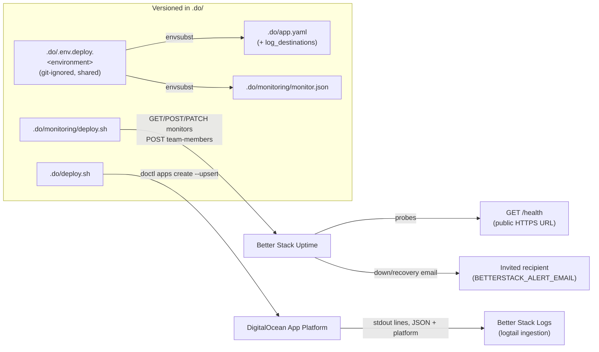

# INFRA-011 — Monitoreo de disponibilidad y agregación de logs — Design

## Problem statement

The backend already emits structured, per-request JSON logs, but they only live inside DigitalOcean App Platform's bounded console — there is no external retention or field-level search. There is also no automated watcher for outages: the only way to learn the backend is down is a user report. This feature closes both gaps without touching any application source code, using Better Stack as the single external provider for uptime checks and log aggregation, wired entirely through the existing `.do/app.yaml` + git-ignored values-file mechanism.

## Alternatives

| Alternative | Description | Decision |
|---|---|---|
| API-driven config-as-code (monitor + log destination declared and reconciled from versioned templates via scripts) | Extend `.do/app.yaml` with a `log_destinations` block for Better Stack's Logtail ingestion, and add a new `.do/monitoring/deploy.sh` that renders a versioned monitor spec and idempotently upserts the Better Stack Uptime monitor and alert recipient via Better Stack's REST API, both driven by the shared per-environment values file. | **Chosen** — satisfies R001–R008 with the monitor and log destination fully versioned in the repo, no forked spec per environment, and no token/recipient committed, mirroring the exact pattern already proven by `.do/deploy.sh` (INFRA-008). |
| Manual dashboard setup + documentation only | Configure the Better Stack Uptime monitor and Logs source by hand in the Better Stack console for each environment, capturing the steps in a runbook; only the log-forwarding token (structurally forced into `.do/app.yaml` by DigitalOcean's own spec format) stays in the repo. | Not chosen — fails R008: the uptime monitor's configuration (target, interval, recipient) would have no versioned source of truth in the repository, only a document describing steps a human followed. Nothing detects or corrects drift between the runbook and the monitor's actual live configuration, unlike the reconciling guarantee `.do/app.yaml` + `doctl apps create --upsert` already gives the app spec. |
| Terraform-managed Better Stack resources | Declare the Better Stack Uptime monitor and Logs source as Terraform resources (via a generic HTTP/community provider) and apply them with `terraform apply` per environment. | Not chosen — directly contradicts the Technical constraint carried over from INFRA-010 ("No Terraform and no AWS resources: the AWS infrastructure was retired"). Reintroducing Terraform for one external SaaS resource brings back a second IaC toolchain the project deliberately walked away from, alongside the shell-script pattern every other piece of infrastructure in this repo already uses. |

## Chosen solution

**API-driven config-as-code, mirroring `.do/deploy.sh`**

This solution satisfies R001–R004 (the probe, its classification, and downtime/recovery notification) by declaring a Better Stack Uptime "status" monitor via Better Stack's REST API from a versioned template (`.do/monitoring/monitor.json`), applied idempotently by a new `.do/monitoring/deploy.sh` — the same upsert idiom `.do/deploy.sh` already uses for `doctl apps create --upsert`. It satisfies R005–R006 by adding a `log_destinations` entry to the existing `services[0]` component of `.do/app.yaml`, using DigitalOcean App Platform's native `logtail` destination type, which is exactly Better Stack's log ingestion endpoint (Better Stack acquired and still exposes the "Logtail" ingestion protocol that DigitalOcean's App Spec supports natively) — no new deploy mechanism is needed for this half, only an addition to the file that already owns log forwarding structurally. It satisfies R007–R008 by keeping every environment-dependent and credential value (`BETTERSTACK_LOGS_TOKEN`, `BETTERSTACK_API_TOKEN`, `BETTERSTACK_ALERT_EMAIL`, `BETTERSTACK_MONITOR_URL`, `BETTERSTACK_CHECK_FREQUENCY_SECONDS`, `BETTERSTACK_CHECK_TIMEOUT_SECONDS`) as an `${VAR}` placeholder resolved from the same git-ignored `.do/.env.deploy.<environment>` file `.do/app.yaml` already uses — no second values-file scheme, no per-environment fork of any template.

No `apps/services` source file is read or modified by this design — the probe target is the already-deployed public `/health` URL, and the forwarded log lines are the already-emitted Pino JSON output. This respects the Technical constraint verbatim and keeps the design entirely inside `.do/`.

## Technical design

### Log forwarding (R005, R006, NF001, NF002)

`.do/app.yaml`'s single `services[0]` component gains:

```yaml
    log_destinations:
      - name: betterstack
        logtail:
          token: ${BETTERSTACK_LOGS_TOKEN}
```

DigitalOcean App Platform ships every line the container writes to stdout/stderr — both the backend's JSON lines and the platform's own build/deploy/lifecycle lines (EC006) — to this destination outside the request path; a destination outage does not slow or fail request handling (NF002 — a platform-level guarantee of the App Platform log pipeline, not something this design implements). Better Stack's Logs source auto-parses valid JSON lines and indexes every top-level key (`timestamp`, `level`, `message`, `requestId`, `userId`, `duration`) as an individually filterable field (R006); non-JSON platform lines remain searchable as plain text only, which is how EC006's "keep both kinds distinguishable" is satisfied — the JSON lines are structurally distinct from the platform lines the moment they reach the destination. NF001 (no secret/PII reaches the destination) is not a code change: it is guaranteed by the pre-existing Pino logging convention in `duck-spec/docs/BACKEND.md` ("Do NOT log: secrets, tokens, passwords, PII"), which this design consumes as-is; the one new obligation this design adds is a mandatory one-time manual inspection of the forwarded stream per environment, documented as a setup step.

### Availability monitoring (R001–R004, NF003)

`.do/monitoring/monitor.json` is a versioned template for a Better Stack Uptime `status` monitor:

```json
{
  "monitor_type": "status",
  "url": "${BETTERSTACK_MONITOR_URL}",
  "pronounceable_name": "duck-stack backend (${DO_APP_NAME})",
  "email": true,
  "check_frequency": ${BETTERSTACK_CHECK_FREQUENCY_SECONDS},
  "request_timeout": ${BETTERSTACK_CHECK_TIMEOUT_SECONDS}
}
```

`${BETTERSTACK_MONITOR_URL}` is the environment's public `/health` URL (the same URL `.do/deploy.sh` prints and the operator records in `.do/README.md`'s "Current deployments" table). `${DO_APP_NAME}` is reused from the same values file `.do/app.yaml` already consumes — no new "environment name" variable is introduced, and Better Stack's own down/recovery incident emails already embed the monitor's `pronounceable_name`, the checked URL, and the observed failure reason (HTTP status, timeout, or connection error) natively, which is what satisfies R003's and R004's content requirements without this design composing notification text itself. `check_frequency` (probe interval) and `request_timeout` are both configurable per environment, never hardcoded, so an operator can set them to the shortest interval the contracted Better Stack plan allows (EC002, EC003, NF003).

`.do/monitoring/deploy.sh` renders `monitor.json` with `envsubst` (same idiom as `.do/deploy.sh`) and reconciles it against the Better Stack Uptime API:

1. `load_values` — sources the given values file (`.do/.env.deploy.<environment>`, the same file used for the app spec).
2. `validate_placeholders` — fails fast, before any network call, if any of `monitor.json`'s placeholders or the two invite-only variables (`BETTERSTACK_API_TOKEN`, `BETTERSTACK_ALERT_EMAIL`) are unset.
3. `render_monitor_spec` — `envsubst` renders `monitor.json` to a temp file, cleaned up on exit.
4. `find_existing_monitor` — `GET https://uptime.betterstack.com/api/v2/monitors` with `Authorization: Bearer $BETTERSTACK_API_TOKEN` (a team-scoped token, one per environment); the response is scanned (via `python3 -m json.tool`-free stdlib `json` parsing — no extra dependency beyond `python3`, already assumed present per `.do/tests/app-spec.test.sh`) for an entry whose `attributes.url` equals `$BETTERSTACK_MONITOR_URL`.
5. `upsert_monitor` — `PATCH .../monitors/<id>` with the rendered body if found, else `POST .../monitors`; this is the same "same command, same result every time" guarantee `doctl apps create --upsert` gives the app spec.
6. `invite_recipient` — `POST https://betterstack.com/api/v2/team-members` with `{"email": "$BETTERSTACK_ALERT_EMAIL"}` using the same team-scoped token; a response indicating the address is already a member is treated as success, keeping the step idempotent. Each environment's alert recipient differs per R007 because each environment uses its own team-scoped `BETTERSTACK_API_TOKEN`, so "who receives the alert" is exactly "who is invited into that environment's team" — no on-call schedule or escalation-policy resource is created or touched, respecting the "out of scope" boundary.
7. On success, the script prints the monitor's id/URL and a reminder to perform the EC005 mandatory end-to-end delivery test (forcing a downtime/recovery notification and confirming receipt) before considering the environment monitored.

### Documentation (EC001–EC006, NF001–NF003)

`.do/monitoring/README.md` is the setup runbook (mirrors `.do/README.md`'s structure): Prerequisites (Better Stack account, one team + team-scoped API token + Logs-source ingestion token per environment), the deploy procedure (extending the same per-environment values file, then running `.do/monitoring/deploy.sh`), and an explicit, itemized section recording:

- **EC001** — `GET /health` does not check the database; the monitor will not detect a DB-only outage; documented as an accepted blind spot.
- **EC002** — the shortest interval permitted by the contracted plan is used, and the resulting maximum undetected outage window (interval × confirmation attempts) is recorded per environment.
- **EC003** — the chosen interval, its resulting monthly request count, and the query filter that excludes `/health` lines from log searches are recorded per environment.
- **EC004** — the Logs destination's ingestion quota and the no-code-change mitigation (raising `LOG_LEVEL` in that environment's values file and redeploying) are recorded.
- **EC005** — the mandatory end-to-end delivery test is a required, checked-off step before an environment is considered monitored.
- **EC006** — the default query that restricts search results to the backend's own structured JSON lines (so filtering by `requestId` returns only application log lines) is recorded.
- **NF001** — the one-time manual inspection of the forwarded stream for secret/PII values is a required setup step.
- **NF002** — the platform-level guarantee that a destination failure does not degrade `GET /health` or request handling is stated explicitly.
- **NF003** — the chosen probe interval's resulting request volume against the contracted plan's quota is recorded per environment (cross-referenced with EC003).



## Files

| Path | Action | Description |
|---|---|---|
| `.do/app.yaml` | MODIFY | Add a `log_destinations` entry to the `services[0]` component referencing `${BETTERSTACK_LOGS_TOKEN}` via DigitalOcean's native `logtail` destination type. |
| `.do/.env.deploy.example` | MODIFY | Add a new "monitoring & log forwarding (INFRA-011)" section documenting `BETTERSTACK_LOGS_TOKEN=`, `BETTERSTACK_API_TOKEN=`, `BETTERSTACK_ALERT_EMAIL=` (left empty), and `BETTERSTACK_MONITOR_URL=`, `BETTERSTACK_CHECK_FREQUENCY_SECONDS=`, `BETTERSTACK_CHECK_TIMEOUT_SECONDS=` (with safe example values). |
| `.do/monitoring/monitor.json` | CREATE | Versioned Better Stack Uptime monitor payload template (`status` monitor, `${VAR}` placeholders for URL, environment name, interval, timeout, `email: true`). |
| `.do/monitoring/deploy.sh` | CREATE | Loads the shared values file, validates placeholders, renders `monitor.json`, idempotently upserts the Uptime monitor via the Better Stack API, and invites the configured alert recipient as a team member. |
| `.do/monitoring/README.md` | CREATE | Setup runbook: prerequisites, procedure, and the documented behaviors/limits for EC001–EC006 and NF001–NF003. |
| `.do/monitoring/tests/monitor-spec.test.sh` | CREATE | Acceptance tests for `monitor.json`'s structure (monitor type, placeholders, `email: true`, environment identification in `pronounceable_name`). |
| `.do/monitoring/tests/deploy-script.test.sh` | CREATE | Acceptance tests for `deploy.sh` using a stub `curl`: fail-fast validation, idempotent create-then-update upsert, and recipient invite. |
| `.do/monitoring/tests/readme.test.sh` | CREATE | Acceptance tests asserting `.do/monitoring/README.md` documents Prerequisites, the procedure, and each of EC001–EC006 / NF001–NF003. |
| `.do/tests/app-spec.test.sh` | MODIFY | Add assertions that `services[0].log_destinations` contains an entry with `logtail.token == "${BETTERSTACK_LOGS_TOKEN}"`. |
| `.do/tests/env-example.test.sh` | MODIFY | Extend the empty-value assertion to also cover `BETTERSTACK_LOGS_TOKEN`, `BETTERSTACK_API_TOKEN`, and `BETTERSTACK_ALERT_EMAIL`. |
| `.do/README.md` | MODIFY | Add a cross-reference from the "Contents" section to `.do/monitoring/README.md`. |

## Requirement coverage

| ID | Design decision |
|---|---|
| R001 | `.do/monitoring/monitor.json` declares a `status` monitor with a configured `check_frequency`; `.do/monitoring/deploy.sh` applies it on a fixed schedule with no manual trigger once deployed, reconciled idempotently against the Better Stack Uptime API. |
| R002 | `monitor_type: status` with `request_timeout` classifies the backend down when `GET /health` fails to return a successful response within the configured timeout, and up again on the next successful probe — native Better Stack Uptime monitor semantics. |
| R003 | `email: true` plus a `pronounceable_name` that embeds `${DO_APP_NAME}` drives Better Stack's native down-incident email, which includes the checked URL and failure reason (HTTP status/timeout/connection error); `invite_recipient` ensures the configured recipient receives it. |
| R004 | The same monitor and recipient wiring; Better Stack's native recovery email (sent when the monitor returns to "up") includes the outage duration. |
| R005 | `.do/app.yaml`'s new `log_destinations` / `logtail` entry forwards every stdout line from DigitalOcean App Platform to Better Stack Logs, which owns its own retention independent of the platform. |
| R006 | Better Stack Logs auto-parses the backend's JSON lines, indexing `timestamp`, `level`, `message`, `requestId`, `userId`, `duration` as individually filterable fields. |
| R007 | Every environment-dependent value (`BETTERSTACK_LOGS_TOKEN`, `BETTERSTACK_API_TOKEN`, `BETTERSTACK_ALERT_EMAIL`, `BETTERSTACK_MONITOR_URL`, interval, timeout) is a placeholder resolved from the same shared `.do/.env.deploy.<environment>` file — one template (`app.yaml` + `monitor.json`) serves every environment, no fork. |
| R008 | `monitor.json` and the `log_destinations` block in `app.yaml` are both versioned templates with `${VAR}` placeholders; `.do/.env.deploy.example` documents every placeholder with sensitive ones left empty, resolved only from the git-ignored per-environment values file. |
| NF001 | Log content is governed by the pre-existing `duck-spec/docs/BACKEND.md` logging convention (no code change); `.do/monitoring/README.md` mandates a one-time manual inspection of the forwarded stream per environment. |
| NF002 | DigitalOcean App Platform's `log_destinations` mechanism ships logs outside the request path — a platform-level guarantee stated explicitly in `.do/monitoring/README.md`, not implemented by this design. |
| NF003 | `check_frequency` and `request_timeout` are configurable per environment (never hardcoded), letting the operator pick the shortest interval the contracted plan allows; `.do/monitoring/README.md` records the resulting monthly request count per environment. |
| EC001 | `.do/monitoring/README.md` states the shallow-health-check blind spot explicitly. |
| EC002 | `.do/monitoring/README.md` records the maximum undetected outage window (interval × confirmation attempts) per environment. |
| EC003 | `.do/monitoring/README.md` records the chosen interval, its resulting monthly request count, and the `/health`-excluding log query filter. |
| EC004 | `.do/monitoring/README.md` records the Logs destination's ingestion quota and the `LOG_LEVEL`-based mitigation via the existing env var. |
| EC005 | `.do/monitoring/deploy.sh` prints a reminder, and `.do/monitoring/README.md` makes the end-to-end delivery test a mandatory, checked-off setup step. |
| EC006 | `.do/monitoring/README.md` documents the default query restricting results to the backend's structured JSON lines. |
