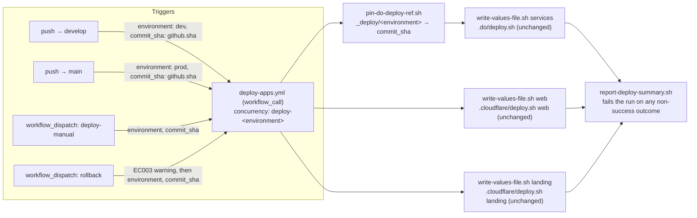

# INFRA-012 — CI/CD sobre DigitalOcean y Cloudflare — Design

## Problem statement

Since INFRA-010 retired the AWS stack, duck-stack has no deploy automation: `services` is delivered by hand with `.do/deploy.sh <values-file>` and each SPA by hand with `.cloudflare/deploy.sh <web|landing> <values-file>`, and nothing deploys on merge (`deploy_on_push: false`, no Cloudflare Git integration). With the environment-variable/secret/build-step inventory now complete and stable (LANDING-003), the pipeline can be built once: automate the deploy of the three apps per branch, plus a manual "deploy this commit" flow and a manual rollback flow.

## Alternatives

| Alternative | Description | Decision |
|---|---|---|
| GitHub Actions native workflows + GitHub Environments as the single config source + a per-environment moving deploy-ref branch to pin DigitalOcean's branch-based source to an exact commit | Reusable `workflow_call` workflow invokes the *unchanged* `.do/deploy.sh` / `.cloudflare/deploy.sh` entry points; every environment-dependent value/credential is a GitHub Environment `vars`/`secrets` entry resolved by the job's `environment: ${{ inputs.environment }}`; DigitalOcean's `github.branch` placeholder is pointed at a dedicated `_deploy/<environment>` branch that CI force-updates to the target commit before every DO deploy. | **Chosen** — see justification below. |
| Marketplace deploy actions (`digitalocean/app_action/deploy`, `cloudflare/pages-action`) replacing the shell scripts as the invoked deploy mechanism | Each app's deploy step calls a dedicated GitHub Action instead of `.do/deploy.sh` / `.cloudflare/deploy.sh`. | Not chosen — `digitalocean/app_action/deploy` performs its own env-var substitution and its own `doctl`-equivalent API calls internally; it does not call `.do/deploy.sh`, so using it would duplicate rather than reuse the versioned entry point and break the constraint that "a manual local deploy and a pipeline deploy stay equivalent." It also does not solve the commit-pinning problem any differently — App Platform's `github` source still only accepts a `branch`, not a commit SHA, whichever tool renders the spec. |
| Immutable per-deploy git tag (`deploy-<environment>-<run_id>`) instead of a moving branch, referenced by `.do/app.yaml`'s `branch` placeholder | Each deploy creates a brand-new, uniquely named tag at the target commit and points DigitalOcean's `github.branch` at that tag name instead of a shared branch. | Not chosen — DigitalOcean's App Spec `github` source is documented as accepting a **branch** for repository-based sources; pointing it at a tag name relies on undocumented/unverified platform behavior with a real risk that App Platform's branch-listing/webhook resolution silently fails to find it. It also leaves an unbounded, ever-growing number of tags in the repository with no pruning mechanism (out of scope), whereas a moving branch keeps a fixed, bounded footprint of exactly two refs (`_deploy/dev`, `_deploy/prod`) for the life of the project. |

## Chosen solution

**GitHub Actions native workflows, GitHub Environments as the single per-environment source, moving deploy-ref branches for DigitalOcean commit pinning**

This is the only alternative that satisfies the two hardest technical constraints simultaneously: it never rewrites `.do/deploy.sh` or `.cloudflare/deploy.sh` (R003's "using the same steps an automatic run uses" is trivially true because every trigger — automatic or manual — funnels through one reusable workflow that calls those two scripts unmodified), and it resolves the "main open technical question" (pinning App Platform's branch-based source to an exact commit) with a mechanism verified against DigitalOcean's own documentation: the App Spec `github` source only supports `branch` + `deploy_on_push`, never a commit SHA, so the pipeline must make a branch *be* the exact commit rather than ask App Platform to resolve one. A per-environment branch (`_deploy/dev`, `_deploy/prod`) that CI force-updates immediately before each DO deploy does exactly that, without touching `app.yaml`'s structure, `envsubst`, `doctl --upsert`, or the `${PORT}`-shared health-check wiring (R001–R004).

GitHub Environments (`dev`, `prod`) satisfy R008 and the Technical constraint "one per-environment source that feeds all three app deploys": each Environment's `vars` (non-secret) and `secrets` (secret) entries are the single versioned-adjacent source — mirroring the existing `type: general`/`type: secret` split already encoded in `.do/app.yaml` — and the same reusable workflow definition serves both `dev` and `prod` by setting the calling job's `environment:` to the input value, with no `if environment == 'prod'` branching anywhere in the workflow body. This satisfies NF001: no token, connection string, or key is ever written to a repository file; every credential is read at run time from GitHub's encrypted per-environment secret storage, the direct CI-provider analogue of the existing git-ignored `.do/.env.deploy.<environment>` / `.cloudflare/.env.deploy.<app>.<environment>` files (which remain untouched, for local/manual use).

Native `concurrency:` groups (one per environment, shared by all four entry-point workflows) satisfy R007 and EC004 without inventing any locking mechanism. A single job with three `continue-on-error` steps (one per app) followed by an unconditional reporting step satisfies R006, NF002 and EC001 — the run only turns green when every app step succeeded, and the reporting step always states, per app, whether it published and at which commit, however the run ends.

## Technical design

### Repository layout

```
.github/
├── workflows/
│   ├── deploy-apps.yml     # reusable (workflow_call): the only place that deploys anything
│   ├── deploy-dev.yml      # push → develop  (R001)
│   ├── deploy-prod.yml     # push → main     (R002)
│   ├── deploy-manual.yml   # workflow_dispatch: commit + environment (R003)
│   └── rollback.yml        # workflow_dispatch: commit + environment, adds the EC003 warning (R004)
├── scripts/
│   ├── pin-do-deploy-ref.sh      # force-updates _deploy/<environment> to the target commit
│   ├── write-values-file.sh      # materializes a values file for services|web|landing from the job's env
│   └── report-deploy-summary.sh  # prints the per-app status/commit/URL table; exit 1 on any failure
├── tests/
│   ├── trigger-workflows.test.sh
│   ├── deploy-apps-workflow.test.sh
│   ├── pin-deploy-ref-script.test.sh
│   ├── write-values-file-script.test.sh
│   ├── report-deploy-summary-script.test.sh
│   └── readme.test.sh
└── README.md
```

### Per-environment configuration source (R008, NF001, Technical constraint)

Two GitHub Environments, `dev` and `prod`, each hold every value the three deploys need, split exactly like `.do/app.yaml` already splits them:

- **Variables (`vars.*`, non-secret):** `DO_APP_NAME`, `NODE_ENV`, `LOG_LEVEL`, `HOST`, `PORT`, `CORS_ORIGIN`, `EMAIL_SENDER_ADDRESS`, `BILLING_PROVIDER`, `MOBBEX_TEST_MODE`, `MOBBEX_TIMEOUT_MS`, `ERROR_TRACKING_SAMPLE_RATE`, `SIGNUP_MODE`, `FREE_TRIAL_DAYS`, `STRICT_ENTITLEMENTS_ON_PAST_DUE`, `GIT_BRANCH` (the Cloudflare classification label only — `develop` for `dev`, `main` for `prod`), `VITE_API_URL`, `VITE_CLERK_PUBLISHABLE_KEY`, `VITE_LANDING_URL`, `VITE_PROVIDER_PORTAL_URL`, `VITE_WEB_URL`, `VITE_ENVIRONMENT`, `VITE_POSTHOG_KEY`, `VITE_POSTHOG_HOST`, `VITE_ERROR_TRACKING_DSN`, `SENTRY_ORG`, `SENTRY_PROJECT`, `SENTRY_URL`.
- **Secrets (`secrets.*`):** `DIGITALOCEAN_ACCESS_TOKEN`, `DATABASE_URL`, `CLERK_SECRET_KEY`, `CLERK_JWT_KEY`, `CLERK_WEBHOOK_SIGNING_SECRET`, `RESEND_API_KEY`, `MOBBEX_API_KEY`, `MOBBEX_ACCESS_TOKEN`, `MOBBEX_WEBHOOK_SECRET`, `ERROR_TRACKING_DSN`, `BETTERSTACK_LOGS_TOKEN`, `CLOUDFLARE_ACCOUNT_ID`, `CLOUDFLARE_API_TOKEN`, `SENTRY_AUTH_TOKEN`.

`CLOUDFLARE_PROJECT_NAME` is intentionally **not** an Environment value: one Cloudflare Pages project already covers every environment per app (INFRA-009), so it is left unset and `.cloudflare/deploy.sh`'s own default (`duck-stack-$APP`) applies uniformly — no per-environment fork, per the Technical constraint. `GITHUB_REPO` is not stored either; it is computed from `${{ github.repository }}`. `SERVICE_VERSION` and `VITE_RELEASE` are not stored; both are set to the exact commit SHA being deployed at run time (R005, EC002), never a stored value. This is documented in `.github/README.md` as the authoritative list an operator populates once per environment, cross-referenced from `.do/README.md` and `.cloudflare/README.md` (EC005 already documents that any new placeholder must be added to `app.yaml`/the values contract *and* to the environment's CI configuration — this design is the CI configuration EC005 refers to).

### Reusable deploy workflow (`deploy-apps.yml`) — R001–R006, R008, NF002, EC001, EC002, EC006

```yaml
on:
  workflow_call:
    inputs:
      environment: { required: true, type: string }   # "dev" | "prod"
      commit_sha:  { required: true, type: string }
permissions:
  contents: write   # needed to force-update the _deploy/<environment> ref
jobs:
  deploy:
    runs-on: ubuntu-latest
    environment: ${{ inputs.environment }}   # scopes vars.*/secrets.* to dev or prod — no branching
    steps:
      - uses: actions/checkout@v5
        with: { ref: ${{ inputs.commit_sha }}, fetch-depth: 0 }
      - run: echo "environment=${{ inputs.environment }} commit=${{ inputs.commit_sha }}"
      - uses: pnpm/action-setup@v4
      - uses: actions/setup-node@v4
        with: { node-version-file: .nvmrc, cache: pnpm }
      - uses: digitalocean/action-doctl@v2   # pinned action; installs + `doctl auth init`s a pinned doctl
        with: { token: ${{ secrets.DIGITALOCEAN_ACCESS_TOKEN }} }

      - name: Deploy services
        id: deploy_services
        continue-on-error: true
        env: { <every services var/secret above>, GITHUB_REPO: ${{ github.repository }}, SERVICE_VERSION: ${{ inputs.commit_sha }} }
        run: |
          GIT_BRANCH="$(.github/scripts/pin-do-deploy-ref.sh "${{ inputs.environment }}" "${{ inputs.commit_sha }}")"
          export GIT_BRANCH
          .github/scripts/write-values-file.sh services /tmp/do-values.env
          .do/deploy.sh /tmp/do-values.env | tee /tmp/do-output.log

      - name: Deploy web
        id: deploy_web
        continue-on-error: true
        env: { <every web var/secret above>, VITE_RELEASE: ${{ inputs.commit_sha }} }
        run: |
          .github/scripts/write-values-file.sh web /tmp/web-values.env
          .cloudflare/deploy.sh web /tmp/web-values.env | tee /tmp/web-output.log

      - name: Deploy landing
        id: deploy_landing
        continue-on-error: true
        env: { <every landing var/secret above>, VITE_RELEASE: ${{ inputs.commit_sha }} }
        run: |
          .github/scripts/write-values-file.sh landing /tmp/landing-values.env
          .cloudflare/deploy.sh landing /tmp/landing-values.env | tee /tmp/landing-output.log

      - name: Report deploy summary
        if: always()
        run: |
          .github/scripts/report-deploy-summary.sh "${{ inputs.environment }}" "${{ inputs.commit_sha }}" \
            "${{ steps.deploy_services.outcome }}" /tmp/do-output.log \
            "${{ steps.deploy_web.outcome }}" /tmp/web-output.log \
            "${{ steps.deploy_landing.outcome }}" /tmp/landing-output.log
```

Three steps, `continue-on-error: true`, then one unconditional (`if: always()`) reporting step is the mechanism that satisfies NF002 and EC001: every app is attempted regardless of an earlier failure, so a partial delivery is never masked by an early `set -e`-style abort of the job, and the final step is the single place that (a) prints, per app, published/not-published + commit + the public URL parsed from that app's captured output (R006) and (b) `exit 1`s the whole job (hence the whole run) if any of the three `outcome`s is not `success` — a partial delivery can never be reported as a success. Steps run **sequentially in one job** (not three parallel jobs), so the job — and therefore the run's conclusion — cannot resolve until all three have reached a terminal state; `services` already blocks on `doctl apps create --upsert --wait` until the platform finishes, so even though the two SPA deploys are typically much faster, the run's completion is never reported before the backend's deployment does (EC006).

`digitalocean/action-doctl@v2` only installs and authenticates a pinned `doctl` release — it performs no deploy action itself — so `.do/deploy.sh` remains the sole component that renders the spec and calls `doctl apps create --spec … --upsert --wait`, per the Technical constraint. `wrangler` needs no separate provisioning step: `.cloudflare/deploy.sh`'s own `build_app()` already runs `pnpm install --frozen-lockfile` from the repo root, which resolves the pinned root `devDependency`, and `resolve_wrangler_cmd()` already falls back to `pnpm exec wrangler`.

### Pinning DigitalOcean's branch-based source to an exact commit (`pin-do-deploy-ref.sh`) — R001–R004, Technical constraint

```
Usage: .github/scripts/pin-do-deploy-ref.sh <environment> <commit_sha>
```

Force-pushes `<commit_sha>` to `refs/heads/_deploy/<environment>` on `origin` (creating the ref on its first use) and prints `_deploy/<environment>` on stdout. Because DigitalOcean's App Spec `github` source only accepts a branch name (verified: it has no commit-SHA field), every one of the four trigger flows — including R001/R002's automatic path — calls this script with the exact commit being delivered (`github.sha` for the automatic flows, `inputs.commit_sha` for the manual/rollback flows) immediately before invoking `.do/deploy.sh`, and only then sets `GIT_BRANCH` (the `.do/app.yaml` placeholder, distinct from Cloudflare's classification-only `GIT_BRANCH`) to that ref name. This makes R003 literally true — the automatic and manual flows execute the identical sequence (pin ref → write values → `.do/deploy.sh`) — and makes an automatic deploy immune to a second commit landing on `develop`/`main` between the merge and DigitalOcean's fetch, which a plain `branch: develop` reconcile would not be. The repository's DigitalOcean GitHub App install already has access to every branch of this repository (existing `.do/README.md` prerequisite), so no extra provider-side authorization is needed for the new refs; `.github/README.md` records the operational note that no branch-protection rule may match `_deploy/*` (or must explicitly allow the workflow's token to force-push it).

### Materializing values files without duplicating the variable manifest (`write-values-file.sh`) — R008

```
Usage: .github/scripts/write-values-file.sh <services|web|landing> <output-path>
```

For `services`, the script reuses the exact discovery technique `.do/deploy.sh`'s own `validate_placeholders()` already uses — `grep -oE '\$\{[A-Z0-9_]+\}' .do/app.yaml | sed …` — to enumerate every placeholder `app.yaml` currently declares, and for each one writes `NAME=<value of the same-named shell variable>` (already populated in the step's environment from `vars.*`/`secrets.*` by the workflow's `env:` block) to `<output-path>`. This means the pipeline never hand-maintains a second, driftable copy of the 27-placeholder list: if a future feature adds a placeholder to `app.yaml`, this script picks it up automatically, and the only remaining step is what EC005 already documents — add it to the environment's CI configuration too. For `web`/`landing`, there is no single template file to grep (`.cloudflare/deploy.sh`'s `validate_required_vars()` already hardcodes each app's required-variable names inline in bash), so the script hardcodes the same small, already-documented manifests: `CLOUDFLARE_ACCOUNT_ID`, `CLOUDFLARE_API_TOKEN`, `GIT_BRANCH` (common) + `VITE_API_URL`, `VITE_CLERK_PUBLISHABLE_KEY`, `VITE_LANDING_URL`, `VITE_PROVIDER_PORTAL_URL` (web) / `VITE_API_URL`, `VITE_WEB_URL` (landing) + the shared optional set `VITE_ERROR_TRACKING_DSN`, `VITE_RELEASE`, `VITE_ENVIRONMENT`, `SENTRY_AUTH_TOKEN`, `SENTRY_ORG`, `SENTRY_PROJECT`, `SENTRY_URL`, `VITE_POSTHOG_KEY`, `VITE_POSTHOG_HOST` — the same groups `.cloudflare/README.md` already documents. An unset optional variable is written as an empty value, which is exactly the behavior a hand-filled local values file already produces, so `.cloudflare/deploy.sh`'s existing validation is unaffected.

### Release identifier / source-map alignment (R005, EC002)

`SERVICE_VERSION` (backend) and `VITE_RELEASE` (both SPAs) are always set to `${{ inputs.commit_sha }}` — the exact commit being delivered — never a stored Environment value, so the release identifier the running SPA reports and the one `@sentry/vite-plugin` uploads source maps under are structurally the same value by construction (R005). `apps/landing/vite.config.ts` gains the same `errorHandler` override `apps/web/vite.config.ts` already has, so a failed source-map upload rethrows instead of being logged and swallowed, failing `vite build` and — under `.cloudflare/deploy.sh`'s `set -euo pipefail` — aborting before `wrangler pages deploy` runs. This closes the asymmetry EC002 calls out; `landing`'s build now fails exactly like `web`'s already does.

### Concurrency serialization (R007, EC004)

Each of the four entry-point workflows sets, on the job that calls `deploy-apps.yml` (a supported keyword for a job that calls a reusable workflow):

```yaml
concurrency:
  group: deploy-${{ <environment: "dev" | "prod" | inputs.environment> }}
  cancel-in-progress: false
```

`cancel-in-progress: false` means a run in progress is never cancelled by a newer one; GitHub Actions' default (no `queue: max`) behavior for a concurrency group holds the newest pending run and runs it after the current one finishes, satisfying R007 ("hold... execute it in full, instead of cancelling either of them") for the documented pairwise case and EC004 (two merges landing in quick succession: the first runs, the second waits and then runs, and it is the second — the one queued last — whose commit the environment ends up serving). The group name depends only on `environment`, identical across all four workflows, so a push-triggered `dev` deploy and a manually-triggered `dev` deploy queue against each other too.

### Rollback flow and its data-caveat warning (R004, EC003)

`rollback.yml` (`workflow_dispatch`, inputs `environment`, `commit_sha`) runs one unconditional step *before* calling `deploy-apps.yml`:

```
::warning::Rolling back services to <commit_sha> only reverts application code.
Already-applied data changes are NOT reverted. Verify this version's compatibility
with the current database state before confirming the rollback as complete.
```

then calls the same reusable workflow with the same inputs `deploy-manual.yml` uses — the deploy mechanics are identical; only this entry point's framing and its extra warning step differ, keeping R003's "same steps an automatic run uses" true for R004 as well. `.github/README.md` records the identical caveat in prose (EC003's documentation requirement), next to the recovery procedure EC001 requires (re-run the manual deploy flow with the same commit, or the rollback flow with the previous one — no automatic compensation).



## Files

| Path | Action | Description |
|---|---|---|
| `.github/workflows/deploy-apps.yml` | CREATE | Reusable (`workflow_call`) workflow: checkout at `commit_sha`, resolve config via `environment: ${{ inputs.environment }}`, pin the DO deploy ref, run the three unchanged deploy scripts as independent `continue-on-error` steps, then report/fail per NF002. |
| `.github/workflows/deploy-dev.yml` | CREATE | `on: push: branches: [develop]`; concurrency group `deploy-dev`; calls `deploy-apps.yml` with `environment: dev`, `commit_sha: ${{ github.sha }}` (R001). |
| `.github/workflows/deploy-prod.yml` | CREATE | `on: push: branches: [main]`; concurrency group `deploy-prod`; calls `deploy-apps.yml` with `environment: prod`, `commit_sha: ${{ github.sha }}` (R002). |
| `.github/workflows/deploy-manual.yml` | CREATE | `on: workflow_dispatch` with `environment` (choice: dev, prod) and `commit_sha` (string) inputs; concurrency group `deploy-${{ inputs.environment }}`; calls `deploy-apps.yml` (R003). |
| `.github/workflows/rollback.yml` | CREATE | Same inputs/concurrency as `deploy-manual.yml`, plus an unconditional EC003 warning step before calling `deploy-apps.yml` (R004). |
| `.github/scripts/pin-do-deploy-ref.sh` | CREATE | Force-pushes `<commit_sha>` to `refs/heads/_deploy/<environment>`; prints the ref name. |
| `.github/scripts/write-values-file.sh` | CREATE | Materializes a `.do/deploy.sh` / `.cloudflare/deploy.sh` values file for `services\|web\|landing` from the job's already-populated environment. |
| `.github/scripts/report-deploy-summary.sh` | CREATE | Prints the per-app environment/commit/URL/status table (R006) and exits non-zero if any app's outcome is not `success` (NF002). |
| `.github/README.md` | CREATE | Pipeline runbook: the four triggers, the GitHub Environments contract (full `vars`/`secrets` list per environment), the `_deploy/<environment>` ref mechanism and its `_deploy/*`-branch-protection caveat, concurrency behavior, the EC001 partial-failure recovery procedure, the EC003 rollback data caveat, and the EC005 cross-reference (add new placeholders to both `app.yaml`/the values contract and the environment's CI configuration). |
| `.github/tests/trigger-workflows.test.sh` | CREATE | Structural (PyYAML) assertions on the four trigger workflows: correct `on:` blocks, `concurrency` groups/`cancel-in-progress: false`, inputs, and that each calls `deploy-apps.yml` with the right `with:` values. |
| `.github/tests/deploy-apps-workflow.test.sh` | CREATE | Structural assertions on `deploy-apps.yml`: `workflow_call` inputs, job-level `environment: ${{ inputs.environment }}`, `permissions: contents: write`, three `continue-on-error` steps invoking the two unchanged scripts, and an `if: always()` reporting step. |
| `.github/tests/pin-deploy-ref-script.test.sh` | CREATE | Stub-`git`-based tests for `pin-do-deploy-ref.sh`: force-pushes the given SHA to `refs/heads/_deploy/<environment>` and prints that ref name. |
| `.github/tests/write-values-file-script.test.sh` | CREATE | Tests for `write-values-file.sh`: `services` against a fixture `app.yaml`-like placeholder file; `web`/`landing` against their fixed manifests, including optional-variable emptiness. |
| `.github/tests/report-deploy-summary-script.test.sh` | CREATE | Tests that the script prints environment/commit/status/URL per app and exits non-zero whenever any outcome argument is not `success`. |
| `.github/tests/readme.test.sh` | CREATE | Assertions that `.github/README.md` documents the full `vars`/`secrets` contract per environment, the EC001 recovery procedure, the EC003 rollback caveat, the EC004/R007 concurrency behavior, and the EC005 cross-reference. |
| `apps/landing/vite.config.ts` | MODIFY | Add the `errorHandler` override (rethrow) to `resolveSentryVitePluginOptions()`, matching `apps/web/vite.config.ts`, closing the EC002 asymmetry. |
| `.do/README.md` | MODIFY | Add a "Contents" row cross-referencing `.github/README.md`; note that `dev`/`prod` now also deploy automatically on merge, with the documented manual procedure remaining valid and equivalent (R003) for local/ad hoc use. |
| `.cloudflare/README.md` | MODIFY | Same cross-reference addition to `.github/README.md`. |

## Requirement coverage

| ID | Design decision |
|---|---|
| R001 | `deploy-dev.yml`'s `push: branches: [develop]` trigger calls `deploy-apps.yml` with `environment: dev`, `commit_sha: github.sha`, with no manual step. |
| R002 | `deploy-prod.yml`'s `push: branches: [main]` trigger calls `deploy-apps.yml` with `environment: prod`, `commit_sha: github.sha`, with no manual step. |
| R003 | `deploy-manual.yml`'s `workflow_dispatch` inputs (`environment`, `commit_sha`) call the exact same `deploy-apps.yml` reusable workflow the automatic flows call — identical steps, identical scripts, only the trigger and inputs differ. |
| R004 | `rollback.yml` calls the same `deploy-apps.yml` with the given previously-delivered `commit_sha`, redeploying that version; the target environment ends up serving it again. |
| R005 | `SERVICE_VERSION`/`VITE_RELEASE` are always set to the exact `commit_sha` being deployed, never a stored value, so the runtime-reported release and the source-map-upload release are structurally identical; `apps/landing/vite.config.ts`'s new `errorHandler` makes a failed upload abort the deploy exactly like `apps/web` already does. |
| R006 | `report-deploy-summary.sh`'s unconditional step prints, per app, the target environment, the exact `commit_sha`, and the public URL parsed from that app's captured deploy output. |
| R007 | Each entry-point workflow's calling job sets `concurrency: { group: deploy-<environment>, cancel-in-progress: false }`, shared across all four triggers per environment. |
| R008 | The reusable workflow's job sets `environment: ${{ inputs.environment }}`; every value/credential is read from that GitHub Environment's `vars`/`secrets` with no `if environment == …` branching anywhere in the workflow body. |
| NF001 | Every credential lives only in GitHub's encrypted per-environment secret storage (`secrets.*`), never in a repository file; `.github/README.md` documents the full contract instead of committing any value. |
| NF002 | The three deploy steps run with `continue-on-error: true`; the final `if: always()` step exits non-zero if any `outcome` is not `success`, so a partial delivery always fails the run while stating, per app, whether it published and at which commit. |
| EC001 | `report-deploy-summary.sh`'s per-app published/not-published + commit output (NF002) plus `.github/README.md`'s documented recovery procedure (re-run `deploy-manual.yml` with the same commit, or `rollback.yml` with the previous one). |
| EC002 | `SERVICE_VERSION`/`VITE_RELEASE` derived from the same `commit_sha` (R005) plus `apps/landing/vite.config.ts`'s new `errorHandler` closing the asymmetry with `apps/web`. |
| EC003 | `rollback.yml`'s unconditional warning step, plus the same caveat recorded in `.github/README.md`. |
| EC004 | The shared `deploy-<environment>` concurrency group with `cancel-in-progress: false` and GitHub Actions' default one-pending-run queueing: the run queued last is the one that ends up serving its commit. |
| EC005 | `.github/README.md`'s documented `vars`/`secrets` contract is the CI-configuration half EC005 already requires new placeholders to be added to; `write-values-file.sh`'s `app.yaml`-grep for `services` keeps that half self-updating. |
| EC006 | `deploy-apps.yml` runs its three deploy steps sequentially in one job; the `services` step already blocks on `doctl apps create --upsert --wait`, so the job — and the run's conclusion — cannot resolve before all three apps reach a terminal state. |
