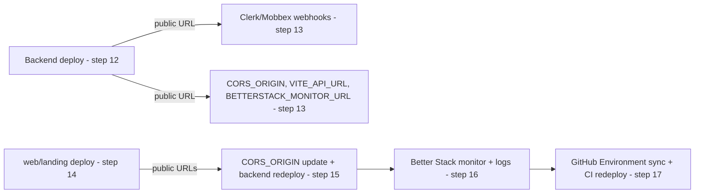

# INFRA-013 — Runbook de aprovisionamiento y despliegue — Design

## Problem statement

duck-stack now runs entirely on externally provisioned services (DigitalOcean, Cloudflare, Supabase, Clerk, Mobbex, Resend, Better Stack, PostHog, GitHub), but the knowledge of what to create in each provider, which credentials it issues, and the order in which they depend on each other exists only in the head of whoever performed the migration, scattered across a dozen feature specs and three component READMEs. There is no single place that shows the stack as a whole or lets a newcomer bring it up from zero.

## Chosen solution

**A single consolidated living runbook (`duck-spec/docs/RUNBOOK.md`) with a fixed four-section skeleton — provider catalogue, environment-variable inventory, ordered provisioning sequence, recurring operations — that cross-references the existing component READMEs for procedural detail instead of duplicating it.**

This directly satisfies R001–R012: one document enumerates every provider and what it is used for (R001–R003), inventories every environment variable with its consumer and origin (R004–R006), lays out the from-scratch procedure as an explicit ordered sequence (R007) that surfaces cross-provider dependencies and blocking waits (EC001, EC002, EC005), and documents the four recurring operations (R008–R011) plus the manual, non-automatable steps (R012). Consolidating into one file — rather than, for example, extending each component README independently — is what makes NF001 possible: a reader follows one document start to finish instead of reconstructing the sequence by jumping between `.do/README.md`, `.cloudflare/README.md`, `.do/monitoring/README.md` and `.github/README.md`. Referencing those READMEs for command-level detail (rather than re-stating their contents) satisfies the technical constraint that the runbook must not replace them, and keeps the two sources from drifting independently for the same procedure.

`duck-spec/docs/INFRASTRUCTURE.md` and `duck-spec/modules/infra/SPEC.md` were consulted (step 3) and confirm the current, already-implemented topology this design describes (INFRA-008/009/011/012); no conflicting or planned-but-unbuilt capability was found. `duck-spec/docs/BACKEND.md` and `duck-spec/docs/FRONTEND.md` were not consulted: this feature adds no application source file (analysis.md's technical constraints scope it to `duck-spec/docs/RUNBOOK.md` alone), so their coding conventions do not apply. The env-var "consumed by" column below was instead verified directly against the consuming source files (`apps/services/src/shared/configs/*.ts`, `apps/web/src/**`, `apps/landing/src/**`) so the inventory is accurate without needing those convention documents.

## Technical design

### Document skeleton

`duck-spec/docs/RUNBOOK.md` has five top-level sections, in this order:

1. **Maintenance rule** (EC004) — a short, unmissable statement, placed first so it cannot be skipped: any change that adds, renames or removes an environment variable, a provider, or a deploy step must update this runbook in the same change. States explicitly that this document contains no credentials and no real environment-specific values (NF003) — only variable names, consuming components, and value origins.
2. **Provider catalogue** (R001, R002, R003, EC003).
3. **Environment variable inventory** (R004, R005, R006, NF002, NF003).
4. **From-scratch provisioning sequence** (R007, EC001, EC002, EC005).
5. **Recurring operations** (R008, R009, R010, R011, R012).

### 1. Provider catalogue

One row per provider:

| Provider | Used for | Resources to create | Credentials issued (env var name) |
|---|---|---|---|
| GitHub | Repository hosting, CI/CD (Actions) | Repository access, two GitHub Environments (`dev`, `prod`) | — (uses repository/Environment access, not a project credential) |
| DigitalOcean App Platform | Backend (`services`) hosting | Team, GitHub App installation, one App per environment (created by `.do/deploy.sh`, not by hand) | `DIGITALOCEAN_ACCESS_TOKEN` |
| Cloudflare Pages | `web` and `landing` static hosting | Account, one Pages project per app (created by `.cloudflare/deploy.sh`, shared across environments) | `CLOUDFLARE_API_TOKEN`, `CLOUDFLARE_ACCOUNT_ID` |
| Supabase | PostgreSQL database | One project per environment | `DATABASE_URL` |
| Clerk | Authentication | One application per environment; a webhook endpoint registered once the backend URL is known | `CLERK_SECRET_KEY`, `CLERK_JWT_KEY`, `CLERK_WEBHOOK_SIGNING_SECRET`; `VITE_CLERK_PUBLISHABLE_KEY` |
| Mobbex | Payments | One account per environment (test/live); a webhook endpoint registered once the backend URL is known | `MOBBEX_API_KEY`, `MOBBEX_ACCESS_TOKEN`, `MOBBEX_WEBHOOK_SECRET` |
| Resend | Transactional email | Verified sending domain (DNS records) | `RESEND_API_KEY` |
| Better Stack — Logs & Uptime | Backend log aggregation and `/health` availability monitoring | One team (per environment or shared, see `.do/monitoring/README.md`), a Logs source, an Uptime monitor, an invited alert recipient | `BETTERSTACK_LOGS_TOKEN`, `BETTERSTACK_API_TOKEN`, `BETTERSTACK_ALERT_EMAIL` |
| Better Stack — error tracking (Sentry-compatible) | Frontend (`web`, `landing`) exception reporting and source-map resolution | One error-tracking project | `ERROR_TRACKING_DSN` / `VITE_ERROR_TRACKING_DSN`, `SENTRY_AUTH_TOKEN`, `SENTRY_ORG`, `SENTRY_PROJECT`, `SENTRY_URL` |
| PostHog | `web`/`landing` product analytics, feature flags, session replay | One project (shared by `web` and `landing`) | `VITE_POSTHOG_KEY`, `VITE_POSTHOG_HOST` |

A trailing "Known production-only limits" note under the Better Stack row records the Logs ingestion quota and points to `.do/monitoring/README.md`'s EC004 mitigation (raise `LOG_LEVEL`, redeploy) instead of duplicating it (EC003). Other rows leave this cell empty until a similar limit is discovered for that provider, per the maintenance rule.

### 2. Environment variable inventory

Grouped by consuming component, each with the same three columns: **Variable | Consumed by | Origin**. "Origin" states where the value is loaded from at deploy time: a GitHub Environment `vars.*`/`secrets.*` entry (per `.github/README.md`'s contract), a provider console, or "computed at run time" for the two values that are never stored (`SERVICE_VERSION`, `VITE_RELEASE` — always the deployed commit SHA).

**Backend (`services`, read via `apps/services/src/shared/configs/*.ts`, declared in `.do/app.yaml`):**
`NODE_ENV`, `LOG_LEVEL`, `HOST`, `PORT`, `CORS_ORIGIN` (`serverConfig.ts`); `DATABASE_URL` (`dbConfig.ts`); `CLERK_SECRET_KEY`, `CLERK_JWT_KEY`, `CLERK_WEBHOOK_SIGNING_SECRET` (`authConfig.ts`); `EMAIL_SENDER_ADDRESS`, `RESEND_API_KEY` (`emailConfig.ts`); `BILLING_PROVIDER`, `MOBBEX_API_KEY`, `MOBBEX_ACCESS_TOKEN`, `MOBBEX_TEST_MODE`, `MOBBEX_TIMEOUT_MS`, `MOBBEX_WEBHOOK_SECRET` (`mobbexConfig.ts`); `ERROR_TRACKING_DSN`, `ERROR_TRACKING_SAMPLE_RATE`, `SERVICE_VERSION` (`errorTrackingConfig.ts`); `SIGNUP_MODE`, `FREE_TRIAL_DAYS`, `STRICT_ENTITLEMENTS_ON_PAST_DUE` (`subscriptionsConfig.ts`); `BETTERSTACK_LOGS_TOKEN` (`app.yaml`'s `log_destinations`).

**`web` (build-time `VITE_*`, inlined by Vite):**
`VITE_API_URL` (`api/client.ts`), `VITE_CLERK_PUBLISHABLE_KEY` (`main.tsx`), `VITE_LANDING_URL` (`pages/billing/BillingPage.tsx`, `SubscribePage.tsx`), `VITE_PROVIDER_PORTAL_URL` (`components/domain/billing/SubscriptionStatusCard.tsx`), `VITE_POSTHOG_KEY`, `VITE_POSTHOG_HOST` (`lib/analytics.ts`), `VITE_ERROR_TRACKING_DSN`, `VITE_ENVIRONMENT`, `VITE_RELEASE` (`lib/errorTracking.ts`).

**`landing` (build-time `VITE_*`):**
`VITE_API_URL` (`api/plans.ts`), `VITE_WEB_URL` (`lib/handoff.ts`), `VITE_POSTHOG_KEY`, `VITE_POSTHOG_HOST` (`lib/analytics.ts`), `VITE_ERROR_TRACKING_DSN`, `VITE_ENVIRONMENT`, `VITE_RELEASE` (`lib/errorTracking.ts`).

**Deploy tooling only (never read by application runtime):**
`DO_APP_NAME`, `GITHUB_REPO`, `GIT_BRANCH` (`.do/app.yaml` identity/source placeholders), `DIGITALOCEAN_ACCESS_TOKEN` (`doctl` auth), `CLOUDFLARE_ACCOUNT_ID`, `CLOUDFLARE_API_TOKEN` (`wrangler` auth), `CLOUDFLARE_PROJECT_NAME` (deploy-script default override, intentionally not a GitHub Environment value), `BETTERSTACK_API_TOKEN`, `BETTERSTACK_ALERT_EMAIL`, `BETTERSTACK_MONITOR_URL`, `BETTERSTACK_CHECK_FREQUENCY_SECONDS`, `BETTERSTACK_CHECK_TIMEOUT_SECONDS` (`.do/monitoring/deploy.sh`), `SENTRY_AUTH_TOKEN`, `SENTRY_ORG`, `SENTRY_PROJECT`, `SENTRY_URL` (source-map upload during `vite build`).

**Verifiability (NF002):** the inventory's "Consumed by" and "Origin" columns are each traceable to one canonical source the reader can diff the runbook against: `.do/app.yaml`'s `envs` list and `.cloudflare/.env.deploy.web.example` / `.env.deploy.landing.example` for "what exists and who declares it", and `.github/README.md`'s `vars.*`/`secrets.*` contract for "where the value is loaded from in CI". A variable added, renamed or removed in any of those three without a matching runbook edit is detectable by comparing the three lists.

### 3. From-scratch provisioning sequence

One ordered table, columns **Step | Scope | Blocking wait | Action → produces**. "Scope" is `per-account` (executed once, regardless of how many environments follow) or `per-environment` (repeated for every environment — EC005). Each step that consumes a value produced by an earlier step states that dependency inline (EC001); each step with an external wait is marked `blocking` with the expected wait stated before its instructions (EC002).

| # | Scope | Blocking | Action → produces |
|---|---|---|---|
| 1 | per-account | no | Ensure GitHub Actions is enabled on the repository; install the DigitalOcean GitHub App with access to it (`.do/README.md` prerequisites) → repo/App access |
| 2 | per-account | no | Create a DigitalOcean team, enable App Platform, generate a personal access token → `DIGITALOCEAN_ACCESS_TOKEN` |
| 3 | per-account | no | Create a Cloudflare account, enable Pages, create an API token with Pages-edit scope → `CLOUDFLARE_API_TOKEN`, `CLOUDFLARE_ACCOUNT_ID` |
| 4 | per-account | no | Create a PostHog project → `VITE_POSTHOG_KEY`, `VITE_POSTHOG_HOST` (reused by both `web` and `landing`, every environment) |
| 5 | per-account | no | Create a Better Stack error-tracking (Sentry-compatible) project → `ERROR_TRACKING_DSN`/`VITE_ERROR_TRACKING_DSN`, `SENTRY_AUTH_TOKEN`, `SENTRY_ORG`, `SENTRY_PROJECT`, `SENTRY_URL` |
| 6 | per-environment | no | Create a Supabase project for this environment → `DATABASE_URL` |
| 7 | per-environment | no | Create a Clerk application for this environment; create its API keys. **Defer** the webhook endpoint (depends on step 11's backend URL — EC001) → `CLERK_SECRET_KEY`, `CLERK_JWT_KEY`, `VITE_CLERK_PUBLISHABLE_KEY` |
| 8 | per-environment | no | Create a Mobbex account (test or live) for this environment; create its API credentials. **Defer** the webhook endpoint (depends on step 11 — EC001) → `MOBBEX_API_KEY`, `MOBBEX_ACCESS_TOKEN`, `BILLING_PROVIDER`, `MOBBEX_TEST_MODE`, `MOBBEX_TIMEOUT_MS` |
| 9 | per-environment | **blocking — DNS propagation, minutes to hours** | Add Resend's sending-domain DNS records and wait for verification → `RESEND_API_KEY`, `EMAIL_SENDER_ADDRESS` |
| 10 | per-environment | no | Create a Better Stack team for this environment (or reuse one shared team, scoped per `.do/monitoring/README.md` prerequisites), enable a Logs source and an Uptime monitor product → `BETTERSTACK_LOGS_TOKEN`, `BETTERSTACK_API_TOKEN` |
| 11 | per-environment | no | Create the two GitHub Environments (`dev`, `prod`) if not already created; populate every `vars.*`/`secrets.*` entry gathered so far, per `.github/README.md`'s contract. `CORS_ORIGIN` is set to a temporary placeholder (`*`) — the real value is not known until step 13 (EC001) |
| 12 | per-environment | no | First backend deploy: run `.do/deploy.sh .do/.env.deploy.<environment>` (or trigger the pipeline) per `.do/README.md` → produces the backend's public URL |
| 13 | per-environment | no | **Depends on step 12's URL (EC001).** Register the Clerk and Mobbex webhook endpoints against the backend URL from step 12; update `CORS_ORIGIN`, `VITE_API_URL`, `BETTERSTACK_MONITOR_URL` now that the URL is known → `CLERK_WEBHOOK_SIGNING_SECRET`, `MOBBEX_WEBHOOK_SECRET` |
| 14 | per-environment | no | Deploy `web` and `landing`: `.cloudflare/deploy.sh web …` / `.cloudflare/deploy.sh landing …` per `.cloudflare/README.md` → produces each SPA's public URL; sets `VITE_WEB_URL`, `VITE_LANDING_URL` |
| 15 | per-environment | no | **Depends on step 14's URLs (EC001).** Update `CORS_ORIGIN` with both SPA URLs and redeploy the backend (`.do/deploy.sh`) so CORS reflects the real origins |
| 16 | per-environment | **blocking — alert-subscription confirmation email** | Run `.do/monitoring/deploy.sh .do/.env.deploy.<environment>` per `.do/monitoring/README.md`; wait for `BETTERSTACK_ALERT_EMAIL` to confirm its team invitation, then perform the mandatory forced downtime/recovery delivery test |
| 17 | per-environment | no | Update the GitHub Environment's `vars.*` with the values produced in steps 12–16 (`CORS_ORIGIN`, `BETTERSTACK_MONITOR_URL`, `VITE_API_URL`, `VITE_WEB_URL`/`VITE_LANDING_URL`), then trigger one CI-driven redeploy (push, or `deploy-manual.yml`) to confirm the pipeline reproduces the manually-provisioned state end to end |

### 4. Recurring operations

- **Deploy to an environment (R008):** automatic on merge to `develop`/`main` (INFRA-012); manual equivalent is `.do/deploy.sh` + `.cloudflare/deploy.sh web|landing` locally, or triggering `deploy-manual.yml` with the branch's current HEAD — references `.do/README.md`, `.cloudflare/README.md`, `.github/README.md`.
- **Deploy a specific commit (R009):** `workflow_dispatch` on `deploy-manual.yml` with `environment` and `commit_sha` inputs, per `.github/README.md`.
- **Rollback (R010):** `workflow_dispatch` on `rollback.yml` with `environment` and the previously-delivered `commit_sha`; restates the data-change caveat already printed by the workflow (application code only, no automatic data reversal).
- **Credential rotation (R011):** a per-category table (Backend secret in `.do/app.yaml` → update the GitHub Environment secret, redeploy `services` only; public `VITE_*` build-time value → update the GitHub Environment var, redeploy every SPA that consumes it, since Vite inlines it at build time; deploy-tooling-only secret such as `DIGITALOCEAN_ACCESS_TOKEN`/`CLOUDFLARE_API_TOKEN`/`BETTERSTACK_API_TOKEN`/`SENTRY_AUTH_TOKEN` → update the GitHub Environment secret only, no redeploy needed since the pipeline itself is the only consumer) followed by the three universal sub-steps: revoke and reissue at the provider, update every place the value is stored (GitHub Environment, and any local `.do/.env.deploy.<environment>`/`.cloudflare/.env.deploy.<app>.<environment>` file still in use), then redeploy per the table.
- **Manual steps enumeration (R012):** a table listing every manual, non-automatable step (provider account/project creation, DNS records, webhook registration, alert-subscription confirmation, delivery test) with a cross-reference to its step number in the provisioning sequence above.

## Files

| Path | Action | Description |
|---|---|---|
| `duck-spec/docs/RUNBOOK.md` | CREATE | The living runbook: maintenance rule, provider catalogue, environment-variable inventory, provisioning sequence, recurring operations, as designed above. |
| `duck-spec/docs/tests/runbook.test.sh` | CREATE | Shell acceptance test asserting the runbook's required sections, tables and specific content exist, following the same grep-based pattern as `.do/tests/readme.test.sh`. |

## Requirement coverage

| ID | Design decision |
|---|---|
| R001 | Provider catalogue table, "Used for" column |
| R002 | Provider catalogue table, "Resources to create" column |
| R003 | Provider catalogue table, "Credentials issued" column |
| R004 | Environment variable inventory, grouped by component |
| R005 | Environment variable inventory, "Consumed by" column |
| R006 | Environment variable inventory, "Origin" column |
| R007 | From-scratch provisioning sequence table (steps 1–17) |
| R008 | Recurring operations — "Deploy to an environment" |
| R009 | Recurring operations — "Deploy a specific commit" |
| R010 | Recurring operations — "Rollback" |
| R011 | Recurring operations — "Credential rotation" per-category table + 3 universal sub-steps |
| R012 | Recurring operations — "Manual steps enumeration" table |
| NF001 | Single consolidated document (Chosen solution) covering every step end to end, with explicit cross-provider dependencies (EC001) so no step assumes undocumented prior knowledge |
| NF002 | Verifiability paragraph in the environment variable inventory, naming the three canonical sources to diff against |
| NF003 | Maintenance rule section states the no-credentials/no-real-values rule; inventory columns hold only names, consumers and origins, never values |
| EC001 | Explicit "Depends on step N" annotations at steps 11, 13, 15; mermaid diagram |
| EC002 | Steps 9 and 16 marked `blocking` with the expected wait stated before the instructions |
| EC003 | Provider catalogue's Better Stack row references `.do/monitoring/README.md`'s ingestion-quota mitigation instead of duplicating it |
| EC004 | Maintenance rule section (first in the document) |
| EC005 | "Scope" column (`per-account` / `per-environment`) on every provisioning step |
