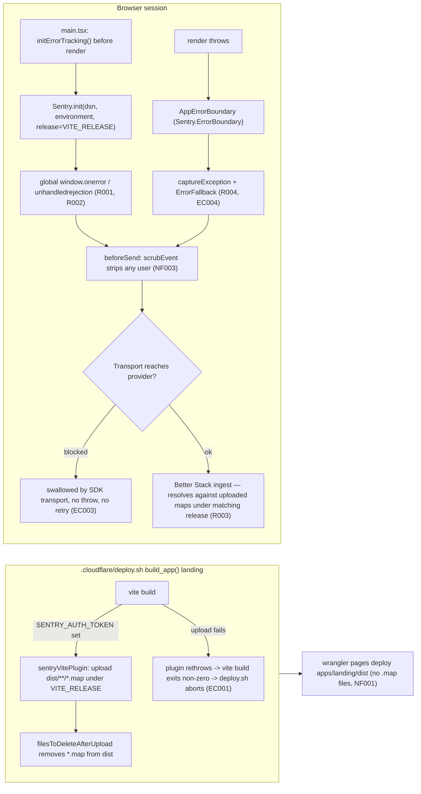

# LANDING-002 — Error tracking en `landing`

## Problem statement

`apps/landing` mounts `<App>` with no error boundary and no reporting client anywhere in the tree: a render error unmounts the React root and leaves a blank page, and uncaught errors or unhandled promise rejections vanish silently — on the visitor's first impression of the product, with no relationship to fall back on. The published bundle is also minified, so any report that did arrive would carry a useless stack trace. The feature must make every landing error reach Better Stack, resolvable back to source, without ever blocking first render or attaching any visitor identity.

## Chosen solution

**`@sentry/react` SDK direct integration, reusing the WEB-002 mechanism as-is**

The technical constraints make this a reuse decision, not a fresh evaluation: WEB-002 already solved stack-trace resolution (build-time source maps gated on a deploy-only credential, uploaded and deleted from `dist` before `wrangler pages deploy`), the `VITE_`-prefixed public-config convention, and the vendor-SDK-as-noop-when-uninitialized pattern that makes R006/R007 trivial — the same `Sentry.init`, `Sentry.ErrorBoundary`, and `@sentry/vite-plugin` building blocks satisfy R001–R005 here for the identical reasons documented in `duck-spec/modules/web/web-002-error-tracking/design.md`. Redesigning any of that for `landing` would violate the explicit technical constraint ("Depends on WEB-002 … must be reused rather than redesigned") for no requirement gain.

The one substantive difference is scope, not mechanism: `landing` has no auth provider and must stay anonymous (NF003, out-of-scope "Attribution of reports to a user"), so this design omits WEB-002's `useSyncErrorTrackingUser` hook and its `Sentry.setUser` calls entirely — there is no user object to sync. `beforeSend` still defensively strips `event.user` should any future dependency populate it, and no additional Sentry integration that could capture form contents (session replay, user feedback widget) is registered, which is what satisfies NF003 for a page that includes a contact form. EC003 here (a browser blocker preventing the report request) requires no application code: `@sentry/react`'s default `fetch` transport already catches its own send failures internally and issues no retry queue by default, so a blocked request is structurally a silent no-op — the same structural argument WEB-002 used for NF004's provider-unavailability case.

`duck-spec/modules/landing/SPEC.md`'s "Base structure (LANDING-001)" section and `duck-spec/docs/FRONTEND.md`'s "`apps/landing` — Marketing SPA structure" section were consulted: `apps/landing` uses a flat layer model (`components/layout/`, `components/sections/`, `components/ui/`, `pages/`, `api/`, `lib/`) and deliberately omits React Query, Zustand, and `@repo/types`. This design introduces no dependency on any of those three and adds no new top-level folder beyond `components/error/` — the same subfolder WEB-002 already established under `apps/web/src/components/error/`, consistent with the technical constraint that "the error boundary and its fallback are components" and with `lib/` staying React-free (`lib/errorTracking.ts` imports only the vendor SDK, no React).

## Technical design

### New public config surface (Vite `VITE_`-prefixed, technical constraint — same convention as WEB-002)

| Variable | Classification | Read by | Purpose |
|---|---|---|---|
| `VITE_ERROR_TRACKING_DSN` | public | `apps/landing/src/lib/errorTracking.ts` (`import.meta.env`) | Provider ingest destination (R006/R007 gate) |
| `VITE_RELEASE` | public | `apps/landing/src/lib/errorTracking.ts` (runtime) **and** `apps/landing/vite.config.ts` (build-time, via `process.env`) | Single source of truth for the release identifier stamped on every report (R005) and on the uploaded source maps (EC002) |
| `VITE_ENVIRONMENT` | public | `apps/landing/src/lib/errorTracking.ts` | Environment name stamped on every report (R005); defaults to `"production"` when unset |

### New build/deploy-only surface (never `VITE_`-prefixed — EC005)

| Variable | Classification | Read by | Purpose |
|---|---|---|---|
| `SENTRY_AUTH_TOKEN` | secret, build/deploy-only | `apps/landing/vite.config.ts` (`process.env`, Node context) | Authenticates the source-map upload; gates whether source maps are produced at all |
| `SENTRY_ORG` / `SENTRY_PROJECT` | build/deploy-only | `apps/landing/vite.config.ts` | Identify the target project for the upload |
| `SENTRY_URL` (optional) | build/deploy-only | `apps/landing/vite.config.ts` | Better Stack's Sentry-compatible API base, when it differs from sentry.io's default |

Because Vite only ever inlines `import.meta.env.VITE_*` keys into the client bundle, a variable that is never `VITE_`-prefixed is structurally unreachable from browser code — this is the mechanism that satisfies EC005, not a convention that has to be manually respected. These four variables follow the same handling `.cloudflare/deploy.sh` already gives `web`'s equivalents: present in the per-environment, git-ignored `.cloudflare/.env.deploy.landing.<environment>` file, exported into the build's `process.env` by `deploy.sh`'s existing `set -a; source "$VALUES_FILE"; set +a`, consumed by `vite.config.ts`. No change to `deploy.sh` itself is needed.

### `apps/landing/src/lib/errorTracking.ts` (R001, R002, R005–R007, NF002–NF004, EC003, EC005)

```ts
import * as Sentry from "@sentry/react";

interface ErrorTrackingConfig {
  dsn: string;
  environment: string;
  release: string;
}

export function readErrorTrackingConfig(): ErrorTrackingConfig | null {
  const dsn = import.meta.env.VITE_ERROR_TRACKING_DSN;
  if (!dsn) return null;
  return {
    dsn,
    environment: import.meta.env.VITE_ENVIRONMENT || "production",
    release: import.meta.env.VITE_RELEASE || "unknown",
  };
}

export function scrubEvent(event: Sentry.ErrorEvent): Sentry.ErrorEvent {
  // NF003: landing is anonymous — no user object is ever attached by this
  // app, but strip one defensively in case a future dependency populates it.
  if (event.user) delete event.user;
  return event;
}

export function initErrorTracking(): void {
  const config = readErrorTrackingConfig(); // R007: absent config -> no-op, no throw
  if (!config) return;

  try {
    Sentry.init({
      dsn: config.dsn,
      environment: config.environment,
      release: config.release,
      sendDefaultPii: false, // NF003 defense in depth
      beforeSend: scrubEvent,
    });
  } catch (err) {
    // NF004: a provider/init failure must never block the landing from rendering.
    console.error("Error tracking initialization failed", err);
  }
}
```

No `integrations`/`defaultIntegrations` override is applied, so `Sentry.init`'s default integrations install the global `window.onerror`/`unhandledrejection` handlers themselves (R001, R002) — identical mechanism to WEB-002. No session-replay or user-feedback integration is added (they are opt-in extras, not defaults), which is what keeps NF003 holding against the contact form's field contents: nothing in this configuration reads or transmits DOM input values. `initErrorTracking()` is synchronous and performs no network I/O of its own — this is what satisfies NF002 structurally when called before `createRoot(...).render(...)` in `main.tsx`. EC003 (a browser blocker preventing the report request) needs no code here: `@sentry/react`'s default `fetch`-based transport catches its own send failures internally and applies no retry queue by default, so a blocked send never reaches `initErrorTracking()`'s call site as a throw and never becomes an uncaught error or rejection in the page.

### `apps/landing/src/components/error/ErrorFallback.tsx` (EC004)

Static markup plus a reload action only — no hooks, no `@repo/types`, no provider-dependent state:

```tsx
export function ErrorFallback() {
  return (
    <div role="alert">
      <h1>Something went wrong.</h1>
      <p>Please reload the page. If the problem persists, try again shortly.</p>
      <button type="button" onClick={() => window.location.reload()}>Reload</button>
    </div>
  );
}
```

### `apps/landing/src/components/error/AppErrorBoundary.tsx` (R004)

Thin project-owned wrapper around `Sentry.ErrorBoundary`:

```tsx
import * as Sentry from "@sentry/react";
import type { ReactNode } from "react";
import { ErrorFallback } from "./ErrorFallback";

export function AppErrorBoundary({ children }: { children: ReactNode }) {
  return (
    <Sentry.ErrorBoundary fallback={ErrorFallback} showDialog={false}>
      {children}
    </Sentry.ErrorBoundary>
  );
}
```

`Sentry.ErrorBoundary` calls `captureException` internally when it catches a render error, then renders `fallback` — this is what satisfies R004's "catch, report, and render an error screen" in one component, and remains a safe fallback-only boundary if `Sentry.init` was never called (R007).

### `apps/landing/src/main.tsx` (R001, R002, R004, R006, R007)

```tsx
import { StrictMode } from "react";
import { createRoot } from "react-dom/client";
import App from "./App";
import { initErrorTracking } from "./lib/errorTracking";
import { AppErrorBoundary } from "./components/error/AppErrorBoundary";

initErrorTracking(); // R006: before first render; NF002: synchronous, non-blocking

createRoot(document.getElementById("root")!).render(
  <StrictMode>
    <AppErrorBoundary>
      <App />
    </AppErrorBoundary>
  </StrictMode>
);
```

No other change to `main.tsx` is required: `App.tsx`'s own `<BrowserRouter>`/`<Routes>` tree is unaffected, it simply renders one level deeper inside `AppErrorBoundary`.

### `apps/landing/vite.config.ts` (R003, R005, NF001, EC001, EC002)

```ts
import { defineConfig } from "vite";
import react from "@vitejs/plugin-react";
import { sentryVitePlugin } from "@sentry/vite-plugin";

const sourceMapsEnabled = Boolean(process.env.SENTRY_AUTH_TOKEN);

export default defineConfig({
  plugins: [
    react(),
    sourceMapsEnabled &&
      sentryVitePlugin({
        org: process.env.SENTRY_ORG,
        project: process.env.SENTRY_PROJECT,
        authToken: process.env.SENTRY_AUTH_TOKEN,
        url: process.env.SENTRY_URL,
        release: { name: process.env.VITE_RELEASE }, // EC002: same identifier the runtime reports (R005)
        sourcemaps: {
          filesToDeleteAfterUpload: ["**/*.map"], // NF001: never left next to the published bundle
        },
        // No custom errorHandler override: the plugin's default rethrows on
        // upload failure, which fails `vite build`, which — under
        // deploy.sh's `set -euo pipefail` — aborts before `wrangler pages
        // deploy` runs (EC001).
      }),
  ].filter(Boolean),
  build: {
    sourcemap: sourceMapsEnabled, // no SENTRY_AUTH_TOKEN -> no maps generated -> nothing to leak (NF001)
  },
});
```

Same `sourceMapsEnabled` single-switch design as WEB-002: absent `SENTRY_AUTH_TOKEN` means no `.map` files are ever produced (NF001 holds trivially, nothing to upload); present means maps are generated, uploaded under `VITE_RELEASE`, and deleted from `dist` before `.cloudflare/deploy.sh`'s `wrangler pages deploy apps/landing/dist` step, because deletion happens inside the same `vite build` invocation `build_app()` calls first.

### `apps/landing/vitest.config.ts` (test infrastructure only)

Add `environmentMatchGlobs: [['tests/error-tracking/viteConfig.test.ts', 'node']]`, mirroring `apps/web/vitest.config.ts`, so the Vite-config unit test runs in a Node environment (it inspects `process.env` and the resolved plugin list, not DOM APIs) while every other test keeps the default `jsdom` environment.

### Flow



## Files

| Path | Action | Description |
|---|---|---|
| `apps/landing/src/lib/errorTracking.ts` | CREATE | `readErrorTrackingConfig()`, `scrubEvent()`, `initErrorTracking()` |
| `apps/landing/src/components/error/ErrorFallback.tsx` | CREATE | Dependency-free error screen (EC004) |
| `apps/landing/src/components/error/AppErrorBoundary.tsx` | CREATE | Project wrapper around `Sentry.ErrorBoundary` |
| `apps/landing/src/main.tsx` | MODIFY | Call `initErrorTracking()` before render; wrap `<App/>` in `<AppErrorBoundary>` |
| `apps/landing/vite.config.ts` | MODIFY | Conditional `sentryVitePlugin`, `build.sourcemap` gated on `SENTRY_AUTH_TOKEN` |
| `apps/landing/vitest.config.ts` | MODIFY | Add `environmentMatchGlobs` so `viteConfig.test.ts` runs under `node` |
| `apps/landing/package.json` | MODIFY | Add `@sentry/react` dependency and `@sentry/vite-plugin` devDependency |
| `.cloudflare/.env.deploy.landing.example` | MODIFY | Document `VITE_ERROR_TRACKING_DSN`, `VITE_RELEASE`, `VITE_ENVIRONMENT` (public) and note `SENTRY_AUTH_TOKEN`/`SENTRY_ORG`/`SENTRY_PROJECT`/`SENTRY_URL` as deploy-environment-only, never committed |
| `.cloudflare/README.md` | MODIFY | Extend the "Error tracking variables" section to cover `landing` (LANDING-002) alongside `web` (WEB-002) |
| `apps/landing/tests/error-tracking/errorTracking.test.ts` | CREATE | Unit tests for config parsing, init gating, user scrubbing, init-failure isolation |
| `apps/landing/tests/error-tracking/viteConfig.test.ts` | CREATE | Unit tests for the `SENTRY_AUTH_TOKEN`-gated plugin/sourcemap wiring |
| `apps/landing/tests/error-tracking/ErrorFallback.test.tsx` | CREATE | Unit test asserting dependency-free static render + reload action |
| `apps/landing/tests/error-tracking/AppErrorBoundary.test.tsx` | CREATE | Unit test asserting a thrown render error is caught and `ErrorFallback` renders |
| `apps/landing/tests/error-tracking/main.test.tsx` | CREATE | Integration test asserting `initErrorTracking()` runs before `render()` and the tree is wrapped in `AppErrorBoundary` |

## Requirement coverage

| ID | Design decision |
|---|---|
| R001 | `initErrorTracking()` calls `Sentry.init()`, whose default integrations install the global `window.onerror` handler; no override disables it |
| R002 | Same `Sentry.init()` call installs the default `unhandledrejection` handler |
| R003 | `vite.config.ts`'s `sourceMapsEnabled`-gated `sentryVitePlugin` uploads `dist/**/*.map` under `VITE_RELEASE` as part of the production build |
| R004 | `AppErrorBoundary` wraps `Sentry.ErrorBoundary`, which catches render errors, reports via `captureException`, and renders `ErrorFallback` |
| R005 | `Sentry.init({ environment, release })` in `errorTracking.ts`, both read from `VITE_ENVIRONMENT`/`VITE_RELEASE`, and `release.name` in `vite.config.ts` reads the same `VITE_RELEASE` key |
| R006 | `initErrorTracking()` is called synchronously in `main.tsx` before `createRoot(...).render(...)`, and only calls `Sentry.init` when `readErrorTrackingConfig()` returns non-null |
| R007 | `readErrorTrackingConfig()` returns `null` when `VITE_ERROR_TRACKING_DSN` is absent; `initErrorTracking()` returns early with no `Sentry.init` call and no throw |
| NF001 | `sourceMapsEnabled` gates `build.sourcemap`; when true, `sourcemaps.filesToDeleteAfterUpload` removes `*.map` from `dist` before `wrangler pages deploy` runs; when false, no maps are ever generated |
| NF002 | `initErrorTracking()` is synchronous, performs no network I/O itself, and runs before `render()` with no `await` in between |
| NF003 | No `Sentry.setUser` call exists anywhere in `apps/landing`; `scrubEvent` strips `event.user` defensively; `sendDefaultPii: false`; no session-replay/feedback integration is registered, so DOM input values are never captured |
| NF004 | `Sentry.init(...)` is wrapped in `try/catch` inside `initErrorTracking()`; a failure is logged and swallowed, never re-thrown to `main.tsx` |
| EC001 | No custom `errorHandler` override is passed to `sentryVitePlugin`, so its default rethrow on upload failure fails `vite build`, which — under `deploy.sh`'s `set -euo pipefail` — aborts the deploy before `wrangler pages deploy` runs |
| EC002 | Both `vite.config.ts`'s `release.name` and `errorTracking.ts`'s runtime `release` read the identical `VITE_RELEASE` variable — one source of truth, no divergence possible |
| EC003 | `@sentry/react`'s default `fetch` transport catches its own send failures internally and applies no default retry queue, so a blocked send is a structural no-op — no application-level try/catch or retry logic is added around it |
| EC004 | `ErrorFallback` renders only static markup and a `window.location.reload()` action — no hooks, no context, no data fetching |
| EC005 | `SENTRY_AUTH_TOKEN`/`SENTRY_ORG`/`SENTRY_PROJECT`/`SENTRY_URL` are read only from `process.env` inside `vite.config.ts` (Node build context) and are never `VITE_`-prefixed, so Vite structurally never inlines them into the client bundle |
