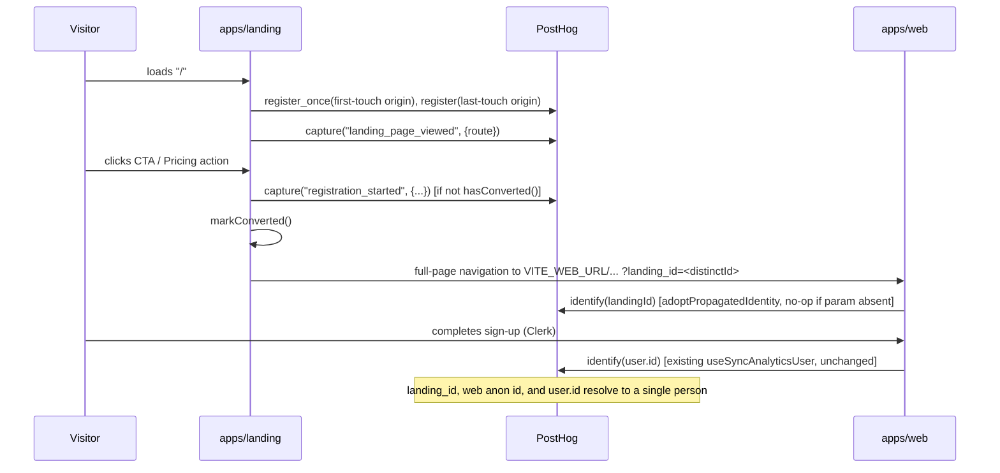

# LANDING-003 — Analítica de conversión en `landing`

## Problem statement

`apps/landing` has no visibility into how many visitors it receives, where they come from, or how many of them convert into registrations: its pricing action hands the visitor off to `apps/web` with a full-page, cross-origin navigation carrying no analytics identity, and its primary "Get early access" CTA has no destination at all. Without recording visits, traffic origin, and the conversion hand-off — and without carrying the visitor's anonymous identity across the origin boundary so it can later be linked to the registered user — the pre-registration half of the journey stays permanently disconnected from the post-registration half that WEB-003 already instruments.

## Alternatives

| Alternative | Description | Decision |
|---|---|---|
| URL query-param propagation + PostHog native identify-merge | Landing captures visits/conversion locally with PostHog, appends its own PostHog `distinct_id` as a query parameter on the cross-origin hand-off URL; `apps/web` adopts that id via `posthog.identify(landingId)` at bootstrap, before its existing WEB-003 `identify(user.id)` call runs, letting PostHog's own anonymous-to-known merge chain link the two. | **Chosen** — reuses the single provider and identification model WEB-003 already established (technical constraints), needs no new backend surface, and keeps `apps/web`'s only responsibility limited to "adopt id + let the existing identify call complete the link", exactly as the constraints require. |
| Backend-mediated identity bridge | Landing calls a new `apps/services` endpoint to persist `{anonymousId, origin}` server-side; `apps/web`'s registration flow calls the backend after signup to resolve and link the identity instead of doing the merge client-side in PostHog. | Not chosen — introduces a new backend endpoint and storage outside this feature's scope (no R-ID calls for a backend surface), duplicates identity-linking logic PostHog already provides, and pushes the conversion-recording responsibility outside `apps/landing`, contradicting the constraint that `apps/landing` owns the conversion event. |
| Shared cross-origin cookie/localStorage | Set a parent-domain cookie readable by both `apps/landing` and `apps/web` deployments so the anonymous id is available without passing it through the navigation. | Not chosen — EC001 explicitly requires the identifier to be carried "in the navigation itself rather than relying on shared browser storage" for exactly this two-separate-origins scenario; this alternative directly contradicts that hard constraint. |

## Chosen solution

**URL query-param propagation + PostHog native identify-merge**

This solution satisfies R001–R010 with the smallest footprint: R001/R002/R004 are satisfied by a landing-owned PostHog client (mirroring the `lib/analytics.ts` shape WEB-003 already established, per the technical constraints) that records a visit event and attaches traffic-origin properties as PostHog super properties, relying on PostHog's own persisted anonymous `distinct_id` for continuity (R004) without inventing a parallel identity mechanism. R003/R005/R007 are satisfied by wiring `components/sections/CTA.tsx` and `components/sections/Pricing.tsx` — the two components that own the hand-off action per the technical constraints — to record the conversion event synchronously and then navigate to a hand-off URL that carries the landing's `distinct_id` as a query parameter, respecting EC001's "carry it in the navigation, not shared storage" requirement and NF001's "no network round-trip before navigating" requirement (PostHog's `capture()` call is fire-and-forget, exactly as already relied upon in WEB-003). R006/NF003 are satisfied on the `apps/web` side by a single new function, `adoptPropagatedIdentity()`, that calls `posthog.identify(landingId)` once at bootstrap when the query parameter is present — before the existing WEB-003 `useSyncAnalyticsUser()` hook's `posthog.identify(user.id)` call ever runs — so PostHog's own anonymous-to-known merge chain resolves both halves of the journey to one person, without redefining WEB-003's identification model. R008/EC004 are satisfied by a browser-local idempotency guard (documented explicitly below, since it is an interpretation of R008 rather than a literal network-verified check). R009/R010 reuse the exact no-op-when-absent init pattern LANDING-002 established in `lib/errorTracking.ts`.

**Documented interpretation of R008/EC004:** `apps/landing` has no server round-trip available to it within NF001's non-blocking constraint, and no authentication provider (technical constraints). "The visitor's analytics identity already resolves to a registered user" is therefore implemented as "this browser has already recorded a conversion for this landing session" — a `localStorage` flag written the first time `registration_started` fires and checked before every subsequent hand-off. This is the correct scope for a stateless, anonymous, non-blocking client: R004 already scopes "the same visitor" to "the same browser/device" via PostHog's own persisted `distinct_id`, so bounding R008's idempotency guarantee to that same scope is consistent, not a weaker guarantee introduced elsewhere in the design.

## Technical design

### `apps/landing` — new modules

- **`lib/analytics.ts`** (landing-owned, mirrors the `apps/web` shape per the technical constraints):
  - `readAnalyticsConfig(): { apiKey: string; apiHost: string } | null` — reads `VITE_POSTHOG_KEY` / `VITE_POSTHOG_HOST`; `null` when the key is absent.
  - `initAnalytics(): void` — no-op when config is `null`; otherwise `posthog.init(apiKey, { api_host, capture_pageview: false, autocapture: false, capture_heatmaps: false, disable_session_recording: true })` wrapped in `try/catch`. `capture_pageview: false` because visits are captured explicitly (R001/R002 ordering control, see below); session replay and autocapture stay off — both are out of scope for this feature.
  - `captureEvent(name: string, properties?: Record<string, unknown>): void` — thin wrapper over `posthog.capture()`; a documented no-op pre-init (same guarantee WEB-003 relies on from `posthog-js`).
  - `getDistinctId(): string | null` — wraps `posthog.get_distinct_id()` in `try/catch`, returns `null` when analytics was never initialized or the call fails.
- **`lib/attribution.ts`**:
  - `interface TrafficOrigin { utmSource, utmMedium, utmCampaign, utmTerm, utmContent, referrer: string | null }`
  - `parseTrafficOrigin(search: string, referrer: string): TrafficOrigin` — pure function reading `URLSearchParams(search)` for the five `utm_*` params plus `referrer`.
  - `registerTrafficOrigin(origin: TrafficOrigin): void` — calls `posthog.register_once({ first_touch_utm_source, ... , first_touch_referrer })` (only ever written once per persisted PostHog store — satisfies EC003's "never overwrite a previously recorded origin") and `posthog.register({ last_touch_utm_source, ..., last_touch_referrer })` (always overwritten — satisfies EC003's "record the origin of the current visit alongside it"). Both are PostHog super properties, so they are automatically attached to every subsequent `capture()` call, including the visit event, with no per-call plumbing.
- **`lib/handoff.ts`**:
  - `buildHandoffUrl(path: string): string` — resolves `path` against `VITE_WEB_URL`, and, when `getDistinctId()` returns a value, appends it as `?landing_id=<id>` (merged with any existing query string on `path`, e.g. `?plan=pro&landing_id=...`). When no distinct id is available (R010, EC002), returns the URL unchanged — identical to the hand-off URL the landing produces today.
- **`lib/conversion.ts`**:
  - `hasConverted(): boolean` — reads a `localStorage` flag (`landing_conversion_recorded`).
  - `markConverted(): void` — writes it.
- **`components/analytics/RouteVisitTracker.tsx`** — the React-aware piece that owns the visit event (mirrors the constraint that event calls belong to the component owning the action): mounted inside `<BrowserRouter>` in `App.tsx`, it calls `useLocation()` and, in a `useEffect` keyed on `location.pathname`, calls `registerTrafficOrigin(parseTrafficOrigin(window.location.search, document.referrer))` followed by `captureEvent('landing_page_viewed', { route: location.pathname })` — origin is registered first so it is present as a super property on the very first visit event. Renders `null`.

### `apps/landing` — modified components

- **`main.tsx`**: calls `initAnalytics()` synchronously, alongside the existing `initErrorTracking()`, before `createRoot(...).render(...)` (R009/R010).
- **`App.tsx`**: mounts `<RouteVisitTracker />` inside `<BrowserRouter>`.
- **`components/sections/Pricing.tsx`**: `handleCTA(code)` becomes:
  ```
  if (!hasConverted()) {
    captureEvent('registration_started', { action: 'pricing', plan: code });
    markConverted();
  }
  window.location.href = buildHandoffUrl(`/billing/subscribe?plan=${code}`);
  ```
  When analytics is unconfigured, `getDistinctId()` is `null`, so `buildHandoffUrl` returns exactly the URL the current implementation produces — no observable change to the existing hand-off behavior (R010).
- **`components/sections/CTA.tsx`**: gains a `handleClick` following the same shape as `Pricing.tsx`, targeting `buildHandoffUrl('/sign-up')`, wired to `<Button variant="primary" onClick={handleClick}>` (R007). `components/ui/Button.tsx` already accepts an `onClick` prop — no change needed there, so no destination or analytics logic is pushed into `components/ui/`.

### `apps/web` — identity adoption

- **`lib/analytics.ts`** (MODIFY, additive only): new `adoptPropagatedIdentity(): void` reads `landing_id` from `window.location.search`; when present, calls `posthog.identify(landingId)` wrapped in `try/catch` (an adoption failure must not block rendering, same guarantee as `initAnalytics`); when absent, it is a no-op — the application continues with its own locally generated anonymous id (EC001's fallback).
- **`main.tsx`** (MODIFY): calls `adoptPropagatedIdentity()` right after `initAnalytics()`, before `createRoot(...).render(...)`. This must run before any `identify(user.id)` call so the merge chain is anonymous-landing-id → anonymous-web-session → known-user, never two already-known ids merging into each other.
- **`hooks/use-sync-analytics-user.ts` is unchanged.** Its existing `posthog.identify(user.id)` call (WEB-003) already performs the "link to the user identifier" half of R006 once a Clerk session exists; this feature's only addition is making sure the distinct id it merges *from* is the one the landing already recorded events against.

### Cross-cutting flow



## Files

| Path | Action | Description |
|---|---|---|
| `apps/landing/src/lib/analytics.ts` | CREATE | `readAnalyticsConfig`, `initAnalytics`, `captureEvent`, `getDistinctId` — landing-owned PostHog init module, no-op when config absent. |
| `apps/landing/src/lib/attribution.ts` | CREATE | `parseTrafficOrigin`, `registerTrafficOrigin` — first-touch/last-touch traffic origin as PostHog super properties. |
| `apps/landing/src/lib/handoff.ts` | CREATE | `buildHandoffUrl(path)` — cross-origin hand-off URL carrying the landing's distinct id. |
| `apps/landing/src/lib/conversion.ts` | CREATE | `hasConverted`, `markConverted` — browser-local conversion idempotency guard. |
| `apps/landing/src/components/analytics/RouteVisitTracker.tsx` | CREATE | Route-aware component recording the visit event and registering traffic origin. |
| `apps/landing/src/App.tsx` | MODIFY | Mount `<RouteVisitTracker />` inside `<BrowserRouter>`. |
| `apps/landing/src/main.tsx` | MODIFY | Call `initAnalytics()` before `createRoot(...).render(...)`. |
| `apps/landing/src/components/sections/Pricing.tsx` | MODIFY | `handleCTA` records the conversion (idempotent) and navigates via `buildHandoffUrl`. |
| `apps/landing/src/components/sections/CTA.tsx` | MODIFY | Wire "Get early access" to a real destination, recording the conversion (idempotent) and navigating via `buildHandoffUrl`. |
| `apps/landing/package.json` | MODIFY | Add `posthog-js` runtime dependency. |
| `apps/web/src/lib/analytics.ts` | MODIFY | Add `adoptPropagatedIdentity()`. |
| `apps/web/src/main.tsx` | MODIFY | Call `adoptPropagatedIdentity()` after `initAnalytics()`, before render. |
| `.cloudflare/.env.deploy.landing.example` | MODIFY | Document `VITE_POSTHOG_KEY` / `VITE_POSTHOG_HOST` as optional public values for `landing`, mirroring the LANDING-002 entry for `VITE_ERROR_TRACKING_DSN`. |
| `.cloudflare/README.md` | MODIFY | Document the analytics/hand-off identity propagation behavior for `landing` alongside the existing error-tracking section. |

## Requirement coverage

| ID | Design decision |
|---|---|
| R001 | `RouteVisitTracker` captures `landing_page_viewed` with `route` on mount and on every `location.pathname` change. |
| R002 | `lib/attribution.ts`'s `registerTrafficOrigin` attaches first-/last-touch UTM + referrer as PostHog super properties on every event, including the visit event. |
| R003 | `Pricing.tsx`/`CTA.tsx` call `captureEvent('registration_started', ...)` synchronously, before `window.location.href` is set. |
| R004 | PostHog's own persisted `distinct_id` (via `posthog.init()`'s default persistence), exposed through `getDistinctId()`; no parallel identity mechanism introduced. |
| R005 | `buildHandoffUrl` appends `landing_id=<distinctId>` to the cross-origin navigation URL. |
| R006 | `apps/web`'s `adoptPropagatedIdentity()` calls `posthog.identify(landingId)` before the existing WEB-003 `identify(user.id)` call, chaining the merge. |
| R007 | `CTA.tsx`'s `handleClick` navigates to `buildHandoffUrl('/sign-up')`. |
| R008 | `lib/conversion.ts`'s `hasConverted()`/`markConverted()` guard around the `captureEvent('registration_started', ...)` call sites (see documented interpretation above). |
| R009 | `initAnalytics()` called synchronously in `main.tsx` before render, config-gated exactly like `initErrorTracking()`. |
| R010 | `readAnalyticsConfig()` returning `null` makes `initAnalytics`/`captureEvent`/`registerTrafficOrigin`/`getDistinctId` no-ops; `buildHandoffUrl` falls back to the unmodified URL so CTA/Pricing navigation (R007/R003 destinations) is unaffected. |
| NF001 | `captureEvent` is a synchronous, non-awaited `posthog.capture()` call issued before navigation (same fire-and-forget guarantee WEB-003 already relies on); `initAnalytics()`/`adoptPropagatedIdentity()` are wrapped in `try/catch` and never block render. |
| NF002 | Event properties are limited by construction to `route`, UTM/referrer fields, `action`/`plan`, and the PostHog-assigned distinct id — no form fields, name, email, or other visitor-supplied data is ever passed to `captureEvent`. |
| NF003 | The `adoptPropagatedIdentity()` → existing `identify(user.id)` chain keeps landing- and app-recorded events on a single PostHog person across the cross-origin hand-off. |
| EC001 | `buildHandoffUrl` carries the id in the navigation URL itself; `adoptPropagatedIdentity()` is a no-op (silent fallback to the app's own generated id) when the parameter is absent. |
| EC002 | Relies on the same `posthog-js` non-throwing, non-retrying behavior under a blocked provider that WEB-003 already established; no custom retry/error-surfacing logic is added. |
| EC003 | `registerTrafficOrigin`'s `register_once` (first-touch, never overwritten) vs. `register` (last-touch, always current) split. |
| EC004 | `hasConverted()` guard prevents a repeat visit/hand-off in the same browser from recording a second `registration_started` event. |
| EC005 | Conversion is recorded at hand-off time by `apps/landing` (R003) independent of `apps/web`'s `adoptPropagatedIdentity`/`identify(user.id)` calls, which only run whenever an account happens to be created — no coupling or wait is introduced between the two. |
