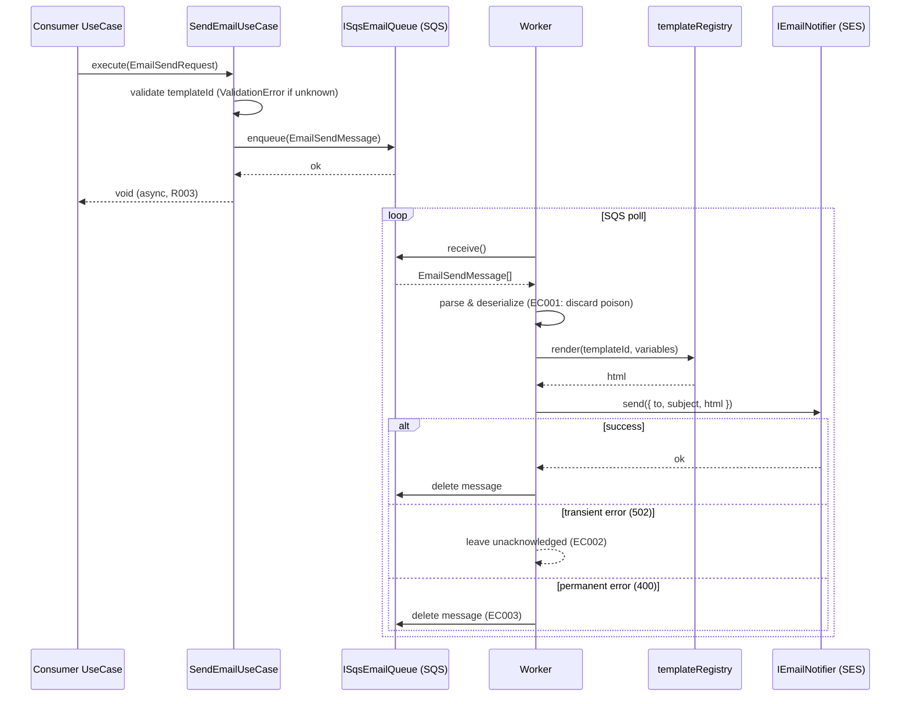

# NOTIFICATIONS-001 — Email Core: Port, SES Adapter, Async Delivery

## Problem statement

The `auth`, `billing`, and `subscriptions` modules need to send transactional emails (welcome, receipt, activation), but no email-sending mechanism exists in the stack. Each future consumer would otherwise be forced to couple directly to a provider, own its own queueing logic, and reduplicate template management. This feature introduces the `notifications` module: a typed port, React Email templates compiled in code, and an asynchronous SQS-backed delivery pipeline, so any consumer can request a send without knowing the provider or the queue.

## Alternatives

| Alternative | Description | Decision |
|---|---|---|
| Option A: In-process synchronous send | The use case calls the SES adapter directly and `await`s the result before returning to the caller; no queue is involved. | Not chosen — violates R003 (caller must not wait for provider delivery) and NF002 (a provider outage causes request failures). |
| Option B: Fastify plugin hook + Bull/BullMQ in-process queue | A Fastify plugin enqueues jobs into a Redis-backed BullMQ queue; a worker pool runs in the same process. | Not chosen — introduces Redis as a new runtime dependency, requires the API process to also run workers (violates NF003: independent scalability), and adds significant operational complexity not present in the existing stack. |
| Option C: Port & Adapter with SQS queue + standalone worker process | A `SendEmailUseCase` enqueues a message to SQS and returns immediately; a separate `worker.ts` entrypoint polls SQS, renders the template, and dispatches via the SES adapter. Retry and DLQ are configured at the SQS level. | **Chosen** — satisfies R003 (async), NF002 (queue durability), NF003 (independent worker process), NF004 (config-file-only env access), and aligns with the existing Port & Adapter pattern (`PaymentProvider` / `MobbexProvider`). |

## Chosen solution

**Port & Adapter with SQS queue and standalone SES worker**

`SendEmailUseCase` (port consumer) enqueues a validated `EmailSendMessage` JSON payload to SQS and returns immediately, satisfying R003 and R007. A separate `worker.ts` process polls SQS; each message is deserialized, the template is looked up in the `templateRegistry`, rendered with React Email's `render()`, and dispatched through the `IEmailNotifier` → `SesEmailNotifier` adapter, satisfying R001, R002, R004, and R009. Transient provider failures leave the message unacknowledged so SQS re-delivers it, satisfying R005 and EC002. Messages that exhaust the SQS `maxReceiveCount` are routed to the DLQ by the queue configuration, satisfying R006 and EC003. Malformed payloads are caught, logged, and deleted without retry, satisfying EC001. Structured log entries at every pipeline stage (request, enqueue, dispatch, retry, dead-letter) cover R008 with no rendered content (NF001).

The `IEmailNotifier` port is defined inside `apps/services/src/modules/notifications/` because it is a backend-only contract (unlike `PaymentProvider` in `@repo/types`, which is needed by `apps/web` for type checks). Template variables are typed through a discriminated `EmailTemplateMap` so the compiler enforces completeness at the call site (R002). Provider credentials and ARNs are isolated to `notificationsConfig.ts` per the no-`process.env`-outside-config-files convention (NF004).

## Technical design

### Template system

A `EmailTemplateMap` type in `@repo/types` maps each `templateId` string literal to its variables shape. The `templateRegistry` in the notifications module is a `Record<keyof EmailTemplateMap, TemplateRenderer>` where each entry holds a `render(vars) => string` function backed by a React Email component.

```ts
// packages/types/src/index.ts — additions
export interface EmailTemplateMap {
  'example.welcome_demo': { recipientName: string };
}

export type EmailTemplateId = keyof EmailTemplateMap;

export interface EmailSendRequest<T extends EmailTemplateId = EmailTemplateId> {
  to: string;
  templateId: T;
  variables: EmailTemplateMap[T];
  requestId?: string;
  userId?: string;
}
```

The compile-time guarantee (R002) comes from the generic bound: `SendEmailUseCase.execute<T extends EmailTemplateId>(req: EmailSendRequest<T>)`.

### Port

```ts
// apps/services/src/modules/notifications/ports/iEmailNotifier.ts
export interface IEmailNotifier {
  send(params: { to: string; subject: string; html: string }): Promise<void>;
}
```

The port is deliberately narrow — it only sends a pre-rendered email. Template rendering is the use case's responsibility, keeping the adapter free of template logic.

### SES Adapter

```ts
// apps/services/src/modules/notifications/adapters/sesEmailNotifier.ts
export class SesEmailNotifier implements IEmailNotifier {
  constructor(private readonly config: NotificationsConfig) {}
  async send(params): Promise<void> { /* SESv2 SendEmail API call */ }
}
```

Uses AWS SDK v3 `@aws-sdk/client-sesv2`. Throws `ProviderError(502)` on transient SES failures; `ProviderError(400)` on permanent ones (invalid address, etc.).

### Queue message schema

```ts
// apps/services/src/modules/notifications/dtos/emailSendMessageDto.ts (Zod)
const EmailSendMessageSchema = z.object({
  requestId: z.string().uuid(),
  userId: z.string().optional(),
  templateId: z.string(),
  to: z.string().email(),
  variables: z.record(z.unknown()),
  enqueuedAt: z.string().datetime(),
});
```

### SendEmailUseCase (enqueue path)

1. Validates `templateId` against `templateRegistry`; throws `ValidationError` if unknown (R007).
2. Constructs `EmailSendMessage` with a generated `requestId` (or forwarded from caller) and `enqueuedAt`.
3. Calls `ISqsEmailQueue.enqueue(message)`.
4. Logs `{ requestId, userId, templateId, outcome: 'enqueued', duration }` (R008, NF001).

### Worker process (`worker.ts`)

1. Polls SQS via `ISqsEmailQueue.receive()` in a loop.
2. For each message:
   a. Parses with `EmailSendMessageSchema`; on failure logs parse error + message ID and deletes message (EC001).
   b. Looks up template in `templateRegistry`; renders HTML.
   c. Calls `IEmailNotifier.send({ to, subject, html })`.
   d. On success: deletes the message from SQS; logs `{ outcome: 'dispatched' }` (R008).
   e. On transient `ProviderError` (502): does NOT delete; logs `{ outcome: 'retry' }` and leaves message for SQS redelivery (R005, EC002).
   f. On permanent `ProviderError` (400): deletes message; logs `{ outcome: 'permanent_failure' }` (EC003).
3. Handles SIGTERM/SIGINT for graceful drain.

### Example template

`ExampleWelcomeDemoEmail` React Email component mapped to `'example.welcome_demo'` — renders an HTML email with `recipientName` and exercises the full pipeline (R009).

### Config

```ts
// apps/services/src/shared/configs/notificationsConfig.ts
export const notificationsConfig = {
  sesRegion: env.SES_REGION ?? 'us-east-1',
  sesFromAddress: env.SES_FROM_ADDRESS ?? '',
  sqsQueueUrl: env.SQS_NOTIFICATIONS_QUEUE_URL ?? '',
  sqsDlqUrl: env.SQS_NOTIFICATIONS_DLQ_URL ?? '',
  sqsPollingIntervalMs: parseInt(env.SQS_POLLING_INTERVAL_MS ?? '5000', 10),
  sqsMaxMessages: parseInt(env.SQS_MAX_MESSAGES ?? '10', 10),
  sqsVisibilityTimeoutSec: parseInt(env.SQS_VISIBILITY_TIMEOUT_SEC ?? '60', 10),
};
```

### Data flow



## Files

| Path | Action | Description |
|---|---|---|
| `packages/types/src/index.ts` | MODIFY | Add `EmailTemplateMap`, `EmailTemplateId`, `EmailSendRequest` types |
| `apps/services/src/shared/configs/notificationsConfig.ts` | CREATE | Config object reading SES/SQS env vars; no `process.env` reads elsewhere |
| `apps/services/src/modules/notifications/ports/iEmailNotifier.ts` | CREATE | `IEmailNotifier` port interface: `send({ to, subject, html }): Promise<void>` |
| `apps/services/src/modules/notifications/ports/iSqsEmailQueue.ts` | CREATE | `ISqsEmailQueue` port interface: `enqueue(msg): Promise<void>`, `receive(): Promise<SqsEnvelope[]>`, `delete(receiptHandle): Promise<void>` |
| `apps/services/src/modules/notifications/dtos/emailSendMessageDto.ts` | CREATE | Zod schema `EmailSendMessageSchema` for the SQS message payload |
| `apps/services/src/modules/notifications/adapters/sesEmailNotifier.ts` | CREATE | `SesEmailNotifier` implementing `IEmailNotifier` via AWS SESv2; throws `ProviderError` on failures |
| `apps/services/src/modules/notifications/adapters/sqsEmailQueue.ts` | CREATE | `SqsEmailQueue` implementing `ISqsEmailQueue` via AWS SQS; wraps SendMessage, ReceiveMessage, DeleteMessage |
| `apps/services/src/modules/notifications/templates/exampleWelcomeDemoEmail.tsx` | CREATE | React Email component for `'example.welcome_demo'` template accepting `{ recipientName: string }` |
| `apps/services/src/modules/notifications/templates/templateRegistry.ts` | CREATE | `templateRegistry: Record<EmailTemplateId, TemplateRenderer>` mapping template IDs to render functions |
| `apps/services/src/modules/notifications/useCases/sendEmailUseCase.ts` | CREATE | `SendEmailUseCase` — validates templateId, builds message, enqueues, logs |
| `apps/services/src/modules/notifications/worker.ts` | CREATE | Standalone entrypoint: SQS poll loop, template render, SES dispatch, retry/DLQ semantics, SIGTERM drain |
| `apps/services/tests/unit/modules/notifications/ports/iEmailNotifier.test.ts` | CREATE | Structural test: `SesEmailNotifier` satisfies `IEmailNotifier` contract |
| `apps/services/tests/unit/modules/notifications/adapters/sesEmailNotifier.test.ts` | CREATE | Unit tests for `SesEmailNotifier`: transient errors → ProviderError(502), permanent errors → ProviderError(400) |
| `apps/services/tests/unit/modules/notifications/adapters/sqsEmailQueue.test.ts` | CREATE | Unit tests for `SqsEmailQueue`: enqueue, receive, delete call correct AWS SDK methods |
| `apps/services/tests/unit/modules/notifications/templates/templateRegistry.test.ts` | CREATE | Tests: registry contains `'example.welcome_demo'`; render returns non-empty HTML string |
| `apps/services/tests/unit/modules/notifications/useCases/sendEmailUseCase.test.ts` | CREATE | Unit tests for `SendEmailUseCase`: unknown templateId → ValidationError; known templateId → enqueue called; log fields confirmed |
| `apps/services/tests/unit/modules/notifications/worker.test.ts` | CREATE | Unit tests for worker dispatch logic: success path, transient failure (no delete), permanent failure (delete), poison message (parse error → delete without retry) |

## Requirement coverage

| ID | Design decision |
|---|---|
| R001 | `IEmailNotifier` port + `SendEmailUseCase` expose a typed email-sending interface accepting `templateId` and typed `variables` |
| R002 | `EmailTemplateMap` + generic bound `EmailSendRequest<T extends EmailTemplateId>` enforce variable completeness at compile time |
| R003 | `SendEmailUseCase` enqueues to SQS via `ISqsEmailQueue.enqueue()` and returns `void` immediately; no provider call in the request path |
| R004 | Worker `receive()` loop: deserializes message, renders template from `templateRegistry`, calls `IEmailNotifier.send()` |
| R005 | Worker leaves message unacknowledged on `ProviderError(502)`; SQS redelivers per queue's visibility timeout and maxReceiveCount |
| R006 | SQS queue is configured with a DLQ and `maxReceiveCount`; exhausted messages are routed automatically without application-level logic |
| R007 | `SendEmailUseCase.execute()` checks `templateId` against `templateRegistry` before enqueue; throws `ValidationError` on unknown ID |
| R008 | Structured log entries emitted at enqueue, dispatch, retry, and permanent-failure stages; fields: `requestId`, `userId`, `templateId`, `outcome`, `duration` |
| R009 | `'example.welcome_demo'` template + `ExampleWelcomeDemoEmail` component registered in `templateRegistry` exercises the full pipeline |
| NF001 | Log entries record only identifiers (`requestId`, `userId`, `templateId`); rendered HTML and variable values are never logged |
| NF002 | Unacknowledged SQS messages remain in-flight until visibility timeout expires and are redelivered; DLQ catches exhausted messages |
| NF003 | `worker.ts` is a standalone entrypoint separate from `src/index.ts`; it can be deployed and scaled independently |
| NF004 | All SES ARNs, SQS URLs, and credentials read exclusively through `notificationsConfig.ts`; no direct `process.env` in module code |
| EC001 | Worker's parse step wraps deserialization in try/catch; on failure logs `{ messageId, error }` and calls `delete()` so the poison message is removed |
| EC002 | Worker does not call `delete()` after a `ProviderError(502)`; message visibility expires and SQS redelivers |
| EC003 | Worker calls `delete()` after a `ProviderError(400)` (permanent provider error); SQS's DLQ also catches messages that exceed `maxReceiveCount` |
| EC004 | Worker is idempotent by design; a crash after SES dispatch but before `delete()` results in redelivery and a duplicate send, which is accepted for this feature |
