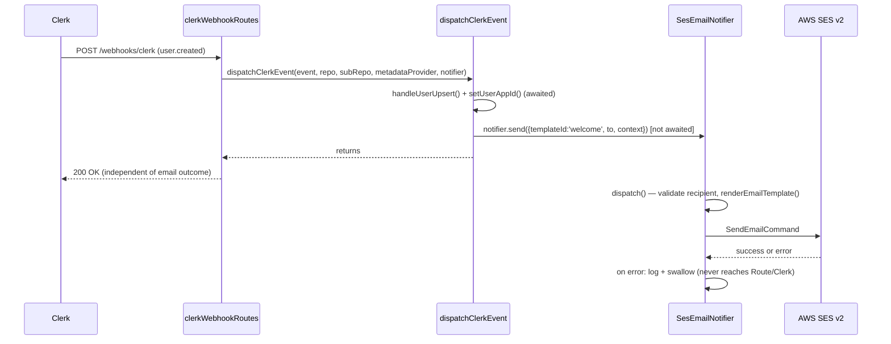

# NOTIFICATIONS-001 — Core de envío de email transaccional (in-process) + email de bienvenida

## Problem statement

Backend modules (`apps/services`) need to notify users by email (welcome, transactional notices) but there is no send mechanism today. Modules need a way to trigger an email — identified by a template id and filled with typed context — without blocking their own flow, without depending on the concrete provider, and without a failure in rendering/delivery ever reaching or interrupting the caller. The `user.created` Clerk webhook is the first consumer that must validate this core end-to-end via a welcome email.

## Alternatives

| Alternative | Description | Decision |
|---|---|---|
| In-process direct port/adapter (fire-and-forget) | A consumer calls a typed `EmailNotifier.send()` port method (constructor-injected) that returns immediately (`void`); internally, a detached async pipeline renders the template and delivers it through an SES v2 adapter, self-guarded by a catch-and-log wrapper. | **Chosen** — satisfies R001–R006 directly, mirrors the mandated `PaymentProvider`/`MobbexProvider` shape, adds no infrastructure beyond the existing single-process App Runner deployment. |
| In-memory event bus (pub/sub) | Consumers `emit('email.requested', payload)` on a shared `EventEmitter`; a listener registered at startup performs render + deliver. | Not chosen — a generic event payload cannot discriminate template-specific context per template id at the call site, weakening the compile-time enforcement required by EC004. It also introduces an extra indirection layer (emitter + listener registration) that the technical constraints do not ask for and that duplicates, in spirit, the same port/adapter shape the constraints explicitly mandate mirroring from `billing`. |
| In-memory queue + worker loop | Sends are pushed onto a local array/queue; a `setInterval`-driven loop drains it, with retry/backoff bookkeeping for failed items. | Not chosen — this reintroduces durable-looking queue/retry semantics and a background worker abstraction, which the technical constraints explicitly rule out ("no SQS queue and no separate worker process", "no durable queue, persistent retries, or separate worker" is out of scope). It also adds unbounded scope beyond what analysis.md requires. |

## Chosen solution

**In-process direct port/adapter (fire-and-forget)**

An `EmailNotifier` port (exposed from `@repo/types`, per the technical constraint mirroring the `PaymentProvider`/`MobbexProvider` pattern) exposes a single generic method, `send<T>(input: SendEmailInput<T>): void`. Its `void` return type encodes the non-blocking contract (R001, NF001) directly in the type system: nothing about the signature invites the caller to `await` it. The concrete `SesEmailNotifier` adapter (module-owned, under `modules/notifications/providers/`, exactly like `MobbexProvider` lives under `modules/billing/providers/` despite being consumed by more than one module) implements rendering (R002) via React Email and delivery (R003) via `@aws-sdk/client-sesv2`, fully encapsulated behind the port so consumers never import the concrete adapter (technical constraint).

Fault isolation (R004, R005, NF002) is achieved with two cooperating layers, reconciling two BACKEND.md rules that would otherwise conflict for this specific shape:
- The adapter's private `dispatch()` method follows the standard **adapter** error-handling rule (`try/catch` required on every external call; log the original error and re-throw a typed `DomainError`): SES failures are caught, logged with the original error/stack (EC003), and re-thrown as `ProviderError`.
- The public `send()` method is the mandatory **fire-and-forget wrapper** (BACKEND.md: "Fire-and-forget async work: Forbidden without a wrapper that catches and logs"): it calls `dispatch()` without awaiting it and attaches a `.catch()` that logs and stops. Because nothing upstream of `send()` ever awaits the returned promise, no rejection — from an unknown template id, a malformed recipient, or a provider failure — can propagate to or block the calling module.

This solution was chosen over the alternatives because it requires no new infrastructure, respects every technical constraint verbatim, and gives the cleanest mapping from EARS requirements to a single class + a template registry.

The `notifications` module has no `SPEC.md` yet (only `FEATURES.md`); there is no existing implemented state to reconcile against, so this design introduces the module's structure from scratch, guided only by `BACKEND.md` conventions and the `billing`/`webhooks/clerk` precedents read directly from source.

## Technical design

### Types (`@repo/types`)

```ts
export interface WelcomeEmailContext {
  recipientName: string;
}

// One entry per registered template id — extended by future features, never removed.
export interface EmailTemplateContextMap {
  welcome: WelcomeEmailContext;
}

export type EmailTemplateId = keyof EmailTemplateContextMap;

export interface SendEmailInput<T extends EmailTemplateId = EmailTemplateId> {
  templateId: T;
  to: string;
  context: EmailTemplateContextMap[T];
}

// The port — every email send goes through this interface (EC004: T ties `templateId` to `context`'s shape at compile time).
export interface EmailNotifier {
  send<T extends EmailTemplateId>(input: SendEmailInput<T>): void;
}
```

`@repo/types` has no runtime dependencies (per `ARCHITECTURE.md`), so only plain interfaces/types live here — the actual `.tsx` template components and the AWS SDK usage live in `apps/services`.

### Config (`src/shared/configs/emailConfig.ts`)

Mirrors `mobbexConfig.ts` shape — one typed object, no direct `process.env` reads elsewhere:

```ts
export const emailConfig = {
  sesRegion: env.SES_REGION ?? 'us-east-1',
  senderEmail: env.EMAIL_SENDER_ADDRESS ?? '',
};
```

### Template registry (`src/modules/notifications/templates/`)

- `welcomeEmail.tsx` — a React Email `.tsx` component `WelcomeEmail(props: WelcomeEmailContext)` built from `@react-email/components` primitives (`Html`, `Head`, `Body`, `Container`, `Heading`, `Text`), plus an exported `welcomeEmailSubject` string.
- `emailTemplateRegistry.ts` — `Record<EmailTemplateId, { subject: string; Component: (props) => ReactElement }>`; today only the `welcome` key.
- `renderEmailTemplate.ts` — `renderEmailTemplate<T>(templateId: T, context): Promise<{ subject, html, text } | undefined>`. Looks the id up in the registry (returns `undefined` if absent — this is what makes R004/EC001 possible without a throw); when found, builds the element with `createElement(Component, context)` and calls `render()` from `react-email` twice — once for HTML, once with `{ plainText: true }` for the text version (R002).

### Provider adapter (`src/modules/notifications/providers/`)

- `sesEmailNotifier.ts` — `SesEmailNotifier implements EmailNotifier`, constructed with `{ region, senderEmail }`, owning a `SESv2Client`.
  - `send()`: fire-and-forget wrapper (see "Chosen solution" above). Returns `void` (R001, NF001).
  - `dispatch()` (private, async): validates `to` against a simple email regex first (EC002 — silent-fail early return with a justifying comment per BACKEND.md's Silent-fail exception rule, since a malformed recipient is non-critical and the caller already returned); then calls `renderEmailTemplate`; if `undefined`, logs a `warn` identifying the missing template id and returns (R004, EC001, silent-fail); otherwise builds and sends a `SendEmailCommand` (`FromEmailAddress: senderEmail`, `Destination.ToAddresses: [to]`, `Content.Simple.{Subject,Body.Html,Body.Text}`) through `SESv2Client.send` (R003); on SES failure, logs the original error with stack and re-throws `ProviderError` (R005, EC003), which `send()`'s wrapper then swallows.
  - **NF003 (no PII in logs):** every log call in this class includes only `templateId` (and, on delivery failure, `err`) — never `to`, `context`, `subject`, `html`, or `text`.
- `resolveNotifier.ts` — singleton factory mirroring `resolveProvider.ts`: builds one `SesEmailNotifier` from `emailConfig` on first call, fails fast (throws a plain `Error`, same pattern as the Clerk webhook signing-secret check) if `senderEmail` is empty, and returns the cached instance afterwards.

### Welcome-email wiring (`src/modules/webhooks/clerk/`)

- `clerkEventHandlers.ts`: `handleUserUpsert` now also returns the derived `email` and `name` (already computed internally) alongside `id`, so the caller doesn't re-derive them. `dispatchClerkEvent` gains a `notifier: EmailNotifier` parameter; inside the `case 'user.created'` branch only (never `case 'user.updated'`), after the existing repository/metadata-provider calls, it calls `notifier.send({ templateId: 'welcome', to: email, context: { recipientName: name } })` — not awaited, so the webhook response is unaffected by anything downstream (R006, NF001).
  - **EC005 (no duplicate welcome email):** de-duplication relies entirely on this call living inside the `user.created` switch case, which is structurally distinct from `user.updated` — exactly the assumption recorded in analysis.md ("no durable idempotency store is introduced"). No additional dedup code is added.
- `routes.ts`: instantiates `resolveNotifier()` once at plugin registration (same lifecycle as the existing repository/provider instantiations) and passes it into every `dispatchClerkEvent(...)` call.

### Flow



## Files

| Path | Action | Description |
|---|---|---|
| `packages/types/src/index.ts` | MODIFY | Add `WelcomeEmailContext`, `EmailTemplateContextMap`, `EmailTemplateId`, `SendEmailInput`, `EmailNotifier`. |
| `apps/services/package.json` | MODIFY | Add dependencies: `@aws-sdk/client-sesv2`, `react-email`, `@react-email/components`, `react`, `react-dom`. |
| `apps/services/tsconfig.json` | MODIFY | Add `"jsx": "react-jsx"` so `.tsx` template files compile. |
| `apps/services/jest.config.ts` | MODIFY | Broaden the `ts-jest` `transform` pattern to also match `.tsx` files. |
| `apps/services/src/shared/configs/emailConfig.ts` | CREATE | Typed config: `sesRegion`, `senderEmail`. |
| `apps/services/src/modules/notifications/templates/welcomeEmail.tsx` | CREATE | `WelcomeEmail` React Email component + `welcomeEmailSubject`. |
| `apps/services/src/modules/notifications/templates/emailTemplateRegistry.ts` | CREATE | `emailTemplateRegistry` mapping `EmailTemplateId` → `{ subject, Component }`. |
| `apps/services/src/modules/notifications/templates/renderEmailTemplate.ts` | CREATE | `renderEmailTemplate()` — registry lookup + HTML/text rendering via `react-email`'s `render`. |
| `apps/services/src/modules/notifications/providers/sesEmailNotifier.ts` | CREATE | `SesEmailNotifier implements EmailNotifier` — fire-and-forget `send()`, private `dispatch()` (validation, render, SES delivery, fault isolation). |
| `apps/services/src/modules/notifications/providers/resolveNotifier.ts` | CREATE | Singleton factory building `SesEmailNotifier` from `emailConfig`. |
| `apps/services/src/modules/webhooks/clerk/clerkEventHandlers.ts` | MODIFY | `handleUserUpsert` also returns `email`/`name`; `dispatchClerkEvent` accepts `notifier` and dispatches the welcome email on `user.created`. |
| `apps/services/src/modules/webhooks/clerk/routes.ts` | MODIFY | Instantiate `resolveNotifier()` and pass it to `dispatchClerkEvent`. |
| `apps/services/tests/unit/modules/notifications/providers/sesEmailNotifier.test.ts` | CREATE | Unit tests for `SesEmailNotifier` (R001, R003, R004, R005, EC001–EC004, NF001–NF003). |
| `apps/services/tests/unit/modules/notifications/templates/renderEmailTemplate.test.ts` | CREATE | Unit tests for `renderEmailTemplate` (R002). |
| `apps/services/tests/unit/modules/notifications/providers/resolveNotifier.test.ts` | CREATE | Unit tests for `resolveNotifier` singleton behavior (R003). |
| `apps/services/tests/unit/modules/webhooks/clerk/clerkEventHandlers.test.ts` | MODIFY | Add welcome-email dispatch assertions (R006, EC005); update existing `dispatchClerkEvent(...)` calls to pass a mock notifier. |

## Requirement coverage

| ID | Design decision |
|---|---|
| R001 | `EmailNotifier.send()` returns `void` and never awaits its internal `dispatch()` call — control returns to the caller immediately. |
| R002 | `renderEmailTemplate()` renders the registered React Email component to HTML and, separately, to plain text via `react-email`'s `render(element, { plainText: true })`. |
| R003 | `SesEmailNotifier.dispatch()` builds and sends a `SendEmailCommand` through `SESv2Client`, resolved once via `resolveNotifier()`. |
| R004 | `renderEmailTemplate()` returns `undefined` for an unregistered id; `dispatch()` logs a `warn` with the template id and returns without throwing. |
| R005 | `dispatch()`'s adapter-style `try/catch` around the SES call logs and re-throws `ProviderError`; `send()`'s fire-and-forget `.catch()` swallows it — no propagation to the caller. |
| R006 | `dispatchClerkEvent`'s `case 'user.created'` calls `notifier.send({ templateId: 'welcome', to, context })` after the existing user-upsert/metadata steps. |
| NF001 | `send()`'s `void` return + un-awaited `dispatch()` call — no perceptible latency added to the caller. |
| NF002 | The fire-and-forget wrapper on `send()` guarantees no provider failure/slowness can degrade or interrupt the originating request. |
| NF003 | Every log call in `SesEmailNotifier` includes only `templateId` (and `err` on failure) — never `to`, `context`, `subject`, `html`, or `text`. |
| EC001 | Same as R004 — `renderEmailTemplate()` returning `undefined` is the signal for "template id not registered". |
| EC002 | `dispatch()` validates `to` against an email regex before rendering/sending; on failure, logs a `warn` and returns (silent-fail, commented per BACKEND.md). |
| EC003 | The SES `catch` block logs the original provider error (with stack) before re-throwing `ProviderError`. |
| EC004 | `SendEmailInput<T extends EmailTemplateId>`'s `context: EmailTemplateContextMap[T]` ties the literal `templateId` to its exact context shape — an incomplete/incorrect context literal fails `tsc`. |
| EC005 | The welcome-email call lives only inside the `case 'user.created'` branch of `dispatchClerkEvent`, structurally distinct from `case 'user.updated'` — no separate idempotency store is introduced, per the assumption recorded in analysis.md. |
