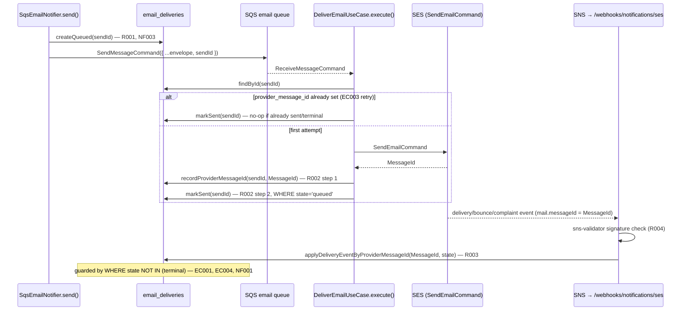

# NOTIFICATIONS-002 — Email Delivery Tracking via Provider Webhook

## Problem statement

NOTIFICATIONS-001 sends email asynchronously but records nothing durable about what happens to a send beyond worker log lines, so delivery problems cannot be diagnosed or audited once those logs roll off. This feature persists a lifecycle record for every send request at acceptance time, evolves it as the worker dispatches to SES and as SES's delivery-event notifications arrive over an authenticated SNS webhook, and makes the dispatch step idempotent so a reprocessed queue message never causes a duplicate send to the provider.

## Alternatives

| Alternative | Description | Decision |
|---|---|---|
| A — Provider-message-id correlation with a decoupled two-step worker write | The worker writes the SES-issued `provider_message_id` as its own durable step immediately after `SendEmailCommand` returns, separate from the `sent` state transition; the webhook correlates incoming SES events to rows by that same `provider_message_id`, and every state-changing write is a single conditional `UPDATE ... WHERE` guard. | **Chosen** — satisfies R001-R005 and EC001-EC004 with no changes to NOTIFICATIONS-001's wire protocol beyond adding one field to the existing envelope, and no new AWS API surface beyond what R003's technical constraint already mandates (SES + SNS). |
| B — Correlation via a self-assigned SES message tag (switch to SES v2 `EmailTags`) | Tag every outbound `SendEmail` call with our own `sendId` via the SES v2 API's `EmailTags`, which SNS echoes back in `mail.tags` on every event notification; the webhook then never depends on our own DB write having landed before the notification arrives, closing the EC001 race entirely. | Not chosen — requires swapping `SesEmailSender` from `@aws-sdk/client-ses` (SES v1, chosen and shipped by NOTIFICATIONS-001) to `@aws-sdk/client-sesv2` to gain tag support, which is scope creep into an already-delivered feature's provider adapter for a race window (see justification below) that Alternative A already closes for every realistic timing. |
| C — Append-only event log with reconciliation | Both the worker and the webhook append immutable rows to a new `email_delivery_events` table instead of updating `email_deliveries` directly; a background job periodically folds the event log into the current-state row. | Not chosen — R001-R005 are all specified as synchronous "on arrival, transition state" requirements, not eventual-consistency requirements; this introduces a new table, a new background job, and reconciliation-lag behavior that no R-ID or NF-ID asks for. The event-log's natural use case (aggregated metrics/history) is explicitly out of scope. |

## Chosen solution

**A — Provider-message-id correlation with a decoupled two-step worker write**

- **R001 / NF003**: the record is created in `queued` state by `SqsEmailNotifier.send()` *before* the SQS `SendMessageCommand` call, not after — so a send that is enqueued but never dispatched still has a visible, diagnosable row, and a DB write failure here aborts the send before it is ever queued (no dangling message without a row).
- **R002**: the worker's `DeliverEmailUseCase.execute()` performs the SES call and, on success, executes two independent, idempotent writes: first `recordProviderMessageId` (guarded by `provider_message_id IS NULL`), then `markSent` (guarded by `state = 'queued'`). Splitting these into two writes is what makes EC003 possible — see below.
- **R003 / R004**: `apps/services/src/modules/webhooks/ses/routes.ts` is a new webhook module (per the "Webhook modules" convention) that verifies the inbound SNS notification's signature with `sns-validator` — the AWS-maintained ("aws-sdk-bot") package implementing the exact mechanism AWS's own docs describe (fetch `SigningCertURL` over HTTPS, verify the RSA signature, `SignatureVersion`-aware) — satisfying the "no custom/simplified verification" constraint without hand-rolling crypto. A `TopicArn` equality check against `notificationsConfig.sesEventsTopicArn` is layered on top as defense-in-depth (recommended by the same AWS doc) and follows the existing "fail-fast secret check" pattern (webhook plugin throws at registration if the expected topic ARN is unset), with the topic ARN standing in for mobbex's shared secret since SNS has no shared-secret concept.
- **R005 / EC003**: before calling SES, `DeliverEmailUseCase.execute()` looks up the record by the send's id. If `provider_message_id` is already set (written by a prior attempt that crashed before `markSent` committed, or before the SQS delete/ack landed), the use case skips the SES call entirely and only (re)attempts `markSent` — this is exactly what "detect the identifier already issued by the provider" means: the identifier is durable in `email_deliveries`, not re-derived from SES.
- **EC001**: the webhook's write, `applyDeliveryEventByProviderMessageId`, is a single `UPDATE ... WHERE state NOT IN (<terminal states>)` keyed on `provider_message_id`, independent of whether the row is currently `queued` or `sent`. Because `recordProviderMessageId` is written synchronously, in-process, immediately after the SES call returns — before the worker does anything else — it is committed well before SES can generate and SNS can deliver a delivery event for that same message (which requires an out-of-process round trip to the receiving mail server first). The later `markSent`, guarded by `state = 'queued'`, becomes a no-op once the webhook has already moved the row to a terminal state, which is the literal EC001 requirement ("a later `sent` transition ... shall not overwrite that already-applied terminal state").
- **EC002 / EC004 / NF001**: `applyDeliveryEventByProviderMessageId` returns a discriminated outcome (`applied` / `not_found` / `already_terminal`) used only for logging; in all three cases the webhook always replies `200` and never returns an error for these cases (R004's error response is reserved for authentication failure). The `WHERE state NOT IN (<terminal>)` guard makes duplicate or late notifications for an already-terminal row a safe no-op (NF001, EC004), and a `provider_message_id` with no matching row is logged and discarded without creating anything (EC002).
- Dependencies confirmed present per analysis.md: NOTIFICATIONS-001's port/adapter/worker (`modules/notifications/`) and AUTH-002's Supabase CLI/migration convention (`apps/services/supabase/migrations/`). `duck-spec/modules/notifications/SPEC.md` was read; it confirms NOTIFICATIONS-001 shipped exactly the port/adapter/worker this feature extends and explicitly lists "persistence of send history... consumption of provider delivery/bounce/complaint webhooks" as its own deferred out-of-scope item, i.e. this feature.
- ds-context sections consulted: Stack, App architecture, Background workers, Coding conventions, Logging strategy, Domain error model, Error handling rules, Security plugins (checked — no change; SNS auth is signature-based, not the global CORS/Helmet plugins), Feature module structure (+ Repository interface pattern, Layer rules), Webhook modules, Database client (+ Query rules), Configuration, Tests, Scripts, Comments. "Cursor-based pagination" was checked and is not applicable — this feature adds no listing endpoint (API exposure is explicitly out of scope).
- One deliberate, minimal deviation from strict scope-avoidance: `SendEmailCommand` must carry `ConfigurationSetName` for SES to emit any event to SNS at all — without it, no notification is ever generated regardless of topic/subscription setup. This is treated as a required technical detail of R003, not scope creep, and is added to `notificationsConfig` alongside the new topic ARN.

## Technical design

### Data model

`apps/services/supabase/migrations/20260723000000_email_deliveries.sql` (new migration, following the `transactions`/`billing_webhook_events` convention — plain `postgres.js`-queried table, no RLS, `set_updated_at()` trigger reused from the existing migration set):

```sql
CREATE TABLE email_deliveries (
  id                  UUID         PRIMARY KEY,               -- client-generated sendId (see below); no DEFAULT
  template_id         TEXT         NOT NULL,
  recipient_email     TEXT         NOT NULL,
  user_id             UUID         REFERENCES users(id) ON DELETE SET NULL,
  state               TEXT         NOT NULL DEFAULT 'queued'
                         CHECK (state IN ('queued', 'sent', 'delivered', 'bounced', 'complained', 'failed')),
  provider_message_id TEXT         UNIQUE,
  created_at          TIMESTAMPTZ  NOT NULL DEFAULT now(),
  updated_at          TIMESTAMPTZ  NOT NULL DEFAULT now()
);

CREATE TRIGGER email_deliveries_set_updated_at
  BEFORE UPDATE ON email_deliveries
  FOR EACH ROW EXECUTE FUNCTION set_updated_at();

-- Webhook correlation lookup (R003, EC001, EC002)
CREATE UNIQUE INDEX idx_email_deliveries_provider_message_id
  ON email_deliveries (provider_message_id) WHERE provider_message_id IS NOT NULL;
```

`id` has no `DEFAULT gen_random_uuid()` because it must be known by the caller (`SqsEmailNotifier`) before insertion, so the same id can be embedded in the SQS envelope and read back by the worker.

### Envelope change (extends NOTIFICATIONS-001)

`EmailSendMessage` gains a `sendId` distinct from the existing `requestId` (which correlates *log lines within one HTTP request* and is not unique per send — a single request could enqueue more than one email):

```ts
// modules/notifications/entities/emailSendMessage.ts
export interface EmailSendMessage<K extends EmailTemplateId = EmailTemplateId> {
  sendId: string;      // NEW — unique per send; primary key of its email_deliveries row
  requestId: string;
  templateId: K;
  variables: EmailTemplateVariables[K];
  to: string;
  userId?: string;
}
```

`EmailSendMessageSchema` gains `sendId: z.string().min(1)`.

### Shared repository

`email_deliveries` is written and read by both `modules/notifications` (producer + worker) and the new `modules/webhooks/ses`, so per the "shared repositories" rule it lives in `shared/repositories/`, mirroring `identityDBRepository.ts`:

```ts
// shared/repositories/interfaces/iEmailDeliveriesRepository.ts
export type EmailDeliveryState = 'queued' | 'sent' | 'delivered' | 'bounced' | 'complained' | 'failed';
export type TerminalEmailDeliveryState = 'delivered' | 'bounced' | 'complained' | 'failed';
export type ApplyDeliveryEventOutcome = 'applied' | 'not_found' | 'already_terminal';

export interface EmailDeliveryRecord {
  id: string;
  state: EmailDeliveryState;
  providerMessageId: string | null;
}

export interface IEmailDeliveriesRepository {
  createQueued(input: { id: string; templateId: string; to: string; userId: string | null }): Promise<void>;
  findById(id: string): Promise<EmailDeliveryRecord | null>;
  recordProviderMessageId(id: string, providerMessageId: string): Promise<void>;
  markSent(id: string): Promise<void>;
  applyDeliveryEventByProviderMessageId(
    providerMessageId: string,
    state: TerminalEmailDeliveryState,
  ): Promise<ApplyDeliveryEventOutcome>;
}
```

`EmailDeliveriesDBRepository implements IEmailDeliveriesRepository` (`shared/repositories/emailDeliveriesDBRepository.ts`), following the `IdentityDBRepository`/`MobbexBillingSyncRepository` style (constructor-injected `Sql`, try/catch → log + `ProviderError(502)` on every query, duration logging):

- `createQueued` — single `INSERT ... VALUES (id, templateId, to, userId, 'queued')`. Any failure (e.g. PK collision, though practically impossible with a fresh UUID) surfaces as `ProviderError` and aborts `send()` before enqueueing (R001).
- `findById` — `SELECT id, state, provider_message_id FROM email_deliveries WHERE id = $1`; `null` if not found.
- `recordProviderMessageId` — `UPDATE email_deliveries SET provider_message_id = $2 WHERE id = $1 AND provider_message_id IS NULL` (idempotent; a second call from a retry that reaches this line again is a harmless no-op).
- `markSent` — `UPDATE email_deliveries SET state = 'sent' WHERE id = $1 AND state = 'queued'` (no-op once already `sent` or moved to a terminal state by the webhook — EC001).
- `applyDeliveryEventByProviderMessageId` — `UPDATE email_deliveries SET state = $2 WHERE provider_message_id = $1 AND state NOT IN ('delivered','bounced','complained','failed') RETURNING id`; if 0 rows, a follow-up `SELECT 1 FROM email_deliveries WHERE provider_message_id = $1` distinguishes `not_found` (EC002) from `already_terminal` (EC004) purely for the log line — the persisted state is correct either way without it.

### Producer change (`SqsEmailNotifier`)

`send()` now takes the `IEmailDeliveriesRepository` (constructor-injected) and, before enqueueing:

1. Generates `sendId = randomUUID()`.
2. Calls `repository.createQueued({ id: sendId, templateId, to, userId })` — **awaited before** the SQS `SendMessageCommand` (R001, NF003: the row must exist before the message can possibly be dequeued).
3. Includes `sendId` in the `EmailSendMessage` envelope.

`resolveEmailNotifier()` is updated to construct `new EmailDeliveriesDBRepository(db)` and pass it into `SqsEmailNotifier`, mirroring how it already wires the `SQSClient`.

### Delivery-side port change (`IEmailSender` / `SesEmailSender`)

`IEmailSender.send()` must return the provider-issued id so the use case can persist it:

```ts
export interface IEmailSender {
  send(message: EmailMessage): Promise<{ providerMessageId: string }>;
}
```

`SesEmailSender.send()` adds `ConfigurationSetName: notificationsConfig.sesConfigurationSetName` to the `SendEmailCommand` input (required for SES to publish any event to SNS at all — see justification above) and returns `{ providerMessageId: response.MessageId! }` on success. Error classification (400 vs 502) is unchanged.

### Worker use case change (`DeliverEmailUseCase`)

```ts
class DeliverEmailUseCase {
  constructor(
    private readonly sender: IEmailSender,
    private readonly deliveries: IEmailDeliveriesRepository,
  ) {}

  async execute(message: EmailSendMessage): Promise<void> {
    const existing = await this.deliveries.findById(message.sendId);

    // R005, EC003: a prior attempt already got an id from the provider — do not call it again,
    // just (re)attempt the state transition, which is itself idempotent (markSent's WHERE guard).
    if (existing?.providerMessageId) {
      await this.deliveries.markSent(message.sendId);
      return;
    }

    const template = emailTemplateRegistry[message.templateId];
    try {
      const subject = template.subject(message.variables);
      const html = await template.render(message.variables);
      const { providerMessageId } = await this.sender.send({ to: message.to, subject, html });

      // R002: two independent, idempotent writes — see "Chosen solution" for why they are split.
      await this.deliveries.recordProviderMessageId(message.sendId, providerMessageId);
      await this.deliveries.markSent(message.sendId);
    } catch (err) {
      // unchanged logging/re-throw behavior from NOTIFICATIONS-001
      ...
    }
  }
}
```

`emailWorker.ts` constructs `new EmailDeliveriesDBRepository(db)` alongside `SesEmailSender` and passes it into `DeliverEmailUseCase`.

### Webhook module (`modules/webhooks/ses`)

New feature module, registered in `app.ts` **before** `clerkAuthPlugin` (per the "Registration order" convention) at `POST /webhooks/notifications/ses`.

- **Raw body**: SNS posts with `Content-Type: text/plain; charset=UTF-8` (confirmed against AWS's own HTTP notification docs), not `application/json` — this webhook registers a scoped `addContentTypeParser('text/plain', { parseAs: 'buffer' }, ...)`, unlike the existing `clerk`/`mobbex` webhooks which override `application/json`.
- **Fail-fast config check**: at plugin registration, throws if `notificationsConfig.sesEventsTopicArn` is unset (mirrors the mobbex "fail-fast secret check").
- **Envelope validation**: raw body → `JSON.parse` → `SnsNotificationSchema` (Zod; `dtos/snsNotificationSchema.ts`) checking the outer SNS envelope shape (`Type`, `MessageId`, `TopicArn`, `Message`, `Signature`, `SignatureVersion`, `SigningCertURL`, optional `SubscribeURL`).
- **R004 — authentication**: `validateSnsMessage()` (`snsSignatureValidator.ts`) wraps `sns-validator`'s callback API in a Promise; any rejection (bad/missing signature, untrusted `SigningCertURL` host, wrong `SignatureVersion`) is thrown as `UnauthorizedError` — the route handler itself has no try/catch (errors bubble to `errorHandler.ts` per the "Routes / handlers: None" rule), which produces the `{ code: 'UNAUTHORIZED', message }` / 401 response and never reaches the dispatch logic (contents are not processed).
- **Defense-in-depth**: `validated.TopicArn !== notificationsConfig.sesEventsTopicArn` also throws `UnauthorizedError`.
- **`SubscriptionConfirmation`**: fetches `SubscribeURL` (Node's global `fetch`) to complete the SNS HTTPS subscription handshake — without this, the topic never delivers real notifications to this endpoint. Not itself an R-ID but required plumbing for R003, exactly as NOTIFICATIONS-001's `src/worker.ts` entrypoint was required plumbing for its R-IDs.
- **`Notification`**: `JSON.parse(validated.Message)` → `SesEventSchema` (Zod; `dtos/sesEventSchema.ts`, checks only `eventType: string` and `mail.messageId: string`, `.passthrough()` for the rest) → `dispatchSesEvent(event, repository)`.
- `sesEventHandlers.ts` maps `eventType` to a terminal state (`Delivery → delivered`, `Bounce → bounced`, `Complaint → complained`, `Reject → failed`); any other `eventType` (`Send`, `Open`, `Click`, `DeliveryDelay`, `Rendering Failure`, etc. — outside R003's four target states) is logged at `info` and ignored, never reaching the repository.
- The handler always replies `200 { received: true }` except on the authentication failures above (R004) — malformed inner content, unknown identifiers (EC002), and already-terminal rows (EC004) are all logged-and-discarded with a `200`, matching "shall not return an error response."

### Configuration

`shared/configs/notificationsConfig.ts` (extended):

```ts
export const notificationsConfig = {
  // ...existing fields...
  sesConfigurationSetName: env.NOTIFICATIONS_SES_CONFIGURATION_SET_NAME ?? '',
  sesEventsTopicArn: env.NOTIFICATIONS_SES_EVENTS_TOPIC_ARN ?? '',
};
```

Provisioning the SNS topic, the SES configuration set's SNS event destination, and the topic-to-endpoint HTTPS subscription itself is external infrastructure (same treatment as the SQS queue/DLQ in NOTIFICATIONS-001) — this feature's Files section is limited to `apps/services` application code that reads the resulting identifiers from config.

### Flow



## Files

| Path | Action | Description |
|---|---|---|
| `apps/services/supabase/migrations/20260723000000_email_deliveries.sql` | CREATE | `email_deliveries` table, `updated_at` trigger, unique partial index on `provider_message_id`. |
| `apps/services/package.json` | MODIFY | Add `sns-validator` dependency and `@types/sns-validator` devDependency. |
| `apps/services/.env.example` | MODIFY | Document `NOTIFICATIONS_SES_CONFIGURATION_SET_NAME`, `NOTIFICATIONS_SES_EVENTS_TOPIC_ARN`. |
| `apps/services/src/shared/configs/notificationsConfig.ts` | MODIFY | Add `sesConfigurationSetName`, `sesEventsTopicArn`. |
| `apps/services/src/shared/repositories/interfaces/iEmailDeliveriesRepository.ts` | CREATE | `IEmailDeliveriesRepository`, `EmailDeliveryState`, `TerminalEmailDeliveryState`, `EmailDeliveryRecord`, `ApplyDeliveryEventOutcome`. |
| `apps/services/src/shared/repositories/emailDeliveriesDBRepository.ts` | CREATE | `EmailDeliveriesDBRepository` — `postgres.js`-backed implementation. |
| `apps/services/src/modules/notifications/entities/emailSendMessage.ts` | MODIFY | Add `sendId: string`. |
| `apps/services/src/modules/notifications/dtos/emailSendMessageSchema.ts` | MODIFY | Add `sendId: z.string().min(1)`. |
| `apps/services/src/modules/notifications/providers/sqsEmailNotifier.ts` | MODIFY | Take `IEmailDeliveriesRepository`; generate `sendId`; `createQueued` before enqueue; include `sendId` in envelope. |
| `apps/services/src/modules/notifications/providers/resolveEmailNotifier.ts` | MODIFY | Construct `EmailDeliveriesDBRepository(db)` and inject into `SqsEmailNotifier`. |
| `apps/services/src/modules/notifications/providers/interfaces/iEmailSender.ts` | MODIFY | `send()` returns `Promise<{ providerMessageId: string }>`. |
| `apps/services/src/modules/notifications/providers/sesEmailSender.ts` | MODIFY | Add `ConfigurationSetName`; return `{ providerMessageId }`. |
| `apps/services/src/modules/notifications/useCases/deliverEmailUseCase.ts` | MODIFY | Take `IEmailDeliveriesRepository`; pre-dispatch idempotency check (R005/EC003); two-step persistence (R002). |
| `apps/services/src/modules/notifications/worker/emailWorker.ts` | MODIFY | Construct `EmailDeliveriesDBRepository(db)` and pass into `DeliverEmailUseCase`. |
| `apps/services/src/modules/webhooks/ses/dtos/snsNotificationSchema.ts` | CREATE | Zod schema for the outer SNS envelope. |
| `apps/services/src/modules/webhooks/ses/dtos/sesEventSchema.ts` | CREATE | Zod schema for the inner SES event (`eventType`, `mail.messageId`). |
| `apps/services/src/modules/webhooks/ses/snsSignatureValidator.ts` | CREATE | `validateSnsMessage()` — promisified `sns-validator` wrapper (R004). |
| `apps/services/src/modules/webhooks/ses/sesEventHandlers.ts` | CREATE | `dispatchSesEvent()` — eventType→state mapping and dispatch to the repository. |
| `apps/services/src/modules/webhooks/ses/routes.ts` | CREATE | Fastify plugin: raw body parser, fail-fast config check, signature/topic verification, `SubscriptionConfirmation` handling, dispatch, always-200 response. |
| `apps/services/src/app.ts` | MODIFY | Register the SES webhook plugin before `clerkAuthPlugin`. |
| `apps/services/tests/mocks/fakeEmailSender.ts` | MODIFY | Update `send()` to return `{ providerMessageId }`. |
| `apps/services/tests/mocks/fakeEmailDeliveriesRepository.ts` | CREATE | `FakeEmailDeliveriesRepository implements IEmailDeliveriesRepository` test fixture. |
| `apps/services/tests/unit/shared/repositories/emailDeliveriesDBRepository.test.ts` | CREATE | Unit tests for the repository's guarded queries. |
| `apps/services/tests/unit/modules/notifications/providers/sqsEmailNotifier.test.ts` | MODIFY | Add coverage for `createQueued`-before-enqueue and `sendId` in the envelope. |
| `apps/services/tests/unit/modules/notifications/useCases/deliverEmailUseCase.test.ts` | MODIFY | Add coverage for the pre-dispatch idempotency check and the two-step persistence. |
| `apps/services/tests/unit/modules/notifications/providers/sesEmailSender.test.ts` | CREATE | Unit tests for the `providerMessageId` return contract and `ConfigurationSetName`. |
| `apps/services/tests/unit/modules/webhooks/ses/snsSignatureValidator.test.ts` | CREATE | Tests for the validator wrapper's resolve/reject behavior. |
| `apps/services/tests/unit/modules/webhooks/ses/sesEventHandlers.test.ts` | CREATE | Tests for eventType→state mapping and outcome logging. |
| `apps/services/tests/unit/modules/webhooks/ses/routes.test.ts` | CREATE | Tests for R003, R004, EC001, EC002, EC004 end-to-end through the route. |

## Requirement coverage

| ID | Design decision |
|---|---|
| R001 | `SqsEmailNotifier.send()` calls `repository.createQueued()` and awaits it before enqueueing to SQS. |
| R002 | `DeliverEmailUseCase.execute()`, after a successful `SesEmailSender.send()`, calls `recordProviderMessageId()` then `markSent()`. |
| R003 | `modules/webhooks/ses/routes.ts` + `sesEventHandlers.dispatchSesEvent()` map the SES event to `delivered`/`bounced`/`complained`/`failed` via `applyDeliveryEventByProviderMessageId()`. |
| R004 | `snsSignatureValidator.validateSnsMessage()` (via `sns-validator`) plus the `TopicArn` check; failure throws `UnauthorizedError`, handled by `errorHandler.ts`, before any dispatch occurs. |
| R005 | `DeliverEmailUseCase.execute()`'s pre-dispatch `findById()` check skips the SES call entirely when `provider_message_id` is already recorded. |
| NF001 | `applyDeliveryEventByProviderMessageId`'s `WHERE state NOT IN (<terminal>)` guard makes a duplicate notification for an already-terminal row a no-op. |
| NF002 | `markSent`'s `WHERE state = 'queued'` guard plus the pre-dispatch `provider_message_id` check together prevent a reprocessed message from calling SES twice. |
| NF003 | `createQueued()` is awaited before the SQS enqueue call, so the row exists at acceptance time regardless of whether dispatch ever happens. |
| EC001 | `recordProviderMessageId` is written synchronously before any out-of-process SES delivery can occur; `markSent`'s `state = 'queued'` guard is a no-op once the webhook has already applied a terminal state. |
| EC002 | `applyDeliveryEventByProviderMessageId` returns `not_found` when no row matches; `sesEventHandlers` logs and discards without creating a row, and the route always replies `200`. |
| EC003 | `recordProviderMessageId` and `markSent` are independent writes; on retry, `findById` reveals a non-null `provider_message_id` and the use case skips straight to `markSent` without calling SES again. |
| EC004 | `applyDeliveryEventByProviderMessageId`'s `WHERE state NOT IN (<terminal>)` guard makes the update a no-op when the row is already terminal; outcome `already_terminal` is logged, no state change, `200` response. |
