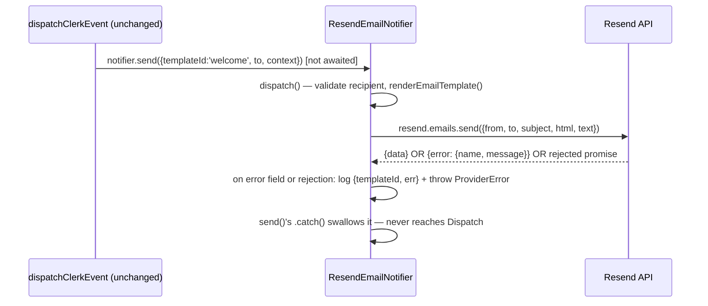

# NOTIFICATIONS-002 — Migración del envío de email a Resend

## Problem statement

`SesEmailNotifier`, the only implementation of the `EmailNotifier` port, talks to AWS SES v2 — infrastructure that no longer exists after the move off AWS. The backend cannot send any email today, and a missing sender address aborts startup instead of degrading the send. This feature swaps the concrete adapter behind the unchanged `EmailNotifier` port for a Resend-backed implementation, without touching the port, the templates, or any consumer module.

## Chosen solution

**Resend adapter as a drop-in replacement for `SesEmailNotifier` (same port, same fire-and-forget shape)**

`ResendEmailNotifier` replaces `SesEmailNotifier` as the sole implementation of `EmailNotifier`. It keeps the exact class shape the port and BACKEND.md mandate: a public `send()` fire-and-forget wrapper (`void`, never awaited by the caller — R001, NF001, NF002) around a private `dispatch()` that validates the recipient, renders through the existing `renderEmailTemplate()` pipeline unchanged (R002, R003, EC005), and performs the external call inside a `try/catch` that logs the original error and re-throws a `ProviderError` (BACKEND.md adapter rule; R005, EC001–EC003, NF003).

The one real design decision this migration introduces is bridging the Resend Node SDK's error-reporting shape to that `try/catch` rule. Unlike the AWS SDK, `resend.emails.send()` does **not** reject on API-level failures (invalid API key, unverified domain, rate limit) — it resolves with `{ data: null, error: { name, message } }`. Network-level failures still reject normally. To keep a single, BACKEND.md-compliant error path, `dispatch()` treats a truthy `error` field as a thrown value (`if (error) throw error;`) so both failure modes — SDK rejection and SDK-returned error — funnel through the same `catch`, which logs `{ templateId, err }` (never PII, NF003) and re-throws `ProviderError('Failed to send email via Resend', 502, err)`. `send()`'s existing `.catch()` swallows it, exactly as it did for SES.

`emailConfig` drops `sesRegion` and gains `resendApiKey` (from `RESEND_API_KEY`), keeping `senderEmail` (from `EMAIL_SENDER_ADDRESS`, R004, EC004). `resolveNotifier()` keeps its current fail-fast singleton shape (analysis.md assumption) but now also fails fast when `resendApiKey` is empty, alongside the existing `senderEmail` check, since both are required to construct a working Resend client — this is not new startup semantics (SERVICES-010 stays out of scope), it is the same "required config absent → throw" rule already in place, applied to the one new required field.

`sesEmailNotifier.ts` and `@aws-sdk/client-sesv2` are deleted (R006, EC006) so `resolveNotifier()` has exactly one adapter to wire.

This solution was chosen directly — `effort: medium` calls for one solution, not an alternatives comparison — because it is the only shape that satisfies the constraint "must not require modifications in the modules that consume the send port": the port, the templates, and the Clerk webhook call sites are untouched; only the notifications module's provider layer, its config, and its own tests change.

The `notifications` module's `SPEC.md` describes `SesEmailNotifier` as "the only implementation of `EmailNotifier`" resolved via `resolveNotifier()` from `emailConfig` — this design's job is to make that same sentence true again with Resend as the provider, not to change the shape SPEC.md already documents.

## Technical design

### Config (`src/shared/configs/emailConfig.ts`)

```ts
export const emailConfig = {
  resendApiKey: env.RESEND_API_KEY ?? '',
  senderEmail: env.EMAIL_SENDER_ADDRESS ?? '',
};
```

`sesRegion`/`SES_REGION` are removed — Resend has no region concept relevant here. `senderEmail`/`EMAIL_SENDER_ADDRESS` is unchanged (EC004: same env var, so an environment already configured for the sender address does not need to change it).

### Provider adapter (`src/modules/notifications/providers/resendEmailNotifier.ts`)

```ts
import { Resend } from 'resend';
import type { EmailNotifier, EmailTemplateId, SendEmailInput } from '@repo/types';

export interface ResendEmailNotifierConfig {
  apiKey: string;
  senderEmail: string;
}

export class ResendEmailNotifier implements EmailNotifier {
  private readonly client: Resend;
  private readonly senderEmail: string;

  constructor(config: ResendEmailNotifierConfig) {
    this.client = new Resend(config.apiKey);
    this.senderEmail = config.senderEmail;
  }

  send<T extends EmailTemplateId>(input: SendEmailInput<T>): void { /* unchanged fire-and-forget wrapper */ }

  private async dispatch<T extends EmailTemplateId>(input: SendEmailInput<T>): Promise<void> {
    // 1. validate `to` (EC002) — unchanged regex guard, unchanged log shape
    // 2. renderEmailTemplate(templateId, context) — unchanged; undefined → warn + return (R004, EC001)
    // 3. deliver:
    try {
      const { error } = await this.client.emails.send({
        from: this.senderEmail,
        to: [input.to],
        subject: rendered.subject,
        html: rendered.html,
        text: rendered.text,
      });
      if (error) {
        throw error; // bridges Resend's returned-error shape into the catch below
      }
    } catch (err) {
      logger.error({ templateId: input.templateId, err }, 'Failed to send email via Resend');
      throw new ProviderError('Failed to send email via Resend', 502, err);
    }
  }
}
```

- `send()` is byte-for-byte the same fire-and-forget wrapper `SesEmailNotifier` had (R001, NF001, NF002) — no behavior changes at that layer.
- Both HTML and text are passed in the same call (EC005) — `renderEmailTemplate()` is untouched, so this was already true and stays true.
- **EC001** (unverified sender domain) and **EC003** (rate limit) surface as `{ error: { name, message } }` from `resend.emails.send()` — Resend's documented error codes are `validation_error` (422, includes unverified-domain sends), `rate_limit_exceeded` (429), `daily_quota_exceeded`/`monthly_quota_exceeded` (429). All of them hit the same `if (error) throw error` branch, so they are handled identically: logged with `{ templateId, err }`, wrapped in `ProviderError`, swallowed by `send()`. No branching by error name — the fire-and-forget contract does not care which provider error occurred (R005, NF002).
- **EC002** (invalid API key) surfaces the same way — `error.name` would be an auth-related code (e.g. `validation_error`/`restricted_api_key` depending on the key state) — same handling path, one log entry per attempted send, no retry.
- **NF003**: the log payload is `{ templateId, err }` only — `err` is the Resend `{ name, message }` object or a native `Error`, neither of which carries recipient, context, subject, or body. Same shape `SesEmailNotifier` already used.

### Factory (`src/modules/notifications/providers/resolveNotifier.ts`)

Same singleton shape as before, updated to build `ResendEmailNotifier` and to fail fast on both required fields:

```ts
function createResendEmailNotifier(): ResendEmailNotifier {
  const { resendApiKey, senderEmail } = emailConfig;
  if (!resendApiKey) throw new Error('Missing required env var: RESEND_API_KEY');
  if (!senderEmail) throw new Error('Missing required env var: EMAIL_SENDER_ADDRESS');
  return new ResendEmailNotifier({ apiKey: resendApiKey, senderEmail });
}
```

### Dependency swap

`apps/services/package.json`: remove `@aws-sdk/client-sesv2`, add `resend`. No other adapter in the codebase imports `@aws-sdk/client-sesv2` after `sesEmailNotifier.ts` is deleted (R006 — verified by the file's deletion and the dependency's absence from `package.json`; nothing else in the repo references the SDK).

### Unchanged (explicitly, per technical constraints)

- `@repo/types`'s `EmailNotifier`, `SendEmailInput`, `EmailTemplateContextMap`, `EmailTemplateId` — the port (R002).
- `src/modules/notifications/templates/*` — registry, `welcomeEmail.tsx`, `renderEmailTemplate.ts` (R003, EC005).
- `src/modules/webhooks/clerk/clerkEventHandlers.ts` and `routes.ts` — they depend on `EmailNotifier` and `resolveNotifier()`, both of which keep their existing signatures; only the object `resolveNotifier()` builds changes.
- `resolveNotifier()`'s current fail-fast-on-missing-config behavior (analysis.md assumption; changing it is SERVICES-010).



## Files

| Path | Action | Description |
|---|---|---|
| `apps/services/package.json` | MODIFY | Remove `@aws-sdk/client-sesv2`; add `resend` (R006). |
| `apps/services/src/shared/configs/emailConfig.ts` | MODIFY | Replace `sesRegion` with `resendApiKey` (from `RESEND_API_KEY`); keep `senderEmail` (R004, EC004). |
| `apps/services/src/modules/notifications/providers/resendEmailNotifier.ts` | CREATE | `ResendEmailNotifier implements EmailNotifier` — fire-and-forget `send()`, private `dispatch()` (validation, render, Resend delivery, error-shape bridging, fault isolation). |
| `apps/services/src/modules/notifications/providers/sesEmailNotifier.ts` | DELETE | SES v2 adapter retired (R006, EC006). |
| `apps/services/src/modules/notifications/providers/resolveNotifier.ts` | MODIFY | Build `ResendEmailNotifier` from `emailConfig.resendApiKey`/`senderEmail`; fail fast if either is empty. |
| `apps/services/tests/unit/shared/configs/emailConfig.test.ts` | CREATE | Unit tests for `emailConfig` defaults/env overrides (`resendApiKey`, `senderEmail`) (R004, EC004). |
| `apps/services/tests/unit/modules/notifications/providers/resendEmailNotifier.test.ts` | CREATE | Unit tests for `ResendEmailNotifier` (R001, R003, R004, R005, EC001–EC003, EC005, NF001–NF003). |
| `apps/services/tests/unit/modules/notifications/providers/sesEmailNotifier.test.ts` | DELETE | Superseded by `resendEmailNotifier.test.ts` (R006, EC006). |
| `apps/services/tests/unit/modules/notifications/providers/resolveNotifier.test.ts` | MODIFY | Update env var names (`RESEND_API_KEY`) and assert the cached singleton is a `ResendEmailNotifier`; add the new fail-fast case for a missing `RESEND_API_KEY` (R003, R004, R006, EC006). |

## Requirement coverage

| ID | Design decision |
|---|---|
| R001 | `ResendEmailNotifier.send()` keeps the unchanged fire-and-forget wrapper — returns `void`, never awaits `dispatch()`. |
| R002 | `EmailNotifier` port in `@repo/types` is untouched; `ResendEmailNotifier` implements the same signature consumer modules already call. |
| R003 | `dispatch()` renders through the unchanged `renderEmailTemplate()` pipeline, then delivers via `resend.emails.send()`. |
| R004 | `emailConfig.resendApiKey`/`senderEmail` are read from typed config (`RESEND_API_KEY`/`EMAIL_SENDER_ADDRESS`), no direct `process.env` reads elsewhere. |
| R005 | `dispatch()`'s `try/catch` around the Resend call (including the `if (error) throw error` bridge) logs and re-throws `ProviderError`; `send()`'s `.catch()` swallows it — no propagation to the caller. |
| R006 | `sesEmailNotifier.ts` and `@aws-sdk/client-sesv2` are deleted from `package.json` and the codebase. |
| NF001 | `send()`'s `void` return + un-awaited `dispatch()` — unchanged, no perceptible latency added. |
| NF002 | The fire-and-forget wrapper guarantees no Resend failure/slowness can degrade or interrupt the originating request. |
| NF003 | Every log call in `ResendEmailNotifier` includes only `templateId` (and `err` on failure) — never `to`, `context`, `subject`, `html`, or `text`. |
| EC001 | Resend's `validation_error` for an unverified sender domain hits `if (error) throw error` → logged (`templateId` + provider error, no PII) → swallowed; the originating webhook still returns 200 because `send()` was never awaited. |
| EC002 | An invalid API key surfaces as a returned `error` (or a rejected promise) on every attempted send — same log-once, no-retry, no-surface path as any other provider error. |
| EC003 | Resend's `rate_limit_exceeded` hits the same `if (error) throw error` path — logged and dropped, no retry or queueing. |
| EC004 | `senderEmail` is read from `emailConfig` (env-driven), never hardcoded in `resendEmailNotifier.ts`. |
| EC005 | `resend.emails.send()` is called once with both `html` and `text` populated from `renderEmailTemplate()`'s output. |
| EC006 | `sesEmailNotifier.ts` is deleted and `resolveNotifier()` only ever constructs `ResendEmailNotifier` — exactly one active `EmailNotifier` implementation. |
