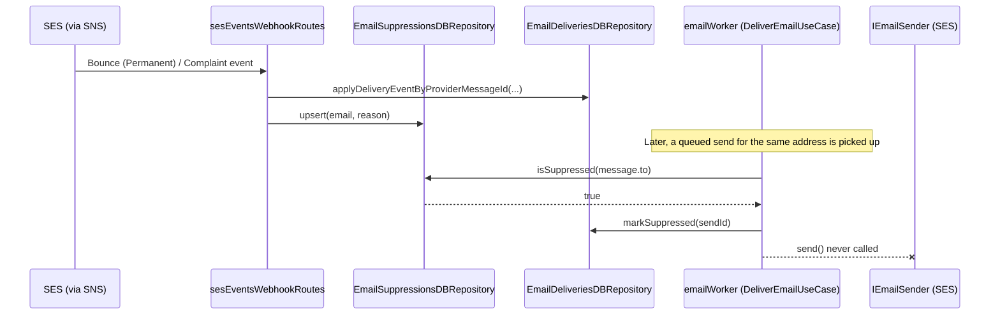

# NOTIFICATIONS-003 — Email Suppression List

## Problem statement

The system knows (via NOTIFICATIONS-002 delivery tracking) which recipient addresses bounce permanently or report spam, but nothing stops it from repeatedly dispatching to them. AWS SES penalizes — and can suspend — the sending account once bounce/complaint rates cross provider thresholds, so permanently-bad addresses must be recorded once and checked before every future dispatch.

## Alternatives

| Alternative | Description | Decision |
|---|---|---|
| Dedicated `email_suppressions` repository, checked in `DeliverEmailUseCase` before dispatch | A new entity/table/repository owns suppression state; the webhook upserts into it on permanent bounce/complaint, the worker's use case queries it right before calling the provider. | **Chosen** — matches the explicit technical constraint (dedicated table), respects "one repository per entity per data source" (deliveries and suppressions are distinct entities), and puts the check exactly where R003/R004 require it. |
| Fold suppression state into `email_deliveries` (derive suppression from historical rows instead of a new table) | Query `email_deliveries` for any prior row with a `bounced`/`complained` state for the recipient instead of maintaining a separate list. | Not chosen — contradicts the technical constraint requiring a dedicated `email_suppressions` table with a unique email key; `email_deliveries` has no `bounce type` (permanent vs. transient) column so EC001 could not be evaluated without widening that table's schema; mixes two entities (a delivery attempt vs. a suppression fact) in one repository, violating the "one repository per entity" rule; and repeat-suppression-as-update (R005) has no natural single row to update. |
| In-memory suppression cache refreshed on an interval, backed by the same table | Worker holds a periodically-refreshed in-memory set of suppressed addresses to avoid a DB round trip per message. | Not chosen — introduces cache-staleness risk that directly threatens EC002 (an address suppressed after a message was enqueued must be caught at dispatch time; a stale cache could still let it through until the next refresh), and NF001 only requires no *perceptible* latency, which a single indexed primary-key lookup already satisfies without a cache's added invalidation complexity. Out of scope per analysis.md (no caching requirement stated). |

## Chosen solution

**Dedicated `email_suppressions` repository, checked in `DeliverEmailUseCase` before dispatch**

This satisfies R001 (a persistent table recording reason + timestamp per address), R002 (the SES webhook upserts into it on permanent bounce/complaint, independent of the delivery-state transition already handled in NOTIFICATIONS-002), R003/R004 (the worker's use case queries the list and short-circuits to the new `suppressed` state before ever calling `IEmailSender`), and R005/NF002 (a single `INSERT … ON CONFLICT (email) DO UPDATE` — the same idiom already used by `usageCounterDBRepository.ts` and `clerkSyncRepository.ts` — makes insertion naturally idempotent and turns a repeat suppression into an update). It keeps the `email_deliveries` and `email_suppressions` concerns in separate repositories per BACKEND.md's "one repository per entity per data source" rule, and it does not require touching `apps/web`/`apps/landing` (no UI is in scope). No `duck-spec/modules/notifications/SPEC.md` capability conflicts with this approach — suppression is explicitly listed there as "planned, out of scope" for NOTIFICATIONS-001/002.

## Technical design

### Data model

New table `email_suppressions` (Supabase migration):

```sql
CREATE TABLE email_suppressions (
  email         TEXT         PRIMARY KEY,
  reason        TEXT         NOT NULL CHECK (reason IN ('bounce', 'complaint')),
  suppressed_at TIMESTAMPTZ  NOT NULL DEFAULT now(),
  updated_at    TIMESTAMPTZ  NOT NULL DEFAULT now()
);

CREATE TRIGGER email_suppressions_set_updated_at
  BEFORE UPDATE ON email_suppressions
  FOR EACH ROW EXECUTE FUNCTION set_updated_at();
```

`email` as the `PRIMARY KEY` satisfies R001's "keyed by email address" and gives `isSuppressed` an O(log n) index lookup (NF001). `reason` + `suppressed_at` satisfy R001's "records the suppression reason and the timestamp." A repeat suppression (R005) becomes `ON CONFLICT (email) DO UPDATE SET reason = EXCLUDED.reason, updated_at = now()`.

`email_deliveries.state`'s `CHECK` constraint is widened to add `'suppressed'` (technical constraint: "a new `suppressed` state is added to the `email_deliveries` lifecycle").

### Interfaces

```ts
// shared/repositories/interfaces/iEmailSuppressionsRepository.ts
export type SuppressionReason = 'bounce' | 'complaint';

export interface IEmailSuppressionsRepository {
  upsert(email: string, reason: SuppressionReason): Promise<void>;
  isSuppressed(email: string): Promise<boolean>;
}
```

```ts
// shared/repositories/interfaces/iEmailDeliveriesRepository.ts (extended)
export type EmailDeliveryState = 'queued' | 'sent' | 'delivered' | 'bounced' | 'complained' | 'failed' | 'suppressed';

export interface IEmailDeliveriesRepository {
  // ...existing methods unchanged
  markSuppressed(id: string): Promise<void>;
}
```

`EmailSuppressionsDBRepository` follows the same `guarded()` try/catch/log/ProviderError wrapper pattern already used by `EmailDeliveriesDBRepository`.

### Webhook flow (R002, EC001, EC003)

`SesEventSchema` is extended with optional `bounce` and `complaint` sub-objects (SES's actual event shape) to expose exactly what's needed to decide suppression, without touching the already-validated `mail`/`eventType` fields:

```ts
bounce: z.object({
  bounceType: z.string().optional(),
  bouncedRecipients: z.array(z.object({ emailAddress: z.string() }).passthrough()).optional(),
}).passthrough().optional(),
complaint: z.object({
  complainedRecipients: z.array(z.object({ emailAddress: z.string() }).passthrough()).optional(),
}).passthrough().optional(),
```

`dispatchSesEvent` gains a second repository parameter (`IEmailSuppressionsRepository`) and, in addition to its existing delivery-state mapping, independently derives suppression targets:

- `eventType === 'Bounce' && bounce.bounceType === 'Permanent'` → upsert every `bounce.bouncedRecipients[].emailAddress` with reason `'bounce'` (EC001: `bounceType !== 'Permanent'`, e.g. `'Transient'`, is skipped — no upsert call).
- `eventType === 'Complaint'` → upsert every `complaint.complainedRecipients[].emailAddress` with reason `'complaint'`.

This suppression upsert is unconditional — it runs regardless of what `applyDeliveryEventByProviderMessageId` returns (`applied` / `already_terminal` / `not_found`), so a complaint for a delivery already in a terminal state still suppresses the address while leaving that delivery record's own state untouched (EC003), because the two writes target different tables and neither is gated on the other's outcome.

### Worker dispatch flow (R003, R004, EC002, EC004, NF001)

`DeliverEmailUseCase` gains a third constructor dependency, `IEmailSuppressionsRepository`. Its private `dispatch()` method — the single call site that leads to `IEmailSender.send()` — checks suppression first:

```ts
private async dispatch(message: EmailSendMessage): Promise<void> {
  if (await this.suppressions.isSuppressed(message.to)) {
    await this.deliveries.markSuppressed(message.sendId);
    return; // R004: provider is never called
  }
  // ...existing render + send + recordProviderMessageId + markSent flow, unchanged
}
```

Because `dispatch()` only runs when `wasAlreadyDispatched()` is false (i.e. the provider was never actually called for this `sendId` before), this is exactly the "about to dispatch" moment R003 describes. Checking at processing time — not at enqueue time — is what makes EC002 hold: an address suppressed after its message was enqueued is still caught, because the query runs when the worker picks the message up, not when it was published. Each queue message maps to its own `email_deliveries` row (its own `sendId`), so concurrent messages to the same freshly-suppressed address (EC004) each independently query and independently transition their own row — no shared mutable state, no additional locking needed. `markSuppressed` guards its `UPDATE` with `WHERE state = 'queued'`, mirroring the existing `markSent` guard, so a redelivered SQS message is a harmless no-op.

`isSuppressed` is a single indexed-primary-key lookup executed once per message, immediately before the network call to SES — negligible relative to that network call, satisfying NF001.



## Files

| Path | Action | Description |
|---|---|---|
| `apps/services/supabase/migrations/20260723010000_email_suppressions.sql` | CREATE | Creates `email_suppressions` table + `updated_at` trigger; widens `email_deliveries.state` CHECK constraint to include `'suppressed'`. |
| `apps/services/src/shared/repositories/interfaces/iEmailSuppressionsRepository.ts` | CREATE | `SuppressionReason` type and `IEmailSuppressionsRepository` interface (`upsert`, `isSuppressed`). |
| `apps/services/src/shared/repositories/emailSuppressionsDBRepository.ts` | CREATE | `EmailSuppressionsDBRepository` implementing the interface via `postgres.js`, using the `guarded()` pattern. |
| `apps/services/src/shared/repositories/interfaces/iEmailDeliveriesRepository.ts` | MODIFY | Add `'suppressed'` to `EmailDeliveryState`; add `markSuppressed(id): Promise<void>` to the interface. |
| `apps/services/src/shared/repositories/emailDeliveriesDBRepository.ts` | MODIFY | Implement `markSuppressed`, guarded UPDATE `WHERE state = 'queued'`. |
| `apps/services/src/modules/notifications/useCases/deliverEmailUseCase.ts` | MODIFY | Inject `IEmailSuppressionsRepository`; check `isSuppressed` in `dispatch()` before rendering/sending; call `markSuppressed` when suppressed. |
| `apps/services/src/modules/notifications/worker/emailWorker.ts` | MODIFY | Instantiate `EmailSuppressionsDBRepository` and pass it into `new DeliverEmailUseCase(...)`. |
| `apps/services/src/modules/webhooks/ses/dtos/sesEventSchema.ts` | MODIFY | Add optional `bounce.bounceType`/`bounce.bouncedRecipients` and `complaint.complainedRecipients` fields. |
| `apps/services/src/modules/webhooks/ses/sesEventHandlers.ts` | MODIFY | Accept a second `IEmailSuppressionsRepository` parameter; derive and upsert suppression targets from permanent bounces and complaints. |
| `apps/services/src/modules/webhooks/ses/routes.ts` | MODIFY | Instantiate `EmailSuppressionsDBRepository` and pass it to `dispatchSesEvent`. |
| `apps/services/tests/mocks/fakeEmailSuppressionsRepository.ts` | CREATE | In-memory fake implementing `IEmailSuppressionsRepository` for unit tests. |
| `apps/services/tests/mocks/fakeEmailDeliveriesRepository.ts` | MODIFY | Add `markSuppressed` fake implementation (guarded on `state === 'queued'`, mirrors `markSent`). |
| `apps/services/tests/unit/shared/repositories/emailSuppressionsDBRepository.test.ts` | CREATE | Unit tests for `upsert`/`isSuppressed` SQL shape (mocked `sql`, mirrors `emailDeliveriesDBRepository.test.ts` conventions). |
| `apps/services/tests/unit/modules/notifications/useCases/deliverEmailUseCase.test.ts` | MODIFY | Add suppression-check test cases; update existing constructions of `DeliverEmailUseCase` to pass the new fake. |
| `apps/services/tests/unit/modules/notifications/worker/emailWorker.test.ts` | MODIFY | Assert the worker wires `EmailSuppressionsDBRepository` into `DeliverEmailUseCase`. |
| `apps/services/tests/unit/modules/webhooks/ses/sesEventHandlers.test.ts` | MODIFY | Add test cases for permanent-bounce/complaint suppression upserts, transient-bounce non-suppression (EC001), and terminal-delivery-unchanged-on-complaint (EC003); update existing calls to `dispatchSesEvent` with the new repository argument. |
| `apps/services/tests/unit/modules/webhooks/ses/routes.test.ts` | MODIFY | Assert the route wires `EmailSuppressionsDBRepository` into `dispatchSesEvent`. |

## Requirement coverage

| ID | Design decision |
|---|---|
| R001 | `email_suppressions` table with `email PRIMARY KEY`, `reason`, `suppressed_at`. |
| R002 | `dispatchSesEvent` upserts into `email_suppressions` on permanent `Bounce` and on `Complaint` events. |
| R003 | `DeliverEmailUseCase.dispatch()` calls `suppressions.isSuppressed(message.to)` immediately before calling `IEmailSender.send()`. |
| R004 | On `isSuppressed() === true`, `dispatch()` calls `deliveries.markSuppressed(sendId)` and returns without calling the sender. |
| R005 | `upsert` is `INSERT … ON CONFLICT (email) DO UPDATE`, turning a repeat suppression into an update of the existing row. |
| NF001 | `isSuppressed` is a single primary-key-indexed lookup, run once per message right before the provider call. |
| NF002 | The same `ON CONFLICT DO UPDATE` upsert makes a duplicate webhook delivery of the same event a no-op re-write, never an error or a duplicate row. |
| EC001 | Suppression upsert is gated on `bounce.bounceType === 'Permanent'`; `'Transient'`/other values produce no upsert call. |
| EC002 | The suppression check runs at worker dispatch time (not enqueue time), so it observes suppressions added after the message was published. |
| EC003 | The suppression upsert and the delivery-record state transition are independent writes to independent tables; the upsert always runs regardless of the delivery record's current/terminal state. |
| EC004 | Each send request has its own `email_deliveries` row (`sendId`); concurrent messages to the same address each independently query and transition their own row. |
