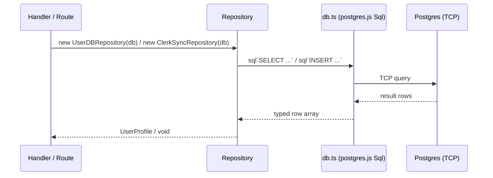

# SERVICES-002 — Replace Supabase JS client with direct Postgres driver

## Problem statement

`apps/services` uses `@supabase/supabase-js` solely as a query builder that routes every database call through PostgREST over HTTP. No Supabase-specific capabilities (auth, realtime, storage, RLS) are in use. Replacing this client with `postgres.js` eliminates the unnecessary HTTP hop and the heavy SDK runtime dependency while keeping all observable HTTP response shapes, side effects, and warning behaviors identical.

## Chosen solution

**Drop-in postgres.js singleton replacing supabase.ts**

Introduce a `postgres.js` client singleton at `src/shared/infrastructure/db.ts` that mirrors the role of the current `supabase.ts`. Rewrite `UserDBRepository` and `ClerkSyncRepository` to accept a `postgres.js` `Sql` instance instead of `SupabaseClient`, replacing every Supabase query chain with a tagged-template SQL call. Update the two handlers and the webhook routes file that currently import `supabase` to import `db` instead. Remove `@supabase/supabase-js` from `package.json`.

This solution satisfies all functional requirements (R001–R010) and both non-functional requirements (NF001, NF002). It requires no interface changes (`IUserRepository` is untouched), no new abstractions, and no new files beyond what analysis.md scopes — only the infrastructure singleton, the two repository implementations, and the three consumers that wire them are touched.

## Technical design

### postgres.js client singleton

`src/shared/infrastructure/db.ts` reads `DATABASE_URL` from the environment at module load time. If the variable is absent or empty it throws a descriptive `Error` synchronously, mirroring the existing `SUPABASE_URL`/`SUPABASE_ANON_KEY` guard in `supabase.ts` (R009, EC005). The exported value is a `postgres.js` `Sql` instance created with `postgres(DATABASE_URL)`.

```ts
// Sql type from postgres.js
export const db: Sql = postgres(databaseUrl);
```

### UserDBRepository rewrite

The constructor signature changes from `SupabaseClient` to `Sql`. Both public methods (`findByClerkUserId`, `updatePreferences`) are rewritten as tagged-template SQL queries.

`findByClerkUserId` issues:
```sql
SELECT name, email, avatar_url, locale, timezone
FROM users
WHERE clerk_user_id = $1
LIMIT 1
```
Returns the first row mapped to `UserProfile`, or `null` when the result set is empty (EC004). Driver-level errors propagate as thrown `Error` instances (EC006).

`updatePreferences` issues:
```sql
UPDATE users
SET locale = $1, timezone = $2
WHERE clerk_user_id = $3
RETURNING name, email, avatar_url, locale, timezone
```
Only the columns present in `patch` are updated; the query is built dynamically using `sql` fragments. Returns the returned row mapped to `UserProfile`. Driver-level errors propagate as thrown `Error` instances (EC006).

### ClerkSyncRepository rewrite

The constructor signature changes from `SupabaseClient` to `Sql`.

`upsertUser` issues:
```sql
INSERT INTO users (clerk_user_id, email, name, avatar_url, updated_at)
VALUES ($1, $2, $3, $4, $5)
ON CONFLICT (clerk_user_id) DO UPDATE
  SET email = EXCLUDED.email,
      name = EXCLUDED.name,
      avatar_url = EXCLUDED.avatar_url,
      updated_at = EXCLUDED.updated_at
```

`upsertOrganization` issues:
```sql
INSERT INTO organizations (clerk_org_id, name, slug, updated_at)
VALUES ($1, $2, $3, $4)
ON CONFLICT (clerk_org_id) DO UPDATE
  SET name = EXCLUDED.name,
      slug = EXCLUDED.slug,
      updated_at = EXCLUDED.updated_at
```

`createMembership` performs three sequential queries:
1. `SELECT id FROM users WHERE clerk_user_id = $1` — if no row, emit warning log and return (R007, EC001).
2. `SELECT id FROM organizations WHERE clerk_org_id = $1` — if no row, emit warning log and return (R008, EC002).
3. `INSERT INTO organization_members (user_id, org_id, role) VALUES ($1, $2, $3) ON CONFLICT (user_id, org_id) DO NOTHING` — preserves duplicate-skip semantics (R006, EC003).

Warning messages are kept textually identical to the current `console.warn` strings so no downstream log-parsing breaks.

### Handler and route wiring

`getUserProfileHandler.ts` and `updateUserProfileHandler.ts` replace the `supabase` import with `db` and pass it to `new UserDBRepository(db)`.

`modules/webhooks/clerk/routes.ts` replaces the `supabase` import with `db` and passes it to `new ClerkSyncRepository(db)`.

### Dependency change

`@supabase/supabase-js` is removed from `dependencies` in `apps/services/package.json` and `postgres` is added in its place (R010, NF002).

### Data flow



## Files

| Path | Action | Description |
|---|---|---|
| `apps/services/src/shared/infrastructure/db.ts` | CREATE | postgres.js singleton; reads DATABASE_URL, throws on missing var, exports `db: Sql` |
| `apps/services/src/shared/infrastructure/supabase.ts` | DELETE | Removed — replaced by db.ts |
| `apps/services/src/modules/users/repositories/UserDBRepository.ts` | MODIFY | Rewrite to accept `Sql`; replace Supabase chain calls with tagged-template SQL queries |
| `apps/services/src/modules/webhooks/clerk/repository.ts` | MODIFY | Rewrite to accept `Sql`; replace Supabase chain calls with tagged-template SQL queries |
| `apps/services/src/modules/users/handlers/getUserProfileHandler.ts` | MODIFY | Replace `supabase` import with `db`; pass `db` to `UserDBRepository` |
| `apps/services/src/modules/users/handlers/updateUserProfileHandler.ts` | MODIFY | Replace `supabase` import with `db`; pass `db` to `UserDBRepository` |
| `apps/services/src/modules/webhooks/clerk/routes.ts` | MODIFY | Replace `supabase` import with `db`; pass `db` to `ClerkSyncRepository` |
| `apps/services/package.json` | MODIFY | Remove `@supabase/supabase-js`; add `postgres` as a runtime dependency |

## Requirement coverage

| ID | Design decision |
|---|---|
| R001 | `db.ts` creates a `postgres.js` client connected over TCP; all repositories use it exclusively |
| R002 | `UserDBRepository.findByClerkUserId` returns `UserProfile \| null` with same shape; handler sends `{ data: profile }` unchanged |
| R003 | `UserDBRepository.updatePreferences` issues `UPDATE … RETURNING` and returns `UserProfile` with same shape; handler sends `{ data: profile }` unchanged |
| R004 | `ClerkSyncRepository.upsertUser` uses `INSERT … ON CONFLICT (clerk_user_id) DO UPDATE` with same columns (`email`, `name`, `avatar_url`, `updated_at`) |
| R005 | `ClerkSyncRepository.upsertOrganization` uses `INSERT … ON CONFLICT (clerk_org_id) DO UPDATE` with same columns (`name`, `slug`, `updated_at`) |
| R006 | `ClerkSyncRepository.createMembership` resolves UUIDs then issues `INSERT … ON CONFLICT (user_id, org_id) DO NOTHING` |
| R007 | Missing-user branch in `createMembership` emits warning log and returns without inserting (EC001) |
| R008 | Missing-org branch in `createMembership` emits warning log and returns without inserting (EC002) |
| R009 | `db.ts` throws a descriptive `Error` synchronously when `DATABASE_URL` is missing, preventing server boot (EC005) |
| R010 | `@supabase/supabase-js` removed from `package.json`; `supabase.ts` deleted; no remaining import in any runtime module |
| NF001 | `postgres.js` connects over TCP directly to Postgres; no HTTP intermediary |
| NF002 | `@supabase/supabase-js` removed from `dependencies` in `apps/services/package.json` |
| EC003 | `ON CONFLICT (user_id, org_id) DO NOTHING` preserves duplicate-skip semantics |
| EC004 | `findByClerkUserId` returns `null` when query returns zero rows |
| EC006 | postgres.js throws on driver-level errors; repositories do not swallow them, so they propagate to Fastify's error handler |
