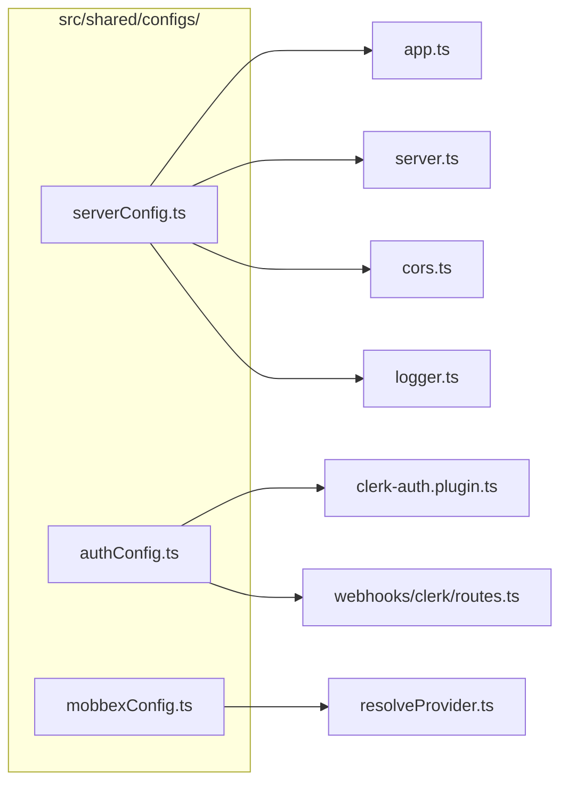

# SERVICES-003 — Centralize `process.env` reads in config files

## Problem statement

Multiple files under `apps/services/src/` read `process.env` directly instead of going through typed configuration objects. This scatters env-var coupling across the codebase, makes defaults non-discoverable from a single location, and lets new env-var dependencies be introduced without passing through the config layer. The `duck-spec/docs/BACKEND.md` convention explicitly forbids `process.env` reads outside `src/shared/configs/` (and two documented exceptions).

## Chosen solution

**Incremental scope-aligned config extraction**

Create the missing config files (`serverConfig.ts`, `authConfig.ts`) and expand the existing `mobbexConfig.ts` to cover every env var in its scope, then update each consumer to import from the appropriate config object. All changes are purely structural: defaults, error messages, and fail-fast timing are preserved verbatim. This approach satisfies R001–R008 and NF001–NF002 with minimal diff surface and zero behavioral change. It reuses the established `const env = process.env || {}` pattern mandated by BACKEND.md, making each new file consistent with `dbConfig.ts` and the existing `mobbexConfig.ts`.

## Technical design

### Config scope mapping

| Scope file | New or modified | Variables covered |
|---|---|---|
| `src/shared/configs/serverConfig.ts` | CREATE | `NODE_ENV`, `LOG_LEVEL`, `HOST`, `PORT`, `CORS_ORIGIN` |
| `src/shared/configs/authConfig.ts` | CREATE | `CLERK_JWT_KEY`, `CLERK_WEBHOOK_SIGNING_SECRET` |
| `src/shared/configs/mobbexConfig.ts` | MODIFY | Expand to include `MOBBEX_API_KEY`, `MOBBEX_ACCESS_TOKEN`, `MOBBEX_TEST_MODE`, `MOBBEX_TIMEOUT_MS`, `MOBBEX_WEBHOOK_SECRET`; add `billingProvider` (`BILLING_PROVIDER`) |

`CLERK_SECRET_KEY` and `DATABASE_URL` remain in their documented exceptions and are not touched.

### Config shapes

**`serverConfig.ts`** (CREATE)

```ts
const env = process.env || {};

export const serverConfig = {
  nodeEnv: env.NODE_ENV ?? 'development',
  logLevel: env.LOG_LEVEL ?? 'info',
  host: env.HOST ?? '0.0.0.0',
  port: Number(env.PORT ?? 3000),
  corsOrigin: env.CORS_ORIGIN ?? '*',
};
```

**`authConfig.ts`** (CREATE)

```ts
const env = process.env || {};

export const authConfig = {
  clerkJwtKey: env.CLERK_JWT_KEY,
  clerkWebhookSigningSecret: env.CLERK_WEBHOOK_SIGNING_SECRET,
};
```

**`mobbexConfig.ts`** (MODIFY — expand)

```ts
const env = process.env || {};

export const mobbexConfig = {
  billingProvider: env.BILLING_PROVIDER ?? 'mobbex',
  apiKey: env.MOBBEX_API_KEY ?? '',
  accessToken: env.MOBBEX_ACCESS_TOKEN ?? '',
  testMode: env.MOBBEX_TEST_MODE === 'true' || env.MOBBEX_TEST_MODE === '1',
  timeoutMs: parseInt(env.MOBBEX_TIMEOUT_MS ?? '10000', 10),
  webhookSecret: env.MOBBEX_WEBHOOK_SECRET ?? '',
};
```

### Consumer changes

| Consumer file | Change |
|---|---|
| `src/app.ts` | Import `serverConfig`; replace `process.env.LOG_LEVEL` with `serverConfig.logLevel` and `process.env.NODE_ENV` comparison with `serverConfig.nodeEnv` |
| `src/server.ts` | Import `serverConfig`; replace `process.env.HOST` and `process.env.PORT` reads with `serverConfig.host` and `serverConfig.port` |
| `src/shared/plugins/cors.ts` | Import `serverConfig`; replace `process.env.CORS_ORIGIN` with `serverConfig.corsOrigin` |
| `src/shared/infrastructure/logger.ts` | Import `serverConfig`; replace `process.env.LOG_LEVEL` and `process.env.NODE_ENV` with `serverConfig.logLevel` and `serverConfig.nodeEnv` |
| `src/shared/plugins/clerk-auth.plugin.ts` | Import `authConfig`; replace `process.env.CLERK_JWT_KEY` with `authConfig.clerkJwtKey`; leave `process.env.CLERK_SECRET_KEY` untouched (documented exception) |
| `src/modules/webhooks/clerk/routes.ts` | Import `authConfig`; replace `process.env.CLERK_WEBHOOK_SIGNING_SECRET` with `authConfig.clerkWebhookSigningSecret`; preserve the fail-fast throw when the value is absent |
| `src/modules/billing/providers/resolveProvider.ts` | Import `mobbexConfig`; replace all `process.env['BILLING_PROVIDER']`, `MOBBEX_*` reads with properties from `mobbexConfig` |

### Fail-fast and default preservation

All `??` defaults in the config files mirror the defaults currently inlined in consumers. The fail-fast guards in `clerk/routes.ts` and `resolveProvider.ts` that throw `Error` on missing required vars are retained in the consumers after migration — they now check the config property (which will be `undefined` or `''`) instead of `process.env` directly. The check semantics and error messages remain identical.

### Data flow (read path)



## Files

| Path | Action | Description |
|---|---|---|
| `apps/services/src/shared/configs/serverConfig.ts` | CREATE | Typed config object for `NODE_ENV`, `LOG_LEVEL`, `HOST`, `PORT`, `CORS_ORIGIN` |
| `apps/services/src/shared/configs/authConfig.ts` | CREATE | Typed config object for `CLERK_JWT_KEY` and `CLERK_WEBHOOK_SIGNING_SECRET` |
| `apps/services/src/shared/configs/mobbexConfig.ts` | MODIFY | Expand to cover `BILLING_PROVIDER` and all `MOBBEX_*` variables; drop bare `webhookSecret`-only shape |
| `apps/services/src/app.ts` | MODIFY | Replace `process.env.LOG_LEVEL` and `process.env.NODE_ENV` reads with `serverConfig` properties |
| `apps/services/src/server.ts` | MODIFY | Replace `process.env.HOST` and `process.env.PORT` reads with `serverConfig` properties |
| `apps/services/src/shared/plugins/cors.ts` | MODIFY | Replace `process.env.CORS_ORIGIN` read with `serverConfig.corsOrigin` |
| `apps/services/src/shared/infrastructure/logger.ts` | MODIFY | Replace `process.env.LOG_LEVEL` and `process.env.NODE_ENV` reads with `serverConfig` properties |
| `apps/services/src/shared/plugins/clerk-auth.plugin.ts` | MODIFY | Replace `process.env.CLERK_JWT_KEY` read with `authConfig.clerkJwtKey`; leave `CLERK_SECRET_KEY` untouched |
| `apps/services/src/modules/webhooks/clerk/routes.ts` | MODIFY | Replace `process.env.CLERK_WEBHOOK_SIGNING_SECRET` read with `authConfig.clerkWebhookSigningSecret` |
| `apps/services/src/modules/billing/providers/resolveProvider.ts` | MODIFY | Replace all `process.env` reads with properties from `mobbexConfig` |
| `apps/services/tests/unit/shared/configs/serverConfig.test.ts` | CREATE | Unit tests asserting `serverConfig` exposes correct defaults and env-driven values |
| `apps/services/tests/unit/shared/configs/authConfig.test.ts` | CREATE | Unit tests asserting `authConfig` exposes correct defaults and env-driven values |
| `apps/services/tests/unit/shared/configs/mobbexConfig.test.ts` | CREATE | Unit tests asserting expanded `mobbexConfig` exposes correct defaults, env-driven values, and dual-string test-mode acceptance |

## Requirement coverage

| ID | Design decision |
|---|---|
| R001 | `serverConfig.ts` (CREATE), `authConfig.ts` (CREATE), `mobbexConfig.ts` (MODIFY) each surface all env vars in their scope as a typed object under `src/shared/configs/` |
| R002 | `app.ts` and `server.ts` import `serverConfig` and read `logLevel`, `nodeEnv`, `host`, `port` from it instead of `process.env` |
| R003 | `cors.ts` imports `serverConfig` and reads `corsOrigin` instead of `process.env.CORS_ORIGIN` |
| R004 | `clerk-auth.plugin.ts` imports `authConfig` and reads `clerkJwtKey` instead of `process.env.CLERK_JWT_KEY` |
| R005 | `modules/webhooks/clerk/routes.ts` imports `authConfig` and reads `clerkWebhookSigningSecret` instead of `process.env.CLERK_WEBHOOK_SIGNING_SECRET` |
| R006 | `modules/billing/providers/resolveProvider.ts` imports `mobbexConfig` and reads all billing and Mobbex properties from it |
| R007 | `shared/infrastructure/logger.ts` imports `serverConfig` and reads `logLevel` and `nodeEnv` instead of `process.env` |
| R008 | Every default (`'info'`, `'0.0.0.0'`, `3000`, `'*'`, `10000`, `'mobbex'`) and every fail-fast guard is preserved verbatim in the corresponding config file and consumer |
| NF001 | Fail-fast guards in `clerk/routes.ts` and `resolveProvider.ts` still throw at registration/first-call time; they now check the config property instead of `process.env`, which reaches the same value from the same source |
| NF002 | After migration, `process.env` references exist only in `src/shared/configs/*.ts` files and the two documented exceptions (`db.ts`, `clerkAuthPlugin` for `CLERK_SECRET_KEY`) |
| EC001 | Default values in each config file (`?? 'info'`, `?? '0.0.0.0'`, etc.) match the previously inlined defaults exactly |
| EC002 | Fail-fast guards preserved verbatim in consumers; checking the config property (`undefined` when env var absent) triggers the same error with the same message |
| EC003 | `mobbexConfig.ts` evaluates `testMode` as `env.MOBBEX_TEST_MODE === 'true' \|\| env.MOBBEX_TEST_MODE === '1'`, preserving the dual-string acceptance semantics |
