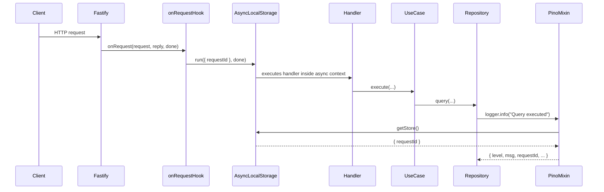

# SERVICES-005 — Propagate request-bound logging context via AsyncLocalStorage

## Problem statement

Every log line emitted during an HTTP request must include a `requestId` to allow trace correlation, as required by `duck-spec/docs/BACKEND.md`. Today, repositories, use cases, and webhook dispatchers use the static Pino logger from `shared/infrastructure/logger.ts`, which has no knowledge of the active request, so their log lines are permanently disconnected from the originating request's trace. The fix must not touch any use case, repository, or dispatcher signature.

## Chosen solution

**AsyncLocalStorage store + Pino mixin**

A single `AsyncLocalStorage<{ requestId: string }>` instance is created in a new dedicated module (`shared/infrastructure/requestContext.ts`) and exported. A Fastify `onRequest` hook registered in `app.ts` wraps the rest of the request lifecycle in `asyncLocalStorage.run({ requestId: request.id }, done)` so the store is populated for the entire duration of the request, including all async continuations. The static Pino logger in `shared/infrastructure/logger.ts` is extended with a `mixin` option that reads the store on every log call and merges `{ requestId }` into the output when the store is set, or returns `{}` otherwise.

This approach satisfies R001–R006 and NF001–NF002 because: it requires zero changes to use case, repository, or dispatcher signatures (R004); it reads `request.id` assigned by Fastify (R002); it naturally omits `requestId` outside a request because the store is undefined (R003); `AsyncLocalStorage` isolates each async chain created by `asyncLocalStorage.run` so concurrent requests cannot bleed context (R005, EC001, EC002); the mixin only appends `requestId` and leaves all other fields untouched (R006); the single shared Pino instance is kept (NF001); and only `node:async_hooks` (built-in) and the existing Pino `mixin` API are used (NF002). EC003 is satisfied because the `onRequest` hook runs before the error handler, so the store is already populated when any pre-handler error reaches the global error handler. EC004 is satisfied by the single mixin path: shared utilities simply call the static logger and the mixin resolves the store at call time.

## Technical design

### `shared/infrastructure/requestContext.ts` (new)

Exports a single `AsyncLocalStorage` instance and its store type:

```ts
import { AsyncLocalStorage } from 'node:async_hooks';

export interface RequestContext {
  requestId: string;
}

export const requestContext = new AsyncLocalStorage<RequestContext>();
```

This module is the single source of truth for the store. Nothing else creates or wraps an `AsyncLocalStorage`.

### `shared/infrastructure/logger.ts` (modified)

Adds a `mixin` option to the existing `pino(...)` call. The mixin reads the store from `requestContext.getStore()` and returns `{ requestId }` when populated, or `{}` when not:

```ts
import pino from 'pino';
import { serverConfig } from '../configs/serverConfig.js';
import { requestContext } from './requestContext.js';

export const logger = pino({
  level: serverConfig.logLevel,
  transport:
    serverConfig.nodeEnv !== 'production'
      ? { target: 'pino-pretty', options: { colorize: true } }
      : undefined,
  mixin() {
    const store = requestContext.getStore();
    return store ? { requestId: store.requestId } : {};
  },
});
```

The mixin is invoked by Pino on every log call, at the moment of serialization. This guarantees that even log lines emitted after async continuations carry the correct `requestId` because `AsyncLocalStorage` propagates the store through the async resource tree.

### `app.ts` (modified)

Registers a global `onRequest` hook immediately after the Fastify instance is created (before any plugin or route registration) that wraps the remaining lifecycle in `requestContext.run`:

```ts
fastify.addHook('onRequest', (request, _reply, done) => {
  requestContext.run({ requestId: request.id }, done);
});
```

`done`-style callback (not async) is used deliberately: passing `done` as the `AsyncLocalStorage.run` callback ensures the rest of the Fastify request lifecycle runs inside the async context, so every `await` in handlers, use cases, and repositories inherits the store through Node.js's async resource tree.

### Request lifecycle flow



### Concurrency isolation

`AsyncLocalStorage.run` creates a new async context for each invocation. Two concurrent calls to `run` with different `requestId` values produce two fully isolated async trees. Any `await`, `setImmediate`, `setTimeout`, or DB driver callback that descends from `run` inherits the context of its originating call and never sees the other call's store.

## Files

| Path | Action | Description |
|---|---|---|
| `apps/services/src/shared/infrastructure/requestContext.ts` | CREATE | Exports the `AsyncLocalStorage<RequestContext>` singleton and the `RequestContext` interface |
| `apps/services/src/shared/infrastructure/logger.ts` | MODIFY | Add `mixin` option that reads `requestContext.getStore()` and merges `{ requestId }` when present |
| `apps/services/src/app.ts` | MODIFY | Register a global `onRequest` hook that calls `requestContext.run({ requestId: request.id }, done)` |
| `apps/services/tests/unit/shared/infrastructure/requestContext.test.ts` | CREATE | Unit tests for `requestContext` store isolation (EC001, EC002) |
| `apps/services/tests/unit/shared/infrastructure/logger.test.ts` | CREATE | Unit tests for the mixin: includes `requestId` inside a store, omits it outside (R001, R002, R003) |
| `apps/services/tests/unit/shared/infrastructure/loggerRequestHook.test.ts` | CREATE | Integration-style test using Fastify `inject` to assert `requestId` presence in log output during a request and absence outside (R001, R002, R003, R005) |

## Requirement coverage

| ID | Design decision |
|---|---|
| R001 | The Pino `mixin` in `logger.ts` appends `requestId` to every log call when `requestContext.getStore()` is defined, which is the case for all code running inside `requestContext.run(...)` triggered by the `onRequest` hook |
| R002 | The `onRequest` hook passes `request.id` (the UUID generated by Fastify's `genReqId`) as the store value, so all log lines inherit the exact same ID |
| R003 | When code runs outside the `onRequest`-initiated `asyncLocalStorage.run` (server bootstrap, DB wiring, provider factory), `getStore()` returns `undefined` and the mixin returns `{}`, leaving the log line unchanged |
| R004 | No use case, repository, or dispatcher file is modified; they continue importing and calling the same static `logger` export |
| R005 | Each `requestContext.run` call creates a separate async context; `AsyncLocalStorage` guarantees isolation between concurrent runs, so log lines from parallel requests each carry only their own `requestId` |
| R006 | The mixin only injects `requestId`; all other fields (`timestamp`, `level`, `message`, and any structured fields passed by the caller) are produced by Pino as before and are not touched |
| NF001 | The single `pino(...)` instance in `logger.ts` is kept; no child loggers or per-request logger instances are created |
| NF002 | The implementation uses only `node:async_hooks` (Node.js built-in, zero install footprint) and the `mixin` option already available in the Pino version used by the project |
| EC001 | Each `requestContext.run` call creates an independent async context; two in-flight requests get separate stores that never merge |
| EC002 | `AsyncLocalStorage` propagates the store across `await`, `setImmediate`, `setTimeout`, and async driver callbacks automatically via Node.js's async resource tracking |
| EC003 | The `onRequest` hook runs before the route handler and before any schema validation or body-parsing error reaches the error handler, so the store is already populated when the global error handler fires |
| EC004 | Shared utilities call the static `logger`; the mixin reads the store at call time — inside a request it finds the store set, outside it finds it unset — with no conditional branching in the utility code itself |
