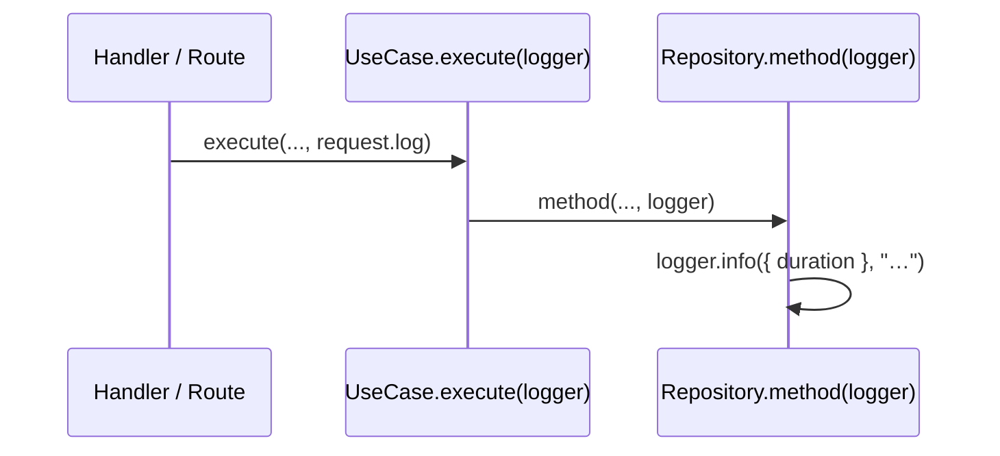
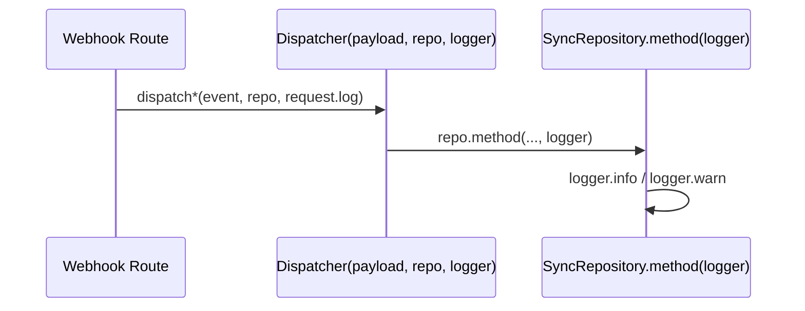

# SERVICES-005 — Propagate request-bound logger across module layers

## Problem statement

Log lines emitted inside repositories and use cases during an HTTP request do not carry `requestId` because those layers import the static Pino logger from `shared/infrastructure/logger.ts` instead of using the Fastify request-bound logger. This makes correlating query-latency traces and business-warning entries with their originating request impossible. The fix must thread `request.log` from every Fastify handler down through the use-case and into each repository method that emits log lines, while leaving the static logger in place for all code paths that run outside the request scope.

## Alternatives

| Alternative | Description | Decision |
|---|---|---|
| Store logger on constructor (field injection) | Pass the logger to the repository or use case constructor and store it as `this.logger`; replace the static import. | Not chosen — the technical constraints in analysis.md explicitly prohibit storing the logger as state. A repository or use case storing a request-bound logger also leaks request state into objects that may be reused across requests (EC004). |
| Async context propagation (AsyncLocalStorage) | Stash `request.log` in an `AsyncLocalStorage` slot at the route level and read it from any module without passing it explicitly. | Not chosen — introduces a shared mutable singleton outside the call stack, making unit testing harder (EC003), hiding the logger dependency from method signatures, and coupling infrastructure code to a Node.js-specific API in places that should stay pure. |
| Explicit per-call logger parameter | Pass the Pino-compatible logger as an argument to each repository method and each use case `execute` call; dispatcher functions accept it as an explicit parameter. | **Chosen** — directly satisfies the technical constraints (logger supplied at call time, not stored), keeps method signatures self-documenting, preserves full testability with a fake logger (EC003), and satisfies EC001 and EC004 by allowing any caller to pass either `request.log` or the static logger without code duplication. |

## Chosen solution

**Explicit per-call logger parameter**

Each repository method that emits log lines adds a `logger: pino.BaseLogger` parameter. Each use case `execute` method that delegates to a repository propagates the same logger argument. Fastify handlers supply `request.log`; code paths outside the request scope supply the static `logger` from `shared/infrastructure/logger.ts`. Dispatcher functions (`dispatchClerkEvent`, `dispatchMobbexEvent`) accept the logger as a new explicit parameter and forward it to repository method calls.

This solution satisfies:
- R001, R002, R003 — handler passes `request.log` into use case, which passes it into repository methods.
- R004, R005 — webhook dispatchers receive the logger as an argument and forward it to `ClerkSyncRepository` and `MobbexBillingSyncRepository` methods.
- R006 — every repository log line now goes through the caller-supplied logger, which carries `requestId` when coming from a request scope.
- R007 — static logger import is retained in `server.ts`, `app.ts`, `db.ts`, `resolveProvider.ts`, and any startup path; nothing removes it.
- R008 — no log message text, level, or structured field is modified.
- NF001 — `pino.BaseLogger` is fully compatible with Pino's existing call sites (`info`, `warn`, `error`).
- NF002 — no logic changes, only signature additions; build, lint, and tests remain green.
- EC001, EC004 — callers outside the request scope pass the static logger; no duplication required.
- EC002 — pre-handler failures are still surfaced through Fastify's built-in error handler using `request.log`; no handler-level change needed.
- EC003 — tests supply a Jest mock that satisfies `pino.BaseLogger`.

## Technical design

### Logger type

All repository methods and use case `execute` signatures that currently emit log lines accept one additional parameter:

```ts
import type { BaseLogger } from 'pino';
```

`pino.BaseLogger` exposes `trace`, `debug`, `info`, `warn`, `error`, `fatal` — the full subset used at existing call sites. This avoids importing Fastify types into the domain layer.

### Repository layer changes

Each repository method that calls `logger.*` today gains a `logger: BaseLogger` parameter in place of the module-level import. The static import of `logger` is removed from the repository file once all call sites are converted.

Affected repositories and methods:

**`TransactionDBRepository`** — `create`, `findById`, `findByIdempotencyKey`, `updateFailureReason`, `updateProviderData`, `list`, `getRefundsByTransactionId`

**`UserDBRepository`** — `findByClerkUserId`, `updatePreferences`, `completeOnboarding`

**`SubscriptionPlanDBRepository`** — `listActive`

**`ClerkSyncRepository`** — `upsertUser`, `upsertOrganization`, `createMembership`

**`MobbexBillingSyncRepository`** — `recordEvent`, `updateTransactionStatus`, `upsertRefundAndMaybeMarkTransactionRefunded`

### Repository interface changes

Repository interfaces (`ITransactionRepository`, `IUserRepository`, `ISubscriptionPlanRepository`, `IMobbexBillingSyncRepository`) add `logger: BaseLogger` to the signatures of every method that has a corresponding implementation change. `ClerkSyncRepository` currently has no interface; its concrete methods receive the logger directly.

The `IMobbexBillingSyncRepository` interface adds `logger: BaseLogger` to `recordEvent`, `updateTransactionStatus`, and `upsertRefundAndMaybeMarkTransactionRefunded`.

### Use case layer changes

Use case `execute` methods that delegate to a repository method that now requires a logger gain a `logger: BaseLogger` parameter and forward it:

- `CheckoutUseCase.execute` — passes logger to `repo.findByIdempotencyKey`, `repo.create`, `repo.updateProviderData`, `repo.updateFailureReason`.
- `GetTransactionUseCase.execute` — passes logger to `repo.findById`.
- `ListTransactionsUseCase.execute` — passes logger to `repo.list`.
- `GetRefundsUseCase.execute` — passes logger to `repo.findById` and `repo.getRefundsByTransactionId`.
- `GetUserProfileUseCase.execute` — passes logger to `repo.findByClerkUserId`.
- `UpdateUserProfileUseCase.execute` — passes logger to `repo.findByClerkUserId` and `repo.updatePreferences`.
- `CompleteOnboardingUseCase.execute` — passes logger to `repo.completeOnboarding`.
- `ListPlansUseCase.execute` — passes logger to `repo.listActive`.

### Handler layer changes

Each handler calls `useCase.execute(..., request.log)`. No other handler change is needed.

`listPlansHandler` is special: the repo and use case are currently instantiated at module scope (outside the handler function). The logger must be passed at call time. The module-scope instances remain; only the `execute(request.log)` call changes.

### Dispatcher changes

**`dispatchClerkEvent(event, repo, logger)`** — adds `logger: BaseLogger` as a third parameter and forwards it to `handleUserUpsert`, `handleOrganizationUpsert`, `handleMembershipCreate`. Each of those helpers gains a `logger` parameter too and passes it to `repo.*` calls.

**`dispatchMobbexEvent(payload, repo, logger)`** — adds `logger: BaseLogger` as a third parameter and forwards it to all `repo.*` calls within the dispatcher.

Webhook route handlers already use `request.log` for their own log line; they now also pass `request.log` to `dispatchClerkEvent` and `dispatchMobbexEvent`.

### Call flow



For webhook dispatchers:



## Files

| Path | Action | Description |
|---|---|---|
| `apps/services/src/modules/billing/repositories/interfaces/iTransactionRepository.ts` | MODIFY | Add `logger: BaseLogger` parameter to all method signatures |
| `apps/services/src/modules/billing/repositories/transactionDBRepository.ts` | MODIFY | Replace static `logger` import with per-method `logger` parameter on all methods |
| `apps/services/src/modules/billing/useCases/checkoutUseCase.ts` | MODIFY | Add `logger: BaseLogger` to `execute`; forward to all `repo.*` calls |
| `apps/services/src/modules/billing/useCases/getTransactionUseCase.ts` | MODIFY | Add `logger: BaseLogger` to `execute`; forward to `repo.findById` |
| `apps/services/src/modules/billing/useCases/listTransactionsUseCase.ts` | MODIFY | Add `logger: BaseLogger` to `execute`; forward to `repo.list` |
| `apps/services/src/modules/billing/useCases/getRefundsUseCase.ts` | MODIFY | Add `logger: BaseLogger` to `execute`; forward to `repo.findById` and `repo.getRefundsByTransactionId` |
| `apps/services/src/modules/billing/handlers/checkoutHandler.ts` | MODIFY | Pass `request.log` as final argument to `useCase.execute` |
| `apps/services/src/modules/billing/handlers/getTransactionHandler.ts` | MODIFY | Pass `request.log` as final argument to `useCase.execute` |
| `apps/services/src/modules/billing/handlers/listTransactionsHandler.ts` | MODIFY | Pass `request.log` as final argument to `useCase.execute` |
| `apps/services/src/modules/billing/handlers/getRefundsHandler.ts` | MODIFY | Pass `request.log` as final argument to `useCase.execute` |
| `apps/services/src/modules/users/repositories/interfaces/iUserRepository.ts` | MODIFY | Add `logger: BaseLogger` parameter to all method signatures |
| `apps/services/src/modules/users/repositories/userDBRepository.ts` | MODIFY | Replace static `logger` import with per-method `logger` parameter on all methods |
| `apps/services/src/modules/users/useCases/completeOnboardingUseCase.ts` | MODIFY | Add `logger: BaseLogger` to `execute`; forward to `repo.completeOnboarding` |
| `apps/services/src/modules/users/useCases/getUserProfileUseCase.ts` | MODIFY | Add `logger: BaseLogger` to `execute`; forward to `repo.findByClerkUserId` |
| `apps/services/src/modules/users/useCases/updateUserProfileUseCase.ts` | MODIFY | Add `logger: BaseLogger` to `execute`; forward to `repo.findByClerkUserId` and `repo.updatePreferences` |
| `apps/services/src/modules/users/handlers/completeOnboardingHandler.ts` | MODIFY | Pass `request.log` as final argument to `useCase.execute` |
| `apps/services/src/modules/users/handlers/getUserProfileHandler.ts` | MODIFY | Pass `request.log` as final argument to `useCase.execute` |
| `apps/services/src/modules/users/handlers/updateUserProfileHandler.ts` | MODIFY | Pass `request.log` as final argument to `useCase.execute` |
| `apps/services/src/modules/subscriptions/repositories/interfaces/iSubscriptionPlanRepository.ts` | MODIFY | Add `logger: BaseLogger` parameter to `listActive` |
| `apps/services/src/modules/subscriptions/repositories/subscriptionPlanDBRepository.ts` | MODIFY | Replace static `logger` import with per-method `logger` parameter on `listActive` |
| `apps/services/src/modules/subscriptions/useCases/listPlansUseCase.ts` | MODIFY | Add `logger: BaseLogger` to `execute`; forward to `repo.listActive` |
| `apps/services/src/modules/subscriptions/handlers/listPlansHandler.ts` | MODIFY | Pass `request.log` as argument to `useCase.execute` |
| `apps/services/src/modules/webhooks/repositories/interfaces/iMobbexBillingSyncRepository.ts` | MODIFY | Add `logger: BaseLogger` parameter to all three method signatures |
| `apps/services/src/modules/webhooks/repositories/mobbexBillingSyncRepository.ts` | MODIFY | Replace static `logger` import with per-method `logger` parameter on all methods |
| `apps/services/src/modules/webhooks/repositories/clerkSyncRepository.ts` | MODIFY | Replace static `logger` import with per-method `logger` parameter on all methods |
| `apps/services/src/modules/webhooks/clerk/clerkEventHandlers.ts` | MODIFY | Add `logger: BaseLogger` to `dispatchClerkEvent` and each `handle*` helper; forward to repo calls |
| `apps/services/src/modules/webhooks/clerk/routes.ts` | MODIFY | Pass `request.log` to `dispatchClerkEvent` |
| `apps/services/src/modules/webhooks/mobbex/mobbexEventHandlers.ts` | MODIFY | Add `logger: BaseLogger` to `dispatchMobbexEvent`; forward to all `repo.*` calls |
| `apps/services/src/modules/webhooks/mobbex/routes.ts` | MODIFY | Pass `request.log` to `dispatchMobbexEvent` |
| `apps/services/tests/unit/billing/transactionDBRepository.test.ts` | MODIFY | Supply fake `BaseLogger` to all repository method calls; add static-logger compatibility test |
| `apps/services/tests/unit/billing/checkoutUseCase.test.ts` | MODIFY | Supply fake `BaseLogger` to `useCase.execute` calls |
| `apps/services/tests/unit/billing/getTransactionUseCase.test.ts` | MODIFY | Supply fake `BaseLogger` to `useCase.execute` calls |
| `apps/services/tests/unit/billing/listTransactionsUseCase.test.ts` | MODIFY | Supply fake `BaseLogger` to `useCase.execute` calls |
| `apps/services/tests/unit/billing/getRefundsUseCase.test.ts` | MODIFY | Supply fake `BaseLogger` to `useCase.execute` calls |
| `apps/services/tests/unit/modules/webhooks/mobbex/mobbexEventHandlers.test.ts` | MODIFY | Supply fake `BaseLogger` to `dispatchMobbexEvent` calls |
| `apps/services/tests/unit/modules/webhooks/repositories/mobbexBillingSyncRepository.test.ts` | MODIFY | Supply fake `BaseLogger` to all repository method calls |
| `apps/services/tests/unit/users/completeOnboarding.test.ts` | MODIFY | Supply fake `BaseLogger` to `useCase.execute` calls |
| `apps/services/tests/unit/users/getUserProfile.test.ts` | MODIFY | Supply fake `BaseLogger` to `useCase.execute` calls |
| `apps/services/tests/unit/modules/subscriptions/listPlansUseCase.test.ts` | MODIFY | Supply fake `BaseLogger` to `useCase.execute` calls |
| `apps/services/tests/unit/modules/subscriptions/subscriptionPlanDBRepository.test.ts` | MODIFY | Supply fake `BaseLogger` to `listActive` calls |
| `apps/services/tests/unit/users/userDBRepository.test.ts` | CREATE | New test file: verify `UserDBRepository` methods accept a fake `BaseLogger` and call `logger.info` |
| `apps/services/tests/unit/modules/webhooks/repositories/clerkSyncRepository.test.ts` | CREATE | New test file: verify `ClerkSyncRepository` methods accept a fake `BaseLogger` and call `logger.info` / `logger.warn` |
| `apps/services/tests/unit/modules/webhooks/clerk/clerkEventHandlers.test.ts` | CREATE | New test file: verify `dispatchClerkEvent` forwards the logger to each `ClerkSyncRepository` method call |

## Requirement coverage

| ID | Design decision |
|---|---|
| R001 | Every handler calls `useCase.execute(..., request.log)` — the request-bound logger is passed at invocation time, not stored. |
| R002 | Every use case `execute` forwards the received `logger` argument to all repository method calls it makes. |
| R003 | Every repository method that emits log lines accepts `logger: BaseLogger` and emits through the caller-supplied instance, removing the static import. |
| R004 | `dispatchClerkEvent` gains a `logger` parameter; the Clerk webhook route passes `request.log` to it; the dispatcher forwards it to `ClerkSyncRepository` methods. |
| R005 | `dispatchMobbexEvent` gains a `logger` parameter; the Mobbex webhook route passes `request.log` to it; the dispatcher forwards it to `MobbexBillingSyncRepository` methods. |
| R006 | Because all in-request log lines flow through `request.log`, Fastify's `genReqId`-assigned `requestId` is included automatically. |
| R007 | The static logger at `shared/infrastructure/logger.ts` is not removed. Server bootstrap, `db.ts`, and `resolveProvider.ts` continue to import and use it. |
| R008 | No log message text, level, or structured field name is changed in any repository or dispatcher file. |
| NF001 | `pino.BaseLogger` is the declared type; existing `.info`, `.warn`, `.error` call sites compile unchanged because `BaseLogger` exposes those methods. |
| NF002 | Only signatures and call sites change; no logic is altered. Build (`tsc`), lint (`eslint src`), and all existing tests pass after updating test call sites with a fake logger. |
| EC001 | Methods accept `logger: BaseLogger` regardless of caller context; startup code and handlers can both supply their own logger instance without duplicating implementation. |
| EC003 | Tests construct `{ info: jest.fn(), warn: jest.fn(), error: jest.fn(), … }` as `BaseLogger` and supply it to each method call. No Fastify server is needed. |
| EC004 | Callers outside the request scope pass the static `logger` from `shared/infrastructure/logger.ts`; output is identical to the pre-change behaviour minus `requestId`. |
