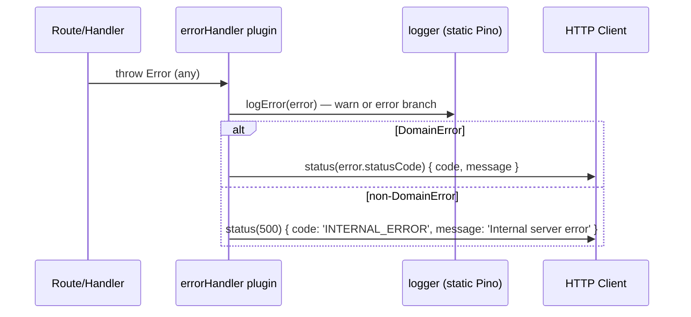

# SERVICES-007 — Error model foundation: originalError + errorHandler logging & contract

## Problem statement

`DomainError` in `src/shared/errors.ts` does not accept an `originalError` parameter, so infrastructure adapters and use cases cannot attach an internal cause to a domain error without losing it. Additionally, `src/shared/plugins/errorHandler.ts` does not log anything and calls `reply.send(error)` for non-`DomainError` instances, leaking raw error messages to the client. These two gaps mean downstream layers cannot comply with the error-handling contract documented in BACKEND.md.

## Alternatives

| Alternative | Description | Decision |
|---|---|---|
| Option A — Inline logging in the callback | Add `originalError?` to `DomainError`'s constructor and write all logging branches directly inside the `setErrorHandler` callback with no extraction. | Not chosen — the three-branch conditional (4xx warn, 5xx error, non-domain error) inside a single arrow function reduces readability and makes the branches harder to cover independently in unit tests. |
| Option B — Extracted `logError` helper + constructor change | Same constructor extension, but extract a private `logError(error: unknown)` function within `errorHandler.ts` so the `setErrorHandler` callback delegates to it and remains a thin dispatcher. | **Chosen** — satisfies all R-IDs, keeps each branch testable in isolation, and respects BACKEND.md's single-static-logger and no-new-dependencies constraints. |
| Option C — `attachCause` setter instead of constructor parameter | Expose an `attachCause(e: unknown)` method on `DomainError` so callers attach causes after construction without changing constructor signatures. | Not chosen — directly contradicts R001, which specifies the constructor signature `(code, message, statusCode, originalError?)`. |

## Chosen solution

**Option B — Extracted `logError` helper + constructor change**

This solution satisfies R001–R010 and all non-functional requirements. Extending the `DomainError` constructor with an optional fourth parameter preserves every existing subclass call site (R002, EC003) while enabling cause attachment (R003, EC002). The private `logError` helper in `errorHandler.ts` makes each logging branch (R004–R007) independently readable and testable. The response branches (R008, R009, R010) are unchanged from the existing `DomainError` serialization path. All logging goes through the imported static logger from `src/shared/infrastructure/logger.ts`, satisfying NF001 and the hard constraint against new logger instances. No external dependencies are added (NF002, technical constraints).

## Technical design

### `DomainError` constructor extension

```ts
export class DomainError extends Error {
  constructor(
    public readonly code: string,
    message: string,
    public readonly statusCode: number = 500,
    public readonly originalError?: unknown,
  ) {
    super(message);
    this.name = 'DomainError';
  }
}
```

`originalError` is stored as a public readonly property so `errorHandler` can read it when building the log payload, but it is never referenced in any serialization path that produces an HTTP response body.

Every existing subclass constructor (`NotFoundError`, `ValidationError`, `UnauthorizedError`, `ForbiddenError`, `ProviderError`) passes its hard-coded `super(code, message, statusCode)` call without a fourth argument, so all current call sites remain valid and behaviorally identical (R002, EC003).

Subclasses that need to forward an `originalError` may do so by accepting it as a parameter and passing it as the fourth argument to `super`, but no subclass is changed in this feature (out of scope).

### `errorHandler` plugin rewrite

The plugin imports the static logger and defines a private `logError` function before the `setErrorHandler` registration. The function encapsulates the three logging branches:

```
logError(error: unknown, request: FastifyRequest): void
```

**Branch 1 — `DomainError` with `statusCode < 500`:**
```
logger.warn({
  code: error.code,
  message: error.message,
  statusCode: error.statusCode,
  originalError: error.originalError,
}, 'Domain error (client)')
```

**Branch 2 — `DomainError` with `statusCode >= 500`:**
```
logger.error({
  code: error.code,
  message: error.message,
  statusCode: error.statusCode,
  stack: error.stack,
  originalError: error.originalError,
}, 'Domain error (server)')
```

**Branch 3 — non-`DomainError`:**
```
logger.error({
  message: (error as Error).message ?? String(error),
  stack: (error as Error).stack,
  originalError: error,
}, 'Unhandled error')
```

The `requestId` is injected automatically by the Pino `mixin` backed by `AsyncLocalStorage` (SERVICES-005) — no manual extraction in `errorHandler` is required (NF001, EC005).

The `setErrorHandler` callback delegates to `logError`, then:
- `DomainError` → `reply.status(error.statusCode).send({ code: error.code, message: error.message })` (R008)
- non-`DomainError` → `reply.status(500).send({ code: 'INTERNAL_ERROR', message: 'Internal server error' })` (R009)

`originalError`, `stack`, and any internal fields never appear in the response body (R010, NF002, EC002, EC004).

### Call-flow diagram



## Files

| Path | Action | Description |
|---|---|---|
| `apps/services/src/shared/errors.ts` | MODIFY | Add optional `originalError?: unknown` as the fourth parameter of `DomainError`'s constructor; store it as a public readonly property. |
| `apps/services/src/shared/plugins/errorHandler.ts` | MODIFY | Import the static logger; add a private `logError` helper with three branches (warn/error/error); rewrite the non-`DomainError` branch to reply with the fixed `INTERNAL_ERROR/500` body. |
| `apps/services/tests/unit/shared/errors.test.ts` | CREATE | Unit tests for `DomainError` constructor: verifies `originalError` is stored, is optional, and is not leaked. |
| `apps/services/tests/unit/shared/plugins/errorHandler.test.ts` | CREATE | Unit tests for `errorHandler`: verifies logging level, log payload fields, and HTTP response body/status for all three error branches. |

## Requirement coverage

| ID | Design decision |
|---|---|
| R001 | `DomainError` constructor extended to `(code, message, statusCode, originalError?)` with `originalError` stored as a public readonly property. |
| R002 | All existing subclasses call `super` without a fourth argument; the parameter is optional so all current instantiations compile and behave identically. |
| R003 | Subclasses may pass `originalError` as the fourth `super` argument; it is stored on the instance for use by `errorHandler`. |
| R004 | `errorHandler.setErrorHandler` calls `logError(error)` before any `reply` call, making it the single final logging site. |
| R005 | `logError` Branch 1: `instanceof DomainError && statusCode < 500` → `logger.warn` with `{ code, message, statusCode, originalError }`. |
| R006 | `logError` Branch 2: `instanceof DomainError && statusCode >= 500` → `logger.error` with `{ code, message, statusCode, stack, originalError }`. |
| R007 | `logError` Branch 3: non-`DomainError` → `logger.error` with `{ message, stack, originalError: error }`. |
| R008 | `setErrorHandler` DomainError branch: `reply.status(error.statusCode).send({ code: error.code, message: error.message })`. |
| R009 | `setErrorHandler` non-DomainError branch: `reply.status(500).send({ code: 'INTERNAL_ERROR', message: 'Internal server error' })`. |
| R010 | Response `send()` calls only include `{ code, message }`; `originalError`, `stack`, and all internal fields are absent from every response path. |
| NF001 | Static logger from `src/shared/infrastructure/logger.ts` is used; `mixin` injects `requestId` automatically; `stack` is included in `error`-level log payloads. |
| NF002 | `DomainError` response path (`reply.status(error.statusCode).send({ code, message })`) is byte-identical to the current behavior; no previously exposed internal field is now included. |
| NF003 | `logError` is called unconditionally before the `reply` branch — no non-`DomainError` can exit the pipeline without being logged. |
| EC002 | `logError` reads `error.originalError` and includes it in the log payload; it is absent from the `send()` call. |
| EC004 | Non-`DomainError` branch applies regardless of whether the error has a `statusCode` property; the response is always `INTERNAL_ERROR/500`. |
