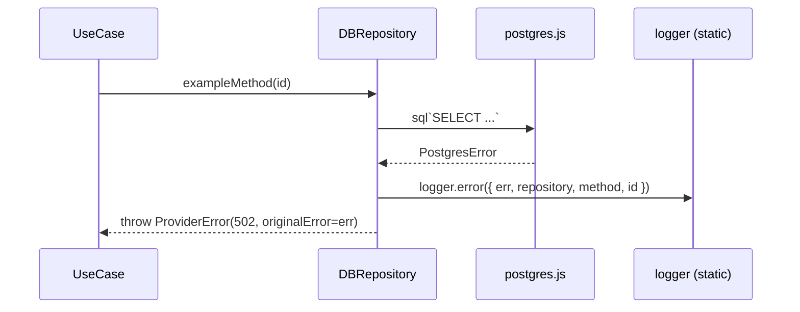

# SERVICES-008 — Repository & adapter try/catch compliance

## Problem statement

`BACKEND.md` mandates that every external call from repositories, adapters, and provider clients be wrapped in `try/catch`, log the original cause, and re-throw a `DomainError` (typically `ProviderError`) with the cause attached as `originalError`. Currently none of the six repositories (`userDBRepository`, `subscriptionDBRepository`, `subscriptionPlanDBRepository`, `transactionDBRepository`, `clerkSyncRepository`, `mobbexBillingSyncRepository`) wrap their SQL calls, nor does the `mobbexProvider` adapter log the original cause before re-throwing. Any Postgres or network failure escapes without repository-level context (name, method, parameters), breaking the traceability contract defined in `BACKEND.md`.

## Alternatives

| Alternative | Description | Decision |
|---|---|---|
| Option A — Inline try/catch per call site | Wrap every individual SQL tagged-template call in its own `try/catch` block inside each method; emit a structured `logger.error` and re-throw a `ProviderError` in each catch. | Not chosen — the number of individual SQL call sites across six repositories produces significant boilerplate duplication. Each method repeats the same catch pattern verbatim, making it easy for future contributors to omit the pattern in new methods. |
| Option B — Shared `wrapQuery` helper | Introduce a single `wrapQuery<T>(label: string, fn: () => Promise<T>): Promise<T>` helper in `src/shared/infrastructure/repositoryUtils.ts` that contains the `try/catch`, `logger.error`, and `throw new ProviderError(...)` logic once; each repository delegates to it. | Not chosen — while it centralises the catch pattern, it introduces an abstraction that hides the control flow from readers of individual repository methods and makes stack traces harder to attribute (the helper frame appears in every error). It also couples all seven files to a new shared module, expanding the blast radius of any signature change. |
| Option C — Inline try/catch per method (one block per method, not per call) | Wrap the body of each repository method in a single `try/catch` block at the method level (not one per SQL statement inside the method). For methods with multiple sequential SQL statements, a single method-level `try/catch` is sufficient because the first failure aborts the method. For `sql.begin` transactional methods, the outer `sql.begin` call is wrapped and each sub-query inside the transaction callback is individually wrapped per R004/EC001. | **Chosen** — keeps the catch logic at the method boundary (one `try/catch` per method), maximally close to the SQL calls without producing per-call-site repetition. Method-level wrapping satisfies R001/R004 and makes the control flow obvious to readers. The `sql.begin` transactional methods (in `mobbexBillingSyncRepository`) use an inner `try/catch` on each sub-query inside the transaction callback so individual step failures are logged before the transaction aborts (EC001). |

## Chosen solution

**Option C — Inline try/catch per method (one block per method, outer + inner for transactions)**

This solution satisfies all functional requirements with no new shared modules and minimal changes to each file:

- R001, R002, R003, R007: Wrapping each repository method body in a `try/catch` ensures every SQL path (including `null`-returning sentinel paths) is covered. `NotFoundError` is re-thrown without wrapping inside the `catch` so that existing domain semantics are preserved (R003). Non-`DomainError` exceptions are logged at `error` level with `{ repository, method, params, err }` and re-thrown as `ProviderError` with `originalError` (R002, NF001, NF002, NF003).
- R004, EC001, EC002: `mobbexBillingSyncRepository` transactional methods add a `try/catch` around the `sql.begin(...)` call (outer) and individual `try/catch` blocks around each sub-query inside the callback (inner). The inner catch logs once with the failing step context and re-throws, which causes `postgres.js` to abort the transaction automatically. The outer catch does not re-log the already-logged cause (EC001), re-throwing the already-wrapped `DomainError`.
- R005, R006, R008, EC003, EC004: `mobbexProvider.fetchWithTimeout` already has a `try/catch` for network/timeout errors; the catch is augmented to log at `error` level with `originalError`. `handleErrorResponse` is augmented to log at `warn` when JSON parsing fails and to attach `originalError` to every `ProviderError` thrown.
- NF001: `error` level (with stack) is used for all `statusCode >= 500` cases; `warn` is used for the JSON-parse silent-fail in `handleErrorResponse`.
- NF002: Every log entry includes the class name and method name as a literal string (e.g. `'UserDBRepository.findByClerkUserId'`).
- NF003: Parameters included in log payloads are limited to non-sensitive IDs (`clerkUserId`, `id`, `reference`) — never tokens, secrets, or PII.
- NF004: No SQL text is altered; all happy-path return values are unchanged; the `try` block contains identical logic to the current code.

## Technical design

### Catch pattern — standard repository method

Every repository method body is replaced by a `try/catch` block:

```ts
async exampleMethod(id: string): Promise<SomeEntity | null> {
  const start = Date.now();
  try {
    const rows = await this.sql<SomeEntity[]>`SELECT ... WHERE id = ${id} LIMIT 1`;
    logger.info({ duration: Date.now() - start }, 'SomeDBRepository.exampleMethod');
    return rows[0] ?? null;
  } catch (err: unknown) {
    if (err instanceof DomainError) throw err;
    logger.error({ err, repository: 'SomeDBRepository', method: 'exampleMethod', id }, 'SomeDBRepository.exampleMethod failed');
    throw new ProviderError('Database error in SomeDBRepository.exampleMethod', 502, err);
  }
}
```

Key decisions:
- `if (err instanceof DomainError) throw err` — re-throws `NotFoundError` and any already-wrapped `DomainError` without double-wrapping (satisfies R003, EC001).
- The `logger.info` for latency remains inside the `try` block, before the `return`, so it is only emitted on success; the `logger.error` fires only on failure.
- `params` included in the error log are restricted to non-PII identifiers (e.g. `id`, `clerkUserId`, `reference`), never body content or secrets.

### Catch pattern — `mobbexBillingSyncRepository` transactional method

Transactional methods use a two-level catch pattern:

```ts
async updateTransactionStatus(input: ...): Promise<...> {
  try {
    return await this.sql.begin(async (tx) => {
      // Each sub-query:
      try {
        const rows = await (tx as unknown as TransactionSql)<...>`SELECT ...`;
        logger.info({ duration: ... }, 'MobbexBillingSyncRepository.updateTransactionStatus select by ...');
      } catch (err: unknown) {
        if (err instanceof DomainError) throw err;
        logger.error({ err, repository: 'MobbexBillingSyncRepository', method: 'updateTransactionStatus', step: 'select by provider_transaction_id' }, '...');
        throw new ProviderError('...', 502, err);
      }
      // ... additional sub-queries similarly wrapped
    });
  } catch (err: unknown) {
    if (err instanceof DomainError) throw err;   // already logged at inner catch
    logger.error({ err, repository: 'MobbexBillingSyncRepository', method: 'updateTransactionStatus' }, '...');
    throw new ProviderError('...', 502, err);
  }
}
```

The outer `catch` serves as a safety net for errors that originate outside the sub-query bodies (e.g. `sql.begin` itself fails). Sub-queries re-throw a `DomainError` from their inner catch, which the outer catch re-throws without logging again (EC001).

### Catch pattern — `mobbexProvider`

`fetchWithTimeout` already has a `try/catch`. The catch block is augmented to log before re-throwing:

```ts
catch (err: unknown) {
  if (err instanceof ProviderError) throw err;
  if (err instanceof Error && err.name === 'AbortError') {
    logger.error({ err }, 'MobbexProvider.fetchWithTimeout timed out');
    throw new ProviderError(`Request to Mobbex timed out after ${this.config.timeoutMs}ms`, 502, err);
  }
  logger.error({ err }, 'MobbexProvider.fetchWithTimeout network error');
  const message = err instanceof Error ? err.message : 'Unknown network error';
  throw new ProviderError(`Network error calling Mobbex: ${message}`, 502, err);
}
```

`handleErrorResponse` is augmented to log on JSON-parse failure and attach `originalError` to every thrown `ProviderError`:

```ts
private async handleErrorResponse(response: Response): Promise<never> {
  let errorCode: string | undefined;
  try {
    const body = (await response.json()) as { error?: string };
    errorCode = body.error;
  } catch (parseErr: unknown) {
    // JSON parse failed — body is discarded. This is intentional: a malformed error body
    // from the provider should not prevent the correct HTTP status from being mapped.
    logger.warn({ err: parseErr, status: response.status }, 'MobbexProvider.handleErrorResponse: failed to parse error body; using HTTP status fallback');
  }

  const message = errorCode ?? `Mobbex responded with HTTP ${response.status}`;

  if (response.status === 401 || response.status >= 500) {
    throw new ProviderError(message, 502);
  }
  throw new ProviderError(message, 400);
}
```

Note: `handleErrorResponse` is called from within the `fetchWithTimeout` `try` block. The `ProviderError` it throws propagates to the outer `catch`, which re-throws it immediately (`if (err instanceof ProviderError) throw err`). Therefore `originalError` on these `ProviderError` instances is the upstream HTTP response context, not a JS error — no `originalError` is available at the `handleErrorResponse` level. The `fetchWithTimeout` catch is the site where network/JS errors get `originalError` set; the `handleErrorResponse` path does not wrap a JS error.

### Imports

Each repository file that does not yet import `ProviderError` and `DomainError` from `shared/errors.ts` will add those imports. The `logger` import is already present in all files.

### Test structure

Test files mirror the production file paths under `tests/unit/`. New test files:
- `tests/unit/modules/users/repositories/userDBRepository.test.ts`
- `tests/unit/modules/webhooks/repositories/clerkSyncRepository.test.ts`

Existing test files that are extended with error-path cases:
- `tests/unit/modules/subscriptions/subscriptionDBRepository.test.ts`
- `tests/unit/modules/subscriptions/subscriptionPlanDBRepository.test.ts`
- `tests/unit/billing/transactionDBRepository.test.ts`
- `tests/unit/modules/webhooks/repositories/mobbexBillingSyncRepository.test.ts`
- `tests/unit/billing/mobbexProvider.test.ts`

Error-path tests use a sql mock that rejects with a raw `Error` and assert that:
1. `logger.error` was called with the repository name and method name.
2. The thrown error is an instance of `ProviderError` with `statusCode 502` and `originalError` equal to the raw error.



## Files

| Path | Action | Description |
|---|---|---|
| `apps/services/src/modules/users/repositories/userDBRepository.ts` | MODIFY | Wrap each method body in `try/catch`; import `DomainError`, `ProviderError`; log + re-throw on SQL failure |
| `apps/services/src/modules/subscriptions/repositories/subscriptionDBRepository.ts` | MODIFY | Wrap each method body in `try/catch`; import `DomainError`, `ProviderError`; log + re-throw on SQL failure |
| `apps/services/src/modules/subscriptions/repositories/subscriptionPlanDBRepository.ts` | MODIFY | Wrap `listActive` method body in `try/catch`; import `DomainError`, `ProviderError`; log + re-throw on SQL failure |
| `apps/services/src/modules/billing/repositories/transactionDBRepository.ts` | MODIFY | Wrap each method body in `try/catch`; import `DomainError`, `ProviderError`; log + re-throw on SQL failure |
| `apps/services/src/modules/webhooks/repositories/clerkSyncRepository.ts` | MODIFY | Wrap each method body in `try/catch`; import `DomainError`, `ProviderError`; log + re-throw on SQL failure |
| `apps/services/src/modules/webhooks/repositories/mobbexBillingSyncRepository.ts` | MODIFY | Wrap `recordEvent` in method-level `try/catch`; wrap each sub-query inside `updateTransactionStatus` and `upsertRefundAndMaybeMarkTransactionRefunded` transaction callbacks in inner `try/catch`; add outer `try/catch` around `sql.begin` calls; import `DomainError`, `ProviderError`; log + re-throw on failure |
| `apps/services/src/modules/billing/providers/mobbexProvider.ts` | MODIFY | Augment `fetchWithTimeout` catch to log before re-throwing; augment `handleErrorResponse` to log `warn` on JSON parse failure and add justifying comment |
| `apps/services/tests/unit/modules/users/repositories/userDBRepository.test.ts` | CREATE | Error-path unit tests for all `UserDBRepository` methods |
| `apps/services/tests/unit/modules/webhooks/repositories/clerkSyncRepository.test.ts` | CREATE | Error-path unit tests for all `ClerkSyncRepository` methods |
| `apps/services/tests/unit/modules/subscriptions/subscriptionDBRepository.test.ts` | MODIFY | Add error-path test cases for each method |
| `apps/services/tests/unit/modules/subscriptions/subscriptionPlanDBRepository.test.ts` | MODIFY | Add error-path test case for `listActive` |
| `apps/services/tests/unit/billing/transactionDBRepository.test.ts` | MODIFY | Add error-path test cases for each method |
| `apps/services/tests/unit/modules/webhooks/repositories/mobbexBillingSyncRepository.test.ts` | MODIFY | Add error-path test cases for transactional methods (`recordEvent`, `updateTransactionStatus`, `upsertRefundAndMaybeMarkTransactionRefunded`) |
| `apps/services/tests/unit/billing/mobbexProvider.test.ts` | MODIFY | Add test cases asserting `originalError` is set on `ProviderError` instances and `logger.warn` is called on JSON parse failure |

## Requirement coverage

| ID | Design decision |
|---|---|
| R001 | Every repository method body is wrapped in a method-level `try/catch`; sub-queries inside `sql.begin` callbacks are individually wrapped. All SQL call paths (standalone and transactional) are covered. |
| R002 | The `catch` block in each method calls `logger.error` with `{ err, repository, method, ...nonSensitiveParams }` and re-throws `new ProviderError(..., 502, err)` with `err` as `originalError`. |
| R003 | The `catch` block checks `if (err instanceof DomainError) throw err` before any logging or re-wrapping, preserving `NotFoundError` and other domain errors unchanged. |
| R004 | `mobbexBillingSyncRepository` transactional methods apply inner `try/catch` on each sub-query inside the `sql.begin` callback, logging once at the failing step and re-throwing a `ProviderError`; the outer `try/catch` around `sql.begin` re-throws `DomainError` instances without re-logging. |
| R005 | `fetchWithTimeout` catch block is augmented to call `logger.error` for network and timeout errors before re-throwing a `ProviderError` with the original error attached as `originalError`. |
| R006 | `handleErrorResponse` preserves the existing `statusCode 502` (401, 5xx) / `statusCode 400` (other 4xx) mapping; error logging for the JSON-parse path uses `logger.warn`; no change to status mapping logic. |
| R007 | The method-level `try/catch` pattern applied to all seven files ensures no external-call failure can escape un-logged: the `catch` always fires before any re-throw. |
| R008 | `handleErrorResponse` JSON-parse `catch` is augmented with a `logger.warn` call and a code comment documenting the intentional silent-fail fallback. |
| NF001 | `logger.error` is called with `{ err }` which includes the stack trace via Pino's error serializer; `logger.warn` is used for the 4xx JSON-parse path. |
| NF002 | Every `logger.error` / `logger.warn` payload includes explicit `repository` and `method` string fields (e.g. `repository: 'UserDBRepository', method: 'findByClerkUserId'`). |
| NF003 | Log payloads include only non-sensitive identifiers (`id`, `clerkUserId`, `reference`, `providerTransactionId`); secrets, tokens, emails, and names are excluded. |
| NF004 | The `try` block contains the existing code unchanged (same SQL, same return values, same happy-path behavior). Only the `catch` block is new. |
| EC001 | Inner `try/catch` blocks inside `sql.begin` callbacks log once and re-throw a `DomainError`; the outer `try/catch` around `sql.begin` re-throws `DomainError` instances via `if (err instanceof DomainError) throw err` without re-logging. |
| EC002 | The inner `try/catch` in `updateTransactionStatus` for the reference-based SELECT logs `{ reference }` before re-throwing, satisfying the traceability requirement. |
| EC004 | `handleErrorResponse` JSON-parse catch emits `logger.warn` and carries a code comment justifying the silent-fail. |
