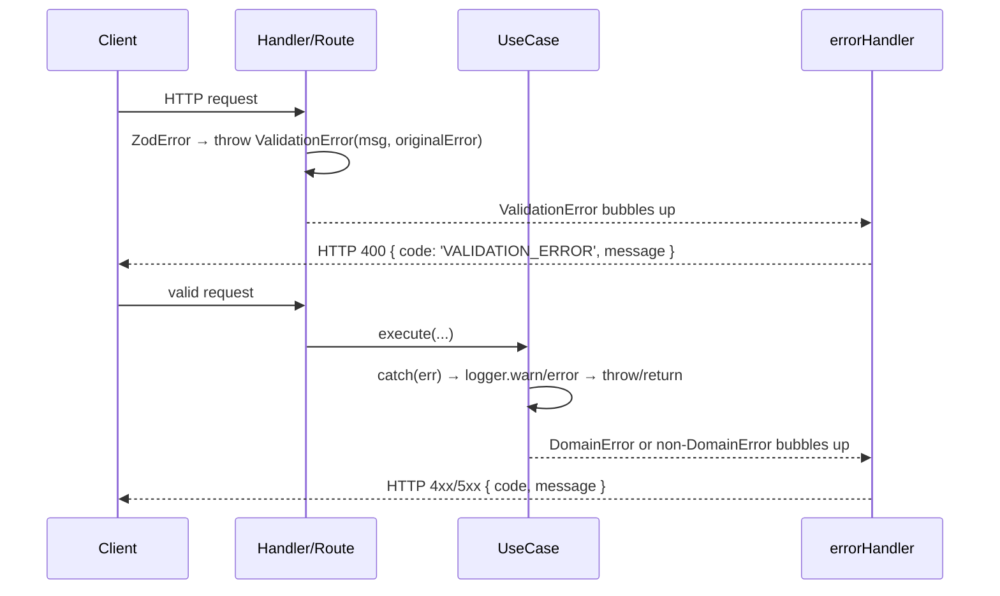

# SERVICES-009 — Use case, handler & webhook route compliance

## Problem statement

`apps/services` defines a single error contract: every error must flow through `errorHandler.ts`, which serializes `DomainError` instances as `{ code, message }` and non-domain errors as `{ code: 'INTERNAL_ERROR', … }`. Several orchestration-layer sites violate this contract: two handlers catch `ZodError` and call `reply.status(400)` directly instead of throwing a `ValidationError`; the Clerk webhook route emits manual `reply.status(400)` for header and signature failures; and catch blocks in `checkoutUseCase`, `cancelSubscriptionUseCase`, `listTransactionsUseCase`, `clerkAuthPlugin`, and `mobbexProvider.handleErrorResponse` either omit logging entirely or retain silent-fails without justifying comments. The result is an inconsistent HTTP error response shape, incomplete structured logs, and unauditable silent-fail sites.

## Alternatives

| Alternative | Description | Decision |
|---|---|---|
| Option A: Central parse helper | Extract Zod parsing into a shared `parseOrThrow<T>(schema, body)` utility that converts `ZodError` to `ValidationError`, then call it from all handlers and any future handler that needs validation. | Not chosen — introduces an indirection layer with no meaningful reuse gain beyond two call sites; the BACKEND.md convention is that handlers are already thin and do one parse call each; a shared helper adds a file with no domain logic that would not be re-used by any existing use case or webhook handler since those parse differently (Svix, raw buffer). |
| Option B: Inline fix per site | Fix each non-compliant site in place: replace `reply.status(400).send(…)` calls with `throw new ValidationError(…)`, add `logger.warn/error` to every catch block, and add justifying comments to retained silent-fails. | **Chosen** — minimizes scope to exactly the files identified in analysis.md, requires no new abstractions, introduces no new dependencies, and satisfies every R-ID and NF-ID directly. Each site is independently testable and the change is auditable line by line. |
| Option C: Wrapper function approach | Create a reusable `parseSafe<T>` higher-order function that wraps the parse call and the throw, and separately create a `logAndRethrow` helper for use-case catches. | Not chosen — `logAndRethrow` would need to know the log level (4xx vs 5xx), which requires either passing the error to it first (trivial wrapper) or duplicating the `instanceof DomainError` check inside it; this adds abstraction without eliminating any complexity. The per-site inline approach (Option B) is simpler and equally correct. |

## Chosen solution

**Inline fix per site**

Each non-compliant site is corrected in its own file with the minimal change that satisfies the BACKEND.md error handling rules:

- `completeOnboardingHandler` and `updateUserProfileHandler` (R001, R002, R003): remove the `try/catch` block wrapping `ZodError`; replace the manual `reply.status(400)` with `throw new ValidationError(err.issues[0]?.message ?? '…', err)` before invoking the use case. Because BACKEND.md mandates that handlers have no try/catch that duplicates `errorHandler`, parsing must instead throw so the error bubbles to `errorHandler` unobstructed.
- Clerk webhook route (R004, R005): replace the `if (!svixId …)` guard's `reply.status(400)` with `throw new ValidationError('Missing required Svix headers')`; replace the catch block's `reply.status(400)` with `throw new ValidationError('Webhook signature verification failed', err)`. Add `logger.warn` before the rethrow in the catch block.
- `checkoutUseCase` catch (R007, R008, R009, EC005): add `logger.warn` or `logger.error` (depending on error type) before the existing `throw err`.
- `cancelSubscriptionUseCase` catch (R007, R008, R009, R010, EC003): add `logger.warn` before the `return updated` silent-fail path and add a justifying comment; add `logger.error` before the re-throw path.
- `listTransactionsUseCase` catch (R007, R009, EC005): add `logger.warn` or `logger.error` depending on error type and re-throw in both branches.
- `clerkAuthPlugin` catch (R011, EC004): add `logger.warn` before the empty catch body, add a justifying comment.
- `mobbexProvider.handleErrorResponse` (R012): the existing `logger.warn` call is already present and correct; the code comment justifying the silent-fail must be explicitly added inline. (This is a verification + comment reinforcement task, not a new implementation.)
- Mobbex webhook route (R006, EC006): add `logger.warn` with parse failure detail before the existing `throw new ValidationError(…)` in the JSON parse catch block.

Observable HTTP behavior (status codes and error codes) is preserved for every endpoint and webhook (R014, NF003) because `errorHandler` already serializes `ValidationError` as HTTP 400 with `{ code: 'VALIDATION_ERROR', message }`.

The `requestId` field is injected automatically by the Pino logger mixin backed by `AsyncLocalStorage` — no per-request child logger is needed at any of these sites (NF002).

## Technical design

### Error flow after changes



### Logging level decision at each catch

| Condition | Log level | Call |
|---|---|---|
| `err instanceof DomainError && err.statusCode < 500` | `warn` | `logger.warn({ err }, message)` |
| `err instanceof DomainError && err.statusCode >= 500` | `error` | `logger.error({ err }, message)` |
| `!(err instanceof DomainError)` | `error` | `logger.error({ err }, message)` |

### Handler validation change

Before (non-compliant):
```ts
try {
  body = Schema.parse(request.body);
} catch (err) {
  if (err instanceof ZodError) {
    return reply.status(400).send({ code: 'VALIDATION_ERROR', message: err.issues[0]?.message ?? '…' });
  }
  throw err;
}
```

After (compliant):
```ts
try {
  body = Schema.parse(request.body);
} catch (err) {
  if (err instanceof ZodError) {
    throw new ValidationError(err.issues[0]?.message ?? 'Invalid request body', err);
  }
  throw err;
}
```

The `try/catch` block is retained to distinguish `ZodError` from other parse-time errors, but the handler no longer calls `reply.status()` — it delegates the HTTP response to `errorHandler`.

### Clerk webhook change

Before (non-compliant):
```ts
if (!svixId || !svixTimestamp || !svixSignature) {
  return reply.status(400).send({ error: 'Missing required Svix headers' });
}
// …
} catch {
  return reply.status(400).send({ error: 'Webhook signature verification failed' });
}
```

After (compliant):
```ts
if (!svixId || !svixTimestamp || !svixSignature) {
  throw new ValidationError('Missing required Svix headers');
}
// …
} catch (err) {
  logger.warn({ err }, 'Clerk webhook signature verification failed');
  throw new ValidationError('Webhook signature verification failed', err instanceof Error ? err : undefined);
}
```

EC002 decision: the signature verification failure remains HTTP 400 (`ValidationError`) — not 401 — because the failing party is the caller's inability to produce a valid signature, not an authentication token issue. Changing to `UnauthorizedError` (401) is deferred and must be a separate design decision.

### Use case catch changes

**`checkoutUseCase`** — the existing catch (re-throws after `updateFailureReason`) gains a log call:
```ts
catch (err) {
  if (err instanceof ProviderError) {
    await this.repo.updateFailureReason(transaction.id, err.message);
  }
  if (err instanceof DomainError && err.statusCode < 500) {
    logger.warn({ err }, 'CheckoutUseCase: provider checkout failed');
  } else {
    logger.error({ err }, 'CheckoutUseCase: provider checkout failed');
  }
  throw err;
}
```

**`cancelSubscriptionUseCase`** — the existing catch gains log calls for both paths:
```ts
catch (err) {
  if (err instanceof ProviderError && err.statusCode === 400) {
    // Non-critical: the subscription is already cancelled locally. A 400 from the provider
    // means the provider rejected the cancel (e.g. already cancelled on its side). We log
    // at warn and return the locally-updated record so the caller observes a successful cancel.
    logger.warn({ err }, 'CancelSubscriptionUseCase: provider cancel rejected (400), returning local result');
    return updated;
  }
  logger.error({ err }, 'CancelSubscriptionUseCase: provider cancel failed with unexpected error');
  throw err;
}
```

**`listTransactionsUseCase`** — the existing catch gains log calls:
```ts
catch (err) {
  if (err instanceof ValidationError) {
    throw err;  // already logged at warn below before re-throw
  }
  throw new ValidationError('Invalid cursor');
}
```
The inner catch currently re-throws `ValidationError` as-is (EC005). Both branches need log calls. Because the cursor is part of the query string (no secrets, no PII), it is safe to include the error detail in the log. The catch is refactored to:
```ts
catch (err) {
  if (err instanceof ValidationError) {
    logger.warn({ err }, 'ListTransactionsUseCase: invalid cursor (re-throwing)');
    throw err;
  }
  logger.warn({ err }, 'ListTransactionsUseCase: cursor decode/parse failed, throwing ValidationError');
  throw new ValidationError('Invalid cursor', err instanceof Error ? err : undefined);
}
```

**`clerkAuthPlugin`** — the empty catch gains a log and a justifying comment:
```ts
} catch (err) {
  // Non-critical silent fail: an invalid or expired JWT leaves userId/orgId unset.
  // Downstream requireAuth / requireOrg preHandlers decide whether the route requires auth.
  logger.warn({ err }, 'clerkAuthPlugin: JWT verification failed; request proceeds without userId');
}
```

**`mobbexProvider.handleErrorResponse`** — the existing `logger.warn` call and comment are already present and compliant. The task is a verification pass to confirm the comment explicitly justifies the silent-fail per R012/R013 and that no PII is logged (NF004). If the comment is insufficient, it is reinforced. No code behavior changes.

**Mobbex webhook route** — the existing `throw new ValidationError(…)` in the JSON parse catch gains a `logger.warn` call before the throw to satisfy R006/EC006:
```ts
} catch (parseErr) {
  logger.warn({ err: parseErr }, 'mobbexWebhookRoutes: failed to parse request body as JSON');
  throw new ValidationError('Request body is not valid JSON');
}
```

### Files

The following files are identified exactly. No new files are created; no files are deleted.

## Files

| Path | Action | Description |
|---|---|---|
| `apps/services/src/modules/users/handlers/completeOnboardingHandler.ts` | MODIFY | Replace manual `reply.status(400)` with `throw new ValidationError(…)` in the `ZodError` catch branch; import `ValidationError` |
| `apps/services/src/modules/users/handlers/updateUserProfileHandler.ts` | MODIFY | Replace manual `reply.status(400)` with `throw new ValidationError(…)` in the `ZodError` catch branch; import `ValidationError` |
| `apps/services/src/modules/webhooks/clerk/routes.ts` | MODIFY | Replace manual `reply.status(400)` guards with `throw new ValidationError(…)`; add `logger.warn` to the signature catch; import `logger` and `ValidationError` |
| `apps/services/src/modules/billing/useCases/checkoutUseCase.ts` | MODIFY | Add `logger.warn/error` before `throw err` in the provider catch block; import `logger` and `DomainError` |
| `apps/services/src/modules/subscriptions/useCases/cancelSubscriptionUseCase.ts` | MODIFY | Add `logger.warn` before the `return updated` silent-fail path (with justifying comment) and `logger.error` before the re-throw path; import `logger` |
| `apps/services/src/modules/billing/useCases/listTransactionsUseCase.ts` | MODIFY | Add `logger.warn` to both branches of the cursor decode catch block; pass `originalError` when constructing `ValidationError`; import `logger` |
| `apps/services/src/shared/plugins/clerkAuthPlugin.ts` | MODIFY | Add `logger.warn` inside the empty catch block; add a justifying comment for the silent-fail; import `logger` |
| `apps/services/src/modules/billing/providers/mobbexProvider.ts` | MODIFY | Add `logger.warn` before `throw new ValidationError(…)` in mobbex webhook route's JSON parse catch; verify/reinforce the justifying comment in `handleErrorResponse` |
| `apps/services/src/modules/webhooks/mobbex/routes.ts` | MODIFY | Add `logger.warn` before `throw new ValidationError(…)` in the JSON parse catch block; import `logger` |
| `apps/services/tests/unit/users/completeOnboardingHandler.test.ts` | MODIFY | Update validation tests to assert that a `ValidationError` is thrown (handler no longer calls `reply.status(400)` directly) — assert via `errorHandler` or thrown error |
| `apps/services/tests/unit/modules/users/handlers/updateUserProfileHandler.test.ts` | CREATE | Acceptance tests for `updateUserProfileHandler` validation compliance: WHEN invalid body THEN throws `ValidationError`; WHEN valid body THEN `reply.send` called with profile |
| `apps/services/tests/unit/billing/checkoutUseCase.test.ts` | MODIFY | Add test asserting `logger.warn/error` is called before re-throw in the provider catch |
| `apps/services/tests/unit/modules/subscriptions/cancelSubscriptionUseCase.test.ts` | MODIFY | Add tests asserting `logger.warn` called on 400 silent-fail path and `logger.error` called on re-throw path |
| `apps/services/tests/unit/billing/listTransactionsUseCase.test.ts` | MODIFY | Add tests asserting `logger.warn` called in both cursor catch branches |
| `apps/services/tests/unit/shared/plugins/clerkAuthPlugin.test.ts` | CREATE | Acceptance tests for `clerkAuthPlugin`: WHEN JWT invalid THEN `logger.warn` is called and `request.userId` remains undefined |
| `apps/services/tests/unit/modules/webhooks/clerk/routes.test.ts` | CREATE | Acceptance tests for Clerk webhook route: missing headers → HTTP 400 `VALIDATION_ERROR`; signature failure → HTTP 400 `VALIDATION_ERROR`; valid → HTTP 200 |
| `apps/services/tests/unit/modules/webhooks/mobbex/routes.test.ts` | MODIFY | Add test asserting `logger.warn` is called when JSON parse fails (R006/EC006) |
| `apps/services/tests/unit/billing/mobbexProvider.test.ts` | MODIFY | Verify/reinforce test asserting `logger.warn` is called on JSON parse failure in `handleErrorResponse` (R012/NF004) |

## Requirement coverage

| ID | Design decision |
|---|---|
| R001 | `completeOnboardingHandler`: `ZodError` catch branch throws `ValidationError(message, err)` instead of calling `reply.status(400)` |
| R002 | `updateUserProfileHandler`: same pattern as R001 |
| R003 | Both handler `try/catch` blocks are retained only to distinguish `ZodError`; the handler never calls `reply.status()` — all HTTP response generation delegated to `errorHandler` |
| R004 | Clerk webhook route: `if (!svixId …)` guard throws `ValidationError('Missing required Svix headers')` instead of `reply.status(400)` |
| R005 | Clerk webhook route: `verifyWebhook` catch throws `ValidationError('Webhook signature verification failed', err)` instead of `reply.status(400)`; stays HTTP 400 per EC002 decision |
| R006 | Mobbex webhook route: JSON parse catch gains `logger.warn({ err: parseErr }, '…')` before the existing `throw new ValidationError(…)` |
| R007 | `checkoutUseCase`, `cancelSubscriptionUseCase`, `listTransactionsUseCase`: each catch block gains a `logger.warn` or `logger.error` call before any re-throw, transform, or silent-fail |
| R008 | Log level selection: `DomainError` with `statusCode < 500` → `logger.warn`; applied in `checkoutUseCase`, `cancelSubscriptionUseCase`, `listTransactionsUseCase` catches |
| R009 | Log level selection: `DomainError` with `statusCode >= 500` or non-`DomainError` → `logger.error`; applied in `checkoutUseCase`, `cancelSubscriptionUseCase`, `listTransactionsUseCase` catches |
| R010 | `cancelSubscriptionUseCase`: `ProviderError` 400 path logs at `warn` and returns `updated`; inline comment justifies the non-critical silent-fail |
| R011 | `clerkAuthPlugin`: empty catch gains `logger.warn({ err }, '…')` and an inline comment explaining the silent-fail |
| R012 | `mobbexProvider.handleErrorResponse`: existing `logger.warn` call is present; task verifies and reinforces the justifying comment so it explicitly satisfies R013 |
| R013 | Every retained silent-fail (`return updated` in `cancelSubscriptionUseCase`, empty catch in `clerkAuthPlugin`, discarded parse body in `mobbexProvider.handleErrorResponse`) carries an inline comment explaining why the caller can continue |
| R014 | `ValidationError` serializes to HTTP 400 `{ code: 'VALIDATION_ERROR', message }` via `errorHandler` — identical to the previous manual `reply.status(400).send({ code: 'VALIDATION_ERROR', message })` responses |
| NF001 | Every modified catch block ends in log + re-throw, log + transform, or log + handle; verified by test coverage and design review |
| NF002 | Static `logger` from `shared/infrastructure/logger.ts` automatically injects `requestId` via the Pino mixin backed by `AsyncLocalStorage`; no per-request child logger is introduced |
| NF003 | `errorHandler` serializes all `DomainError` as `{ code, message }` and non-domain errors as `{ code: 'INTERNAL_ERROR', message: 'Internal server error' }`; all touched sites throw `DomainError` subclasses |
| NF004 | Log calls in all catch blocks pass the error object only (`{ err }`); no token, secret, JWT payload, or user PII is included in the logged fields |
| EC001 | Clerk webhook missing-header path throws `ValidationError` → `errorHandler` replies HTTP 400 `{ code: 'VALIDATION_ERROR', message: 'Missing required Svix headers' }` |
| EC002 | Signature verification failure remains `ValidationError` (HTTP 400), not `UnauthorizedError` (401); this decision is documented here and not assumed |
| EC003 | `cancelSubscriptionUseCase` `ProviderError` 400 path: logs at `warn`, returns locally-cancelled subscription; observable response matches today's behavior |
| EC005 | Use case catches re-throw the same error without wrapping unless the `ValidationError` construction from a caught non-`ValidationError` provides better semantics for the caller |
| EC006 | Mobbex webhook JSON parse catch logs parse failure before throwing `ValidationError`; error body excerpt is the `err` object (non-sensitive catch result, not request PII) |
| EC008 | `errorHandler` remains the final log site; intermediate catch-level logs (use cases) are additive per BACKEND.md preference for duplicate logs over missing ones |
