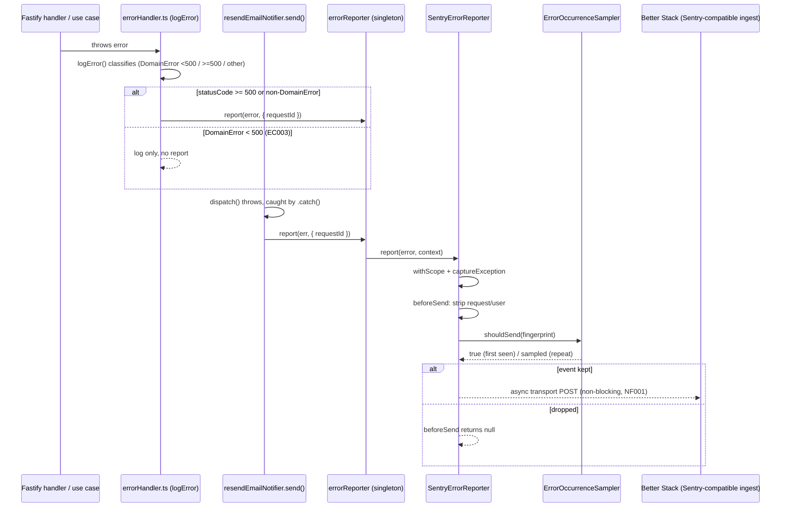

# SERVICES-011 — Error tracking del backend

## Problem statement

The backend already logs every error through Pino, with a correlated `requestId` and a queryable destination in Better Stack (INFRA-011), but nobody is proactively notified when something breaks — searchable is not the same as alerted. Worse, the fire-and-forget email delivery wrapper (NOTIFICATIONS-001/002) deliberately swallows its own failures to protect the caller, so a broken email provider produces no signal beyond a log line nobody is watching. The backend needs every exception — including the ones caught and stopped on purpose — reported, grouped, and correlated with its originating request.

## Alternatives

| Alternative | Description | Decision |
|---|---|---|
| Direct Sentry SDK calls at each site | Call `Sentry.captureException()` directly inside `errorHandler.ts`'s `logError` and inside `resendEmailNotifier.dispatch()`'s catch block, with `Sentry.init()` called once at bootstrap. | Not chosen — couples two cross-cutting files directly to a concrete vendor SDK, violating the "abstract names over concrete architecture names / role over vendor" convention (`apps/services/CLAUDE.md`); a future provider swap would require touching every call site instead of the single variable the technical constraints call for. |
| Sentry's Fastify auto-instrumentation (`setupFastifyErrorHandler`) + manual capture for the email wrapper | Let Sentry's own Fastify integration auto-capture every error that reaches Fastify's error handling, and add a manual `Sentry.captureException` call inside the email wrapper for the fire-and-forget case. | Not chosen — installs a second, competing "final" error-processing site alongside `shared/plugins/errorHandler.ts`, contradicting SERVICES-007's "single, final logging site" contract; it also auto-reports every error including expected 4xx `DomainError`s, requiring extra filtering logic to satisfy EC003 that the chosen alternative gets for free from `logError`'s existing branching. |
| Provider-agnostic `ErrorReporter` adapter | Define an `IErrorReporter` port with a `SentryErrorReporter` adapter (backed by `@sentry/node`, pointed at Better Stack through its DSN) and a `NoopErrorReporter` for the disabled case; instantiate one singleton at module load and call it explicitly from the two cross-cutting sites named in the technical constraints (`errorHandler.ts`, the email wrapper). | **Chosen** — see justification below. |

## Chosen solution

**Provider-agnostic `ErrorReporter` adapter**

This satisfies R001–R008 while respecting every technical constraint: the DSN alone selects the provider (constraint: "switching providers is a change of one variable"); no use case, repository, or route handler changes, only the two named cross-cutting points (`errorHandler.ts`, the fire-and-forget email wrapper) and app bootstrap via module-load-time initialization; and it follows the existing "shared providers live in `src/shared/providers/` when two or more modules depend on the same provider adapter" convention (`apps/services/CLAUDE.md`), since both `errorHandler.ts` (a shared plugin) and `resendEmailNotifier.ts` (a module adapter) need the same reporter instance so occurrence-sampling (EC004) is shared across both entry points.

Reusing `errorHandler.ts`'s existing three-way branch (`DomainError` <500 → `warn`, `DomainError` ≥500 → `error`, non-`DomainError` → `error`) to decide when to report means EC003 (no noise from expected 4xx errors) requires zero new logic — reporting is wired into the two `error`-level branches only, which is exactly the failure population R001 and R005 describe. `duck-spec/modules/services/SPEC.md`'s "Error handler (SERVICES-007)" section documents this branching as already implemented and stable, so extending it in place (rather than introducing a parallel error-classification path) keeps the single-final-logging-site guarantee intact.

## Technical design

### Config — `errorTrackingConfig.ts`

New typed config, following the established `src/shared/configs/<scope>Config.ts` shape (`serverConfig.ts`, `emailConfig.ts`):

```ts
const env = process.env || {};

export const errorTrackingConfig = {
  dsn: env.ERROR_TRACKING_DSN ?? '',
  enabled: Boolean(env.ERROR_TRACKING_DSN),
  environment: env.NODE_ENV ?? 'development',
  release: env.SERVICE_VERSION ?? 'unknown',
  sampleRate: env.ERROR_TRACKING_SAMPLE_RATE ? Number(env.ERROR_TRACKING_SAMPLE_RATE) : 0.2,
};
```

`dsn` is the single Sentry-compatible endpoint the technical constraints call for — pointing it at Better Stack's ingest URL is the only provider-specific detail in the whole feature. `enabled` gates R007/R008. `environment` reuses the existing `NODE_ENV` value already read by `serverConfig.ts` rather than introducing a duplicate variable. `release` reads a new `SERVICE_VERSION` variable (deployed service version, R004) defaulting to `'unknown'` when unset (e.g. local dev) rather than failing startup. `sampleRate` (0–1) is the *repeat*-occurrence sampling rate consumed by `ErrorOccurrenceSampler` (EC004) — it never applies to a fingerprint's first occurrence.

### Port — `IErrorReporter`

```ts
export interface ErrorReportContext {
  requestId?: string;
}

export interface IErrorReporter {
  report(error: unknown, context?: ErrorReportContext): void;
}
```

### `ErrorOccurrenceSampler` (EC004)

A small, pure, independently testable class used by the Sentry adapter's `beforeSend` hook. Sentry's own `sampleRate` init option applies a fixed probability to *every* event uniformly (confirmed against current Sentry Node docs), which can drop an issue's first occurrence — exactly what EC004 forbids. `ErrorOccurrenceSampler` tracks fingerprints it has already seen and only samples repeats:

```ts
const MAX_TRACKED_FINGERPRINTS = 500;

export class ErrorOccurrenceSampler {
  private readonly seen = new Map<string, true>();

  constructor(private readonly sampleRate: number) {}

  shouldSend(fingerprint: string): boolean {
    if (!this.seen.has(fingerprint)) {
      if (this.seen.size >= MAX_TRACKED_FINGERPRINTS) {
        const oldest = this.seen.keys().next().value;
        if (oldest !== undefined) this.seen.delete(oldest);
      }
      this.seen.set(fingerprint, true);
      return true; // first occurrence of this condition is never dropped
    }
    return Math.random() < this.sampleRate;
  }
}
```

The bounded `Map` (FIFO eviction) keeps memory flat over long process uptime; the only side effect of eviction is that a very old, rarely-seen fingerprint may later be treated as "first occurrence" again, which only biases the sampler toward sending — never toward silently losing a first occurrence.

### `SentryErrorReporter` (R001, R003–R006, NF001–NF003, EC001, EC002, EC004, EC005)

```ts
export class SentryErrorReporter implements IErrorReporter {
  private readonly sampler: ErrorOccurrenceSampler;

  constructor(config: ErrorTrackingConfig) {
    this.sampler = new ErrorOccurrenceSampler(config.sampleRate);
    Sentry.init({
      dsn: config.dsn,
      environment: config.environment,
      release: config.release,
      sendDefaultPii: false,
      beforeSend: (event) => this.beforeSend(event),
    });
  }

  report(error: unknown, context: ErrorReportContext = {}): void {
    try {
      Sentry.withScope((scope) => {
        if (context.requestId) scope.setTag('requestId', context.requestId);
        Sentry.captureException(error);
      });
    } catch (err) {
      logger.error({ err }, 'Failed to report error to error tracking provider');
    }
  }

  private beforeSend(event: Sentry.ErrorEvent): Sentry.ErrorEvent | null {
    delete event.request;
    delete event.user;
    if (!this.sampler.shouldSend(fingerprintFor(event))) return null;
    return event;
  }
}
```

Key decisions, each traced to a requirement:

- **R003/EC005 — request correlation.** `report()` accepts an optional `requestId`; the caller reads it from `requestContext.getStore()?.requestId` (the same `AsyncLocalStorage` used for logging, SERVICES-005) and passes it through. When the store is empty (code running outside the request lifecycle), the tag is simply omitted — the report is still sent.
- **R004 — environment/version on every report.** Set once in `Sentry.init(...)`; the SDK stamps `environment`/`release` on every event automatically, so no per-call plumbing is needed.
- **R005 — grouping.** No custom fingerprinting integration is registered; Sentry's default stack-trace-based grouping (driven by passing the real `Error` object to `captureException`) groups repeated occurrences of the same condition into one issue. `fingerprintFor(event)` (derived from `event.exception.values[0].type`/`.value`) is a separate, narrower concept used only to drive the local occurrence sampler (EC004) — it is not sent to Sentry as a `fingerprint` override.
- **R006/NF003/EC002 — no secrets/PII/body data.** Two independent layers guarantee this: (1) the reporter never uses Sentry's Fastify/HTTP request-data integrations, so no `event.request` is ever populated by the SDK in the first place; (2) `beforeSend` still explicitly `delete`s `event.request`/`event.user` as defense in depth. `sendDefaultPii: false` is set explicitly rather than relying on the SDK's own default. Custom fields on `DomainError` subclasses (`code`, `statusCode`, `originalError`) are never serialized either, because that requires the opt-in `extraErrorDataIntegration`, which is not registered — confirmed against current Sentry Node SDK docs.
- **NF001 — non-blocking.** `report()` is synchronous and void; `Sentry.captureException` enqueues on the SDK's internal transport and returns immediately — the actual HTTP call to Better Stack happens on a background timer inside the SDK, never on the request's await chain.
- **NF002 — provider failure isolation.** `report()` wraps the call in `try/catch`; any synchronous SDK failure is logged and swallowed, never re-thrown to the caller (`errorHandler.ts` / `resendEmailNotifier.ts`).

### `NoopErrorReporter` (R008)

```ts
export class NoopErrorReporter implements IErrorReporter {
  report(): void {
    // Error tracking is disabled — intentionally a no-op (R008).
  }
}
```

### Factory + singleton — `errorReporter.ts`

```ts
function createErrorReporter(): IErrorReporter {
  if (!errorTrackingConfig.enabled) {
    logger.info('Error tracking disabled: ERROR_TRACKING_DSN not set');
    return new NoopErrorReporter();
  }
  return new SentryErrorReporter(errorTrackingConfig);
}

export const errorReporter: IErrorReporter = createErrorReporter();
```

Module-scope singleton, mirroring the existing `logger.ts` pattern (a single shared instance, not per-request/per-call). Because ES module imports are resolved eagerly, importing `errorReporter` from `errorHandler.ts` (itself imported and registered near the top of `createApp()`) guarantees the reporter — and, when enabled, `Sentry.init(...)` — runs before `server.ts` calls `fastify.listen()`, satisfying R007 ("initialize the reporting client at startup") without any explicit bootstrap wiring in `app.ts`/`server.ts`. When disabled, the log line is `info`-level, not `error`-level, satisfying EC006 ("skip reporting client initialization without logging an error-level entry").

### Integration point 1 — `errorHandler.ts` (R001, R003, EC003, EC005, NF001, NF002)

`logError`'s two `error`-level branches (`DomainError` ≥500, non-`DomainError`) each gain one line calling `errorReporter.report(error, { requestId: requestContext.getStore()?.requestId })` right after the existing `logger.error(...)` call. The `warn` branch (`DomainError` <500) is untouched, so expected client errors (`ValidationError`, `UnauthorizedError`, `ForbiddenError`, `NotFoundError`, etc.) are never reported — EC003 falls out of the existing classification for free.

### Integration point 2 — `resendEmailNotifier.ts` (R002, EC001)

`send()`'s previously-empty `.catch(() => {})` becomes `.catch((err: unknown) => { errorReporter.report(err, { requestId: requestContext.getStore()?.requestId }); })`. This is the one place the constraints explicitly name ("the fire-and-forget wrapper") and the only place a dispatch failure is currently observable at all beyond a log line — `dispatch()` itself still logs and re-throws exactly as before (SERVICES-008 adapter contract untouched).

No other fire-and-forget site in the codebase (`resolveIdentityClaim.ts`'s lazy backfill) is touched — it belongs to a different feature's documented scope and analysis.md scopes this feature to the email wrapper specifically.

### Deploy wiring — `.do/app.yaml`

Three new placeholders are added to `services[0].envs`, mirroring the existing per-config-file grouping convention: `ERROR_TRACKING_DSN` (`type: secret`), `ERROR_TRACKING_SAMPLE_RATE` (`type: general`), `SERVICE_VERSION` (`type: general`). This keeps the DigitalOcean manifest in sync with the new config surface, consistent with how every other `shared/configs/*.ts` file is already mirrored there.

### Flow



## Files

| Path | Action | Description |
|---|---|---|
| `apps/services/src/shared/configs/errorTrackingConfig.ts` | CREATE | Typed config: `dsn`, `enabled`, `environment`, `release`, `sampleRate` |
| `apps/services/src/shared/providers/errorOccurrenceSampler.ts` | CREATE | `ErrorOccurrenceSampler` — first-occurrence-safe, rate-limited repeat sampling (EC004) |
| `apps/services/src/shared/providers/noopErrorReporter.ts` | CREATE | `NoopErrorReporter implements IErrorReporter` — used when config is absent (R008) |
| `apps/services/src/shared/providers/sentryErrorReporter.ts` | CREATE | `SentryErrorReporter implements IErrorReporter` — wraps `@sentry/node`, scrubbing + sampling |
| `apps/services/src/shared/providers/errorReporter.ts` | CREATE | `IErrorReporter` port, `ErrorReportContext`, `createErrorReporter()` factory, exported `errorReporter` singleton |
| `apps/services/src/shared/plugins/errorHandler.ts` | MODIFY | `logError`'s two `error`-level branches call `errorReporter.report(error, { requestId })` |
| `apps/services/src/modules/notifications/providers/resendEmailNotifier.ts` | MODIFY | `send()`'s catch calls `errorReporter.report(err, { requestId })` instead of swallowing silently |
| `apps/services/package.json` | MODIFY | Add `@sentry/node` runtime dependency |
| `.do/app.yaml` | MODIFY | Add `ERROR_TRACKING_DSN` (secret), `ERROR_TRACKING_SAMPLE_RATE`, `SERVICE_VERSION` env entries |
| `apps/services/tests/unit/shared/configs/errorTrackingConfig.test.ts` | CREATE | Unit tests for config parsing/defaults |
| `apps/services/tests/unit/shared/providers/errorOccurrenceSampler.test.ts` | CREATE | Unit tests for first-occurrence guarantee and repeat sampling |
| `apps/services/tests/unit/shared/providers/noopErrorReporter.test.ts` | CREATE | Unit test asserting `report()` is a no-op |
| `apps/services/tests/unit/shared/providers/sentryErrorReporter.test.ts` | CREATE | Unit tests for tagging, init wiring, scrubbing, sampling gate, and internal-failure isolation |
| `apps/services/tests/unit/shared/providers/errorReporter.test.ts` | CREATE | Unit tests for the enabled/disabled factory branch |
| `apps/services/tests/unit/shared/plugins/errorHandler.test.ts` | MODIFY | Add cases for reporting on 5xx/non-`DomainError`, skipping on 4xx, requestId propagation, and reply independence |
| `apps/services/tests/unit/modules/notifications/providers/resendEmailNotifier.test.ts` | MODIFY | Add a case asserting the caught dispatch failure is reported |

## Requirement coverage

| ID | Design decision |
|---|---|
| R001 | `errorHandler.ts`'s `logError` calls `errorReporter.report()` in both `error`-level branches (non-`DomainError` and `DomainError` ≥500), including the full `Error` object so its stack is captured by Sentry |
| R002 | `resendEmailNotifier.send()`'s catch calls `errorReporter.report(err, ...)` — the only observable point for a fire-and-forget dispatch failure |
| R003 | `report()` accepts `{ requestId }`, populated from `requestContext.getStore()` at both call sites and attached as a Sentry tag |
| R004 | `SentryErrorReporter`'s constructor sets `environment`/`release` once in `Sentry.init(...)`, stamped by the SDK on every event |
| R005 | Real `Error` objects passed to `Sentry.captureException` drive Sentry's default stack-trace-based issue grouping; no custom fingerprint override |
| R006 | `beforeSend` strips `event.request`/`event.user`; no request-data integration is registered; `extraErrorDataIntegration` (which would serialize custom `DomainError` fields) is not enabled |
| R007 | `createErrorReporter()` calls `Sentry.init(...)` synchronously when `errorTrackingConfig.enabled`; module-eager import order guarantees this runs before `fastify.listen()` |
| R008 | `createErrorReporter()` returns `NoopErrorReporter` when `ERROR_TRACKING_DSN` is unset — no `Sentry.init` call, no thrown error, no blocked startup |
| NF001 | `report()` is synchronous/void; Sentry's transport POST happens on the SDK's own background timer, never on the request's await chain |
| NF002 | `report()` wraps the Sentry call in `try/catch`, logging and swallowing any internal SDK failure instead of propagating it |
| NF003 | Same scrubbing as R006 — no passwords/tokens/credentials/PII ever reach `event.request`/`event.user`/custom-field serialization |
| EC001 | `resendEmailNotifier.send()`'s catch explicitly reports, closing the exact blind spot the requirement describes |
| EC002 | `event.request` is never populated (no request-data integration) and is explicitly deleted in `beforeSend` regardless |
| EC003 | Only the two `error`-level `logError` branches call `report()`; the `warn` branch (4xx `DomainError`) never does |
| EC004 | `ErrorOccurrenceSampler.shouldSend()` always returns `true` for a fingerprint's first occurrence and applies `sampleRate` only to repeats, bounded by a capped `Map` |
| EC005 | `context.requestId` is `undefined` when `requestContext.getStore()` is empty; `report()` simply omits the tag and still sends the report |
| EC006 | `createErrorReporter()` logs at `info` level (never `error`) when disabled, and returns a fully functional `NoopErrorReporter` — startup and `/health` are unaffected |
