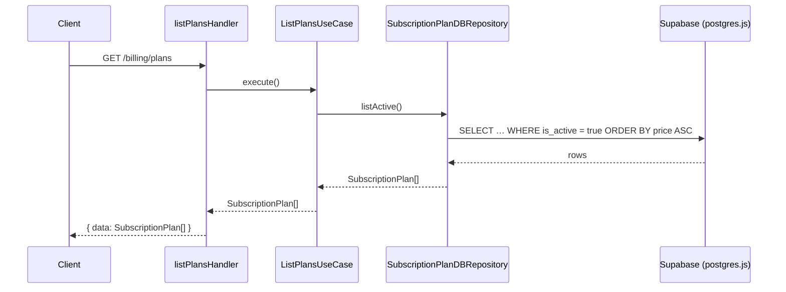

# SUBS-001 — Subscription Plans Catalog

## Problem statement

To sell subscriptions the product needs a stable catalog of plans that both the frontend pricing page and the backend subscription logic can consume. Plans must be configurable without a redeploy: stored in Supabase, filtered to active-only at query time, and exposed through a public read endpoint ordered by price ascending.

## Chosen solution

**Vertical-slice subscriptions module with a Supabase migration, DB repository, use case, and Fastify handler**

This solution follows the established `handler → useCase → IRepository → DBRepository` pattern used by the `billing` and `users` modules. A single Supabase migration creates the `subscription_plans` table (R001) and inserts the three seed rows (R003, R004). A `SubscriptionPlanDBRepository` handles the single read query that filters `is_active = true` and orders by `price ASC` (R002, EC001, EC002, NF001). A `ListPlansUseCase` holds the trivially thin business layer. A `listPlansHandler` wires the pieces and registers the route without a `preHandler` so no authentication is required (R002). The `SubscriptionPlan` type is published from `@repo/types` so the frontend can import it without a runtime dependency on the backend (technical constraint).

## Technical design

### Shared type (`@repo/types`)

```ts
export interface SubscriptionPlan {
  id: string;
  code: string;
  name: string;
  description: string;
  price: number;        // numeric — stored as NUMERIC in DB, returned as JS number
  currency: string;
  interval: 'month' | 'year';
  features: string[];   // flat array of strings
  is_active: boolean;
  provider_plan_id: string | null;
  created_at: string;
  updated_at: string;
}
```

### Database migration

File: `apps/services/supabase/migrations/20260623300000_subscription_plans.sql`

```sql
CREATE TABLE subscription_plans (
  id               uuid        PRIMARY KEY DEFAULT gen_random_uuid(),
  code             text        NOT NULL UNIQUE,
  name             text        NOT NULL,
  description      text        NOT NULL,
  price            numeric     NOT NULL CHECK (price >= 0),
  currency         text        NOT NULL,
  interval         text        NOT NULL CHECK (interval IN ('month', 'year')),
  features         jsonb       NOT NULL DEFAULT '[]',
  is_active        boolean     NOT NULL DEFAULT true,
  provider_plan_id text,
  created_at       timestamptz NOT NULL DEFAULT now(),
  updated_at       timestamptz NOT NULL DEFAULT now()
);

INSERT INTO subscription_plans (id, code, name, description, price, currency, interval, features, is_active, provider_plan_id)
VALUES
  (
    '00000000-0000-0000-0001-000000000001',
    'free',
    'Free',
    'Get started at no cost.',
    0,
    'USD',
    'month',
    '["Up to 3 projects", "Community support"]',
    true,
    null
  ),
  (
    '00000000-0000-0000-0001-000000000002',
    'pro',
    'Pro',
    'For individuals and small teams.',
    12,
    'USD',
    'month',
    '["Unlimited projects", "Priority support", "Advanced analytics"]',
    true,
    null
  ),
  (
    '00000000-0000-0000-0001-000000000003',
    'business',
    'Business',
    'For growing teams that need more power.',
    49,
    'USD',
    'month',
    '["Everything in Pro", "SSO", "SLA", "Dedicated support"]',
    true,
    null
  )
ON CONFLICT (code) DO NOTHING;
```

### API contract

| Method | Path | Auth | Response |
|---|---|---|---|
| GET | `/billing/plans` | None | `{ data: SubscriptionPlan[] }` |

Response shape (HTTP 200):
```json
{
  "data": [
    {
      "id": "uuid",
      "code": "free",
      "name": "Free",
      "description": "Get started at no cost.",
      "price": 0,
      "currency": "USD",
      "interval": "month",
      "features": ["Up to 3 projects", "Community support"],
      "is_active": true,
      "provider_plan_id": null,
      "created_at": "2026-06-23T00:00:00.000Z",
      "updated_at": "2026-06-23T00:00:00.000Z"
    }
  ]
}
```

Only plans where `is_active = true` are returned, ordered by `price ASC`. The free plan (price=0) is always included when active.

### Module layer structure

```
src/modules/subscriptions/
  entities/
    subscriptionPlan.entity.ts        ← plain TS interface mirroring DB row
  repositories/
    interfaces/
      iSubscriptionPlanRepository.ts  ← ISubscriptionPlanRepository with listActive()
    subscriptionPlanDBRepository.ts   ← postgres.js query: SELECT … WHERE is_active ORDER BY price
  useCases/
    listPlansUseCase.ts               ← calls repo.listActive(), returns result
  handlers/
    listPlansHandler.ts               ← no Zod input needed; instantiates repo+useCase, replies
  routes.ts                           ← registers GET /billing/plans with no preHandler
```



## Files

| Path | Action | Description |
|---|---|---|
| `apps/services/supabase/migrations/20260623300000_subscription_plans.sql` | CREATE | Migration creating `subscription_plans` table and inserting the three seed rows |
| `packages/types/src/index.ts` | MODIFY | Add `SubscriptionPlan` interface export |
| `apps/services/src/modules/subscriptions/entities/subscriptionPlan.entity.ts` | CREATE | Plain TypeScript interface mirroring the DB row for use within the backend |
| `apps/services/src/modules/subscriptions/repositories/interfaces/iSubscriptionPlanRepository.ts` | CREATE | `ISubscriptionPlanRepository` interface with `listActive(): Promise<SubscriptionPlan[]>` |
| `apps/services/src/modules/subscriptions/repositories/subscriptionPlanDBRepository.ts` | CREATE | `SubscriptionPlanDBRepository` implementing `ISubscriptionPlanRepository` via postgres.js |
| `apps/services/src/modules/subscriptions/useCases/listPlansUseCase.ts` | CREATE | `ListPlansUseCase` calling `repo.listActive()` and returning the result |
| `apps/services/src/modules/subscriptions/handlers/listPlansHandler.ts` | CREATE | Fastify handler instantiating the repository and use case, replying with `{ data }` |
| `apps/services/src/modules/subscriptions/routes.ts` | CREATE | Fastify plugin registering `GET /billing/plans` with no `preHandler` |
| `apps/services/src/app.ts` | MODIFY | Register the new `subscriptionsRoutes` plugin |
| `apps/services/tests/unit/modules/subscriptions/listPlansUseCase.test.ts` | CREATE | Unit tests for `ListPlansUseCase` covering R002, EC001, EC002 |
| `apps/services/tests/unit/modules/subscriptions/listPlansHandler.test.ts` | CREATE | Unit tests for `listPlansHandler` covering R002, NF001 |
| `apps/services/tests/unit/modules/subscriptions/subscriptionPlanDBRepository.test.ts` | CREATE | Unit tests for `SubscriptionPlanDBRepository` covering R001, R003, R004 |

## Requirement coverage

| ID | Design decision |
|---|---|
| R001 | `20260623300000_subscription_plans.sql` migration creates the `subscription_plans` table with all required columns, constraints (`NOT NULL`, `UNIQUE`, `CHECK`) and default values |
| R002 | `GET /billing/plans` route (no `preHandler`) wired through `listPlansHandler` → `ListPlansUseCase` → `SubscriptionPlanDBRepository.listActive()` which queries `WHERE is_active = true ORDER BY price ASC` |
| R003 | The migration's `INSERT … ON CONFLICT (code) DO NOTHING` block seeds `free` (price=0), `pro`, and `business` plans |
| R004 | `provider_plan_id text` column is nullable in the migration and exposed on the `SubscriptionPlan` type as `string \| null` |
| NF001 | Single indexed primary-key query with a static filter (`is_active = true`) and no joins; expected well under 200ms; `listPlansHandler` wraps execution in latency logging at the repository layer |
| EC001 | `WHERE is_active = true` does not exclude `price = 0`; the free plan is always returned when active |
| EC002 | `WHERE is_active = true` silently omits inactive plans; no application logic references them, leaving existing subscriptions untouched |
