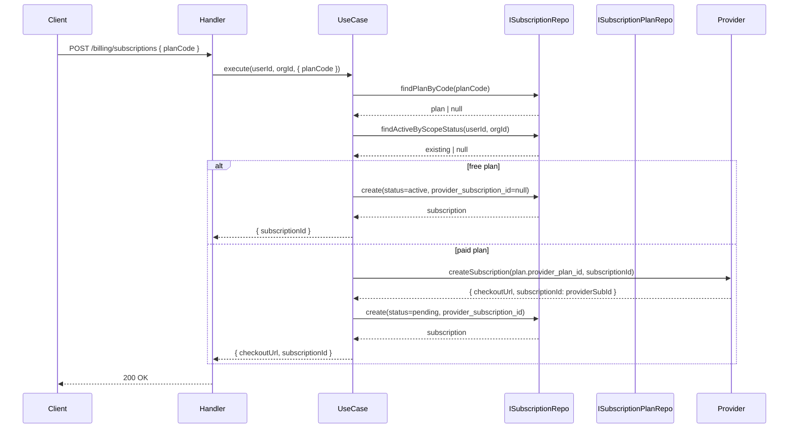

# SUBS-002 — Subscribe & Cancel Flow

## Problem statement

The subscription plans catalog (SUBS-001) exists but there is no mechanism for a user or organization to actually subscribe to a plan, authorize recurring billing, or cancel an existing subscription. The system needs a persistence layer for subscriptions, three authenticated endpoints, and integration with the existing `billing` provider port (`createSubscription`, `cancelSubscription`) — while short-circuiting provider calls for the free plan.

## Alternatives

| Alternative | Description | Decision |
|---|---|---|
| Option A: Thin routes calling provider directly | Add three route handlers that call `resolveProvider()` inline (no use-case layer, no repository interface), persisting rows directly in the handler via raw SQL. | Not chosen — violates the handler→useCase→IRepository→DBRepository layering rule mandated in BACKEND.md; use cases must contain all business logic and handlers must be thin. |
| Option B: Shared subscription repository in `src/shared/repositories/` | Place the new `SubscriptionDBRepository` under `src/shared/repositories/` on the assumption that SUBS-003 (webhooks) will also need it. | Not chosen — BACKEND.md states shared repositories live in `src/shared/repositories/` only when two or more modules currently depend on the same repository; SUBS-003 is out of scope for this feature. Moving it pre-emptively violates the single-responsibility rule and adds scope creep. The repository stays in the subscriptions module and can be relocated when SUBS-003 needs it. |
| Option C: Vertical-slice use cases within the subscriptions module | Extend `apps/services/src/modules/subscriptions/` with a migration, entity, repository interface, DB repository, Zod DTOs, one use case per endpoint, one handler per endpoint, and updated routes — all following the established billing module pattern. Provider access goes exclusively through `resolveProvider()`. | **Chosen** — satisfies all R-IDs and NF-IDs, respects every layer rule, keeps scope strictly within the subscriptions module, and mirrors the billing module layout that BACKEND.md identifies as the canonical reference. |

## Chosen solution

**Vertical-slice use cases within the subscriptions module**

This solution extends `apps/services/src/modules/subscriptions/` with the full handler→useCase→IRepository→DBRepository stack for three endpoints: create subscription, cancel subscription, and get current subscription. It introduces a Supabase migration for the `subscriptions` table with the required schema and uniqueness partial index, an `ISubscriptionRepository` interface, a `SubscriptionDBRepository` implementation, three DTOs (`createSubscriptionDto`, `cancelSubscriptionDto`), three use cases (`createSubscriptionUseCase`, `cancelSubscriptionUseCase`, `getMySubscriptionUseCase`), three handlers, and updated `routes.ts`. Provider access uses the existing `resolveProvider()` singleton from the billing module — no direct Mobbex import. Shared types (`Subscription`, `CreateSubscriptionInput`, `CancelSubscriptionInput`) are added to `@repo/types`.

This satisfies:
- R001 (migration creates the `subscriptions` table with all required columns and constraints)
- R002 (partial unique index enforces at-most-one active subscription per scope)
- R003, R008, R011 (DTOs validate inputs with Zod before any DB/provider call; `requireAuth` guards all three endpoints)
- R004, EC002 (free-plan branch short-circuits without provider call)
- R005 (paid-plan branch calls `provider.createSubscription`, persists `pending` row, returns `checkoutUrl`)
- R006, EC003 (use case checks for existing active subscription before creating; expired/canceled don't block)
- R007 (use case resolves plan by `planCode` from `subscription_plans` where `is_active = true`, returns 400 if absent)
- R009, R010, EC001 (cancel use case branches on `atPeriodEnd`; provider 404 on pending cancellation is treated as success)
- R011 (get-my use case queries by scope and returns null if no active subscription exists)
- R012 (three types exported from `@repo/types`)
- NF001 (Zod schemas validate all inputs before any DB or provider interaction)
- NF002 (use cases only issue commands; no polling)

## Technical design

### Data model

**Migration: `subscriptions` table**

```sql
CREATE TABLE subscriptions (
  id                       uuid        PRIMARY KEY DEFAULT gen_random_uuid(),
  user_id                  text        REFERENCES users(id) ON DELETE SET NULL,
  org_id                   text        REFERENCES organizations(id) ON DELETE SET NULL,
  plan_id                  uuid        NOT NULL REFERENCES subscription_plans(id),
  provider                 text        NOT NULL,
  provider_subscription_id text,
  status                   text        NOT NULL
    CHECK (status IN ('pending','active','past_due','canceled','expired')),
  current_period_start     timestamptz,
  current_period_end       timestamptz,
  cancel_at_period_end     boolean     NOT NULL DEFAULT false,
  canceled_at              timestamptz,
  created_at               timestamptz NOT NULL DEFAULT now(),
  updated_at               timestamptz NOT NULL DEFAULT now()
);

-- R002: at most one non-terminal subscription per scope
CREATE UNIQUE INDEX subscriptions_active_per_user
  ON subscriptions (user_id)
  WHERE user_id IS NOT NULL AND status NOT IN ('canceled', 'expired');

CREATE UNIQUE INDEX subscriptions_active_per_org
  ON subscriptions (org_id)
  WHERE org_id IS NOT NULL AND status NOT IN ('canceled', 'expired');
```

### Shared types (`@repo/types`)

```ts
export type SubscriptionStatusValue =
  | 'pending' | 'active' | 'past_due' | 'canceled' | 'expired';

export interface Subscription {
  id: string;
  user_id: string | null;
  org_id: string | null;
  plan_id: string;
  provider: string;
  provider_subscription_id: string | null;
  status: SubscriptionStatusValue;
  current_period_start: string | null;
  current_period_end: string | null;
  cancel_at_period_end: boolean;
  canceled_at: string | null;
  created_at: string;
  updated_at: string;
}

export interface CreateSubscriptionInput {
  planCode: string;
}

export interface CancelSubscriptionInput {
  atPeriodEnd: boolean;
}
```

### Entity

`SubscriptionEntity` mirrors the database row (identical shape to `Subscription`).

### Repository interface (`ISubscriptionRepository`)

```ts
interface ISubscriptionRepository {
  findActiveByScopePlanCode(userId: string, orgId: string | null): Promise<SubscriptionEntity | null>;
  findByIdAndScope(id: string, userId: string, orgId: string | null): Promise<SubscriptionEntity | null>;
  findPlanByCode(planCode: string): Promise<SubscriptionPlanEntity | null>;
  create(input: CreateSubscriptionData): Promise<SubscriptionEntity>;
  setCancelAtPeriodEnd(id: string): Promise<SubscriptionEntity>;
  cancelImmediately(id: string): Promise<SubscriptionEntity>;
  findActiveByScopeStatus(userId: string, orgId: string | null): Promise<SubscriptionEntity | null>;
}
```

`findActiveByScopePlanCode` is used in the conflict check (R006). `findPlanByCode` resolves plan by code and `is_active = true` (R007). `findActiveByScopeStatus` is used by `getMySubscriptionUseCase` (R011). `setCancelAtPeriodEnd` and `cancelImmediately` are the two cancel mutations.

### Use case contracts

**`CreateSubscriptionUseCase.execute(userId, orgId, input)`**
1. Validate `planCode` via `ISubscriptionRepository.findPlanByCode` — 400 if absent (R007).
2. Check `ISubscriptionRepository.findActiveByScopeStatus` — 409 if non-terminal subscription exists (R006, EC003).
3. If `plan.code === 'free'`: create row with `status = 'active'`, `provider_subscription_id = null`, respond `{ subscriptionId }` (R004, EC002).
4. Else: call `provider.createSubscription(plan.provider_plan_id, subscriptionId)`, create row with `status = 'pending'` and returned `provider_subscription_id`, respond `{ checkoutUrl, subscriptionId }` (R005).

**`CancelSubscriptionUseCase.execute(userId, orgId, subscriptionId, input)`**
1. Resolve subscription via `findByIdAndScope` — 404 if not found or wrong scope.
2. If `atPeriodEnd = true`: set `cancel_at_period_end = true` on local row; call `provider.cancelSubscription` to schedule (R009).
3. If `atPeriodEnd = false`: set `status = 'canceled'`, `canceled_at = now()` on local row; call `provider.cancelSubscription` immediately (R010).
4. EC001: if provider responds HTTP 404 (caught as `ProviderError` with statusCode 400 — treat as success).

**`GetMySubscriptionUseCase.execute(userId, orgId)`**
1. Query `findActiveByScopeStatus` — return `SubscriptionEntity | null` (R011).

### API endpoints

| Method | Path | Auth | Body / Response |
|---|---|---|---|
| `POST` | `/billing/subscriptions` | `requireAuth` | Body: `CreateSubscriptionInput`; Response: `{ subscriptionId }` (free) or `{ checkoutUrl, subscriptionId }` (paid) |
| `POST` | `/billing/subscriptions/:id/cancel` | `requireAuth` | Body: `CancelSubscriptionInput`; Response: `{ subscription: SubscriptionEntity }` |
| `GET` | `/billing/subscriptions/me` | `requireAuth` | Response: `{ subscription: SubscriptionEntity \| null }` |

### Call sequence



## Files

| Path | Action | Description |
|---|---|---|
| `apps/services/supabase/migrations/20260624000000_subscriptions.sql` | CREATE | Creates the `subscriptions` table with all columns, constraints, and two partial unique indexes (R001, R002) |
| `packages/types/src/index.ts` | MODIFY | Exports `SubscriptionStatusValue`, `Subscription`, `CreateSubscriptionInput`, and `CancelSubscriptionInput` (R012) |
| `apps/services/src/modules/subscriptions/entities/subscriptionEntity.ts` | CREATE | Plain TypeScript interface mirroring the `subscriptions` DB row |
| `apps/services/src/modules/subscriptions/repositories/interfaces/iSubscriptionRepository.ts` | CREATE | Repository interface declaring `findActiveByScopeStatus`, `findByIdAndScope`, `findPlanByCode`, `create`, `setCancelAtPeriodEnd`, and `cancelImmediately` |
| `apps/services/src/modules/subscriptions/repositories/subscriptionDBRepository.ts` | CREATE | `SubscriptionDBRepository` implementing `ISubscriptionRepository` using the `postgres.js` singleton with logged queries |
| `apps/services/src/modules/subscriptions/dtos/createSubscriptionDto.ts` | CREATE | Zod schema `CreateSubscriptionBodySchema` validating `{ planCode: string }` |
| `apps/services/src/modules/subscriptions/dtos/cancelSubscriptionDto.ts` | CREATE | Zod schema `CancelSubscriptionBodySchema` validating `{ atPeriodEnd: boolean }` (default `true`) |
| `apps/services/src/modules/subscriptions/useCases/createSubscriptionUseCase.ts` | CREATE | `CreateSubscriptionUseCase` — resolves plan, checks conflict, branches on free vs. paid, calls provider for paid plans |
| `apps/services/src/modules/subscriptions/useCases/cancelSubscriptionUseCase.ts` | CREATE | `CancelSubscriptionUseCase` — resolves subscription by scope, branches on `atPeriodEnd`, calls provider, treats provider 404 as success |
| `apps/services/src/modules/subscriptions/useCases/getMySubscriptionUseCase.ts` | CREATE | `GetMySubscriptionUseCase` — returns the active subscription for the scope or `null` |
| `apps/services/src/modules/subscriptions/handlers/createSubscriptionHandler.ts` | CREATE | Thin Fastify handler: validates body with Zod, instantiates repo and use case, calls execute, replies |
| `apps/services/src/modules/subscriptions/handlers/cancelSubscriptionHandler.ts` | CREATE | Thin Fastify handler: validates body with Zod, reads `:id` param, calls cancel use case, replies |
| `apps/services/src/modules/subscriptions/handlers/getMySubscriptionHandler.ts` | CREATE | Thin Fastify handler: calls get-my use case, replies with `{ subscription }` |
| `apps/services/src/modules/subscriptions/routes.ts` | MODIFY | Registers three new routes with `requireAuth`: `POST /billing/subscriptions`, `POST /billing/subscriptions/:id/cancel`, `GET /billing/subscriptions/me` |
| `apps/services/tests/unit/modules/subscriptions/createSubscriptionUseCase.test.ts` | CREATE | Unit tests for `CreateSubscriptionUseCase` covering R003–R007, EC001–EC003 |
| `apps/services/tests/unit/modules/subscriptions/cancelSubscriptionUseCase.test.ts` | CREATE | Unit tests for `CancelSubscriptionUseCase` covering R008–R010, EC001 |
| `apps/services/tests/unit/modules/subscriptions/getMySubscriptionUseCase.test.ts` | CREATE | Unit tests for `GetMySubscriptionUseCase` covering R011 |
| `apps/services/tests/unit/modules/subscriptions/createSubscriptionHandler.test.ts` | CREATE | Unit tests for `createSubscriptionHandler` covering Zod validation gating (NF001) and happy path |
| `apps/services/tests/unit/modules/subscriptions/cancelSubscriptionHandler.test.ts` | CREATE | Unit tests for `cancelSubscriptionHandler` covering Zod validation gating (NF001) |
| `apps/services/tests/unit/modules/subscriptions/getMySubscriptionHandler.test.ts` | CREATE | Unit tests for `getMySubscriptionHandler` covering R011 response shape |
| `apps/services/tests/unit/modules/subscriptions/subscriptionDBRepository.test.ts` | CREATE | Unit tests for `SubscriptionDBRepository` covering all repository methods (R001, R002) |

## Requirement coverage

| ID | Design decision |
|---|---|
| R001 | Migration `20260624000000_subscriptions.sql` creates the `subscriptions` table with all specified columns, types, nullability, and status `CHECK` constraint |
| R002 | Migration creates two partial unique indexes (`subscriptions_active_per_user`, `subscriptions_active_per_org`) on `user_id`/`org_id` WHERE `status NOT IN ('canceled','expired')` |
| R003 | `POST /billing/subscriptions` is guarded by `requireAuth` in `routes.ts`; `createSubscriptionHandler` validates body with `CreateSubscriptionBodySchema` (Zod) before calling the use case |
| R004 | `CreateSubscriptionUseCase` branches on `plan.code === 'free'` and creates the row with `status = 'active'` and `provider_subscription_id = null`, returning immediately without a provider call |
| R005 | `CreateSubscriptionUseCase` calls `provider.createSubscription(plan.provider_plan_id, subscriptionId)` for non-free plans, persists the row with `status = 'pending'` and the returned `provider_subscription_id`, and responds with `{ checkoutUrl, subscriptionId }` |
| R006 | `CreateSubscriptionUseCase` calls `findActiveByScopeStatus` before creating; if a non-terminal subscription exists it throws `ValidationError` (HTTP 409) with the required message |
| R007 | `CreateSubscriptionUseCase` calls `findPlanByCode` which queries `subscription_plans WHERE code = $1 AND is_active = true`; throws `ValidationError` (HTTP 400) if no row is returned |
| R008 | `POST /billing/subscriptions/:id/cancel` is guarded by `requireAuth` in `routes.ts`; `cancelSubscriptionHandler` validates body with `CancelSubscriptionBodySchema` (Zod, `atPeriodEnd` defaults to `true`) |
| R009 | `CancelSubscriptionUseCase` with `atPeriodEnd = true`: calls `setCancelAtPeriodEnd` on the repo (sets `cancel_at_period_end = true`, keeps `status`), then calls `provider.cancelSubscription` |
| R010 | `CancelSubscriptionUseCase` with `atPeriodEnd = false`: calls `cancelImmediately` on the repo (sets `status = 'canceled'`, `canceled_at = now()`), then calls `provider.cancelSubscription` |
| R011 | `GET /billing/subscriptions/me` is guarded by `requireAuth`; `GetMySubscriptionUseCase` calls `findActiveByScopeStatus` and returns the entity or `null`; handler replies `{ subscription }` |
| R012 | `packages/types/src/index.ts` exports `SubscriptionStatusValue`, `Subscription`, `CreateSubscriptionInput`, and `CancelSubscriptionInput` |
| NF001 | Both create and cancel handlers validate their request body with Zod before any DB or provider call; invalid input returns HTTP 400 without touching the DB |
| NF002 | Use cases only issue `createSubscription` and `cancelSubscription` commands to the provider; no polling loop or provider-state queries are performed in this feature |
| EC001 | `CancelSubscriptionUseCase` catches `ProviderError` where the message indicates HTTP 404 from the provider and treats it as a successful cancellation, returning HTTP 200 |
| EC002 | Handled by R004 branch — free plan creates `status = 'active'` with no provider call |
| EC003 | `findActiveByScopeStatus` queries `status NOT IN ('canceled','expired')`; a previous `canceled` or `expired` subscription does not trigger the 409 conflict check |
