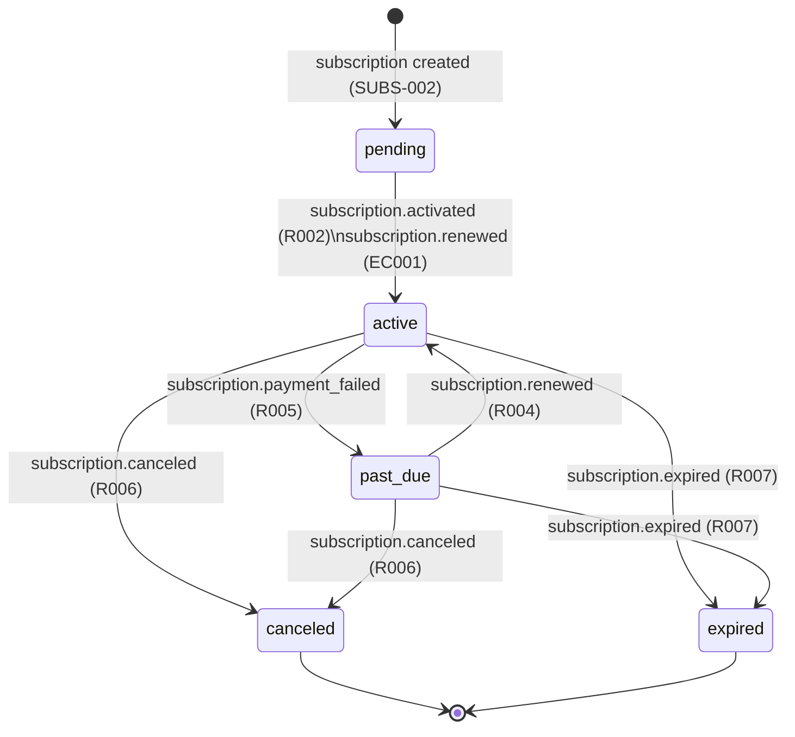
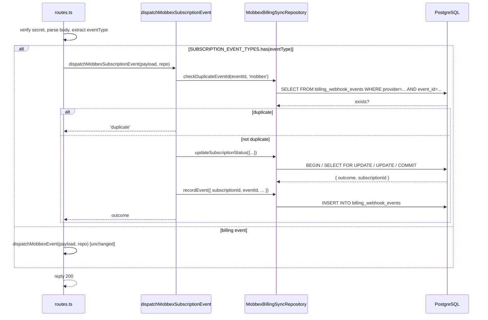

# SUBS-003 — Subscription Lifecycle Webhooks

## Problem statement

The `subscriptions` table holds a local mirror of each user/org subscription, but its state fields (`status`, `current_period_start`, `current_period_end`, `canceled_at`) are never updated after creation. Mobbex emits recurring lifecycle events (activation, renewal, payment failure, cancellation, expiration) for which the system has no consumer, causing local subscription state to drift from provider reality and making it unreliable for downstream entitlement and quota logic. SUBS-003 closes this gap by extending the existing Mobbex webhook endpoint with a dedicated subscription event dispatcher.

## Alternatives

| Alternative | Description | Decision |
|---|---|---|
| Inline extension | Extend `dispatchMobbexEvent` in `mobbexEventHandlers.ts` with additional `if/else` branches for subscription event types; add subscription methods to the existing repository. | Not chosen — conflates billing transaction lifecycle and subscription lifecycle in a single function; harder to test subscription logic independently; violates SRP as the function would grow across two unrelated domains. |
| Parallel subscription dispatcher | Create `mobbexSubscriptionEventHandlers.ts` with `dispatchMobbexSubscriptionEvent()` and a static `SUBSCRIPTION_EVENT_TYPES` set; route handler branches on event type; repository extended with subscription-specific methods. | **Chosen** — separates concerns while reusing shared infrastructure (`recordEvent`, repository, route); satisfies all technical constraints including the static event-type table and `MobbexBillingSyncRepository` extension requirement; each dispatcher is independently testable. |
| Handler registry | Introduce a generic `Map<string, HandlerFn>` registry that maps event type strings to handler functions; register both billing and subscription handlers at startup; dispatch via a single Map lookup. | Not chosen — unnecessary abstraction for a fixed, finite, and stable set of event types; adds indirection without meaningful extensibility gain; the static table constraint is better served by the simpler Set-based approach. |

## Chosen solution

**Parallel subscription dispatcher**

A new `mobbexSubscriptionEventHandlers.ts` module is created alongside the existing billing dispatcher. A static `SUBSCRIPTION_EVENT_TYPES` Set declares the five known subscription event types. The route handler in `routes.ts` checks whether the incoming event type is in this Set and routes accordingly: subscription events go to `dispatchMobbexSubscriptionEvent`, all other events continue to the existing `dispatchMobbexEvent`. This satisfies R001 (routing) without touching secret verification, raw-body parsing, or endpoint registration.

`MobbexBillingSyncRepository` is extended with two new methods (`checkDuplicateEventId`, `updateSubscriptionStatus`) as required by the technical constraint. `RecordEventInput` gains optional `subscriptionId` and `eventId` fields, enabling R008 (event persistence) and R010 (idempotency) to share the existing `billing_webhook_events` table. A migration adds the FK constraint on the reserved `subscription_id` column and a new `event_id` column with a partial index for idempotency lookups.

The `updateSubscriptionStatus` method atomically handles the full subscription state machine — including R009 (state idempotency), R004 (past_due recovery on renewal), EC001 (never-activated renewal), and EC002 (payment_failed guard) — inside a single `sql.begin` transaction, preventing TOCTOU races under concurrent deliveries.

## Technical design

### Database migration

`billing_webhook_events` already has a reserved `subscription_id UUID` column with no FK. The migration adds:
- A FK constraint linking it to `subscriptions(id) ON DELETE SET NULL`.
- A nullable `event_id TEXT` column populated from the Mobbex payload.
- A partial index on `(provider, event_id) WHERE event_id IS NOT NULL` for sub-millisecond idempotency lookups (R010).

No changes to the `subscriptions` table are needed — all required columns (`status`, `current_period_start`, `current_period_end`, `canceled_at`) were added in SUBS-002.

### Interface extensions (IMobbexBillingSyncRepository)

```typescript
// Extends existing RecordEventInput
export interface RecordEventInput {
  eventType: string;
  payload: Record<string, unknown>;
  transactionId: string | null;
  subscriptionId?: string | null;  // populated for subscription events
  eventId?: string | null;          // Mobbex event_id for idempotency
}

export type SubscriptionSyncOutcome = 'applied' | 'noop' | 'orphan';

export interface UpdateSubscriptionStatusInput {
  providerSubscriptionId: string;
  eventType: string;             // determines which state transition to apply
  currentPeriodStart?: string | null;
  currentPeriodEnd?: string | null;
}

export interface UpdateSubscriptionStatusResult {
  outcome: SubscriptionSyncOutcome;
  subscriptionId: string | null;
  resolvedStatus: string | null;  // current status before transition, for logging
}

// New methods on IMobbexBillingSyncRepository
checkDuplicateEventId(eventId: string, provider: string): Promise<boolean>;
updateSubscriptionStatus(input: UpdateSubscriptionStatusInput): Promise<UpdateSubscriptionStatusResult>;
```

### Subscription dispatcher (mobbexSubscriptionEventHandlers.ts)

```
export const SUBSCRIPTION_EVENT_TYPES = new Set([
  'subscription.activated',
  'subscription.renewed',
  'subscription.payment_failed',
  'subscription.canceled',
  'subscription.expired',
]);

export type SubscriptionDispatchOutcome = 'applied' | 'noop' | 'orphan' | 'unknown' | 'duplicate';

dispatchMobbexSubscriptionEvent(payload, repo) → SubscriptionDispatchOutcome:
  1. Extract eventType from payload.type ?? payload.event_type ?? ''
  2. Extract data = payload.data ?? {}
  3. Extract eventId from data.event_id ?? null
  4. Extract providerSubscriptionId from data.subscription_id ?? data.id ?? null
  5. Extract currentPeriodStart, currentPeriodEnd from data fields
  6. R010/EC005: if eventId → checkDuplicateEventId(eventId, 'mobbex')
       → true: log warn { event_type, provider_subscription_id, subscription_id: null, outcome: 'duplicate' }
              return 'duplicate'  [no recordEvent — EC005: only first occurrence persisted]
  7. EC004: if eventType not in SUBSCRIPTION_EVENT_TYPES
       → recordEvent({ eventType, payload, transactionId: null, subscriptionId: null, eventId })
       → log warn { ..., outcome: 'unknown' }
       → return 'unknown'
  8. updateSubscriptionStatus({ providerSubscriptionId, eventType, currentPeriodStart, currentPeriodEnd })
       → result: { outcome, subscriptionId, resolvedStatus }
  9. R008: recordEvent({ eventType, payload, transactionId: null, subscriptionId: result.subscriptionId, eventId })
  10. NF002: log info/warn { event_type, provider_subscription_id, subscription_id: result.subscriptionId, outcome }
  11. return result.outcome
```

### updateSubscriptionStatus atomic state machine

Executed inside `sql.begin` with `SELECT ... FOR UPDATE` to prevent concurrent mutations:

```
BEGIN
  SELECT id, status, current_period_start, current_period_end
  FROM subscriptions
  WHERE provider_subscription_id = $providerSubscriptionId
  LIMIT 1
  FOR UPDATE

  if not found:
    return { outcome: 'orphan', subscriptionId: null, resolvedStatus: null }

  switch(eventType):
    'subscription.activated':      -- R002
      R009: if status='active' AND periods match input → return 'noop'
      UPDATE SET status='active', current_period_start, current_period_end, updated_at=now()

    'subscription.renewed':        -- R003, R004, EC001
      R009: if status='active' AND current_period_end matches input → return 'noop'
      if status='past_due': also SET status='active'        -- R004
      if status='pending':  also SET status='active' AND current_period_start  -- EC001
      UPDATE SET current_period_end [, status='active'] [, current_period_start], updated_at=now()

    'subscription.payment_failed': -- R005, EC002
      EC002: if status IN ('canceled','expired') → return 'noop'
      R009: if status='past_due' → return 'noop'
      UPDATE SET status='past_due', updated_at=now()

    'subscription.canceled':       -- R006
      R009: if status='canceled' → return 'noop'
      UPDATE SET status='canceled', canceled_at=now(), updated_at=now()

    'subscription.expired':        -- R007
      R009: if status='expired' → return 'noop'
      UPDATE SET status='expired', updated_at=now()

  return { outcome: 'applied', subscriptionId: row.id, resolvedStatus: row.status }
COMMIT
```

### Route handler changes (routes.ts)

The existing route handler is minimally extended — the secret check, content-type parser, and route registration are untouched:

```typescript
import { SUBSCRIPTION_EVENT_TYPES, dispatchMobbexSubscriptionEvent } from './mobbexSubscriptionEventHandlers.js';

// Inside the existing route handler, after parsing payload and extracting eventType:
let outcome: string;
if (SUBSCRIPTION_EVENT_TYPES.has(eventType)) {
  outcome = await dispatchMobbexSubscriptionEvent(payload, repository);
} else {
  outcome = await dispatchMobbexEvent(payload, repository);
}
// Existing request.log.info(...) continues unchanged
```

### Subscription state machine diagram



### Dispatch sequence diagram



## Files

| Path | Action | Description |
|---|---|---|
| `apps/services/supabase/migrations/20260625000000_billing_webhook_events_subscription.sql` | CREATE | Adds FK constraint on `subscription_id`, `event_id TEXT` column, and partial index on `(provider, event_id)` |
| `apps/services/src/modules/webhooks/repositories/interfaces/iMobbexBillingSyncRepository.ts` | MODIFY | Extends `RecordEventInput` with `subscriptionId` and `eventId`; adds `SubscriptionSyncOutcome`, `UpdateSubscriptionStatusInput`, `UpdateSubscriptionStatusResult`; declares `checkDuplicateEventId` and `updateSubscriptionStatus` methods |
| `apps/services/src/modules/webhooks/repositories/mobbexBillingSyncRepository.ts` | MODIFY | Extends `recordEvent` INSERT to include `subscription_id` and `event_id`; adds `checkDuplicateEventId` and `updateSubscriptionStatus` implementations |
| `apps/services/src/modules/webhooks/mobbex/mobbexSubscriptionEventHandlers.ts` | CREATE | `SUBSCRIPTION_EVENT_TYPES` Set and `dispatchMobbexSubscriptionEvent` function handling R001–R011, NF002, EC003–EC005 |
| `apps/services/src/modules/webhooks/mobbex/routes.ts` | MODIFY | Imports `SUBSCRIPTION_EVENT_TYPES` and `dispatchMobbexSubscriptionEvent`; adds branching after payload parse to route subscription events to the new dispatcher |
| `apps/services/tests/unit/modules/webhooks/repositories/mobbexBillingSyncRepository.test.ts` | MODIFY | Adds test cases for `checkDuplicateEventId`, extended `recordEvent`, and `updateSubscriptionStatus` (all event types, orphan, R009, EC001, EC002) |
| `apps/services/tests/unit/modules/webhooks/mobbex/mobbexSubscriptionEventHandlers.test.ts` | CREATE | Tests for `dispatchMobbexSubscriptionEvent`: duplicate event_id, unknown type, orphan, each event type, NF002 logging |
| `apps/services/tests/unit/modules/webhooks/mobbex/routes.test.ts` | MODIFY | Adds test cases asserting subscription events route to subscription dispatcher and non-subscription events route to billing dispatcher |

## Requirement coverage

| ID | Design decision |
|---|---|
| R001 | `routes.ts` branching on `SUBSCRIPTION_EVENT_TYPES.has(eventType)` — subscription events to new dispatcher, all other events to existing billing dispatcher unchanged |
| R002 | `updateSubscriptionStatus` case `subscription.activated`: atomically sets `status='active'`, `current_period_start`, `current_period_end` |
| R003 | `updateSubscriptionStatus` case `subscription.renewed`: atomically updates `current_period_end` |
| R004 | `updateSubscriptionStatus` case `subscription.renewed`: when current `status='past_due'`, also sets `status='active'` in the same UPDATE |
| R005 | `updateSubscriptionStatus` case `subscription.payment_failed`: sets `status='past_due'` when current status is neither `canceled`, `expired`, nor already `past_due` |
| R006 | `updateSubscriptionStatus` case `subscription.canceled`: sets `status='canceled'` and `canceled_at=now()` |
| R007 | `updateSubscriptionStatus` case `subscription.expired`: sets `status='expired'` |
| R008 | `dispatchMobbexSubscriptionEvent` calls `repo.recordEvent({..., subscriptionId: result.subscriptionId, eventId})` after every non-duplicate processing path; migration adds FK + `event_id` column |
| R009 | `updateSubscriptionStatus` SELECT current row before UPDATE; compares target status and period fields; returns `'noop'` if already in target state, skipping the UPDATE |
| R010 | `dispatchMobbexSubscriptionEvent` calls `checkDuplicateEventId` as the first DB operation when `eventId` is present; returns `'duplicate'` immediately without further processing or recording |
| R011 | Route handler `reply.status(200)` is always reached on the non-error path regardless of dispatch outcome |
| NF001 | Single `sql.begin` transaction per event; no synchronous heavy computation; consistent with BILLING-003's existing sub-5s budget |
| NF002 | `dispatchMobbexSubscriptionEvent` emits structured log via static `logger` with fields `event_type`, `provider_subscription_id`, `subscription_id`, `outcome` for every processing path including duplicates and unknowns |
| EC001 | `updateSubscriptionStatus` case `subscription.renewed` when `status='pending'`: sets `status='active'` and populates `current_period_start` in addition to `current_period_end` |
| EC002 | `updateSubscriptionStatus` case `subscription.payment_failed` when `status IN ('canceled','expired')`: returns `'noop'` without updating; `dispatchMobbexSubscriptionEvent` logs `warn` with `outcome='noop'` |
| EC003 | `updateSubscriptionStatus` when no subscription found for `provider_subscription_id`: returns `{ outcome: 'orphan', subscriptionId: null }`; `dispatchMobbexSubscriptionEvent` records the event with `subscriptionId=null` and logs `warn` |
| EC004 | `dispatchMobbexSubscriptionEvent` checks `SUBSCRIPTION_EVENT_TYPES` after the duplicate check; on unknown type records event with `subscriptionId=null` and returns `'unknown'` without calling `updateSubscriptionStatus` |
| EC005 | `checkDuplicateEventId` queries `billing_webhook_events` index; on match `dispatchMobbexSubscriptionEvent` returns without recording a second event row, satisfying "persist only the first occurrence" |
