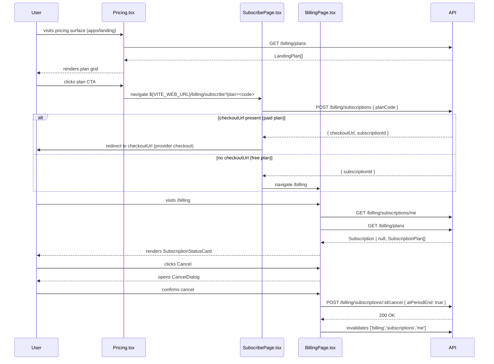

# SUBS-004 — Pricing Page & Billing Settings UI

## Problem statement

The subscriptions backend is complete (SUBS-001/002/003), but end users have no way to interact with it. The marketing SPA (`apps/landing`) cannot surface the pricing catalog, the authenticated app (`apps/web`) cannot trigger checkout, and there is no page to inspect or cancel an active subscription. This feature bridges that gap by adding a public pricing section to `apps/landing` and two protected pages to `apps/web`.

## Alternatives

| Alternative | Description | Decision |
|---|---|---|
| Inline state in page components | Pages in `apps/web` call `apiFetch` directly via `useState`+`useEffect`, skipping the hooks layer | Not chosen — violates `apps/web` layered architecture: pages must not import from `api/` directly; the hooks layer is mandatory per FRONTEND.md conventions |
| Zustand store for subscription state | A Zustand store owns subscription and plans state in `apps/web`; pages dispatch store actions instead of using React Query | Not chosen — analysis.md explicitly mandates React Query for plans and subscription reads (`usePlans`, `useMySubscription`, `useCancelSubscription`); Zustand is designed for client-side state, not server-synced data |
| Layered API + React Query hooks | Full `api` → `hooks` → `pages` → `components` flow in `apps/web`; `apps/landing` uses a lightweight `api/plans.ts` with `useEffect` fetch inside the section component | **Chosen** — satisfies all R-IDs, respects all layering rules in both apps, and aligns with patterns already established in `hooks/use-user-profile.ts` and `api/billing.ts` |

## Chosen solution

**Layered API + React Query hooks**

The chosen solution implements the full `apps/web` layer stack for all billing operations while keeping `apps/landing` intentionally lightweight (no React Query, no `@repo/types`). `Pricing.tsx` fetches plans in a `useEffect` via `api/plans.ts` and renders them as cards; CTA clicks navigate to the `apps/web` origin using `VITE_WEB_URL`. In `apps/web`, `api/billing.ts` gains four functions (`listPlans`, `subscribe`, `getMySubscription`, `cancelSubscription`); `hooks/use-billing.ts` wraps them in `usePlans`, `useSubscribe`, `useMySubscription`, and `useCancelSubscription`; pages are the only callers of those hooks; domain components under `components/domain/billing/` are props-only. This satisfies R001–R009, NF001–NF002, and all EC edge cases while respecting every hard constraint in analysis.md.

## Technical design

### Data flow



### `apps/landing` — `api/plans.ts`

Inline local type (no `@repo/types`):

```typescript
interface LandingPlan {
  code: string;
  name: string;
  price: number;
  currency: string;
  interval: 'month' | 'year';
  features: string[];
}

async function listPlans(): Promise<LandingPlan[]>
// Fetches GET ${import.meta.env.VITE_API_URL}/billing/plans
// Returns parsed data array; throws on non-2xx
```

### `apps/landing` — `Pricing.tsx` section

Uses `useState<{ plans: LandingPlan[]; loading: boolean; error: boolean }>` and a `useEffect` to call `listPlans()`. Renders:
- Loading state while fetching
- Non-blocking error message with retry affordance on failure (NF002, EC006-adapted)
- "No plans available" empty state when `plans.length === 0` (EC006)
- Plan grid with one `PlanCard`-style div per plan when plans are present (R001)
- CTA button per plan: `onclick → window.location.href = ${VITE_WEB_URL}/billing/subscribe?plan=${plan.code}` (R002)

### `apps/web` — `api/billing.ts` additions

```typescript
// No auth required; public endpoint
listPlans(): Promise<SubscriptionPlan[]>
// GET /billing/plans

// Creates subscription; checkoutUrl absent for free plans
subscribe(token: string, body: CreateSubscriptionInput): Promise<{ checkoutUrl?: string; subscriptionId: string }>
// POST /billing/subscriptions

// Returns null when backend 404 (user has no subscription)
getMySubscription(token: string): Promise<Subscription | null>
// GET /billing/subscriptions/me

// Returns void; throws on error
cancelSubscription(token: string, id: string, body: CancelSubscriptionInput): Promise<void>
// POST /billing/subscriptions/:id/cancel
```

`getMySubscription` catches `ApiError` with `status === 404` and returns `null` instead of throwing, so `useMySubscription` can treat `null` as "free plan" without an error state.

### `apps/web` — `hooks/use-billing.ts`

| Hook | Type | Query key | Calls |
|---|---|---|---|
| `usePlans` | `useQuery` | `['billing', 'plans']` | `listPlans()` |
| `useMySubscription` | `useQuery` | `['billing', 'subscriptions', 'me']` | `getMySubscription(token)` |
| `useSubscribe` | `useMutation` | — | `subscribe(token, body)` |
| `useCancelSubscription` | `useMutation` | — | `cancelSubscription(token, id, body)`; invalidates `['billing', 'subscriptions', 'me']` on success |

`useMySubscription` and `useCancelSubscription` obtain the bearer token via `useAuth().getToken()` from Clerk, mirroring the pattern in `use-user-profile.ts`.

### `apps/web` — domain component props

**`StatusBadge`**
```typescript
{ status: SubscriptionStatusValue }
```
Renders a `<span>` with status-specific inline style or class for `pending` (yellow), `active` (green), `past_due` (red), `canceled` (grey).

**`PlanCard`**
```typescript
{ plan: SubscriptionPlan; onSelect: (code: string) => void; loading?: boolean }
```
Renders plan name, `formatCurrency(plan.price, plan.currency)` + interval, features list, and a CTA button disabled when `loading` (NF001).

**`SubscriptionStatusCard`**
```typescript
{
  subscription: Subscription | null;
  plan: SubscriptionPlan | null;  // resolved from plans list by plan_id; null = legacy/unknown
  onCancel: () => void;
  cancelLoading: boolean;
  onNavigateToPricing: () => void;
}
```
- `subscription === null` → free plan empty state with CTA to pricing surface (R006)
- `subscription.status === 'past_due'` → `StatusBadge` + inline "payment failed" message + external portal link (EC001)
- `subscription.status === 'canceled'` → `StatusBadge` + "access ends `<formatDate(current_period_end)>`"; Cancel button hidden (EC002)
- `plan === null` → render `subscription.plan_id` with "(legacy plan)" label (EC003)
- Otherwise → plan name, `StatusBadge`, `formatDate(current_period_end)`, Cancel button disabled when `cancelLoading` (NF001)

**`CancelDialog`**
```typescript
{ open: boolean; onConfirm: () => void; onDismiss: () => void; loading: boolean }
```
Modal overlay; Confirm button disabled when `loading` (NF001); dismiss without confirming does not call `onConfirm` (R009).

### `apps/web` — pages

**`SubscribePage`** (`/billing/subscribe`)
1. Reads `plan` from `useSearchParams()`
2. Calls `usePlans()` to resolve plan details
3. Fires `useSubscribe` mutation in a `useEffect` on first render when `plan` is present
4. On success with `checkoutUrl` → `window.location.href = checkoutUrl` (R003)
5. On success without `checkoutUrl` → `navigate('/billing')` (R004)
6. On `ApiError.status === 400` or missing `?plan` → error message + CTA to landing pricing (EC004)
7. On `ApiError.status === 409` → "already subscribed" message + CTA to `/billing` (EC005)

**`BillingPage`** (`/billing`)
1. Calls `useMySubscription()`, `usePlans()`, `useCancelSubscription()`
2. Renders loading skeleton while queries are pending
3. Renders non-blocking error message with retry affordance on query failure (NF002)
4. Resolves plan from plans list: `plans.find(p => p.id === subscription?.plan_id) ?? null`
5. Renders `SubscriptionStatusCard` with resolved props
6. Manages local `cancelDialogOpen: boolean` state
7. Cancel confirmed → calls `useCancelSubscription` mutation with `{ atPeriodEnd: true }` (R007)

### Router changes

Billing pages are added as children of the existing `/*` → `<AppLayout />` route, which renders `<Outlet />` and is already under `<AuthGuard />`:

```typescript
{ path: 'billing', element: <BillingPage /> }
{ path: 'billing/subscribe', element: <SubscribePage /> }
```

## Files

| Path | Action | Description |
|---|---|---|
| `apps/landing/src/api/plans.ts` | CREATE | `LandingPlan` local type and `listPlans()` using raw `fetch` |
| `apps/landing/src/components/sections/Pricing.tsx` | CREATE | Pricing section with `useEffect` fetch, plan grid, CTA buttons |
| `apps/landing/src/pages/HomePage.tsx` | MODIFY | Add `<Pricing />` to page composition |
| `apps/web/src/api/billing.ts` | MODIFY | Add `listPlans`, `subscribe`, `getMySubscription`, `cancelSubscription` |
| `apps/web/src/hooks/use-billing.ts` | CREATE | `usePlans`, `useSubscribe`, `useMySubscription`, `useCancelSubscription` |
| `apps/web/src/components/domain/billing/StatusBadge.tsx` | CREATE | Color-coded status badge for `SubscriptionStatusValue` |
| `apps/web/src/components/domain/billing/PlanCard.tsx` | CREATE | Props-only plan card for display in SubscribePage |
| `apps/web/src/components/domain/billing/SubscriptionStatusCard.tsx` | CREATE | Current subscription display with free-plan state, EC001–EC003 handling |
| `apps/web/src/components/domain/billing/CancelDialog.tsx` | CREATE | Confirmation modal for cancel action |
| `apps/web/src/pages/billing/SubscribePage.tsx` | CREATE | Subscribe redirector page handling R003/R004/EC004/EC005 |
| `apps/web/src/pages/billing/BillingPage.tsx` | CREATE | Authenticated billing management page handling R005–R009 |
| `apps/web/src/router.tsx` | MODIFY | Add `/billing` and `/billing/subscribe` routes under AppLayout |
| `apps/landing/tests/Pricing.test.tsx` | CREATE | Acceptance tests for R001, R002, EC006 |
| `apps/web/tests/billing/use-billing.test.ts` | CREATE | Unit tests for `api/billing.ts` new functions and hooks |
| `apps/web/tests/billing/SubscribePage.test.tsx` | CREATE | Acceptance tests for R003, R004, EC004, EC005 |
| `apps/web/tests/billing/BillingPage.test.tsx` | CREATE | Acceptance tests for R005–R009, NF001, NF002, EC001–EC003 |

## Requirement coverage

| ID | Design decision |
|---|---|
| R001 | `Pricing.tsx` calls `listPlans()` on mount and renders one card per plan showing name, formatted price, interval, features, and CTA |
| R002 | CTA click in `Pricing.tsx` sets `window.location.href` to `${VITE_WEB_URL}/billing/subscribe?plan=<code>` |
| R003 | `SubscribePage.tsx` fires `useSubscribe` on mount; on success with `checkoutUrl` → `window.location.href = checkoutUrl` |
| R004 | `SubscribePage.tsx` navigates to `/billing` when `useSubscribe` success response has no `checkoutUrl` |
| R005 | `BillingPage.tsx` mounted under AuthGuard+AppLayout; calls `useMySubscription()` and renders `SubscriptionStatusCard` with plan name, `StatusBadge`, and `formatDate(current_period_end)` |
| R006 | `SubscriptionStatusCard` renders free-plan empty state with pricing CTA when `subscription === null` |
| R007 | Cancel button in `SubscriptionStatusCard` triggers dialog; confirmed → `useCancelSubscription({ atPeriodEnd: true })`; mutation success → query invalidated |
| R008 | `StatusBadge.tsx` renders distinct visual treatment for each `SubscriptionStatusValue` |
| R009 | `CancelDialog.onDismiss` closes dialog; `onConfirm` is never called on dismiss |
| NF001 | `useSubscribe.isPending` and `useCancelSubscription.isPending` disable CTA and Cancel buttons respectively |
| NF002 | `useMySubscription.isError` and `usePlans.isError` render inline error messages with retry affordances instead of crashing |
| EC001 | `SubscriptionStatusCard` checks `status === 'past_due'` and renders red badge, payment-failed message, and external portal link |
| EC002 | `SubscriptionStatusCard` checks `status === 'canceled'` and renders canceled badge with end-date line; Cancel button is hidden |
| EC003 | `BillingPage` passes `plan: null` when `plan_id` has no match in plans list; `SubscriptionStatusCard` falls back to `plan_id` text with "(legacy plan)" label |
| EC004 | `SubscribePage` renders error + pricing CTA when `?plan` param absent or `subscribe` returns 400 |
| EC005 | `SubscribePage` renders "already subscribed" message + `/billing` CTA when `subscribe` returns 409 |
| EC006 | `Pricing.tsx` renders "No plans available right now" empty state when `listPlans()` returns `[]` |
