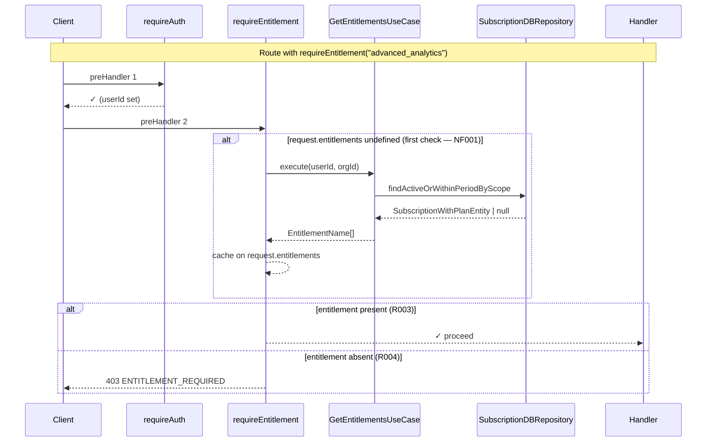

# SUBS-005 — Entitlements / Feature Gates

## Problem statement

With active subscriptions in place, the product has no uniform mechanism to gate functionality by plan. Each feature would need its own ad-hoc check, producing duplication and inconsistency across backend routes and frontend components.

This feature introduces a single backend-owned `planCode → EntitlementName[]` mapping and the runtime primitives that consume it: a Fastify `preHandler` factory for route-level gating, a public-facing `/billing/entitlements/me` endpoint, a React Query–backed hook, and a render-gating component.

## Alternatives

| Alternative | Description | Decision |
|---|---|---|
| Flat Resolver Function | Define a standalone `resolveEntitlements(sql, userId, orgId)` function in `entitlements.ts` that directly queries the DB; `requireEntitlement` calls this function directly, bypassing the use-case layer. | Not chosen — business logic (EC001/EC003/EC004 status rules) and DB access coupled in a module-scope function outside the use-case layer, violating the layer rules in BACKEND.md. |
| Fastify Plugin Decorator | Register a `entitlementResolver` Fastify decorator via a plugin in `app.ts`; `requireEntitlement` accesses the resolver through Fastify's decorator API. | Not chosen — adds plugin lifecycle and encapsulation complexity that is unnecessary; `requireAuth`/`requireOrg` set the precedent that preHandlers hold a direct reference to logic, not Fastify decorators. |
| Feature Slice with Module-Scope Use Case | Follow the standard `handler → useCase → IRepository → DBRepository` vertical slice; `requireEntitlement` factory holds a module-scope `GetEntitlementsUseCase` instance; request augmentation for `request.entitlements` is co-located in `requireEntitlement.ts`. | **Chosen** — satisfies all R-IDs and NF-IDs; respects every layer rule; module-scope use case + per-request `request.entitlements` caching satisfies NF001; mirrors established patterns in the codebase. |

## Chosen solution

**Feature Slice with Module-Scope Use Case**

The design follows the `handler → useCase → IRepository → DBRepository` vertical slice established by all existing subscription handlers. The `GetEntitlementsUseCase` owns all entitlement resolution logic (EC001/EC003/EC004). A new `findActiveOrWithinPeriodByScope` repository method returns the relevant subscription row with its plan code in a single JOIN query. The `requireEntitlement(name)` factory in `subscriptions/plugins/requireEntitlement.ts` holds module-scope instances of the repo and use case (satisfying NF001 by caching on `request.entitlements`), and co-locates the FastifyRequest augmentation per the technical constraint. The `EntitlementName` type is defined in `@repo/types` (pattern established by `SubscriptionStatusValue`) and the mapping lives in `subscriptions/entitlements.ts` which imports from `@repo/types`.

This satisfies R001–R009 and both NF-IDs. No conventions are violated. The "Fastify Plugin Decorator" variant was explicitly considered and dismissed because the existing preHandler pattern (`requireAuth`, `requireOrg`) is a plain function reference and is sufficient.

## Technical design

### Shared type: `EntitlementName`

Added to `packages/types/src/index.ts`:

```ts
export type EntitlementName =
  | 'advanced_analytics'
  | 'priority_support'
  | 'api_access'
  | 'team_collaboration'
  | 'white_label';
```

### Backend: entitlements mapping

`apps/services/src/modules/subscriptions/entitlements.ts` exports:

```ts
import type { EntitlementName } from '@repo/types';

export const PLAN_ENTITLEMENTS: Record<string, EntitlementName[]> = {
  free:     [],
  pro:      ['advanced_analytics', 'priority_support', 'api_access'],
  business: ['advanced_analytics', 'priority_support', 'api_access', 'team_collaboration', 'white_label'],
};
```

### Backend: config

`apps/services/src/shared/configs/subscriptionsConfig.ts`:

```ts
const env = process.env || {};
export const subscriptionsConfig = {
  strictEntitlementsOnPastDue: env.STRICT_ENTITLEMENTS_ON_PAST_DUE === 'true',
};
```

### Backend: new error class

Added to `apps/services/src/shared/errors.ts`:

```ts
export class EntitlementRequiredError extends DomainError {
  constructor(entitlement: string) {
    super('ENTITLEMENT_REQUIRED', `Entitlement required: ${entitlement}`, 403);
  }
}
```

### Backend: repository extension

New entity `SubscriptionWithPlanEntity` in `entities/subscriptionWithPlanEntity.ts`:

```ts
import type { SubscriptionEntity } from './subscriptionEntity.js';
export interface SubscriptionWithPlanEntity extends SubscriptionEntity {
  plan_code: string;
}
```

New method added to `ISubscriptionRepository`:

```ts
findActiveOrWithinPeriodByScope(
  userId: string,
  orgId: string | null
): Promise<SubscriptionWithPlanEntity | null>;
```

SQL (implemented in `SubscriptionDBRepository`):

```sql
SELECT s.id, s.user_id, s.org_id, s.plan_id, s.provider,
       s.provider_subscription_id, s.status,
       s.current_period_start, s.current_period_end,
       s.cancel_at_period_end, s.canceled_at, s.created_at, s.updated_at,
       sp.code AS plan_code
FROM subscriptions s
JOIN subscription_plans sp ON sp.id = s.plan_id
WHERE <scope condition>
  AND (
    s.status NOT IN ('canceled', 'expired')
    OR (s.status = 'canceled' AND s.current_period_end > NOW())
  )
ORDER BY
  CASE WHEN s.status NOT IN ('canceled', 'expired') THEN 0 ELSE 1 END ASC,
  s.created_at DESC
LIMIT 1
```

The `ORDER BY` ensures an active/past_due/pending row is always preferred over a canceled-within-period row, without relying on wall-clock ordering.

### Backend: GetEntitlementsUseCase

```ts
async execute(userId: string, orgId: string | null): Promise<EntitlementName[]> {
  const sub = await this.repo.findActiveOrWithinPeriodByScope(userId, orgId);

  // EC001: no subscription → free plan
  if (!sub) return PLAN_ENTITLEMENTS['free'] ?? [];

  // EC003: past_due + strict mode → free plan
  if (sub.status === 'past_due' && subscriptionsConfig.strictEntitlementsOnPastDue) {
    return PLAN_ENTITLEMENTS['free'] ?? [];
  }

  // EC004: canceled still within period → grant plan's entitlements
  // Active / pending / past_due (non-strict) → grant plan's entitlements
  return PLAN_ENTITLEMENTS[sub.plan_code] ?? [];
}
```

Note: the SQL query handles EC004 selection (canceled rows with `current_period_end > NOW()`); the use case does not need to re-check the date.

### Backend: requireEntitlement preHandler

`apps/services/src/modules/subscriptions/plugins/requireEntitlement.ts`:

```ts
import 'fastify';
import type { FastifyRequest } from 'fastify';
import type { EntitlementName } from '@repo/types';

declare module 'fastify' {
  interface FastifyRequest {
    entitlements?: EntitlementName[];
  }
}

// Module-scope instances satisfy NF001 (resolve at most once per request via request.entitlements)
const repo = new SubscriptionDBRepository(db);
const useCase = new GetEntitlementsUseCase(repo);

export function requireEntitlement(name: EntitlementName) {
  return async function (request: FastifyRequest): Promise<void> {
    if (request.entitlements === undefined) {
      request.entitlements = await useCase.execute(request.userId!, request.orgId ?? null);
    }
    if (!request.entitlements.includes(name)) {
      throw new EntitlementRequiredError(name);
    }
  };
}
```

### Backend: endpoint

`GET /billing/entitlements/me` registered in `routes.ts` with `preHandler: requireAuth`. Handler calls `GetEntitlementsUseCase` and replies `{ entitlements: EntitlementName[] }`.

### Frontend: api function

Added to `apps/web/src/api/billing.ts`:

```ts
export async function getMyEntitlements(token: string): Promise<EntitlementName[]> {
  const response = await apiFetch<{ entitlements: EntitlementName[] }>(
    '/billing/entitlements/me',
    { token },
  );
  return response.entitlements;
}
```

### Frontend: useEntitlement hook

`apps/web/src/hooks/use-entitlement.ts`:

```ts
export function useEntitlement(name: EntitlementName): boolean {
  const { getToken } = useAuth();

  const { data } = useQuery<EntitlementName[], ApiError>({
    queryKey: ['billing', 'entitlements', 'me'],
    queryFn: async () => {
      try {
        const token = await getToken();
        if (!token) return [];
        return getMyEntitlements(token);
      } catch (err) {
        if (err instanceof ApiError && err.status === 401) return []; // EC005
        throw err;
      }
    },
    staleTime: 5 * 60 * 1000, // NF002: 5 minutes
  });

  return (data ?? []).includes(name);
}
```

All components that call `useEntitlement` with the same query key share a single cache entry (NF002).

### Frontend: EntitlementGate

`apps/web/src/components/domain/billing/EntitlementGate.tsx`:

```tsx
interface EntitlementGateProps {
  name: EntitlementName;
  children: ReactNode;
  fallback?: ReactNode;
}

export function EntitlementGate({ name, children, fallback }: EntitlementGateProps) {
  const hasEntitlement = useEntitlement(name);
  if (hasEntitlement) return <>{children}</>;
  return <>{fallback ?? <UpgradeCTA />}</>;
}
```

`UpgradeCTA` is a simple inline component defined in the same file (or imported from `components/ui/` when it exists).

### Flow diagram



## Files

| Path | Action | Description |
|---|---|---|
| `packages/types/src/index.ts` | MODIFY | Add `EntitlementName` string-literal union type |
| `apps/services/src/shared/configs/subscriptionsConfig.ts` | CREATE | Config for `STRICT_ENTITLEMENTS_ON_PAST_DUE` env var |
| `apps/services/src/shared/errors.ts` | MODIFY | Add `EntitlementRequiredError` class (code `ENTITLEMENT_REQUIRED`, 403) |
| `apps/services/src/modules/subscriptions/entitlements.ts` | CREATE | `PLAN_ENTITLEMENTS` mapping from plan code to `EntitlementName[]` |
| `apps/services/src/modules/subscriptions/entities/subscriptionWithPlanEntity.ts` | CREATE | `SubscriptionWithPlanEntity` extending `SubscriptionEntity` with `plan_code` |
| `apps/services/src/modules/subscriptions/repositories/interfaces/iSubscriptionRepository.ts` | MODIFY | Add `findActiveOrWithinPeriodByScope` method signature |
| `apps/services/src/modules/subscriptions/repositories/subscriptionDBRepository.ts` | MODIFY | Implement `findActiveOrWithinPeriodByScope` with JOIN and status filter |
| `apps/services/src/modules/subscriptions/useCases/getEntitlementsUseCase.ts` | CREATE | Resolve plan code → entitlements; apply EC001/EC003/EC004 status rules |
| `apps/services/src/modules/subscriptions/handlers/getMyEntitlementsHandler.ts` | CREATE | Thin handler for `GET /billing/entitlements/me` |
| `apps/services/src/modules/subscriptions/plugins/requireEntitlement.ts` | CREATE | `requireEntitlement(name)` preHandler factory + `FastifyRequest.entitlements` augmentation |
| `apps/services/src/modules/subscriptions/routes.ts` | MODIFY | Register `GET /billing/entitlements/me` with `requireAuth` preHandler |
| `apps/web/src/api/billing.ts` | MODIFY | Add `getMyEntitlements(token)` function |
| `apps/web/src/hooks/use-entitlement.ts` | CREATE | `useEntitlement(name)` React Query hook with 5-min staleTime |
| `apps/web/src/components/domain/billing/EntitlementGate.tsx` | CREATE | Render-gating component; renders children or upgrade CTA fallback |
| `apps/services/tests/unit/shared/configs/subscriptionsConfig.test.ts` | CREATE | Tests for config value parsing |
| `apps/services/tests/unit/shared/errors.test.ts` | MODIFY | Add `EntitlementRequiredError` test cases |
| `apps/services/tests/unit/modules/subscriptions/entitlements.test.ts` | CREATE | Tests for `PLAN_ENTITLEMENTS` mapping coverage |
| `apps/services/tests/unit/modules/subscriptions/useCases/getEntitlementsUseCase.test.ts` | CREATE | Tests for EC001/EC003/EC004 resolution scenarios |
| `apps/services/tests/unit/modules/subscriptions/handlers/getMyEntitlementsHandler.test.ts` | CREATE | Tests for handler response shape |
| `apps/services/tests/unit/modules/subscriptions/plugins/requireEntitlement.test.ts` | CREATE | Tests for allow/deny/NF001-caching behavior of preHandler |
| `apps/services/tests/unit/modules/subscriptions/subscriptionDBRepository.test.ts` | MODIFY | Add tests for `findActiveOrWithinPeriodByScope` |
| `apps/web/tests/billing/use-entitlement.test.ts` | CREATE | Tests for `useEntitlement` hook (R007, NF002, EC005) |
| `apps/web/tests/billing/EntitlementGate.test.tsx` | CREATE | Tests for `EntitlementGate` render behavior (R008, R009) |

## Requirement coverage

| ID | Design decision |
|---|---|
| R001 | `PLAN_ENTITLEMENTS` const in `entitlements.ts`; `EntitlementName` type in `@repo/types` |
| R002 | `requireEntitlement` preHandler calls `GetEntitlementsUseCase.execute` on first invocation and sets `request.entitlements` |
| R003 | `requireEntitlement` returns without throwing when `request.entitlements.includes(name)` is true |
| R004 | `requireEntitlement` throws `EntitlementRequiredError` (403, code `ENTITLEMENT_REQUIRED`) when entitlement is absent |
| R005 | `getMyEntitlementsHandler` calls `GetEntitlementsUseCase` and replies `{ entitlements }` |
| R006 | `GET /billing/entitlements/me` registered with `preHandler: requireAuth` in `routes.ts` |
| R007 | `useEntitlement` hook uses `useQuery` with key `['billing', 'entitlements', 'me']`; returns `.includes(name)` |
| R008 | `EntitlementGate` renders `children` when `useEntitlement(name)` returns `true` |
| R009 | `EntitlementGate` renders `fallback ?? <UpgradeCTA />` when `useEntitlement(name)` returns `false` |
| NF001 | `requireEntitlement` checks `request.entitlements === undefined` before calling use case; reuses cached value for subsequent preHandler calls on the same request |
| NF002 | `useEntitlement` passes `staleTime: 5 * 60 * 1000` to `useQuery`; all `useEntitlement` calls share `['billing', 'entitlements', 'me']` key, deduplicating fetches automatically |
| EC001 | `GetEntitlementsUseCase` returns `PLAN_ENTITLEMENTS['free']` when `findActiveOrWithinPeriodByScope` returns `null` |
| EC003 | `GetEntitlementsUseCase` returns `PLAN_ENTITLEMENTS['free']` when `status === 'past_due'` and `subscriptionsConfig.strictEntitlementsOnPastDue === true` |
| EC004 | SQL query in `findActiveOrWithinPeriodByScope` includes `status = 'canceled' AND current_period_end > NOW()` rows; use case grants their plan's entitlements |
| EC005 | `useEntitlement` query function catches `ApiError` with status 401 and returns `[]` instead of re-throwing |
