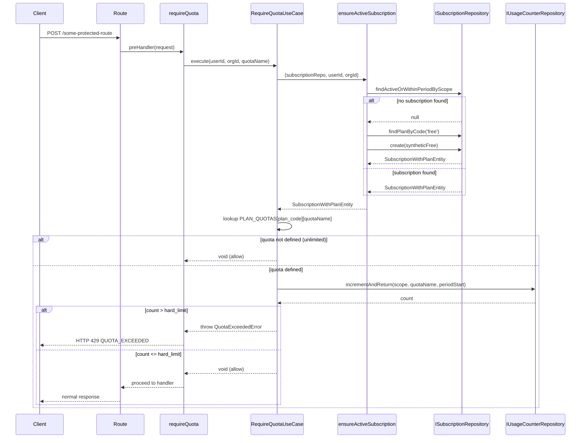

# SUBS-006 — Plan Usage Quotas

## Problem statement

SUBS-005 introduced boolean entitlements per plan, but the product also needs numeric consumption limits (e.g. "100 API requests per month on the free plan"). Without these limits the backend cannot enforce plan-bound usage caps and the frontend has no way to surface warnings as a user approaches a threshold. This feature adds the backend infrastructure to count, enforce, and expose per-scope quota usage aligned to the active subscription's billing period.

## Alternatives

| Alternative | Description | Decision |
|---|---|---|
| Option A: Redis sliding-window counter | Maintain per-scope quota counters in Redis using atomic INCR with a TTL derived from the billing period; read the plan's thresholds from the code-level mapping at enforcement time. | Not chosen — introduces a new infrastructure dependency (Redis) not present in the stack. Sliding-window semantics are explicitly out of scope (analysis.md Out of scope). Period rollover and historical record-keeping require the Supabase row to already exist, making Redis an auxiliary store with no clear authority over the authoritative count. |
| Option B: Postgres advisory locks + SELECT + UPDATE | Before each increment, acquire a Postgres advisory lock for the (scope, quota, period) tuple, read the counter, check the limit, and conditionally UPDATE. | Not chosen — advisory locks are session-scoped and do not compose well with connection-pool multiplexing (postgres.js uses a pool). The two-statement round-trip (SELECT then UPDATE) also adds latency and complexity without providing atomicity stronger than the ON CONFLICT DO UPDATE approach. |
| Option C: Atomic upsert via INSERT … ON CONFLICT DO UPDATE | Persist counters in a new `usage_counters` Supabase table. Each `requireQuota` invocation issues a single atomic `INSERT … ON CONFLICT (user_id, org_id, quota_name, period_start) DO UPDATE SET count = usage_counters.count + 1 RETURNING count`. The returned count is compared to the plan's code-level threshold to accept or reject the request. | **Chosen** — satisfies NF001 (atomicity under concurrency) with a single database round-trip, fully satisfies R002–R007 and R011 (natural period rollover via unique constraint), needs no new infrastructure, and mirrors the pattern already established in the subscriptions module. Latency overhead is a single parameterised SQL upsert, well within the 20 ms p95 target (NF002). |

## Chosen solution

**Atomic upsert via INSERT … ON CONFLICT DO UPDATE**

This solution is selected because it satisfies all 11 functional requirements while respecting every technical constraint in analysis.md:

- R001: the plan → quotas mapping is added to `entitlements.ts` alongside SUBS-005's `PLAN_ENTITLEMENTS`, keeping the single source of truth in backend code.
- R002: the `usage_counters` table is created by a Supabase migration with the exact schema and constraints specified.
- R003–R007, R011: the atomic upsert inside `requireQuota` handles increment, period alignment, and lazy subscription creation via a dedicated `ensureActiveSubscription` helper, satisfying all event-driven requirements.
- R008–R010: a new `GET /billing/quotas/me` endpoint backed by a `GetMyQuotasUseCase` + `UsageCounterDBRepository` satisfies the query path.
- NF001: a single `INSERT … ON CONFLICT DO UPDATE … RETURNING` is atomic at the Postgres level; no two concurrent requests can lose an increment.
- NF002/NF003: one SQL round-trip per preHandler invocation and one per quota-list query keeps latency well within the targets.
- EC001–EC007: handled by `GetMyQuotasUseCase` and `RequireQuotaUseCase` following the same `strictEntitlementsOnPastDue` pattern as SUBS-005.

The layer rules from BACKEND.md are respected throughout: each concern (entity, repository interface, DB repository, use case, handler) lives in its own file; use cases never consume other use cases (the `ensureActiveSubscription` helper is a plain async function, not a use case); no `process.env` reads outside config files.

## Technical design

### Shared types (`packages/types`)

```ts
// New exports in packages/types/src/index.ts

export type QuotaName = string; // open string type; concrete values are backend-defined

export interface QuotaThresholds {
  soft_limit: number;
  hard_limit: number;
}

export type QuotaState = 'normal' | 'soft_exceeded' | 'hard_exceeded';

export interface QuotaUsage {
  name: QuotaName;
  count: number;
  soft_limit: number;
  hard_limit: number;
  period_start: string;   // ISO 8601
  period_end: string;     // ISO 8601
  state: QuotaState;
}

export interface QuotasResponse {
  quotas: QuotaUsage[];
}
```

### Plan → quotas mapping

Added to `apps/services/src/modules/subscriptions/entitlements.ts` alongside `PLAN_ENTITLEMENTS`:

```ts
export const PLAN_QUOTAS: Record<string, Record<string, QuotaThresholds>> = {
  free:     { api_requests: { soft_limit: 80,   hard_limit: 100  } },
  pro:      { api_requests: { soft_limit: 800,  hard_limit: 1000 } },
  business: { api_requests: { soft_limit: 8000, hard_limit: 10000 } },
};
```

The keys of the inner `Record` are the concrete `QuotaName` values enforced in this version. Additional quota names can be added without schema changes.

### Database: `usage_counters` table

Migration creates:

```sql
CREATE TABLE usage_counters (
  id           uuid        PRIMARY KEY DEFAULT gen_random_uuid(),
  user_id      text        REFERENCES users(id) ON DELETE SET NULL,
  org_id       text        REFERENCES organizations(id) ON DELETE SET NULL,
  quota_name   text        NOT NULL,
  period_start timestamptz NOT NULL,
  count        integer     NOT NULL DEFAULT 0,
  created_at   timestamptz NOT NULL DEFAULT now(),
  updated_at   timestamptz NOT NULL DEFAULT now(),
  CONSTRAINT usage_counters_scope_check CHECK (
    user_id IS NOT NULL OR org_id IS NOT NULL
  ),
  CONSTRAINT usage_counters_unique UNIQUE (user_id, org_id, quota_name, period_start)
);

CREATE INDEX usage_counters_user_idx
  ON usage_counters (user_id, quota_name, period_start)
  WHERE user_id IS NOT NULL;

CREATE INDEX usage_counters_org_idx
  ON usage_counters (org_id, quota_name, period_start)
  WHERE org_id IS NOT NULL;
```

### Entity

```ts
// apps/services/src/modules/subscriptions/entities/usageCounterEntity.ts
export interface UsageCounterEntity {
  id: string;
  user_id: string | null;
  org_id: string | null;
  quota_name: string;
  period_start: string;
  count: number;
  created_at: string;
  updated_at: string;
}
```

### Repository interface

```ts
// IUsageCounterRepository
interface IUsageCounterRepository {
  // Atomically increments the counter for (scope, quotaName, periodStart).
  // Returns the new count after the increment.
  incrementAndReturn(
    userId: string | null,
    orgId: string | null,
    quotaName: string,
    periodStart: string,
  ): Promise<number>;

  // Returns the current count (0 if no row exists) for the given scope and period.
  findCount(
    userId: string | null,
    orgId: string | null,
    quotaName: string,
    periodStart: string,
  ): Promise<number>;
}
```

`incrementAndReturn` executes:

```sql
INSERT INTO usage_counters (user_id, org_id, quota_name, period_start, count)
VALUES ($userId, $orgId, $quotaName, $periodStart, 1)
ON CONFLICT (user_id, org_id, quota_name, period_start)
DO UPDATE SET count = usage_counters.count + 1, updated_at = now()
RETURNING count
```

### `ensureActiveSubscription` helper

A standalone async function (not a use case) in `apps/services/src/modules/subscriptions/helpers/ensureActiveSubscription.ts`:

```ts
async function ensureActiveSubscription(
  repo: ISubscriptionRepository,
  userId: string,
  orgId: string | null,
): Promise<SubscriptionWithPlanEntity>
```

Logic:
1. Call `repo.findActiveOrWithinPeriodByScope(userId, orgId)`.
2. If a subscription is found, return it.
3. Otherwise, look up the `free` plan via `repo.findPlanByCode('free')`.
4. Insert a synthetic subscription with `status = 'active'`, `provider = 'internal'`, `current_period_start = date_trunc('month', now())`, `current_period_end = current_period_start + interval '1 month'`.
5. If the insert fails with a unique-constraint violation (EC007 race), retry step 1 once and return the now-existing row.
6. Return the newly created subscription (augmented with `plan_code = 'free'`).

### `requireQuota` preHandler factory

Located in `apps/services/src/modules/subscriptions/plugins/requireQuota.ts`, mirroring `requireEntitlement.ts`:

```ts
// Module-scope singletons (instantiated once at plugin load time)
const subscriptionRepo = new SubscriptionDBRepository(db);
const counterRepo = new UsageCounterDBRepository(db);
const useCase = new RequireQuotaUseCase(subscriptionRepo, counterRepo);

export function requireQuota(name: string): (request: FastifyRequest) => Promise<void>
```

The returned preHandler:
1. Resolves scope: if `request.orgId` is set, `(userId=null, orgId)`, otherwise `(userId, orgId=null)`.
2. Calls `useCase.execute(scope, name)`.
3. If the use case throws `QuotaExceededError`, Fastify's `errorHandler` serialises it as HTTP 429.
4. Otherwise allows the request to proceed.

### `RequireQuotaUseCase`

```ts
class RequireQuotaUseCase {
  constructor(
    private readonly subscriptionRepo: ISubscriptionRepository,
    private readonly counterRepo: IUsageCounterRepository,
  ) {}

  async execute(
    userId: string,
    orgId: string | null,
    quotaName: string,
  ): Promise<void>
}
```

Logic:
1. Call `ensureActiveSubscription(this.subscriptionRepo, userId, orgId)` to get the active subscription with `plan_code`.
2. Look up `PLAN_QUOTAS[plan_code]?.[quotaName]`. If undefined → R006/EC004: return (unlimited).
3. Derive `periodStart = sub.current_period_start`.
4. Determine effective scope: if `orgId != null` then `(counterUserId=null, counterOrgId=orgId)` (EC005), else `(counterUserId=userId, counterOrgId=null)`.
5. Call `counterRepo.incrementAndReturn(counterUserId, counterOrgId, quotaName, periodStart)`.
6. If returned `count > hard_limit` → throw `QuotaExceededError(quotaName, count, thresholds, sub.current_period_end)`.
7. Otherwise return.

EC001/EC002 are naturally handled: `findActiveOrWithinPeriodByScope` already returns `past_due` and within-period `canceled` subscriptions, whose plan thresholds are applied directly.
EC003 is handled: if `count > hard_limit` after a downgrade, every subsequent upsert returns a count that exceeds the new lower limit, and `QuotaExceededError` is thrown.

### `GetMyQuotasUseCase`

```ts
class GetMyQuotasUseCase {
  constructor(
    private readonly subscriptionRepo: ISubscriptionRepository,
    private readonly counterRepo: IUsageCounterRepository,
  ) {}

  async execute(userId: string, orgId: string | null): Promise<QuotaUsage[]>
}
```

Logic:
1. Call `this.subscriptionRepo.findActiveOrWithinPeriodByScope(userId, orgId)`. If null, use `free` plan thresholds with a synthetic period.
2. Look up `PLAN_QUOTAS[plan_code]`. If empty or missing, return `[]`.
3. Determine effective scope (EC005 rule).
4. For each quota name in the plan's quota map, call `counterRepo.findCount(...)` to get the current count (0 if no row).
5. Derive `state` per R009: `count > hard_limit` → `hard_exceeded`; `count > soft_limit` → `soft_exceeded`; else `normal`.
6. Return `QuotaUsage[]`.

### `QuotaExceededError`

New domain error added to `shared/errors.ts`:

```ts
export class QuotaExceededError extends DomainError {
  constructor(
    quotaName: string,
    count: number,
    soft_limit: number,
    hard_limit: number,
    period_end: string,
  ) {
    super('QUOTA_EXCEEDED', `Quota exceeded: ${quotaName}`, 429);
    // The extra fields are attached to the error for errorHandler serialisation.
  }
}
```

The `errorHandler` already serialises `DomainError` instances as `{ code, message }` at the error's `statusCode`. R004 requires the body to also carry `{ quota, count, soft_limit, hard_limit, period_end }`. Since the stock `errorHandler` only serialises `code` and `message`, `QuotaExceededError` will encode the structured data in the `message` field OR the `errorHandler` will need a narrow extension for this error subclass. The chosen approach: extend `errorHandler` to detect `QuotaExceededError` and serialise its extra properties. This is the minimal invasive change and keeps the error contract fully typed.

### `GET /billing/quotas/me` endpoint

```
GET /billing/quotas/me
preHandler: [requireAuth]
Response 200: { quotas: QuotaUsage[] }
Response 401: { code: 'UNAUTHORIZED', message: 'Unauthorized' }
```

Handler instantiates `SubscriptionDBRepository` and `UsageCounterDBRepository`, constructs `GetMyQuotasUseCase`, calls `execute`, replies with `{ quotas }`.

### Call-sequence diagram



## Files

| Path | Action | Description |
|---|---|---|
| `packages/types/src/index.ts` | MODIFY | Export `QuotaName`, `QuotaThresholds`, `QuotaState`, `QuotaUsage`, `QuotasResponse` |
| `apps/services/src/modules/subscriptions/entitlements.ts` | MODIFY | Add `PLAN_QUOTAS` constant mapping plan codes to quota thresholds |
| `apps/services/supabase/migrations/20260626000000_usage_counters.sql` | CREATE | Migration creating `usage_counters` table, unique constraint, and two partial indexes |
| `apps/services/src/modules/subscriptions/entities/usageCounterEntity.ts` | CREATE | `UsageCounterEntity` interface mirroring the `usage_counters` table row |
| `apps/services/src/modules/subscriptions/repositories/interfaces/iUsageCounterRepository.ts` | CREATE | `IUsageCounterRepository` interface with `incrementAndReturn` and `findCount` methods |
| `apps/services/src/modules/subscriptions/repositories/usageCounterDBRepository.ts` | CREATE | `UsageCounterDBRepository` implementing `IUsageCounterRepository` via postgres.js tagged-template SQL |
| `apps/services/src/modules/subscriptions/helpers/ensureActiveSubscription.ts` | CREATE | `ensureActiveSubscription(repo, userId, orgId)` helper that lazily creates a synthetic free subscription |
| `apps/services/src/shared/errors.ts` | MODIFY | Add `QuotaExceededError` extending `DomainError` (HTTP 429, code `QUOTA_EXCEEDED`) with structured quota fields |
| `apps/services/src/shared/plugins/errorHandler.ts` | MODIFY | Extend serialisation to emit `{ code, message, quota, count, soft_limit, hard_limit, period_end }` when the caught error is `QuotaExceededError` |
| `apps/services/src/modules/subscriptions/useCases/requireQuotaUseCase.ts` | CREATE | `RequireQuotaUseCase` implementing quota resolution, counter increment, and hard-limit enforcement |
| `apps/services/src/modules/subscriptions/useCases/getMyQuotasUseCase.ts` | CREATE | `GetMyQuotasUseCase` implementing quota list retrieval with derived state |
| `apps/services/src/modules/subscriptions/plugins/requireQuota.ts` | CREATE | `requireQuota(name)` preHandler factory; module-scope singletons; `FastifyRequest` augmentation for cached quota data |
| `apps/services/src/modules/subscriptions/handlers/getMyQuotasHandler.ts` | CREATE | Thin handler for `GET /billing/quotas/me` |
| `apps/services/src/modules/subscriptions/routes.ts` | MODIFY | Register `GET /billing/quotas/me` with `requireAuth` preHandler |
| `apps/services/tests/unit/modules/subscriptions/useCases/requireQuotaUseCase.test.ts` | CREATE | Unit tests for `RequireQuotaUseCase` covering R003–R007, EC001–EC007 |
| `apps/services/tests/unit/modules/subscriptions/useCases/getMyQuotasUseCase.test.ts` | CREATE | Unit tests for `GetMyQuotasUseCase` covering R008, R009, EC001–EC005 |
| `apps/services/tests/unit/modules/subscriptions/plugins/requireQuota.test.ts` | CREATE | Unit tests for `requireQuota` preHandler factory covering R003–R007, NF001 |
| `apps/services/tests/unit/modules/subscriptions/handlers/getMyQuotasHandler.test.ts` | CREATE | Unit tests for `getMyQuotasHandler` covering R008, R010 |
| `apps/services/tests/unit/modules/subscriptions/helpers/ensureActiveSubscription.test.ts` | CREATE | Unit tests for `ensureActiveSubscription` covering R007, EC006, EC007 |
| `apps/services/tests/unit/modules/subscriptions/repositories/usageCounterDBRepository.test.ts` | CREATE | Unit tests for `UsageCounterDBRepository` covering R002, NF001 |
| `apps/services/tests/unit/shared/errors.test.ts` | MODIFY | Add test cases for `QuotaExceededError` structure |

## Requirement coverage

| ID | Design decision |
|---|---|
| R001 | `PLAN_QUOTAS` constant in `entitlements.ts` maps `plan.code` → `Record<QuotaName, QuotaThresholds>` at code level, no database lookup |
| R002 | `20260626000000_usage_counters.sql` migration creates `usage_counters` with all specified columns, unique constraint on `(user_id, org_id, quota_name, period_start)`, and scope check constraint |
| R003 | `RequireQuotaUseCase.execute` calls `ensureActiveSubscription` to get the active subscription and `counterRepo.incrementAndReturn` with the period start as the partition key |
| R004 | `RequireQuotaUseCase.execute` throws `QuotaExceededError` (HTTP 429, code `QUOTA_EXCEEDED`) when returned count exceeds `hard_limit`; `errorHandler` serialises structured body |
| R005 | `RequireQuotaUseCase.execute` returns `void` without throwing when `count <= hard_limit`, allowing `requireQuota` preHandler to pass control to the route handler |
| R006 | `RequireQuotaUseCase.execute` returns early (no upsert) when `PLAN_QUOTAS[plan_code]?.[name]` is undefined |
| R007 | `ensureActiveSubscription` lazily creates a synthetic `free` subscription with `current_period_start = date_trunc('month', now())` when `findActiveOrWithinPeriodByScope` returns null |
| R008 | `GetMyQuotasUseCase.execute` returns `QuotaUsage[]` for all quota names in the active plan; `getMyQuotasHandler` wraps it as `{ quotas }` |
| R009 | `GetMyQuotasUseCase.execute` derives `state` as `hard_exceeded` / `soft_exceeded` / `normal` per the specified comparison rules |
| R010 | `GET /billing/quotas/me` is registered with `[requireAuth]` preHandler in `routes.ts` |
| R011 | Natural period rollover: the unique constraint key includes `period_start`; a new billing period produces a new `period_start`, which does not match existing rows, so the upsert inserts a fresh row |
| NF001 | `INSERT … ON CONFLICT DO UPDATE SET count = usage_counters.count + 1 RETURNING count` is atomic at the Postgres row level; no two concurrent requests can lose an increment |
| NF002 | `requireQuota` issues one SQL upsert (after `ensureActiveSubscription` which may add one SELECT + one INSERT on first call per period); subsequent calls in a period are a single upsert |
| NF003 | `getMyQuotasHandler` issues one subscription lookup + N `findCount` calls (one per quota name in the plan); for the current single-quota-per-plan design this is two SQL queries total |
| EC001 | `findActiveOrWithinPeriodByScope` returns `past_due` subscriptions; `RequireQuotaUseCase` evaluates their plan's thresholds without consulting `strictEntitlementsOnPastDue` (quota enforcement is always applied) |
| EC002 | `findActiveOrWithinPeriodByScope` already returns cancelled subscriptions with `current_period_end > now()`; their plan thresholds are used until the period elapses |
| EC003 | After a downgrade the active period's `count` in `usage_counters` is unchanged; if it already exceeds the new lower `hard_limit`, every subsequent `incrementAndReturn` returns a count above the limit and `QuotaExceededError` is thrown |
| EC004 | `RequireQuotaUseCase.execute` checks `PLAN_QUOTAS[plan_code]?.[name]`; if absent it returns without inserting a `usage_counters` row |
| EC005 | `RequireQuotaUseCase.execute` and `GetMyQuotasUseCase.execute` both apply the scope rule: if `orgId != null`, use `(counterUserId=null, counterOrgId=orgId)` |
| EC006 | After a paid subscription is activated, `findActiveOrWithinPeriodByScope` returns it (ordered by non-terminal status first); the free subscription row remains as historical data |
| EC007 | `ensureActiveSubscription` catches the unique-constraint violation on the synthetic free subscription insert and retries `findActiveOrWithinPeriodByScope` to retrieve the now-existing row |
