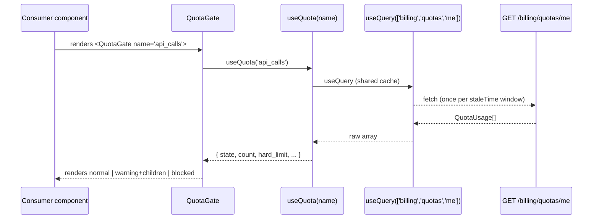

# SUBS-007 — Quota UI Gates

## Problem statement

SUBS-006 exposes per-scope usage counters and thresholds via `GET /billing/quotas/me`, but the frontend has no primitive to consume that state. Without a shared hook and gate component, the product cannot hide or disable features based on usage, nor surface contextual upgrade prompts when users near or reach a quota limit.

## Alternatives

| Alternative | Description | Decision |
|---|---|---|
| Option A: Inline per-component quota checks | Each page or domain component calls `useQuery` directly for quota state, duplicating logic and issuing multiple network requests. | Not chosen — violates NF001 (single cache entry), scatters quota logic, and conflicts with the established hook + gate layering used by SUBS-005. |
| Option B: Single `useQuotas()` hook returning the full array, with gate as pure presentational component receiving `QuotaUsage` as a prop from the page | Page fetches all quotas via `useQuotas()`, selects the relevant entry, and passes it down to a purely presentational `<QuotaGate>`. | Not chosen — requires every page that embeds a gate to wire quota data explicitly, creating boilerplate; `<EntitlementGate>` already established the precedent that domain gate components may call their own hook internally. This option also complicates lazy consumption in deeply nested trees. |
| Option C: Dedicated `useQuota(name)` hook + self-contained `<QuotaGate>` component (chosen) | `useQuota(name)` calls `GET /billing/quotas/me` under a shared query key and filters to the named entry; `<QuotaGate>` calls `useQuota` internally and renders the appropriate state branch. `useInvalidateQuotas()` provides cache invalidation for mutation consumers. | **Chosen** — mirrors the `useEntitlement` / `<EntitlementGate>` architecture already present in the codebase, satisfies NF001 via a shared query key, satisfies NF002 via `refetchOnWindowFocus`, requires no page-level wiring changes for new gates, and maps directly to R001–R011. |

## Chosen solution

**Dedicated `useQuota(name)` hook + self-contained `<QuotaGate>` component**

This solution follows the established SUBS-005 pattern exactly: the hook owns the React Query subscription under a single shared cache key (`['billing', 'quotas', 'me']`) and the domain gate component calls the hook internally. The API client is extended with `getMyQuotas()` as the only new HTTP-layer function. Upgrade CTA logic (R008, R009) resolves the "next plan" by composing `useMySubscription()` and `usePlans()` — both already available — without duplicating plan-lookup code. `useInvalidateQuotas()` satisfies R010 with a minimal wrapper around `queryClient.invalidateQueries`. All types come from `@repo/types` (R-constraint), and no new client modules are introduced.

Sections consulted and found non-conflicting: `apps/web — Layered architecture`, `api/client.ts pattern`, `Entitlement gating`, `Shared domain types`. The domain-component-calls-hook pattern used by `<EntitlementGate>` is an established exception to the strict unidirectional layering rule and is replicated here for `<QuotaGate>`.

## Technical design

### API function: `getMyQuotas(token)`

Added to `apps/web/src/api/billing.ts`. Calls `apiFetch<QuotasResponse>('/billing/quotas/me', { token })` and returns `response.quotas` (a `QuotaUsage[]`). Import `QuotaUsage` and `QuotasResponse` from `@repo/types`.

### Hook: `useQuota(name: QuotaName)`

File: `apps/web/src/hooks/useQuota.ts`

```
useQuery key: ['billing', 'quotas', 'me']
staleTime:    60_000  (60 s — NF001)
refetchOnWindowFocus: true  (NF002, inherited from QueryClient default; explicitly set for clarity)
```

Return shape (R003):

```ts
{
  count:       number;        // 0 while loading
  soft_limit:  number;        // Infinity while loading or entry absent
  hard_limit:  number;        // Infinity while loading or entry absent (R002)
  state:       QuotaState;    // 'normal' while loading or entry absent (R002, EC001)
  period_end:  string;        // '' while loading or entry absent
  isLoading:   boolean;
}
```

When `isLoading` is `true` (EC001) return `state = 'normal'` so the gate renders children without blocking the tree. When the response array has no entry matching `name` (R002) return `state = 'normal'` and `hard_limit = Infinity`.

The query function uses `getToken()` from `useAuth()` (Clerk). The token is passed to `getMyQuotas`. A missing or null token returns an empty array (safe before auth settles, consistent with `useEntitlement`).

### Hook: `useInvalidateQuotas()`

Exported from `apps/web/src/hooks/useQuota.ts` (same file for colocation). Calls `queryClient.invalidateQueries({ queryKey: ['billing', 'quotas', 'me'] })`. Returns the invalidation function so consumers can call it after mutations (R010, EC005).

### Component: `<QuotaGate>`

File: `apps/web/src/components/domain/billing/QuotaGate.tsx`

Props:

```ts
interface QuotaGateProps {
  name: QuotaName;
  children: ReactNode;
  fallbackBlocked?: ReactNode;   // R004 — shown when hard_exceeded
  fallbackWarning?: ReactNode;   // R005 — shown alongside children when soft_exceeded
}
```

Rendering logic (R004–R007, precedence hard > soft > normal):

| `state` | Output |
|---|---|
| `hard_exceeded` | `fallbackBlocked` prop, or default blocked message + upgrade CTA |
| `soft_exceeded` | `children` + `fallbackWarning` prop, or `children` + default warning banner + upgrade CTA |
| `normal` (incl. loading) | `children` only |

The component calls `useQuota(name)` internally and additionally calls `usePlans()` and `useMySubscription()` to resolve the upgrade CTA (R008, R009).

### Upgrade CTA resolution (R008, R009, EC003)

```
plans = usePlans().data ?? []        // sorted price ASC by the API
subscription = useMySubscription().data
currentPlanId = subscription?.plan_id

// Find current plan object in catalog
currentPlan = plans.find(p => p.id === currentPlanId)
currentPrice = currentPlan?.price ?? -1

// Next plan: first plan with price > currentPrice
nextPlan = plans.filter(p => p.price > currentPrice).sort price ASC [0]
```

- If `nextPlan` exists: render `<a href="/billing/subscribe?plan=<nextPlan.code>">Upgrade</a>` (R008).
- If no `nextPlan` (user is on highest plan, or plan removed from catalog — EC003): render "You are on our highest plan — contact us for custom limits" (R009).
- When `state === 'normal'`: no CTA is rendered at all (R006).

### State / data flow



## Files

| Path | Action | Description |
|---|---|---|
| `apps/web/src/api/billing.ts` | MODIFY | Add `getMyQuotas(token)` function that calls `GET /billing/quotas/me` and returns `QuotaUsage[]` |
| `apps/web/src/hooks/useQuota.ts` | CREATE | Exports `useQuota(name)` hook and `useInvalidateQuotas()` helper |
| `apps/web/src/components/domain/billing/QuotaGate.tsx` | CREATE | Exports `<QuotaGate>` component with three-state rendering and upgrade CTA logic |
| `apps/web/tests/billing/use-quota.test.ts` | CREATE | Unit tests for `getMyQuotas`, `useQuota`, and `useInvalidateQuotas` |
| `apps/web/tests/billing/QuotaGate.test.tsx` | CREATE | Acceptance tests for `<QuotaGate>` rendering across all states |

## Requirement coverage

| ID | Design decision |
|---|---|
| R001 | `useQuota(name)` calls `useQuery` with key `['billing', 'quotas', 'me']`; on mount the query fetches `GET /billing/quotas/me` and filters the result to the entry matching `name`. |
| R002 | When no entry matches `name` in the response array, `useQuota` returns `state = 'normal'` and `hard_limit = Infinity`. |
| R003 | `useQuota` return shape is typed with `count`, `soft_limit`, `hard_limit`, `state`, `period_end`, and `isLoading`. |
| R004 | `<QuotaGate>` renders `fallbackBlocked` prop (or default blocked UI with upgrade CTA) when `state === 'hard_exceeded'`. |
| R005 | `<QuotaGate>` renders `children` plus `fallbackWarning` prop (or default warning banner with upgrade CTA) when `state === 'soft_exceeded'`. |
| R006 | `<QuotaGate>` renders `children` only when `state === 'normal'`. |
| R007 | Branch selection uses `if hard_exceeded … else if soft_exceeded … else` so `hard_exceeded` always takes precedence. |
| R008 | Upgrade CTA is built from `usePlans()` + `useMySubscription()`; `nextPlan` is the first plan with `price > currentPlan.price`, linked to `/billing/subscribe?plan=<nextPlan.code>`. |
| R009 | When no `nextPlan` exists (user is on highest plan or plan removed from catalog), the CTA is replaced with "You are on our highest plan — contact us for custom limits". |
| R010 | `useInvalidateQuotas()` exported from `useQuota.ts` calls `queryClient.invalidateQueries({ queryKey: ['billing', 'quotas', 'me'] })`. |
| R011 | `getMyQuotas(token)` added to `apps/web/src/api/billing.ts`; no other client modules are introduced. |
| NF001 | All `useQuota` instances share the query key `['billing', 'quotas', 'me']` with `staleTime: 60_000`, ensuring at most one fetch per 60-second window. |
| NF002 | `refetchOnWindowFocus: true` is set explicitly in the `useQuery` options for `useQuota`. |
| EC001 | While `isLoading` is `true`, `useQuota` returns `state = 'normal'`; `<QuotaGate>` renders `children` with no blocking or warning. |
| EC002 | The lazy free-subscription creation on the backend returns a valid `QuotaUsage[]`; `useQuota` consumes it transparently with no extra branching. |
| EC003 | When the current plan has been removed from the catalog and no plan has a higher price, `nextPlan` is `undefined` and the component renders the top-plan informational message. |
| EC004 | `useQuota` renders `state` exactly as returned by the backend; no local period-end recomputation is performed. |
| EC005 | Without a `useInvalidateQuotas()` call, cached quota values persist until `staleTime` expires or the window regains focus; this is the documented behavior. |
