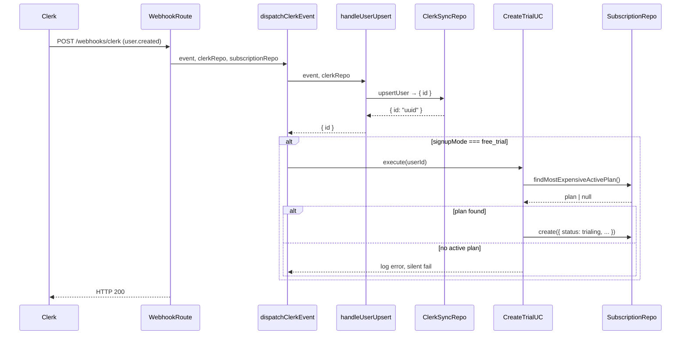

# SUBS-008 — Free Trial Mode (backend)

## Problem statement

The starter pack currently supports only the freemium model, where every new user lazily receives a permanent `free` subscription. Operators who want a "free trial" onboarding model — where new users start on the most expensive plan with time-limited access and must explicitly pick a plan once the trial expires — have no supported configuration path. Without this feature, access-gating at trial expiration and the associated signup-mode toggling must be hand-built by each adopter.

## Alternatives

| Alternative | Description | Decision |
|---|---|---|
| Option A: Inline mode switch | Embed all trial logic directly in `clerkEventHandlers.ts`, `ensureActiveSubscription.ts`, and `getMySubscriptionHandler.ts` with `if (signupMode === 'free_trial')` branches throughout existing files. | Not chosen — violates SRP and "one use case per feature" convention; business logic leaks into handlers and helpers |
| Option B: Dedicated use case + new preHandler plugin | Introduce a `CreateTrialSubscriptionUseCase` for webhook-time trial creation, extend `ISubscriptionRepository` and `SubscriptionDBRepository` with two new methods (`findMostExpensiveActivePlan`, `transitionExpiredTrials`), add `requireActiveSubscription` as a new plugin, and extend `subscriptionsConfig` with `SIGNUP_MODE` and `FREE_TRIAL_DAYS`. | **Chosen** — respects vertical slice conventions, one use case per concern, testable repo methods, clean config isolation |
| Option C: Extend ClerkSyncRepository for trial creation | Handle trial creation inside `ClerkSyncRepository` and wire it through `dispatchClerkEvent` without a separate use case. | Not chosen — mixes sync/persistence concerns with subscription business logic; repository would reach outside its bounded context |

## Chosen solution

**Dedicated use case + new preHandler plugin (Option B)**

This solution satisfies all R-IDs while respecting every layer rule in BACKEND.md:

- R001/R002: `SIGNUP_MODE` and `FREE_TRIAL_DAYS` are added to the existing `subscriptionsConfig.ts` config file — the only place allowed to read `process.env`.
- R003: A dedicated Supabase migration extends the `subscriptions.status` CHECK constraint to include `trialing` and adds `trial_ends_at timestamptz`.
- R004/R005/NF001/NF002/NF003: A new `CreateTrialSubscriptionUseCase` handles webhook-time logic. The `dispatchClerkEvent` dispatcher passes the subscription repo alongside the sync repo so the use case can call `findMostExpensiveActivePlan` at runtime. Idempotency is guaranteed by the existing SUBS-002 unique-constraint; the use case catches the PG 23505 violation and responds silently.
- R006/NF004: A new repository method `transitionExpiredTrials(userId, orgId)` issues an atomic `UPDATE WHERE status = 'trialing' AND trial_ends_at < now()` so concurrent reads cannot double-transition.
- R007/R008/EC001/EC005: The new `requireActiveSubscription` plugin mirrors the `requireEntitlement` factory pattern; it reads `subscriptionsConfig.signupMode` and throws `TrialExpiredError` (HTTP 403, code `TRIAL_EXPIRED`) when the scope's subscription is expired and no active/trialing alternative exists. The plugin is registered globally in `app.ts` after `clerkAuthPlugin`, with route-level exclusions for `/billing/*`, `GET /billing/plans`, and webhook paths using Fastify's `onRequest` skip pattern.
- R009: `ensureActiveSubscription` gains a mode check; when `signupMode === 'free_trial'` it returns the existing subscription (trialing counts as active-equivalent for quota/entitlement consumers) and skips free-plan creation.
- R010/NF005: `GetMySubscriptionUseCase` and its handler are extended to compute and include `trial_ends_at` and `days_remaining` when `status === 'trialing'`. `@repo/types` is updated accordingly.
- EC004: the existing SUBS-002 `createSubscriptionUseCase` already sets the trial to `canceled` before creating the new paid subscription via the unique-constraint — no additional change needed beyond `trialing` being a non-terminal status recognized by the partial unique index.
- EC008: caught by existing 23505 handling in `CreateTrialSubscriptionUseCase`.

The `clerkWebhookRoutes` plugin receives a second repository (`SubscriptionDBRepository`) passed down to `dispatchClerkEvent`. Because the webhook convention (BACKEND.md) calls for all SQL to live in a repository class and all handler/dispatcher code to be SQL-free, we extend `ClerkSyncRepository` with no SQL — the subscription repo handles all subscription writes.

## Technical design

### Configuration (`subscriptionsConfig.ts`)

Two new keys are added to the existing config object:

```ts
signupMode: (env.SIGNUP_MODE ?? 'freemium') as 'freemium' | 'free_trial',
freeTrialDays: parseInt(env.FREE_TRIAL_DAYS ?? '14', 10),
```

### Database migration

```sql
ALTER TABLE subscriptions
  DROP CONSTRAINT subscriptions_status_check,
  ADD CONSTRAINT subscriptions_status_check
    CHECK (status IN ('pending', 'active', 'past_due', 'canceled', 'expired', 'trialing'));

ALTER TABLE subscriptions
  ADD COLUMN trial_ends_at timestamptz;
```

The partial unique indexes already exclude `canceled` and `expired`; `trialing` is not in either exclusion list, so the existing index correctly enforces at-most-one non-terminal subscription per scope and blocks duplicate trial inserts.

### `SubscriptionEntity` extension

`trial_ends_at: string | null` is added to `SubscriptionEntity`.

### `@repo/types` extension

```ts
export type SubscriptionStatusValue =
  | 'pending'
  | 'active'
  | 'past_due'
  | 'canceled'
  | 'expired'
  | 'trialing';

export interface Subscription {
  // ... existing fields ...
  trial_ends_at: string | null;
  days_remaining?: number; // only present when status === 'trialing'
}
```

### New repository methods on `ISubscriptionRepository`

```ts
findMostExpensiveActivePlan(): Promise<SubscriptionPlanEntity | null>;
transitionExpiredTrials(userId: string, orgId: string | null): Promise<SubscriptionEntity | null>;
```

`CreateSubscriptionData.status` is widened to include `'trialing'`.
`CreateSubscriptionData` gains an optional `trial_ends_at?: string | null` field.

### `CreateTrialSubscriptionUseCase`

Location: `apps/services/src/modules/subscriptions/useCases/createTrialSubscriptionUseCase.ts`

```ts
class CreateTrialSubscriptionUseCase {
  constructor(private readonly repo: ISubscriptionRepository) {}

  async execute(userId: string): Promise<void>
}
```

Logic:
1. Call `repo.findMostExpensiveActivePlan()`. If null, log error and return (NF003 silent fail).
2. Compute `trialEndsAt = now() + freeTrialDays days`.
3. Call `repo.create({ ..., status: 'trialing', trial_ends_at: trialEndsAt.toISOString(), current_period_start: now(), current_period_end: trialEndsAt })`.
4. Catch PG 23505 (unique violation) and return silently — idempotent retry (NF001/EC008).

### `dispatchClerkEvent` extension

The function signature gains an optional second parameter:

```ts
export async function dispatchClerkEvent(
  event: WebhookEvent,
  clerkRepo: ClerkSyncRepository,
  subscriptionRepo?: ISubscriptionRepository,
): Promise<void>
```

For the `user.created` branch: after `handleUserUpsert` resolves, if `subscriptionsConfig.signupMode === 'free_trial'` and `subscriptionRepo` is provided, the dispatcher resolves the internal user id from the upserted user and calls `new CreateTrialSubscriptionUseCase(subscriptionRepo).execute(userId)`.

The webhook route plugin (`clerkWebhookRoutes`) is updated to instantiate `SubscriptionDBRepository` and pass it to `dispatchClerkEvent`.

To get the internal `userId` after `handleUserUpsert`, the dispatcher needs it. `ClerkSyncRepository.upsertUser` is extended to return `{ id: string }` — the internal UUID — in addition to its current void behavior.

### `ensureActiveSubscription` extension

When `subscriptionsConfig.signupMode === 'free_trial'`:
- If an existing subscription is found (`trialing`, `active`, `pending`, `past_due`, or canceled-within-period), return it as-is.
- If no subscription is found, do **not** create a free subscription. Return `null`. Callers that currently rely on the non-null guarantee must be updated — see Files section.

Because `ensureActiveSubscription` currently returns `SubscriptionWithPlanEntity` (non-nullable), its signature must be widened to `Promise<SubscriptionWithPlanEntity | null>` and `RequireQuotaUseCase` / `GetMyQuotasUseCase` updated to handle the null case (treat as no-plan / no quotas).

### `requireActiveSubscription` plugin

Location: `apps/services/src/modules/subscriptions/plugins/requireActiveSubscription.ts`

This is a plain `preHandler` function (not a factory — no parameter needed).

```ts
export async function requireActiveSubscription(
  request: FastifyRequest,
  reply: FastifyReply,
): Promise<void>
```

Logic (only when `subscriptionsConfig.signupMode === 'free_trial'`):
1. If `request.userId` is not set, skip (route is unauthenticated — `requireAuth` guards it separately).
2. Call `transitionExpiredTrials(userId, orgId)` to lazily flip any expired trial.
3. Call `findActiveByScopeStatus(userId, orgId)` for active/trialing/pending/past_due.
4. If a non-expired subscription exists, allow.
5. If no non-expired subscription exists, throw `TrialExpiredError`.

When `signupMode === 'freemium'`, the function is a no-op (returns immediately).

Module-scope singletons: `SubscriptionDBRepository` (one instance shared with `requireEntitlement` and `requireQuota`).

### `TrialExpiredError`

New domain error added to `shared/errors.ts`:

```ts
export class TrialExpiredError extends DomainError {
  constructor(public readonly trialEndedAt: string) {
    super('TRIAL_EXPIRED', 'Your trial has expired. Please select a plan to continue.', 403);
  }
}
```

`errorHandler.ts` must serialize `trialEndedAt` alongside `code` and `message` for `TrialExpiredError` instances, matching the `QuotaExceededError` pattern.

### `GET /billing/subscriptions/me` extension

`GetMySubscriptionUseCase.execute` is updated to:
1. Call `transitionExpiredTrials` before reading.
2. When the returned entity has `status === 'trialing'`, compute `daysRemaining = Math.max(0, Math.ceil((trialEndsAt - now) / ms_per_day))`.

`getMySubscriptionHandler` maps the enriched entity to include `trial_ends_at` and `days_remaining` in the JSON response.

### Global preHandler registration in `app.ts`

`requireActiveSubscription` is registered as a global `onRequest` hook **after** `clerkAuthPlugin` (so `request.userId` is already populated) and **before** the route modules, but with a URL exclusion list:

```ts
fastify.addHook('onRequest', async (request, reply) => {
  const url = request.raw.url ?? '';
  // Exclude billing routes, public plan catalog, and webhook endpoints
  if (
    url.startsWith('/billing/') ||
    url.startsWith('/webhooks/') ||
    url === '/health'
  ) return;
  await requireActiveSubscription(request, reply);
});
```

This satisfies R008 and EC005 without per-route wiring.

### Data flow diagram



## Files

| Path | Action | Description |
|---|---|---|
| `apps/services/supabase/migrations/20260701000000_subscriptions_trial.sql` | CREATE | Migration: extends `status` CHECK to include `trialing`, adds `trial_ends_at timestamptz` column |
| `packages/types/src/index.ts` | MODIFY | Add `trialing` to `SubscriptionStatusValue`; add `trial_ends_at: string \| null` and `days_remaining?: number` to `Subscription` |
| `apps/services/src/shared/configs/subscriptionsConfig.ts` | MODIFY | Add `signupMode` and `freeTrialDays` from `SIGNUP_MODE` and `FREE_TRIAL_DAYS` env vars |
| `apps/services/src/shared/errors.ts` | MODIFY | Add `TrialExpiredError` class with `trialEndedAt` field |
| `apps/services/src/shared/plugins/errorHandler.ts` | MODIFY | Serialize `trialEndedAt` for `TrialExpiredError` responses alongside `code` and `message` |
| `apps/services/src/modules/subscriptions/entities/subscriptionEntity.ts` | MODIFY | Add `trial_ends_at: string \| null` field |
| `apps/services/src/modules/subscriptions/repositories/interfaces/iSubscriptionRepository.ts` | MODIFY | Add `findMostExpensiveActivePlan()` and `transitionExpiredTrials(userId, orgId)` methods; widen `CreateSubscriptionData.status` to include `'trialing'`; add optional `trial_ends_at` field to `CreateSubscriptionData` |
| `apps/services/src/modules/subscriptions/repositories/subscriptionDBRepository.ts` | MODIFY | Implement `findMostExpensiveActivePlan` and `transitionExpiredTrials`; update `create` to pass `trial_ends_at` |
| `apps/services/src/modules/subscriptions/useCases/createTrialSubscriptionUseCase.ts` | CREATE | Use case for creating a trialing subscription on `user.created`; handles NF001/NF002/NF003 |
| `apps/services/src/modules/subscriptions/helpers/ensureActiveSubscription.ts` | MODIFY | When `signupMode === 'free_trial'`, skip free-plan creation and return `null` instead |
| `apps/services/src/modules/subscriptions/useCases/getMySubscriptionUseCase.ts` | MODIFY | Call `transitionExpiredTrials` before reading; compute `days_remaining` when `status === 'trialing'` |
| `apps/services/src/modules/subscriptions/handlers/getMySubscriptionHandler.ts` | MODIFY | Pass `trial_ends_at` and `days_remaining` through in the response |
| `apps/services/src/modules/subscriptions/useCases/requireQuotaUseCase.ts` | MODIFY | Handle `null` return from `ensureActiveSubscription` when `signupMode === 'free_trial'` |
| `apps/services/src/modules/subscriptions/useCases/getMyQuotasUseCase.ts` | MODIFY | Handle `null` return from `ensureActiveSubscription` when `signupMode === 'free_trial'` |
| `apps/services/src/modules/subscriptions/plugins/requireActiveSubscription.ts` | CREATE | Global preHandler that blocks expired-trial scopes with HTTP 403 `TRIAL_EXPIRED`; no-op when `signupMode === 'freemium'` |
| `apps/services/src/modules/webhooks/repositories/clerkSyncRepository.ts` | MODIFY | Return `{ id: string }` from `upsertUser` so the dispatcher can obtain the internal user UUID |
| `apps/services/src/modules/webhooks/clerk/clerkEventHandlers.ts` | MODIFY | Accept optional `subscriptionRepo: ISubscriptionRepository` in `dispatchClerkEvent`; on `user.created`, invoke `CreateTrialSubscriptionUseCase` when `signupMode === 'free_trial'` |
| `apps/services/src/modules/webhooks/clerk/routes.ts` | MODIFY | Instantiate `SubscriptionDBRepository` and pass it to `dispatchClerkEvent` |
| `apps/services/src/app.ts` | MODIFY | Register `requireActiveSubscription` as a global `onRequest` hook after `clerkAuthPlugin`, with URL exclusions for `/billing/*`, `/webhooks/*`, and `/health` |
| `apps/services/tests/unit/shared/configs/subscriptionsConfig.test.ts` | MODIFY | Add tests for `SIGNUP_MODE` and `FREE_TRIAL_DAYS` defaults and values |
| `apps/services/tests/unit/shared/errors.test.ts` | MODIFY | Add test for `TrialExpiredError` shape |
| `apps/services/tests/unit/modules/subscriptions/useCases/createTrialSubscriptionUseCase.test.ts` | CREATE | Tests for R004, R005, NF001, NF002, NF003 |
| `apps/services/tests/unit/modules/subscriptions/helpers/ensureActiveSubscription.test.ts` | MODIFY | Add tests for R009 (free-trial mode skips free-plan creation) |
| `apps/services/tests/unit/modules/subscriptions/useCases/getMySubscriptionUseCase.test.ts` | MODIFY | Add tests for R010 (trial fields in response) and R006 (lazy transition) |
| `apps/services/tests/unit/modules/subscriptions/plugins/requireActiveSubscription.test.ts` | CREATE | Tests for R007, R008, EC001, EC005 |
| `apps/services/tests/unit/modules/webhooks/clerk/clerkEventHandlers.test.ts` | CREATE | Tests for `user.created` dispatch in both modes; EC008 idempotency |
| `apps/services/tests/unit/modules/subscriptions/repositories/subscriptionDBRepository.test.ts` | MODIFY | Add tests for `findMostExpensiveActivePlan` and `transitionExpiredTrials` |

## Requirement coverage

| ID | Design decision |
|---|---|
| R001 | `subscriptionsConfig.ts` adds `signupMode` read from `SIGNUP_MODE`, defaulting to `'freemium'` |
| R002 | `subscriptionsConfig.ts` adds `freeTrialDays` read from `FREE_TRIAL_DAYS`, defaulting to `14` |
| R003 | `20260701000000_subscriptions_trial.sql` drops and re-adds the CHECK constraint to include `trialing`; adds `trial_ends_at timestamptz` column |
| R004 | `CreateTrialSubscriptionUseCase.execute` creates a `trialing` subscription on `user.created` when `signupMode === 'free_trial'`; `trial_ends_at = now() + freeTrialDays days` |
| R005 | `dispatchClerkEvent` invokes `CreateTrialSubscriptionUseCase` only when `signupMode === 'free_trial'`; freemium path is unchanged |
| R006 | `transitionExpiredTrials` method in `SubscriptionDBRepository` issues `UPDATE WHERE status = 'trialing' AND trial_ends_at < now()`; called by `requireActiveSubscription` and `getMySubscriptionUseCase` before reads |
| R007 | `requireActiveSubscription` throws `TrialExpiredError` (HTTP 403, `TRIAL_EXPIRED`, body `{ trialEndedAt }`) when no non-expired subscription exists in `free_trial` mode |
| R008 | `requireActiveSubscription` registered as a global `onRequest` hook in `app.ts` with URL exclusions for `/billing/*`, `/webhooks/*`, and `/health` |
| R009 | `ensureActiveSubscription` returns `null` in `free_trial` mode when no subscription exists, skipping free-plan creation; `requireQuotaUseCase` and `getMyQuotasUseCase` handle `null` gracefully |
| R010 | `GetMySubscriptionUseCase.execute` includes `trial_ends_at` and computed `days_remaining` in its return value when `status === 'trialing'`; handler forwards them to the response |
| NF001 | `CreateTrialSubscriptionUseCase` catches PG 23505 and returns silently, relying on the existing partial unique index |
| NF002 | `findMostExpensiveActivePlan` queries `subscription_plans WHERE is_active = true ORDER BY price DESC LIMIT 1` at runtime per webhook invocation |
| NF003 | `CreateTrialSubscriptionUseCase` logs an error and returns without throwing when `findMostExpensiveActivePlan` returns null |
| NF004 | `transitionExpiredTrials` UPDATE filters `status = 'trialing'` so concurrent transitions are idempotent at the database level |
| NF005 | `@repo/types` `SubscriptionStatusValue` union gains `trialing`; `Subscription` gains `trial_ends_at` and optional `days_remaining` |
