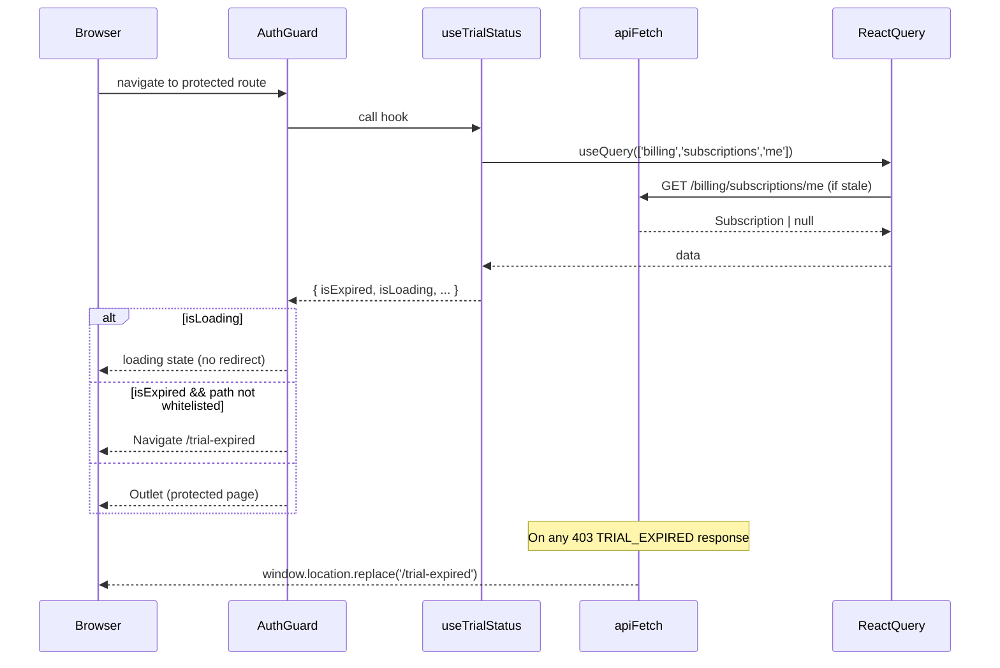

# SUBS-009 — Trial UI Gates (frontend)

## Problem statement

SUBS-008 introduced a `trialing` subscription on the backend, exposing `trial_ends_at` and `days_remaining` from `GET /billing/subscriptions/me` and returning HTTP 403 `TRIAL_EXPIRED` when an expired-trial user hits a protected route. The `apps/web` SPA currently has no primitive that surfaces this trial state, so the countdown is invisible and an expired-trial user hitting a protected page sees only an opaque 403. This feature closes the gap by delivering a shared React Query hook, an urgency banner, a `/trial-expired` plan-selection page, an `AuthGuard` extension, and a global HTTP interceptor.

## Alternatives

| Alternative | Description | Decision |
|---|---|---|
| Option A — Prop-drilled trial state from a single top-level fetch | Fetch `GET /billing/subscriptions/me` once in `AppLayout`, derive trial state, and pass it down via props or React context to `<TrialBanner />` and `AuthGuard`. | Not chosen — requires threading state through the component tree, breaks the established hook-per-concern pattern used by `useQuota` and `useEntitlement`, and makes `AuthGuard` depend on a layout-level prop rather than owning its own data check. Violates the convention that domain hooks, not props, carry server state. |
| Option B — Dedicated `useTrialStatus` hook with its own cache key | Introduce `useTrialStatus` as an independent React Query hook fetching `GET /billing/subscriptions/me` under a separate query key, independently of `useMySubscription`. | Not chosen — produces two independent cache entries for the same endpoint (violating R001 and NF002), meaning simultaneous mounts of `useTrialStatus` and `useMySubscription` issue duplicate network requests within the same `staleTime` window. |
| Option C — `useTrialStatus` deriving from the shared `getMySubscription` query key | Introduce `useTrialStatus` in `apps/web/src/hooks/useTrialStatus.ts` that issues its own `useQuery` call under the same `queryKey: ['billing', 'subscriptions', 'me']` already used by `useMySubscription`, with `staleTime: 60_000` and `refetchOnWindowFocus: true`. Both hooks share one cache entry. Trial-state derivation is a pure mapping of the `Subscription` fields `status`, `trial_ends_at`, and `days_remaining`. | **Chosen** — satisfies R001, R002, NF001, NF002, and EC001 while following the same pattern established by `useQuota` / `useInvalidateQuotas` in `hooks/useQuota.ts`. Cache sharing at the React Query level is idiomatic and requires no new context or prop threading. |

## Chosen solution

**Option C — shared `getMySubscription` query key with `useTrialStatus` derivation**

`useTrialStatus` issues a `useQuery` call with `queryKey: ['billing', 'subscriptions', 'me']`, `staleTime: 60_000`, and `refetchOnWindowFocus: true`. React Query deduplicates this with the identical key already used by `useMySubscription` in `hooks/use-billing.ts`, satisfying NF001 and NF002. While the query is loading the hook returns safe defaults (`isTrialing: false`, `isExpired: false`) so `AuthGuard` does not redirect prematurely (EC001). All derivation logic is a pure transformation of `Subscription | null` — no local date arithmetic on `trial_ends_at` (respecting the technical constraint that `days_remaining` is consumed verbatim from the backend).

The `AuthGuard` extension follows the sequential-condition pattern already present: after the authentication and onboarding checks, it calls `useTrialStatus()`, holds in loading state while the query is pending, and redirects to `/trial-expired` when `isExpired === true` and the current path is not on the whitelist (R012, R013). This keeps all redirect logic in one file per the convention that individual pages must not duplicate guard checks.

The `api/client.ts` interceptor wraps the existing `apiFetch` response-handling block: when the response is 403 and the parsed body contains `code === 'TRIAL_EXPIRED'`, it redirects via `window.location.replace('/trial-expired')` before throwing (R014, EC003). This is the only global side-effect injection point that does not require React context, matching the existing `ApiError` handling pattern.

`<TrialBanner />` calls `useTrialStatus()` directly, following the domain-component-calls-hook exception already established by `<QuotaGate />` and `<EntitlementGate />`. It is mounted inside `AppLayout` (which wraps all `/*` routes), so it appears on every authenticated page without modifying individual pages.

`/trial-expired` is a page-level component (`pages/TrialExpired.tsx`) that calls `usePlans()` and `useSubscribe()` from `hooks/use-billing.ts` plus `useTrialStatus()` to resolve the redirect-after-success. It reuses `<PlanCard />` for plan rendering (R009), conditionally renders a "Continue with free" button (R010, R011), and on mutation success invalidates the shared query key before navigating to `/` (R015, EC004).

Conventions respected:
- Layered import rule: hooks consume `api/`; pages call hooks; domain components in `components/domain/billing/` call hooks under the billing-domain exception.
- Types imported from `@repo/types` only; the frontend does not redeclare `SubscriptionStatusValue`, `Subscription`, `trial_ends_at`, or `days_remaining`.
- `components/ui/` does not import from `@repo/types` — `<TrialBanner />` is a domain component, not a UI component.
- `AuthGuard` extension does not duplicate auth or onboarding checks; trial redirect is a third sequential condition added after the existing two.

## Technical design

### `useTrialStatus()` hook

```typescript
// apps/web/src/hooks/useTrialStatus.ts
import { useQuery, useQueryClient } from '@tanstack/react-query';
import { useAuth } from '@clerk/clerk-react';
import type { Subscription } from '@repo/types';
import { getMySubscription } from '../api/billing';

export interface TrialStatus {
  isTrialing: boolean;
  daysRemaining: number | null;
  trialEndsAt: string | null;
  isExpired: boolean;
  isLoading: boolean;
}

export function useTrialStatus(): TrialStatus { ... }

export function useInvalidateMySubscription(): () => Promise<void> { ... }
```

Query configuration:
- `queryKey: ['billing', 'subscriptions', 'me']` — shared with `useMySubscription`
- `staleTime: 60_000`
- `refetchOnWindowFocus: true`
- `queryFn`: calls `getMySubscription(token)` (existing `api/billing.ts` function)

Derivation rules (pure function of `Subscription | null`):
- Loading: all fields at safe defaults, `isLoading: true`
- `data === null` or `status` is not `'trialing'` or `'expired'`: `isTrialing: false`, `isExpired: false`, `daysRemaining: null`, `trialEndsAt: null`, `isLoading: false`
- `status === 'trialing'`: `isTrialing: true`, `daysRemaining: data.days_remaining ?? null`, `trialEndsAt: data.trial_ends_at`, `isExpired: false`
- `status === 'expired'`: `isExpired: true`, `isTrialing: false`, `daysRemaining: null`, `trialEndsAt: data.trial_ends_at`
- EC006 (paid `active` subscription): since the backend SUBS-002 partial unique index ensures at most one non-terminal subscription, when the current subscription is `active`/`pending`/`past_due`, neither `isTrialing` nor `isExpired` is set (R005)

`useInvalidateMySubscription` is a helper exported from the same file; it calls `queryClient.invalidateQueries({ queryKey: ['billing', 'subscriptions', 'me'] })` and is used by the "Continue with free" mutation's `onSuccess` handler.

### `api/client.ts` TRIAL_EXPIRED interceptor

`apiFetch` is modified to parse the 403 response body before constructing `ApiError`. When `response.status === 403` and the parsed JSON contains `{ code: 'TRIAL_EXPIRED' }`, `apiFetch` calls `window.location.replace('/trial-expired')` then throws `ApiError` with the original message and status. This applies globally — no per-callsite change needed (R014, EC003).

The body-parse path must not break the existing non-TRIAL_EXPIRED 403 flow: when the body does not contain `code: 'TRIAL_EXPIRED'`, the existing `ApiError` throw proceeds unchanged.

### `<TrialBanner />` component

```typescript
// apps/web/src/components/domain/billing/TrialBanner.tsx
export default function TrialBanner(): JSX.Element | null
```

Calls `useTrialStatus()` internally. Renders `null` when `!isTrialing || daysRemaining === null || daysRemaining > 3`. When rendering, outputs a fixed-position top bar (CSS `position: fixed; top: 0`) so the rest of the page body is not reflowed (NF003). Banner text:
- `daysRemaining === 0`: "Less than 1 day left in your trial — upgrade now" (R008, EC007)
- `daysRemaining >= 1 && daysRemaining <= 3`: "X days left in your trial — upgrade now" where X is `daysRemaining`

The top bar includes an anchor/link to `/pricing` as the CTA (R006).

`AppLayout` is modified to mount `<TrialBanner />` above the `<header>` element so the banner occupies fixed space at the top of the viewport.

### `AuthGuard` extension

A third sequential condition is appended after the existing onboarding checks:

```
if (trialStatus.isLoading) → render loading state (no redirect)
if (trialStatus.isExpired && !TRIAL_EXPIRED_WHITELIST.includes(pathname)) → <Navigate to="/trial-expired" replace />
if (trialStatus.isExpired && TRIAL_EXPIRED_WHITELIST.includes(pathname)) → render <Outlet />
```

`TRIAL_EXPIRED_WHITELIST = ['/pricing', '/billing', '/billing/subscribe', '/trial-expired']`

`useTrialStatus()` is called unconditionally in `AuthGuard` (same pattern as `useUserProfile`) and the guard holds in a neutral loading state while the query is pending (EC001, EC002).

### `TrialExpired` page

```typescript
// apps/web/src/pages/TrialExpired.tsx
export default function TrialExpiredPage(): JSX.Element
```

Calls:
- `usePlans()` — fetches plan catalog from `GET /billing/plans`
- `useSubscribe()` — mutation for `POST /billing/subscriptions`
- `useInvalidateMySubscription()` — to clear cache on success
- `useNavigate()` — to redirect to `/` after successful "Continue with free"

Renders:
- Title: "Your free trial has ended"
- Plan list using `<PlanCard />` for each plan, with `onSelect` invoking `useSubscribe` mutation with `{ planCode: plan.code }`
- "Continue with free" button when `plans.some(p => p.code === 'free')` (R010); omitted when no free plan exists (R011, EC005)
- On mutation `onSuccess`: calls `useInvalidateMySubscription()` then `navigate('/')` (R015, EC004)

### Router update

`router.tsx` adds `/trial-expired` as a child of `AuthGuard` at the same level as `/onboarding`. It must be outside the `/*` / `AppLayout` subtree to avoid `AppLayout` rendering while trial is expired (the banner would render in a loop during the expired state), but inside `AuthGuard` so the user must be authenticated to see it.

The whitelist entries `/pricing`, `/billing`, and `/billing/subscribe` already exist as routes; no new routes are required for those.

### Data flow diagram



## Files

| Path | Action | Description |
|---|---|---|
| `apps/web/src/hooks/useTrialStatus.ts` | CREATE | `useTrialStatus()` hook and `useInvalidateMySubscription()` helper sharing the `['billing','subscriptions','me']` query key |
| `apps/web/src/api/client.ts` | MODIFY | Add TRIAL_EXPIRED body-parse and redirect inside the non-2xx branch of `apiFetch` |
| `apps/web/src/components/auth/AuthGuard.tsx` | MODIFY | Add trial-expiry check (third sequential condition) using `useTrialStatus()` with whitelist |
| `apps/web/src/components/domain/billing/TrialBanner.tsx` | CREATE | Fixed-position top banner rendered when `isTrialing && daysRemaining <= 3` |
| `apps/web/src/components/layout/AppLayout.tsx` | MODIFY | Mount `<TrialBanner />` above the header |
| `apps/web/src/pages/TrialExpired.tsx` | CREATE | `/trial-expired` page: plan list via `<PlanCard />`, optional "Continue with free" button, mutation + invalidate + navigate on success |
| `apps/web/src/router.tsx` | MODIFY | Add `/trial-expired` route inside `AuthGuard` children, outside the `AppLayout` subtree |
| `apps/web/tests/billing/useTrialStatus.test.ts` | CREATE | Unit tests for `useTrialStatus()` and `useInvalidateMySubscription()` covering R001–R005, NF001, NF002, EC001, EC002, EC006 |
| `apps/web/tests/billing/TrialBanner.test.tsx` | CREATE | Render tests for `<TrialBanner />` covering R006, R007, R008, NF003, EC007 |
| `apps/web/tests/billing/TrialExpired.test.tsx` | CREATE | Render and interaction tests for `<TrialExpiredPage />` covering R009, R010, R011, R015, EC004, EC005 |
| `apps/web/tests/AuthGuard.trial.test.tsx` | CREATE | Extension tests for `AuthGuard` trial redirect logic covering R012, R013, EC001, EC002 |
| `apps/web/tests/client.trial.test.ts` | CREATE | Unit tests for the TRIAL_EXPIRED interceptor in `apiFetch` covering R014, EC003 |

## Requirement coverage

| ID | Design decision |
|---|---|
| R001 | `useTrialStatus` calls `useQuery` with `queryKey: ['billing', 'subscriptions', 'me']`, identical to `useMySubscription` — React Query deduplicates them into one cache entry |
| R002 | `useTrialStatus` return type is `{ isTrialing: boolean, daysRemaining: number \| null, trialEndsAt: string \| null, isExpired: boolean, isLoading: boolean }` |
| R003 | Derivation branch: `status === 'trialing'` → `isTrialing = true`, `daysRemaining = data.days_remaining ?? null`, `trialEndsAt = data.trial_ends_at` |
| R004 | Derivation branch: `status === 'expired'` → `isExpired = true` |
| R005 | Derivation default branch: any non-terminal status other than `trialing` or `expired` returns `isTrialing = false`, `isExpired = false` |
| R006 | `<TrialBanner />` renders fixed top bar with text "X days left in your trial — upgrade now" and CTA link to `/pricing` when `isTrialing && daysRemaining <= 3` |
| R007 | `<TrialBanner />` returns `null` when `!isTrialing`, `daysRemaining > 3`, or `daysRemaining === null` |
| R008 | `<TrialBanner />` renders "Less than 1 day left in your trial — upgrade now" when `daysRemaining === 0` |
| R009 | `TrialExpiredPage` renders title "Your free trial has ended" and maps plans from `usePlans()` to `<PlanCard />` |
| R010 | `TrialExpiredPage` renders "Continue with free" button when `plans.some(p => p.code === 'free')`; click dispatches `POST /billing/subscriptions` with `planCode: 'free'` |
| R011 | `TrialExpiredPage` omits "Continue with free" button when no free plan exists in the catalog |
| R012 | `AuthGuard` third sequential condition: `isExpired && !whitelist.includes(pathname)` → `<Navigate to="/trial-expired" replace />` |
| R013 | `AuthGuard` third sequential condition: `isExpired && whitelist.includes(pathname)` → renders `<Outlet />` unchanged |
| R014 | `apiFetch` non-2xx branch: 403 body parse checks for `code === 'TRIAL_EXPIRED'`; if matched, calls `window.location.replace('/trial-expired')` before throwing |
| R015 | `TrialExpiredPage` `onSuccess` handler calls `useInvalidateMySubscription()` then `navigate('/')` |
| NF001 | `useTrialStatus` configures `staleTime: 60_000` and `refetchOnWindowFocus: true` on the React Query call |
| NF002 | Shared `queryKey: ['billing', 'subscriptions', 'me']` between `useTrialStatus` and `useMySubscription` ensures at most one fetch per `staleTime` window regardless of mounted instances |
| NF003 | `<TrialBanner />` uses `position: fixed; top: 0` so the banner does not reflow the page body when it appears or disappears |
| EC001 | `useTrialStatus` returns `isTrialing: false`, `isExpired: false`, `isLoading: true` before the initial query resolves; `AuthGuard` renders loading state without redirecting |
| EC002 | `refetchOnWindowFocus: true` on `useTrialStatus` causes React Query to re-run the query when the tab regains focus; `AuthGuard` re-evaluates the redirect condition on the next render after `isExpired` becomes `true` |
| EC003 | `apiFetch` interceptor fires synchronously on any 403 `TRIAL_EXPIRED` response regardless of whether `useTrialStatus` has observed the state change |
| EC004 | `TrialExpiredPage` `onSuccess` handler calls `useInvalidateMySubscription()` before `navigate('/')`, ensuring the cache is invalidated and `isExpired` re-derives to `false` on the next render |
| EC005 | `TrialExpiredPage` conditionally renders the "Continue with free" button only when `plans.some(p => p.code === 'free')` |
| EC006 | Derivation default branch: `status` not in `['trialing', 'expired']` → `isExpired = false`; the backend's partial unique index ensures only one non-terminal subscription exists, so an active paid subscription after a trial yields a single `active` record and `isExpired = false` |
| EC007 | `<TrialBanner />` renders "Less than 1 day left in your trial — upgrade now" when `daysRemaining === 0` instead of "0 days left" |
