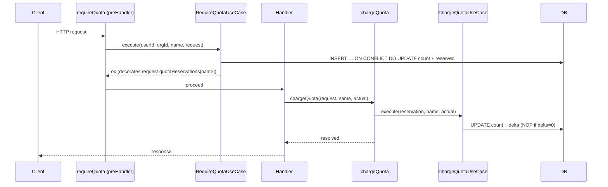

# SUBS-010 — Variable-Cost Quota Strategies

## Problem statement

SUBS-006 models every quota as a fixed-cost counter that increments by `+1` per request. Many real operations consume variable amounts (tokens, bytes, recipients), and some costs are only knowable after the handler executes. This forces teams to either undercount consumption or adopt workarounds that break the atomicity guarantee provided by the SUBS-006 upsert pattern.

## Alternatives

| Alternative | Description | Decision |
|---|---|---|
| Fat Use Case | Extend `RequireQuotaUseCase.execute` to accept a pre-computed cost and add an extra `reconcile` method; compute the strategy and store the reservation directly in the plugin layer. | Not chosen — business logic (cost validation, delta computation) leaks into the plugin; the `reconcile` method on the use case would hold raw SQL delta semantics that belong in the repository; harder to test in isolation. |
| Strategy-Aware Use Case Split | Add a `QUOTA_STRATEGIES` registry in `entitlements.ts`; extend `RequireQuotaUseCase` to read the strategy and pass cost to the repository; export `chargeQuota` as a standalone function backed by a new `ChargeQuotaUseCase`; decorate `request.quotaReservations` from the plugin. | **Chosen** — business logic lives in use cases, SQL in repository, plugin stays thin; `chargeQuota` is cleanly exportable; each layer is independently testable; respects all BACKEND.md layering rules. |
| Plugin-Owned Strategy with Flat Helper | Move all strategy resolution and delta arithmetic into a standalone `chargeQuota.ts` plugin file that imports the db singleton directly and executes raw SQL inline, bypassing the use case and repository layers. | Not chosen — SQL in a plugin violates the "queries only in repositories" rule from BACKEND.md; merges orchestration and data-access concerns; untestable without a real DB. |

## Chosen solution

**Strategy-Aware Use Case Split**

This solution extends the existing vertical slice cleanly:

- R001/R002: `QUOTA_STRATEGIES` registry in `entitlements.ts` with a typed fallback default; strategy is resolved once per request.
- R003/R004: `RequireQuotaUseCase` reads the strategy, calls `compute(request)`, passes cost to the repository's `incrementByAndReturn` method; for `post` mode it decorates `request.quotaReservations[name]`.
- R005/R006/R007: `ChargeQuotaUseCase` reads the reservation, validates `actual`, computes `delta`, calls `adjustCount` on the repository; the plugin-level `chargeQuota` helper reads the request decoration and delegates.
- R008/R009/R010: reservation-as-final-cost is a no-op (already persisted); `adjustCount` allows `count > hard_limit` with a warning log; `GetMyQuotasUseCase` reads `unit` from the strategy.
- EC001–EC009: handled in use cases with `ValidationError` for negative/non-integer costs and appropriate guard branches.

All BACKEND.md rules are respected: SQL only in repositories, use cases depend on interfaces, plugins are thin factories, `process.env` never read in application code.

## Technical design

### New shared types (`@repo/types`)

```ts
export type QuotaMode = 'pre' | 'post';
export type QuotaUnit = string;   // e.g. 'request', 'token', 'byte', 'recipient'

export interface QuotaStrategy {
  unit: QuotaUnit;
  mode: QuotaMode;
  compute: (req: FastifyRequest) => number;
}

// Extended QuotaUsage (SUBS-006) gains:
// unit: QuotaUnit
```

`QuotaStrategy` is exported from `@repo/types` but note: the `compute` function references `FastifyRequest` from Fastify. Since `@repo/types` has no runtime dependencies, `compute` is typed as `(req: unknown) => number` in the shared package and cast to `FastifyRequest` at the call site in `entitlements.ts`. Alternatively the type can accept `unknown` with a note that the concrete shape is narrowed by `entitlements.ts`. The chosen approach: `@repo/types` declares `QuotaStrategy` with `compute: (req: unknown) => number` and `entitlements.ts` casts appropriately.

### Strategy registry in `entitlements.ts`

```ts
export const QUOTA_STRATEGIES: Record<QuotaName, QuotaStrategy> = {
  api_requests: { unit: 'request', mode: 'pre', compute: () => 1 },
};

export const DEFAULT_QUOTA_STRATEGY: QuotaStrategy = {
  unit: 'request', mode: 'pre', compute: () => 1,
};

export function resolveStrategy(quotaName: QuotaName): QuotaStrategy {
  return QUOTA_STRATEGIES[quotaName] ?? DEFAULT_QUOTA_STRATEGY;
}
```

R002 is satisfied by the fallback to `DEFAULT_QUOTA_STRATEGY`.

### Request decoration

`requireQuota.ts` calls `fastify.decorateRequest('quotaReservations', null)` once via a plugin registration and adds a module augmentation:

```ts
declare module 'fastify' {
  interface FastifyRequest {
    quotaReservations: Record<string, { reserved: number; charged: number; rowKey: QuotaRowKey }> | null;
  }
}
```

`QuotaRowKey` is a local interface:
```ts
interface QuotaRowKey {
  userId: string | null;
  orgId: string | null;
  periodStart: string;
}
```

The `quotaReservations` map is initialized to `{}` by the preHandler on first write (defensive against `null` from `decorateRequest`).

### `IUsageCounterRepository` — new methods

```ts
// Atomically increments by `cost` (instead of 1) and returns new count
incrementByAndReturn(
  userId: string | null,
  orgId: string | null,
  quotaName: string,
  periodStart: string,
  cost: number,
): Promise<number>;

// Atomically applies delta (positive or negative) to an existing row
// delta = actual - reserved; if delta == 0 this is a no-op
adjustCount(
  userId: string | null,
  orgId: string | null,
  quotaName: string,
  periodStart: string,
  delta: number,
): Promise<void>;
```

SQL for `incrementByAndReturn`:
```sql
INSERT INTO usage_counters (user_id, org_id, quota_name, period_start, count)
VALUES ($userId, $orgId, $quotaName, $periodStart, $cost)
ON CONFLICT (user_id, org_id, quota_name, period_start)
DO UPDATE SET count = usage_counters.count + $cost, updated_at = now()
RETURNING count
```

SQL for `adjustCount`:
```sql
UPDATE usage_counters
SET count = count + $delta, updated_at = now()
WHERE user_id IS NOT DISTINCT FROM $userId
  AND org_id IS NOT DISTINCT FROM $orgId
  AND quota_name = $quotaName
  AND period_start = $periodStart
```

NF001 is satisfied: both are single atomic statements with no prior read.

### `RequireQuotaUseCase` — extended `execute`

```
execute(userId, orgId, quotaName, request):
  1. ensureActiveSubscription → sub (null = unlimited, return)
  2. planQuotas = PLAN_QUOTAS[sub.plan_code][quotaName] (null = unlimited, return)
  3. strategy = resolveStrategy(quotaName)
  4. cost = strategy.compute(request)
  5. IF cost == 0 THEN return (EC001)
  6. IF cost < 0 OR !Number.isInteger(cost) THEN throw ValidationError (EC002)
  7. IF cost > thresholds.hard_limit THEN throw QuotaExceededError (EC003)
  8. count = counterRepo.incrementByAndReturn(scope, quotaName, periodStart, cost)
  9. IF count > thresholds.hard_limit THEN throw QuotaExceededError
  10. IF strategy.mode == 'post' THEN
        decorate request.quotaReservations[quotaName] = { reserved: cost, charged: cost, rowKey }
```

Signature change: `execute(userId, orgId, quotaName, request: unknown)` — the use case receives the raw Fastify request as `unknown` and passes it to `strategy.compute`. This preserves the use case's independence from Fastify while satisfying R003.

### `ChargeQuotaUseCase`

```ts
export class ChargeQuotaUseCase {
  constructor(private readonly counterRepo: IUsageCounterRepository) {}

  async execute(
    reservation: { reserved: number; charged: number; rowKey: QuotaRowKey },
    quotaName: string,
    actual: number,
  ): Promise<number /* new charged */> {
    // EC004
    if (actual < 0) throw new ValidationError('chargeQuota: actual must be >= 0');
    // EC006
    const strategy = resolveStrategy(quotaName);
    if (strategy.mode !== 'post') throw new ProgrammingError(...)
    const delta = actual - reservation.charged;
    if (delta !== 0) {
      // R009: log warning if delta would push count above hard_limit (cannot check without reading, so log at repository layer)
      await this.counterRepo.adjustCount(
        reservation.rowKey.userId,
        reservation.rowKey.orgId,
        quotaName,
        reservation.rowKey.periodStart,
        delta,
      );
    }
    return actual; // new charged value
  }
}
```

A `ProgrammingError` is a new `DomainError` subclass with status 500 and code `PROGRAMMING_ERROR`, used for developer mistakes (EC006, R006).

### `chargeQuota` helper (exported from subscriptions module)

```ts
export async function chargeQuota(
  request: FastifyRequest,
  name: string,
  actual: number,
): Promise<void>
```

- Reads `request.quotaReservations?.[name]`; if absent throws `ProgrammingError` (R006).
- Delegates to `ChargeQuotaUseCase.execute`.
- Updates `request.quotaReservations[name].charged = actual` (R007).

The singleton `ChargeQuotaUseCase` instance lives at module scope in `chargeQuota.ts`, the same pattern as `requireQuota.ts`.

### `requireQuota` plugin — updated factory

The plugin file is refactored to:
1. Register `fastify.decorateRequest('quotaReservations', null)` once (via Fastify plugin registration wrapping).
2. Pass `request` as the fourth argument to `useCase.execute`.

### `GetMyQuotasUseCase` — `unit` field

```ts
results.push({
  ...existingFields,
  unit: resolveStrategy(quotaName).unit,
});
```

R010 satisfied; `QuotaUsage` in `@repo/types` gains `unit: string`.

### Request lifecycle for `post` mode



## Files

| Path | Action | Description |
|---|---|---|
| `packages/types/src/index.ts` | MODIFY | Add `QuotaMode`, `QuotaUnit`, `QuotaStrategy` types; extend `QuotaUsage` with `unit: string` |
| `apps/services/src/modules/subscriptions/entitlements.ts` | MODIFY | Add `QUOTA_STRATEGIES` registry, `DEFAULT_QUOTA_STRATEGY` constant, and `resolveStrategy` exported function |
| `apps/services/src/modules/subscriptions/repositories/interfaces/iUsageCounterRepository.ts` | MODIFY | Add `incrementByAndReturn` and `adjustCount` method signatures |
| `apps/services/src/modules/subscriptions/repositories/usageCounterDBRepository.ts` | MODIFY | Implement `incrementByAndReturn` and `adjustCount` using raw `postgres.js` SQL |
| `apps/services/src/modules/subscriptions/useCases/requireQuotaUseCase.ts` | MODIFY | Extend `execute` to accept `request: unknown`, resolve strategy, compute cost, validate, call `incrementByAndReturn`, decorate `request.quotaReservations` in `post` mode |
| `apps/services/src/modules/subscriptions/useCases/chargeQuotaUseCase.ts` | CREATE | `ChargeQuotaUseCase` class: validates `actual`, resolves strategy mode, computes delta, calls `adjustCount` |
| `apps/services/src/modules/subscriptions/plugins/requireQuota.ts` | MODIFY | Register `decorateRequest('quotaReservations', null)`; pass `request` to `useCase.execute`; add `FastifyRequest` module augmentation for `quotaReservations` |
| `apps/services/src/modules/subscriptions/helpers/chargeQuota.ts` | CREATE | `chargeQuota(request, name, actual)` exported helper; module-scope `ChargeQuotaUseCase` singleton; reads/updates `request.quotaReservations` |
| `apps/services/src/shared/errors.ts` | MODIFY | Add `ProgrammingError` subclass (status 500, code `PROGRAMMING_ERROR`) |
| `apps/services/src/modules/subscriptions/useCases/getMyQuotasUseCase.ts` | MODIFY | Include `unit: resolveStrategy(quotaName).unit` in each `QuotaUsage` entry pushed to results |
| `apps/services/tests/unit/modules/subscriptions/entitlements.test.ts` | MODIFY | Add tests for `resolveStrategy` (known quota, unknown quota falls back to default) |
| `apps/services/tests/unit/modules/subscriptions/repositories/usageCounterDBRepository.test.ts` | CREATE | Tests for `incrementByAndReturn` and `adjustCount` |
| `apps/services/tests/unit/modules/subscriptions/useCases/requireQuotaUseCase.test.ts` | MODIFY | Add tests for strategy-aware cost computation, `post` mode decoration, EC001–EC003 |
| `apps/services/tests/unit/modules/subscriptions/useCases/chargeQuotaUseCase.test.ts` | CREATE | Tests for `ChargeQuotaUseCase`: EC004, EC006, R005, R007, R009 |
| `apps/services/tests/unit/modules/subscriptions/helpers/chargeQuota.test.ts` | CREATE | Tests for `chargeQuota` helper: R006 (missing reservation), R007 (incremental charging), R008 (no-call leaves reservation) |
| `apps/services/tests/unit/modules/subscriptions/plugins/requireQuota.test.ts` | MODIFY | Add tests for `post` mode decoration on request, EC001 (zero cost skip), EC002 (negative/non-integer validation) |
| `apps/services/tests/unit/modules/subscriptions/useCases/getMyQuotasUseCase.test.ts` | CREATE | Tests asserting `unit` field appears in each `QuotaUsage` entry |

## Requirement coverage

| ID | Design decision |
|---|---|
| R001 | `QUOTA_STRATEGIES` registry of shape `{ unit, mode, compute }` added to `entitlements.ts` alongside `PLAN_QUOTAS` |
| R002 | `resolveStrategy` returns `DEFAULT_QUOTA_STRATEGY` (`unit: 'request', mode: 'pre', compute: () => 1`) when quota name not in registry |
| R003 | `RequireQuotaUseCase.execute` resolves strategy, calls `compute(request)`, passes cost to `incrementByAndReturn` |
| R004 | `RequireQuotaUseCase.execute` in `post` mode decorates `request.quotaReservations[name] = { reserved, charged, rowKey }` after upsert |
| R005 | `chargeQuota` helper reads reservation, calls `ChargeQuotaUseCase.execute` which calls `adjustCount` with `delta = actual - charged` |
| R006 | `chargeQuota` throws `ProgrammingError` when `request.quotaReservations[name]` is absent |
| R007 | `chargeQuota` updates `reservation.charged = actual` after each call; next call computes delta against updated value |
| R008 | If `chargeQuota` is never called, the initial `reserved` amount remains booked in `usage_counters` — no additional code needed |
| R009 | `ChargeQuotaUseCase.execute` logs a warning when `adjustCount` is called with a positive delta that may push count above `hard_limit`, then proceeds with the UPDATE |
| R010 | `GetMyQuotasUseCase` adds `unit: resolveStrategy(quotaName).unit` to each `QuotaUsage` entry; `QuotaUsage` type in `@repo/types` gains `unit: string` |
| NF001 | `adjustCount` issues `UPDATE … SET count = count + $delta` with no preceding `SELECT` — single atomic statement |
| NF002 | `pre` mode: `incrementByAndReturn` replaces the old `incrementAndReturn` with the same single-upsert pattern — no extra query |
| NF003 | `post` mode: preHandler does one upsert (`incrementByAndReturn`); `chargeQuota` adds one `UPDATE` (`adjustCount`) — exactly one extra query |
| EC001 | `RequireQuotaUseCase.execute` returns early when `cost == 0` without calling `incrementByAndReturn` and without decorating `quotaReservations` |
| EC002 | `RequireQuotaUseCase.execute` throws `ValidationError` when `cost < 0` or `!Number.isInteger(cost)` |
| EC003 | `RequireQuotaUseCase.execute` throws `QuotaExceededError` when `cost > thresholds.hard_limit` (before the upsert) or when the returned `count > thresholds.hard_limit` |
| EC004 | `ChargeQuotaUseCase.execute` throws `ValidationError` when `actual < 0` |
| EC005 | R008 satisfied by design: reservation is the worst-case cost already persisted; no additional logic needed |
| EC006 | `ChargeQuotaUseCase.execute` throws `ProgrammingError` when `resolveStrategy(quotaName).mode !== 'post'` |
| EC007 | No migration or reset logic — existing `usage_counters` rows are valid unit-total counters regardless of strategy changes |
| EC008 | `GET /billing/quotas/me` reads `count` from DB snapshot via `findCount`; in-flight reservations are already persisted — no change needed |
| EC009 | `request.quotaReservations` is a map keyed by quota name; each quota reconciles independently via its own entry |
