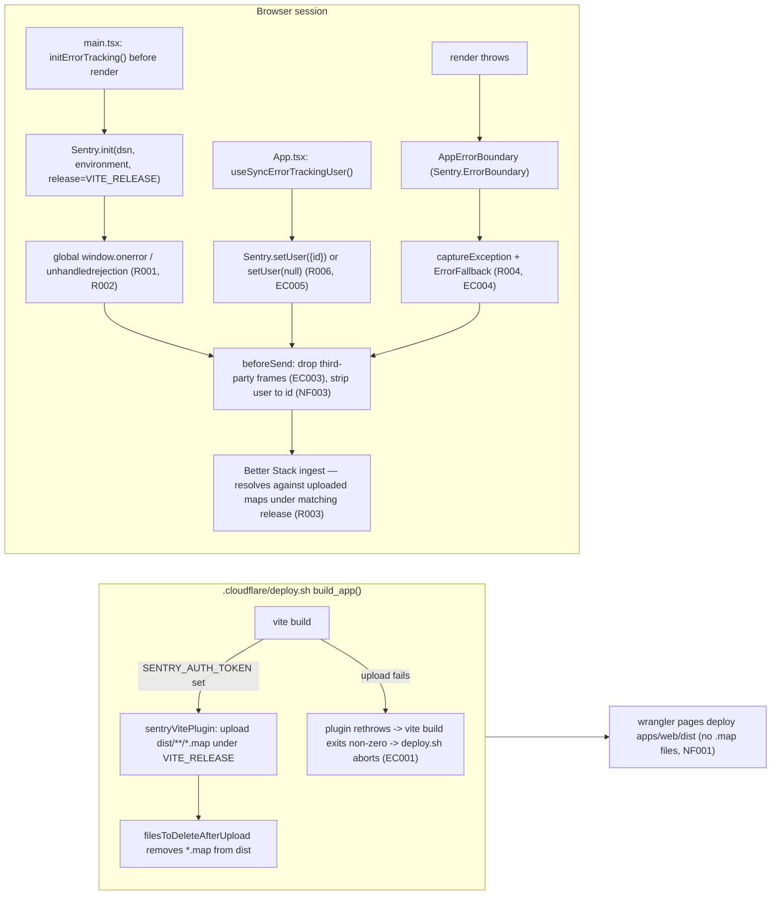

# WEB-002 — Error tracking en `web`

## Problem statement

`apps/web` mounts `<ClerkProvider>` / `<QueryClientProvider>` / `<App>` with no error boundary and no reporting client anywhere in the tree: a render error unmounts the React root and leaves a blank screen, and uncaught errors or unhandled promise rejections vanish silently. The published bundle is also minified, so even a report that did arrive would carry a useless stack trace. The feature must make every SPA error reach Better Stack, grouped and resolvable back to source, without ever blocking or breaking the application itself.

## Alternatives

| Alternative | Description | Decision |
|---|---|---|
| `@sentry/react` SDK direct integration | Call `Sentry.init()` once at bootstrap (`main.tsx`) and use the SDK's own `<Sentry.ErrorBoundary>` primitive for render-error capture and `Sentry.setUser`/`captureException` for attribution; global `window.onerror`/`unhandledrejection` capture comes for free from the SDK's default integrations. | **Chosen** — see justification below. |
| Hand-rolled global listeners + custom `IReportingClient` port/adapter (mirroring SERVICES-011's provider-agnostic pattern) | Define an `IReportingClient` port with a `SentryReportingClient` adapter and a `NoopReportingClient`, and manually wire `window.addEventListener('error'/'unhandledrejection')` plus a hand-rolled boundary that calls the port. | Not chosen — SERVICES-011's port/adapter abstraction was justified there by two independent call sites (`errorHandler.ts` and `resendEmailNotifier.ts`) needing to share one reporter singleton and its occurrence sampler. `apps/web` has exactly one integration surface (the SPA bootstrap); reinventing global-handler wiring, breadcrumb capture, and minified/symbolicated stack normalization that `@sentry/react` already provides for free is pure scope creep with no requirement it serves better, and adds untested surface area with no benefit. |
| Vendor snippet loaded via `<script>` tag in `index.html` (no npm SDK) | Load a Better Stack/Sentry browser beacon directly in the HTML shell instead of importing `@sentry/react`. | Not chosen — cannot participate in the Vite build pipeline, so there is no way to wire `beforeSend` scrubbing (R006/NF003), no way to gate initialization on the `VITE_`-prefixed config convention (technical constraint), and no way to associate the build's source maps with a release identifier at build time (R003, EC002). It also cannot be tree-shaken or type-checked, and its load timing relative to first render (NF002) is outside application control. |

## Chosen solution

**`@sentry/react` SDK direct integration**

This satisfies R001, R002, and R007 for free: `Sentry.init()`'s default integrations already install the global `window.onerror` and `unhandledrejection` handlers, so once the client is initialized before render, uncaught errors and unhandled rejections are captured automatically — no hand-written listener code is a second, competing capture path to keep in sync. `<Sentry.ErrorBoundary>` gives R004 a battle-tested boundary that both catches the render error and calls `captureException` in one step, wrapped in a dependency-free project-owned fallback for EC004. `Sentry.setUser`/`Sentry.setUser(null)` give R006/EC005 a one-line, well-defined attribution surface. Every exported Sentry.js function (`init`, `setUser`, `captureException`, the `ErrorBoundary` component) is a documented no-op when the client was never initialized, which is what makes R008 trivial: `initErrorTracking()` simply returns early when configuration is absent, and every other call site in the app keeps working unmodified — there is no need for a hand-rolled `NoopReportingClient` class the way SERVICES-011 needed one, because the vendor SDK already behaves like one when uninitialized.

`duck-spec/modules/web/SPEC.md`'s "Base structure (WEB-001)" section documents the `apps/web` layered import rule (`api → hooks → pages → components`) and its Health vertical slice as the reference pattern; this feature is cross-cutting rather than a vertical feature slice, so it follows the two documented precedents for cross-cutting exceptions instead (`TrialBanner` calling `useTrialStatus()` directly, `AppLayout` rendering `<UserButton/>` directly): the bootstrap lives in `main.tsx` per the technical constraints, and the one non-data-fetching sync hook this feature needs (`useSyncErrorTrackingUser`, R006) is invoked from `App.tsx` — the root component above the router — because user attribution must hold for every route, not just one page, and the hook makes no React Query call so it does not conflict with "only page components invoke data-fetching hooks."

**Assumption** (FRONTEND.md and INFRASTRUCTURE.md do not document a Better Stack source-map-upload contract): Better Stack's error-tracking product exposes a Sentry-CLI/API-compatible endpoint for release creation and source-map upload, addressable via the same `authToken`/`org`/`project`/`url` options `@sentry/vite-plugin` already supports for self-hosted/non-sentry.io Sentry-compatible backends — consistent with the technical constraint that the whole instrumentation is "compatible with the Sentry SDKs." If this proves inaccurate at implementation time, the fallback is publishing the same `dist/**/*.map` artifacts to Better Stack's own upload API from the same build step; the runtime pieces of this design (R001–R002, R004, R006–R008, NF002–NF004, EC003–EC005) are unaffected either way.

## Technical design

### New public config surface (Vite `VITE_`-prefixed, technical constraint)

| Variable | Classification | Read by | Purpose |
|---|---|---|---|
| `VITE_ERROR_TRACKING_DSN` | public | `apps/web/src/lib/errorTracking.ts` (`import.meta.env`) | Provider ingest destination (R007/R008 gate — a Sentry-compatible DSN, same convention as the existing `VITE_CLERK_PUBLISHABLE_KEY`) |
| `VITE_RELEASE` | public | `apps/web/src/lib/errorTracking.ts` (runtime) **and** `apps/web/vite.config.ts` (build-time, via `process.env`) | Single source of truth for the release identifier stamped on every report (R005) and on the uploaded source maps (EC002) |
| `VITE_ENVIRONMENT` | public | `apps/web/src/lib/errorTracking.ts` | Environment name stamped on every report (R005); defaults to `"production"` when unset since every Cloudflare Pages build runs Vite in production mode regardless of target branch/environment |

### New build/deploy-only surface (never `VITE_`-prefixed — EC006)

| Variable | Classification | Read by | Purpose |
|---|---|---|---|
| `SENTRY_AUTH_TOKEN` | secret, build/deploy-only | `apps/web/vite.config.ts` (`process.env`, Node context) | Authenticates the source-map upload; **gates whether source maps are produced at all** |
| `SENTRY_ORG` / `SENTRY_PROJECT` | build/deploy-only | `apps/web/vite.config.ts` | Identify the target project for the upload |
| `SENTRY_URL` (optional) | build/deploy-only | `apps/web/vite.config.ts` | Better Stack's Sentry-compatible API base, when it differs from sentry.io's default |

Because Vite only ever inlines `import.meta.env.VITE_*` keys into the client bundle, a variable that is never `VITE_`-prefixed is structurally unreachable from browser code even though it is present in `process.env` during the build — this is the concrete mechanism that satisfies EC006, not a convention that has to be manually respected. These four variables follow the same handling `.cloudflare/deploy.sh` already gives `CLOUDFLARE_API_TOKEN`: present in the per-environment, git-ignored `.cloudflare/.env.deploy.web.<environment>` file (never committed, never in the `.example` template's filled-in form), exported into the build's `process.env` by `deploy.sh`'s existing `set -a; source "$VALUES_FILE"; set +a`, and consumed by `vite.config.ts` — no change to `deploy.sh` itself is needed, since it already exports every variable in the values file unfiltered.

### `apps/web/src/lib/errorTracking.ts` (R001, R002, R005–R008, NF002–NF004, EC003, EC006)

```ts
import * as Sentry from "@sentry/react";

interface ErrorTrackingConfig {
  dsn: string;
  environment: string;
  release: string;
}

const EXTENSION_URL_SCHEMES = ["chrome-extension:", "moz-extension:", "safari-extension:", "safari-web-extension:"];

export function readErrorTrackingConfig(): ErrorTrackingConfig | null {
  const dsn = import.meta.env.VITE_ERROR_TRACKING_DSN;
  if (!dsn) return null;
  return {
    dsn,
    environment: import.meta.env.VITE_ENVIRONMENT || "production",
    release: import.meta.env.VITE_RELEASE || "unknown",
  };
}

export function isThirdPartyError(event: Sentry.ErrorEvent): boolean {
  const frames = event.exception?.values?.[0]?.stacktrace?.frames ?? [];
  if (frames.length === 0) return false;
  return frames.every((frame) =>
    EXTENSION_URL_SCHEMES.some((scheme) => frame.filename?.startsWith(scheme))
  );
}

export function initErrorTracking(): void {
  const config = readErrorTrackingConfig(); // R008: absent config -> no-op, no throw
  if (!config) return;

  try {
    Sentry.init({
      dsn: config.dsn,
      environment: config.environment,
      release: config.release,
      sendDefaultPii: false, // R006/NF003 defense in depth
      beforeSend(event) {
        if (isThirdPartyError(event)) return null; // EC003
        if (event.user) event.user = { id: event.user.id }; // R006/NF003: id only, ever
        return event;
      },
    });
  } catch (err) {
    // NF004: a provider/init failure must never block the app from rendering.
    console.error("Error tracking initialization failed", err);
  }
}
```

`initErrorTracking()` is synchronous and performs no network I/O of its own (the SDK's transport is async and internal to Sentry, never awaited here), which is what satisfies NF002 structurally: calling it before `createRoot(...).render(...)` in `main.tsx` adds no blocking round trip. R001/R002 need no code beyond a successful `Sentry.init()` call: the SDK's default integrations install the global `window.onerror`/`unhandledrejection` handlers themselves — no `integrations`/`defaultIntegrations` override is applied that would disable them.

### `apps/web/src/components/error/ErrorFallback.tsx` (EC004)

Static markup plus a reload action only — no hooks, no `@repo/types`, no provider-dependent state, so it has no failure path of its own:

```tsx
export function ErrorFallback() {
  return (
    <div role="alert">
      <h1>Something went wrong.</h1>
      <p>Please reload the page. If the problem persists, contact support.</p>
      <button type="button" onClick={() => window.location.reload()}>Reload</button>
    </div>
  );
}
```

### `apps/web/src/components/error/AppErrorBoundary.tsx` (R004)

Thin project-owned wrapper around `Sentry.ErrorBoundary`, so `main.tsx` depends on one project symbol rather than the vendor package directly:

```tsx
import * as Sentry from "@sentry/react";
import type { ReactNode } from "react";
import { ErrorFallback } from "./ErrorFallback";

export function AppErrorBoundary({ children }: { children: ReactNode }) {
  return (
    <Sentry.ErrorBoundary fallback={ErrorFallback} showDialog={false}>
      {children}
    </Sentry.ErrorBoundary>
  );
}
```

`Sentry.ErrorBoundary` calls `captureException` internally when it catches a render error, then renders `fallback` — this is what satisfies R004's "catch, report, and render an error screen" in one component, and remains a safe no-op fallback-only boundary (still renders `ErrorFallback`) if `Sentry.init` was never called (R008).

### `apps/web/src/hooks/use-sync-error-tracking-user.ts` (R006, EC005)

```ts
import { useEffect } from "react";
import * as Sentry from "@sentry/react";
import { useCurrentUser } from "./use-current-user";

export function useSyncErrorTrackingUser(): void {
  const user = useCurrentUser();

  useEffect(() => {
    if (user) {
      Sentry.setUser({ id: user.id }); // R006: identifier only, never name/email/profile data
    } else {
      Sentry.setUser(null); // EC005: unauthenticated -> report without identifier, not discarded
    }
  }, [user]);
}
```

Reuses the existing `useCurrentUser()` hook (`apps/web/src/hooks/use-current-user.ts`, wraps Clerk's `useUser()`) instead of importing `@clerk/clerk-react` a second time, so there is exactly one place in `apps/web` that reads the Clerk user object.

### `apps/web/src/main.tsx` (R001, R002, R004, R007, R008)

```tsx
import { StrictMode } from "react";
import { createRoot } from "react-dom/client";
import { QueryClient, QueryClientProvider } from "@tanstack/react-query";
import { ClerkProvider } from "@clerk/clerk-react";
import App from "./App";
import { initErrorTracking } from "./lib/errorTracking";
import { AppErrorBoundary } from "./components/error/AppErrorBoundary";

const publishableKey = import.meta.env.VITE_CLERK_PUBLISHABLE_KEY;
if (!publishableKey) {
  throw new Error(/* unchanged */);
}

initErrorTracking(); // R007: before first render; NF002: synchronous, non-blocking

const queryClient = new QueryClient();

createRoot(document.getElementById("root")!).render(
  <StrictMode>
    <ClerkProvider publishableKey={publishableKey}>
      <QueryClientProvider client={queryClient}>
        <AppErrorBoundary>
          <App />
        </AppErrorBoundary>
      </QueryClientProvider>
    </ClerkProvider>
  </StrictMode>
);
```

### `apps/web/src/App.tsx` (R006)

```tsx
import { RouterProvider } from "react-router-dom";
import { router } from "./router";
import { useSyncErrorTrackingUser } from "./hooks/use-sync-error-tracking-user";

export default function App() {
  useSyncErrorTrackingUser();
  return <RouterProvider router={router} />;
}
```

### `apps/web/vite.config.ts` (R003, R005, NF001, EC001, EC002)

```ts
import { defineConfig } from "vite";
import react from "@vitejs/plugin-react";
import { sentryVitePlugin } from "@sentry/vite-plugin";

const sourceMapsEnabled = Boolean(process.env.SENTRY_AUTH_TOKEN);

export default defineConfig({
  plugins: [
    react(),
    sourceMapsEnabled &&
      sentryVitePlugin({
        org: process.env.SENTRY_ORG,
        project: process.env.SENTRY_PROJECT,
        authToken: process.env.SENTRY_AUTH_TOKEN,
        url: process.env.SENTRY_URL,
        release: { name: process.env.VITE_RELEASE }, // EC002: same identifier the runtime reports (R005)
        sourcemaps: {
          filesToDeleteAfterUpload: ["**/*.map"], // NF001: never left next to the published bundle
        },
        // No custom errorHandler override: the plugin's default rethrows on
        // upload failure, which fails `vite build`, which fails
        // `pnpm --filter web build`, which — because deploy.sh runs under
        // `set -euo pipefail` — aborts before `wrangler pages deploy` runs (EC001).
      }),
  ].filter(Boolean),
  build: {
    sourcemap: sourceMapsEnabled, // no SENTRY_AUTH_TOKEN -> no maps generated -> nothing to leak (NF001)
  },
});
```

`sourceMapsEnabled` is the single switch that ties source-map generation, upload, and public-directory cleanup together: when `SENTRY_AUTH_TOKEN` is absent (e.g. a contributor's local `pnpm build` without deploy credentials), Vite emits no `.map` files at all, so there is nothing that could leak (NF001 holds trivially) and nothing to upload (R003 simply does not apply to that build). When present (a real deploy), maps are generated, uploaded under `VITE_RELEASE`, and deleted from `dist` before `.cloudflare/deploy.sh`'s later `wrangler pages deploy apps/web/dist` step ever runs, because the deletion happens inside the same `vite build` invocation that `build_app()` calls before `deploy_and_print_url()`.

### Flow



## Files

| Path | Action | Description |
|---|---|---|
| `apps/web/src/lib/errorTracking.ts` | CREATE | `readErrorTrackingConfig()`, `isThirdPartyError()`, `initErrorTracking()` |
| `apps/web/src/hooks/use-sync-error-tracking-user.ts` | CREATE | `useSyncErrorTrackingUser()` — syncs Clerk user id to Sentry scope |
| `apps/web/src/components/error/ErrorFallback.tsx` | CREATE | Dependency-free error screen (EC004) |
| `apps/web/src/components/error/AppErrorBoundary.tsx` | CREATE | Project wrapper around `Sentry.ErrorBoundary` |
| `apps/web/src/main.tsx` | MODIFY | Call `initErrorTracking()` before render; wrap `<App/>` in `<AppErrorBoundary>` |
| `apps/web/src/App.tsx` | MODIFY | Call `useSyncErrorTrackingUser()` |
| `apps/web/vite.config.ts` | MODIFY | Conditional `sentryVitePlugin`, `build.sourcemap` gated on `SENTRY_AUTH_TOKEN` |
| `apps/web/package.json` | MODIFY | Add `@sentry/react` dependency and `@sentry/vite-plugin` devDependency |
| `.cloudflare/.env.deploy.web.example` | MODIFY | Document `VITE_ERROR_TRACKING_DSN`, `VITE_RELEASE`, `VITE_ENVIRONMENT` (public) and note `SENTRY_AUTH_TOKEN`/`SENTRY_ORG`/`SENTRY_PROJECT`/`SENTRY_URL` as deploy-environment-only, never committed |
| `.cloudflare/README.md` | MODIFY | Document the new opt-in variables and the source-map publish-then-delete behavior (EC001, EC002, EC006) |
| `apps/web/tests/error-tracking/errorTracking.test.ts` | CREATE | Unit tests for config parsing, init gating, third-party filtering, user scrubbing, init-failure isolation |
| `apps/web/tests/error-tracking/viteConfig.test.ts` | CREATE | Unit tests for the `SENTRY_AUTH_TOKEN`-gated plugin/sourcemap wiring |
| `apps/web/tests/error-tracking/ErrorFallback.test.tsx` | CREATE | Unit test asserting dependency-free static render + reload action |
| `apps/web/tests/error-tracking/AppErrorBoundary.test.tsx` | CREATE | Unit test asserting a thrown render error is caught and `ErrorFallback` renders |
| `apps/web/tests/error-tracking/use-sync-error-tracking-user.test.ts` | CREATE | Unit tests for authenticated/unauthenticated `Sentry.setUser` calls |
| `apps/web/tests/error-tracking/main.test.tsx` | CREATE | Integration test asserting `initErrorTracking()` runs before `render()` and the tree is wrapped in `AppErrorBoundary` |
| `apps/web/tests/error-tracking/App.test.tsx` | CREATE | Test asserting `App` invokes `useSyncErrorTrackingUser()` |

## Requirement coverage

| ID | Design decision |
|---|---|
| R001 | `initErrorTracking()` calls `Sentry.init()`, whose default integrations install the global `window.onerror` handler; no override disables it |
| R002 | Same `Sentry.init()` call installs the default `unhandledrejection` handler |
| R003 | `vite.config.ts`'s `sourceMapsEnabled`-gated `sentryVitePlugin` uploads `dist/**/*.map` under `VITE_RELEASE` as part of the production build |
| R004 | `AppErrorBoundary` wraps `Sentry.ErrorBoundary`, which catches render errors, reports via `captureException`, and renders `ErrorFallback` |
| R005 | `Sentry.init({ environment, release })` in `errorTracking.ts`, both read from `VITE_ENVIRONMENT`/`VITE_RELEASE` |
| R006 | `useSyncErrorTrackingUser()` calls `Sentry.setUser({ id: user.id })` when authenticated; `beforeSend` also trims `event.user` to `{ id }` as defense in depth |
| R007 | `initErrorTracking()` is called synchronously in `main.tsx` before `createRoot(...).render(...)`, and only calls `Sentry.init` when `readErrorTrackingConfig()` returns non-null |
| R008 | `readErrorTrackingConfig()` returns `null` when `VITE_ERROR_TRACKING_DSN` is absent; `initErrorTracking()` returns early with no `Sentry.init` call and no throw |
| NF001 | `sourceMapsEnabled` gates `build.sourcemap`; when true, `sourcemaps.filesToDeleteAfterUpload` removes `*.map` from `dist` before `wrangler pages deploy` runs; when false, no maps are ever generated |
| NF002 | `initErrorTracking()` is synchronous, performs no network I/O itself, and runs before `render()` with no `await` in between |
| NF003 | `sendDefaultPii: false`, `beforeSend` trims `event.user` to `{ id }`, no request/form-data-capturing integration is registered |
| NF004 | `Sentry.init(...)` is wrapped in `try/catch` inside `initErrorTracking()`; a failure is logged and swallowed, never re-thrown to `main.tsx` |
| EC001 | No custom `errorHandler` override is passed to `sentryVitePlugin`, so its default rethrow on upload failure fails `vite build`, which — under `deploy.sh`'s `set -euo pipefail` — aborts the deploy before `wrangler pages deploy` runs |
| EC002 | Both `vite.config.ts`'s `release.name` and `errorTracking.ts`'s runtime `release` read the identical `VITE_RELEASE` variable — one source of truth, no divergence possible |
| EC003 | `isThirdPartyError()` inspects stack frames for extension URL schemes; `beforeSend` returns `null` for such events before transmission |
| EC004 | `ErrorFallback` renders only static markup and a `window.location.reload()` action — no hooks, no context, no data fetching |
| EC005 | `useSyncErrorTrackingUser()` calls `Sentry.setUser(null)` (not a no-op) when unauthenticated, so subsequent reports are sent without an identifier rather than discarded |
| EC006 | `SENTRY_AUTH_TOKEN`/`SENTRY_ORG`/`SENTRY_PROJECT`/`SENTRY_URL` are read only from `process.env` inside `vite.config.ts` (Node build context) and are never `VITE_`-prefixed, so Vite structurally never inlines them into the client bundle |
