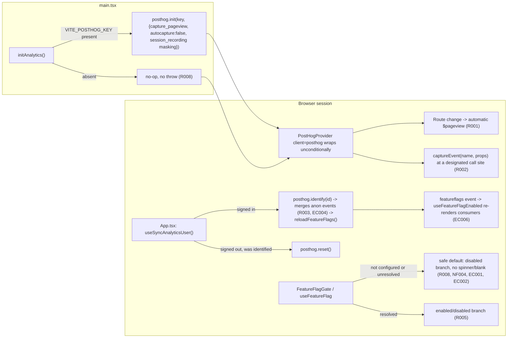

# WEB-003 — Product analytics y feature flags en `web`

## Problem statement

`apps/web` has no record of product usage — no screen views, no named product actions, no session replay to follow up a non-crash bug report — so every product decision is made on intuition. There is also no way to enable a piece of functionality for a subset of users without a deploy, pushing the team toward long-lived branches or all-or-nothing releases. The feature must add both capabilities through PostHog while leaving the application fully functional when the configuration is absent.

## Chosen solution

**`posthog-js` + `@posthog/react` SDK direct integration, following the WEB-002 `lib/*.ts` init-module pattern**

This satisfies R001, R004–R006 essentially for free from the vendor SDK: `capture_pageview: 'history_change'` gives automatic, route-accurate screen views (R001) with no per-page code; PostHog's own session recording gives replay (R004); `useFeatureFlagEnabled` from `@posthog/react` is a reactive hook already subscribed to the SDK's internal `featureflags` event, so a flag change surfaced by `posthog.identify()` (which unconditionally triggers `reloadFeatureFlags()` when the distinct id changes) re-renders every consuming component automatically — this is what satisfies R006 and EC006 without any bespoke polling or event-bus code. `posthog.capture()`/`getFeatureFlag()`/etc. are documented no-ops (return `undefined`, log a warning, never throw) when `posthog.init()` was never called, which is exactly the property that made the WEB-002 `errorTracking.ts` no-op-on-absent-config design work for `@sentry/react` — the same shape is reused here for R007/R008: a single `lib/analytics.ts` module owns `readAnalyticsConfig()` (returns `null` when `VITE_POSTHOG_KEY` is absent) and `initAnalytics()` (a no-op early return when config is `null`, `posthog.init()` wrapped in `try/catch` otherwise), called synchronously from `main.tsx` before `createRoot(...).render(...)`.

Two vendor behaviors are not relied upon as-is and are instead pinned explicitly in `initAnalytics()`'s options, because the technical constraints and NF/EC requirements are stricter than PostHog's defaults: `autocapture: false` and `capture_heatmaps: false` (EC005 forbids automatic high-frequency capture; only explicitly named events via `captureEvent()` are recorded, which also keeps NF002 structurally true — no call site auto-serializes DOM/form content), and `session_recording.maskAllInputs: true` plus a `maskTextSelector: "*"` / `maskTextFn` pair that masks all text by default and requires an explicit `data-ph-allow="true"` opt-out per element (NF003, EC003 — masking is opt-out, not opt-in).

`useFeatureFlag()` (in `hooks/`, per the technical constraint that flag resolution is exposed through a hook) wraps `useFeatureFlagEnabled` and maps its three possible states — not-configured, unresolved, resolved — onto a small `{ enabled, isResolved }` shape so `FeatureFlagGate` (in `components/`, per the same constraint) can implement EC001's rule directly: unresolved renders identically to disabled (or a caller-supplied loading placeholder), never the enabled branch first. Because "not configured" is mapped to `{ enabled: false, isResolved: true }` immediately (not to a perpetually unresolved state), R008/NF004 hold deterministically rather than depending on a timeout; because "unresolved" (whether from the initial load window or from `EC002`'s ad-blocked/unreachable provider) also renders the same safe, non-blocking disabled branch per EC001, NF004's "no blocking spinner, blank screen, or error surface" holds even if the flag never resolves at all.

User attribution reuses the existing `hooks/use-current-user.ts` (Clerk) and mirrors `use-sync-error-tracking-user.ts`'s shape: `useSyncAnalyticsUser()`, invoked once from `App.tsx` above the router (the same documented cross-cutting exception to "only page components invoke data-fetching hooks" as `useSyncErrorTrackingUser`, `TrialBanner`, and `AppLayout`'s `<UserButton/>`). It calls `posthog.identify(user.id)` — id only, never name/email — which is also the mechanism PostHog uses server-side to merge the session's prior anonymous events into the newly identified person via `$anon_distinct_id` (EC004), and calls `posthog.reset()` when a previously identified user signs out, so a following anonymous session on the same device is not misattributed.

`duck-spec/modules/web/SPEC.md`'s "Base structure (WEB-001)" and "Error tracking (WEB-002)" sections are the two precedents this design follows: the layered `api → hooks → pages → components` rule (flag resolution hook in `hooks/`, gate component in `components/`) and the entry-point init-module-plus-cross-cutting-hook shape (bootstrap in `main.tsx`, identification hook in `App.tsx`) are reused as-is rather than reinvented, per the WEB-002 dependency noted in the technical constraints.

## Technical design

### New public config surface (Vite `VITE_`-prefixed, technical constraint)

| Variable | Classification | Read by | Purpose |
|---|---|---|---|
| `VITE_POSTHOG_KEY` | public | `apps/web/src/lib/analytics.ts` (`import.meta.env`) | PostHog project API key (public by design, same publishability class as `VITE_CLERK_PUBLISHABLE_KEY`); its absence is the R007/R008 gate |
| `VITE_POSTHOG_HOST` | public | `apps/web/src/lib/analytics.ts` | Ingestion host; defaults to `https://us.i.posthog.com` when unset |

No new build/deploy-only (non-`VITE_`) variable is introduced — unlike WEB-002's source-map upload, this feature has no build-time secret.

### `apps/web/src/lib/analytics.ts` (R001, R002, R004, R007, R008, NF001–NF004, EC003, EC005)

```ts
import posthog from "posthog-js";

interface AnalyticsConfig {
  key: string;
  host: string;
}

export function readAnalyticsConfig(): AnalyticsConfig | null {
  const key = import.meta.env.VITE_POSTHOG_KEY;
  if (!key) return null; // R008 gate
  return { key, host: import.meta.env.VITE_POSTHOG_HOST || "https://us.i.posthog.com" };
}

function maskTextFn(text: string, element?: HTMLElement): string {
  // EC003: masking is opt-out per element, not opt-in — only an explicit
  // data-ph-allow="true" element is ever sent unmasked.
  if (element?.dataset.phAllow === "true") return text;
  return "*".repeat(text.trim().length);
}

export function initAnalytics(): void {
  const config = readAnalyticsConfig(); // R008: absent config -> no-op, no throw
  if (!config) return;

  try {
    posthog.init(config.key, {
      api_host: config.host,
      capture_pageview: "history_change", // R001: automatic, route-accurate screen views
      autocapture: false, // EC005: no automatic click/DOM capture
      capture_heatmaps: false, // EC005: no scroll/pointer capture
      person_profiles: "identified_only",
      session_recording: {
        maskAllInputs: true, // NF003: entered text unreadable in replay
        maskTextSelector: "*",
        maskTextFn, // EC003
      },
    });
  } catch (err) {
    // NF004: a provider/init failure must never block the app from rendering.
    console.error("Analytics initialization failed", err);
  }
}

export function captureEvent(name: string, properties?: Record<string, unknown>): void {
  // R002/NF001: posthog.capture() queues internally and returns synchronously —
  // never awaited on the caller's interaction path. Pre-init it is a documented
  // no-op (R008). Callers are responsible for passing only non-PII, non-free-text
  // properties (NF002); this function performs no DOM/form auto-serialization.
  posthog.capture(name, properties);
}

export { posthog };
```

`initAnalytics()` is synchronous and performs no network I/O of its own — `posthog.init()`'s network calls are internal and async, never awaited here — which is what satisfies NF001/NF002's "must not block the originating interaction" structurally when called before `createRoot(...).render(...)`.

### `apps/web/src/hooks/useFeatureFlag.ts` (R005, R008, NF004, EC001, EC002, EC006)

```ts
import { useFeatureFlagEnabled } from "@posthog/react";
import { readAnalyticsConfig } from "../lib/analytics";

export interface FeatureFlagState {
  enabled: boolean;
  isResolved: boolean;
}

export function useFeatureFlag(key: string): FeatureFlagState {
  const rawValue = useFeatureFlagEnabled(key); // always called — Rules of Hooks

  if (!readAnalyticsConfig()) {
    return { enabled: false, isResolved: true }; // R008/NF004: deterministic safe default
  }
  if (rawValue === undefined) {
    // EC001/EC002/NF004: unresolved (still loading, or provider unreachable/
    // blocked) — safe default, and stays this way indefinitely if the
    // provider never responds, without ever throwing or blocking.
    return { enabled: false, isResolved: false };
  }
  return { enabled: rawValue, isResolved: true };
}
```

`useFeatureFlagEnabled` is subscribed (via `@posthog/react`'s internal `usePostHog()`/`onFeatureFlags`) to the SDK's `featureflags` event, which `posthog.identify()` re-emits whenever the distinct id changes — so a component calling `useFeatureFlag` automatically re-renders with the identified user's resolved value after `useSyncAnalyticsUser()` runs, satisfying EC006 with no bespoke code.

### `apps/web/src/components/flags/FeatureFlagGate.tsx` (R005, EC001)

```tsx
import type { ReactNode } from "react";
import { useFeatureFlag } from "../../hooks/useFeatureFlag";

interface FeatureFlagGateProps {
  flag: string;
  children: ReactNode;
  fallback?: ReactNode;
  loading?: ReactNode;
}

export function FeatureFlagGate({ flag, children, fallback = null, loading }: FeatureFlagGateProps) {
  const { enabled, isResolved } = useFeatureFlag(flag);

  if (!isResolved) return <>{loading ?? fallback}</>; // EC001: never enabled-then-removed
  return <>{enabled ? children : fallback}</>;
}
```

### `apps/web/src/hooks/use-sync-analytics-user.ts` (R003, EC004)

```ts
import { useEffect, useRef } from "react";
import { posthog } from "../lib/analytics";
import { useCurrentUser } from "./use-current-user";

export function useSyncAnalyticsUser(): void {
  const user = useCurrentUser();
  const previousUserId = useRef<string | null>(null);

  useEffect(() => {
    if (user) {
      posthog.identify(user.id); // R003: id only; EC004: merges the session's
      previousUserId.current = user.id; // prior anonymous events via $anon_distinct_id
    } else if (previousUserId.current) {
      posthog.reset(); // sign-out: fresh anonymous identity for what follows
      previousUserId.current = null;
    }
  }, [user]);
}
```

Reuses `useCurrentUser()` (the same Clerk-wrapping hook `use-sync-error-tracking-user.ts` uses) instead of importing `@clerk/clerk-react` a second time.

### `apps/web/src/main.tsx` (R001, R002, R004, R007, R008)

```tsx
import { PostHogProvider } from "@posthog/react";
import { initAnalytics, posthog } from "./lib/analytics";
// ...existing imports unchanged

initErrorTracking();
initAnalytics(); // R007: before first render; NF001: synchronous, non-blocking

createRoot(document.getElementById("root")!).render(
  <StrictMode>
    <ClerkProvider publishableKey={publishableKey}>
      <QueryClientProvider client={queryClient}>
        <PostHogProvider client={posthog}>
          <AppErrorBoundary>
            <App />
          </AppErrorBoundary>
        </PostHogProvider>
      </QueryClientProvider>
    </ClerkProvider>
  </StrictMode>
);
```

`PostHogProvider` is mounted unconditionally with the singleton `posthog` client, whether or not `initAnalytics()` actually called `posthog.init()` — this is what lets `useFeatureFlagEnabled`/`useFeatureFlag` be called unconditionally by every consumer without a missing-context failure, mirroring how `AppErrorBoundary` always wraps the tree in WEB-002 regardless of whether Sentry was initialized (R008).

### `apps/web/src/App.tsx` (R003)

```tsx
import { useSyncAnalyticsUser } from "./hooks/use-sync-analytics-user";
// ...existing imports unchanged

export default function App() {
  useSyncErrorTrackingUser();
  useSyncAnalyticsUser();
  return <RouterProvider router={router} />;
}
```

### Flow



## Files

| Path | Action | Description |
|---|---|---|
| `apps/web/src/lib/analytics.ts` | CREATE | `readAnalyticsConfig()`, `initAnalytics()`, `captureEvent()`, exported `posthog` client |
| `apps/web/src/hooks/useFeatureFlag.ts` | CREATE | `useFeatureFlag(key)` — maps not-configured/unresolved/resolved to `{ enabled, isResolved }` |
| `apps/web/src/hooks/use-sync-analytics-user.ts` | CREATE | `useSyncAnalyticsUser()` — identifies/resets the PostHog user against the Clerk session |
| `apps/web/src/components/flags/FeatureFlagGate.tsx` | CREATE | Declarative flag-gated rendering with an explicit unresolved state |
| `apps/web/src/main.tsx` | MODIFY | Call `initAnalytics()` before render; wrap tree in `<PostHogProvider client={posthog}>` |
| `apps/web/src/App.tsx` | MODIFY | Call `useSyncAnalyticsUser()` |
| `apps/web/package.json` | MODIFY | Add `posthog-js` and `@posthog/react` dependencies |
| `.cloudflare/.env.deploy.web.example` | MODIFY | Document `VITE_POSTHOG_KEY` / `VITE_POSTHOG_HOST` as optional, public values |
| `.cloudflare/README.md` | MODIFY | Document the new opt-in analytics/flags variables and their no-op-when-absent behavior |
| `apps/web/tests/analytics/analytics.test.ts` | CREATE | Unit tests for config parsing, init gating, init options (pageview/autocapture/masking), init-failure isolation, `captureEvent` no-op-pre-init/synchronous behavior |
| `apps/web/tests/analytics/useFeatureFlag.test.ts` | CREATE | Unit tests for the not-configured/unresolved/resolved state mapping |
| `apps/web/tests/analytics/FeatureFlagGate.test.tsx` | CREATE | Unit tests for the unresolved/disabled/enabled render branches |
| `apps/web/tests/analytics/use-sync-analytics-user.test.ts` | CREATE | Unit tests for `identify()`/`reset()` calls on sign-in/sign-out transitions |
| `apps/web/tests/analytics/main.test.tsx` | CREATE | Integration test asserting `initAnalytics()` runs before `render()` and `PostHogProvider` wraps the tree |
| `apps/web/tests/analytics/App.test.tsx` | CREATE | Test asserting `App` invokes `useSyncAnalyticsUser()` |

## Requirement coverage

| ID | Design decision |
|---|---|
| R001 | `initAnalytics()` passes `capture_pageview: "history_change"` to `posthog.init()`, giving automatic route-keyed screen views with no per-page code |
| R002 | `captureEvent(name, properties)` in `analytics.ts` wraps `posthog.capture()`; a no-op, synchronous, project-owned entry point any layer can call to record a designated action |
| R003 | `useSyncAnalyticsUser()` calls `posthog.identify(user.id)` — identifier only — when a Clerk session is present |
| R004 | `initAnalytics()`'s `session_recording` options configure PostHog's session recording (enabled by default at the project level) with the masking policy below |
| R005 | `useFeatureFlag(key)` resolves `useFeatureFlagEnabled`'s value and `FeatureFlagGate` renders the matching branch |
| R006 | Flags are evaluated by a runtime API call rather than a bundled constant; changing a flag in the provider changes what the next resolution returns with no rebuild — reinforced by the identify-triggered reload described under EC006 |
| R007 | `initAnalytics()` is called synchronously in `main.tsx` before `createRoot(...).render(...)`, only calling `posthog.init` when `readAnalyticsConfig()` is non-null |
| R008 | `readAnalyticsConfig()` returns `null` when `VITE_POSTHOG_KEY` is absent; `initAnalytics()` returns early with no `posthog.init` call; `useFeatureFlag` returns a deterministic `{ enabled: false, isResolved: true }` in that case; `PostHogProvider` is still mounted so no consumer throws |
| NF001 | `captureEvent`/`initAnalytics` are synchronous wrappers around `posthog`'s internally-queued, internally-async transport; nothing on the interaction path is ever awaited |
| NF002 | `autocapture: false` and `capture_heatmaps: false` remove all automatic DOM/form/high-frequency capture; `captureEvent`'s explicit `(name, properties)` signature is the only capture surface, putting property content under caller control |
| NF003 | `session_recording.maskAllInputs: true` masks all input/textarea entry in the replay |
| NF004 | `useFeatureFlag` maps both the "not configured" and "unresolved" cases to `{ enabled: false, isResolved: false | true }`, which `FeatureFlagGate` always renders as a normal branch (disabled or loading placeholder) — never a spinner, blank screen, or thrown error |
| EC001 | `FeatureFlagGate` renders `loading ?? fallback` whenever `isResolved` is `false`, and only renders `children` once `isResolved` is `true` and `enabled` is `true` — no enabled-then-removed flicker |
| EC002 | `useFeatureFlag` treats `useFeatureFlagEnabled() === undefined` (the SDK's state when it cannot reach the provider, including ad-blocked requests) identically to "still loading" — safe default forever, no exception, no blank screen |
| EC003 | `session_recording.maskTextSelector: "*"` + `maskTextFn` mask all replay text content by default; only an element carrying `data-ph-allow="true"` is sent unmasked — opt-out, not opt-in |
| EC004 | `posthog.identify(user.id)` on sign-in triggers PostHog's own `$anon_distinct_id` merge of the session's prior anonymous events into the newly identified person |
| EC005 | `autocapture: false` and `capture_heatmaps: false` in `initAnalytics()` — no scroll, pointer, or per-keystroke capture; only `captureEvent()`'s explicitly named calls are recorded |
| EC006 | `posthog.identify()` unconditionally calls `reloadFeatureFlags()` on a distinct-id change, and `useFeatureFlagEnabled` is subscribed to the resulting `featureflags` event, so every `useFeatureFlag`/`FeatureFlagGate` consumer re-renders with the identified user's value automatically |
